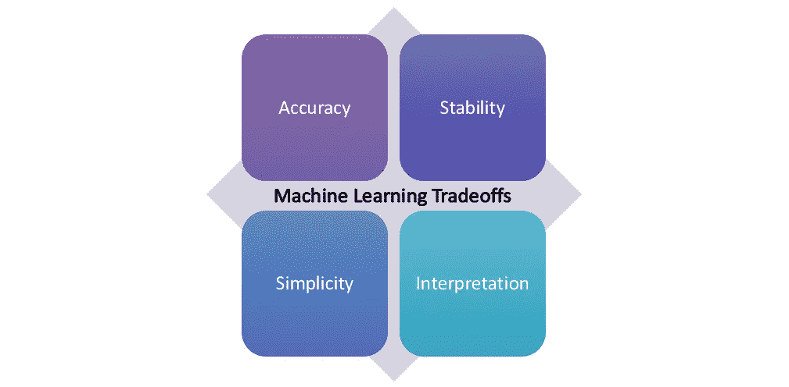
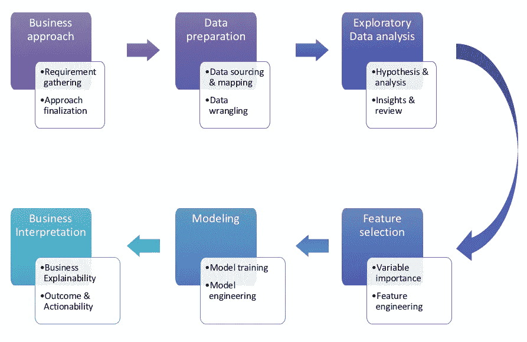

# 是什么让机器学习项目中的数据科学家感到沮丧？

> 原文：<https://towardsdatascience.com/what-frustrates-data-scientists-in-machine-learning-projects-3398919a7c79?source=collection_archive---------9----------------------->

Photo by [Vance Osterhout](https://unsplash.com/photos/Z4v9cSEP8qo?utm_source=unsplash&utm_medium=referral&utm_content=creditCopyText) on [Unsplash](https://unsplash.com/?utm_source=unsplash&utm_medium=referral&utm_content=creditCopyText)

如今，人们对数据科学的兴趣激增。一个人只需要插入标语“*由人工智能驱动*”，任何东西都可以卖出去。

但是，这就是问题的开始。

数据科学的推销通常是异想天开。然后，客户将期望值提高一个档次，启动他们的登月计划。最终，把客户带到月球上，还是把他们留在荒岛上，都要由数据科学家来决定。

早先的一篇文章，[数据科学家工作面试失败的 4 种方式](/4-ways-to-fail-a-data-scientist-job-interview-d9c4c85c683)研究了候选人在追求数据科学职业生涯时犯的主要错误。现在，我们走进数据科学项目期望的幻想世界，找出客户持有的最大误解。

在这里，我们将讨论我在机器学习项目中看到的 8 个最常见的神话，以及它们为什么会让数据科学家感到烦恼。如果你刚刚进入数据科学，或者已经成为主流，这些都是可能扔向你的潜在手榴弹。因此，知道如何处理它们会很方便。

> “所有的模型都是错的，但有些是有用的。”—乔治·博克斯

Photo by [Andre Hunter](https://unsplash.com/photos/5otlbgWJlLs?utm_source=unsplash&utm_medium=referral&utm_content=creditCopyText) on [Unsplash](https://unsplash.com/?utm_source=unsplash&utm_medium=referral&utm_content=creditCopyText)

## 误区一。“我们想要一个人工智能模型..造一个来解决这个问题”

分析领域的大多数行业问题都可以通过简单的探索性数据分析来解决。如果机器学习对这些来说是多余的，我们甚至不要开始讨论为什么人工智能在这里是无用的。为什么要用大炮打死一只苍蝇？

是的，高级分析很酷。每个企业都喜欢谈论成为行业中部署最新技术的第一人。而哪个厂商不想标榜一个 AI 项目呢？但是，人们需要教育客户，并找出真正保证 ML 军械库重型火炮的用例。对于所有其他需求，通过使用探索性数据分析、统计或其他此类久经考验的技术展示商业价值来说服客户。

> “到目前为止，人工智能最大的危险是，人们过早地断定他们理解它。”—埃利泽·尤德科夫斯基

## 误区二。*“拿着这个数据..并带着变革性的见解回来”*

通常，客户认为他们的责任到移交数据就结束了。有些甚至停留在问题定义上，但是我们将在第 4 点看到这一点！他们要求分析师获取数据，并带回一套惊天动地的商业见解，这将在一夜之间改变组织。

不幸的是，与创造性写作不同，人们不能孤立地想出可行的商业建议。它要求与业务用户就什么对他们是相关的和可行的进行持续的迭代和富有成效的对话。在整个项目中，定期与业务人员一起计划优质时间。

> “如果你不知道如何问正确的问题，你将一无所获。爱德华·戴明

## 误区三。“构建模型，通过跳过不必要的*分析来节省时间”*

许多数据科学家忽视了在打开模型工具箱之前进行数据辩论和探索性分析的重要性。因此，当客户要求从关键路径中删除*【不必要的分析】*以节省宝贵的项目时间时，他们看不到风险。

数据探索和分析是机器学习和所有其他高级技术的强制性先决步骤。没有对数据的感觉，发现异常值或发现潜在模式，模型除了在黑暗中拍摄什么也不做。总是指定时间进行分析，并通过分享有趣的发现来说服客户。

> *炼金术士在寻找黄金的过程中发现了许多其他更有价值的东西。——*亚瑟·叔本华

## 误区四。“我们有上周的数据，你能预测未来 6 个月吗？”

这是数据科学家最讨厌的事情。客户在电子表格中拼凑几行数据。然后，他们希望人工智能能像水晶球一样凝视未来。有时，当客户承认没有任何数据，然后真正想知道机器学习是否可以填补空白时，这变得非常奇怪。

数据质量和数量是不容讨价还价的。*“垃圾进垃圾出”*同样适用于分析。当你的数据有限时，统计技术会派上用场，当你的数据更少时，它们会帮助你提取更多的数据。例如，[估算](https://en.wikipedia.org/wiki/Imputation_(statistics))缺失点， [smote](https://en.wikipedia.org/wiki/Oversampling_and_undersampling_in_data_analysis#SMOTE) 生成数据或使用[更简单的低容量模型](https://medium.com/rants-on-machine-learning/what-to-do-with-small-data-d253254d1a89)。但是这需要降低客户对模型结果和项目成果的期望。

Performance of analytics techniques with data volume: Source [Andrew Ng](https://www.slideshare.net/ExtractConf)

## 误区五。"你能在两周内完成建模项目吗？"

在任何业务关键型项目中，结果都是在昨天就可以预期的，即使项目启动是在今天计划的。在匆忙破坏项目时间表的过程中，一个常见的损失就是模型工程阶段。随着模型 API 的免费提供和对 GPU 计算的轻松访问，客户想知道是什么减慢了数据科学家的速度。

尽管 [Auto-ML](https://www.forbes.com/sites/janakirammsv/2018/04/15/why-automl-is-set-to-become-the-future-of-artificial-intelligence/#2959040f780a) 有所进步，但是在建模过程中有一个不可缺少的手工元素。数据科学家必须检查统计结果、比较模型和检查解释，通常需要经历痛苦的迭代。这是无法自动完成的。至少，现在还没有。最好通过分享示例和说明如果跳过某些步骤可能会遗漏什么来启发客户关于数据科学生命周期的知识。

> 建模一部分是实验，一部分是艺术，所以里程碑驱动的项目计划可能不会太精确。

## 误区六。"你能替换结果变量并点击刷新吗？"

在数据科学家解决了业务行为建模的问题后，新的客户请求经常会以增量变化的形式出现。有时，他们会要求替换结果变量，并通过重新运行模型来快速刷新结果。客户没有意识到这种变化不仅仅是移动球门柱，而是将比赛从足球转换到篮球。

虽然机器学习是高度迭代的，但核心挑战是为给定的结果变量挑选正确的影响者，并映射他们的关系。客户必须事先了解这是如何运作的，以及他们可以自由使用的杠杆。他们还必须注意那些需要预先仔细规划的参数，以及如果这些参数的变化超出了定义的里程碑，将会发生什么情况。

## 神话 7。“我们能有 100%的模型准确率吗？”

人们经常被错误率所困扰。就像盲目追求考试成绩一样，客户希望准确率接近 100%。当准确性成为压倒所有其他因素的唯一焦点时，这变得令人担忧。建立一个复杂到无法实时制作的高度精确的模型有多大用处？

以最高精度赢得百万美元[网飞奖](https://www.netflixprize.com/leaderboard.html)的模型从未上线，因为它的极端复杂性意味着沉重的工程成本。而精度较低的型号[采用了](https://medium.com/netflix-techblog/netflix-recommendations-beyond-the-5-stars-part-1-55838468f429)。始终平衡准确性与简单性、稳定性和业务可解释性。这需要果断的权衡和判断，信任客户。

Model Engineering: Achieving the fine balance and trade-off

## 误区八。“训练出来的模型能永远保持聪明吗？”

在投入大量精力进行模型构建和测试后，客户想知道机器是否已经学会了它所需要的一切。一个常见的问题是，它能否保持智能，适应业务动态的所有未来变化？

可惜机器不是终身学习的。模型需要不断耐心的教导。他们需要每隔几周或几个月快速复习一次，就像学校里那些努力学习的学生一样。当环境改变时，更是如此。这就是分析行业目前的状况，尽管它在快速发展。所以，现在，为模型维护和病人更新做时间和精力的预算。

## 结论

我们已经看到了项目中的 8 个主要误解，这些误解也可以分为 ML 建模生命周期的 6 个阶段，如下所示。

Machine learning project lifecycle

几乎所有的上述误解都是由于缺乏意识和项目中的优先级错位造成的。毕竟，每个客户和企业都是在严格的时间表、紧张的预算和不那么完美的数据流下进行团队合作的。数据科学家应该能够与客户产生共鸣，理解这些脱节的真正原因。这将使他们能够教育利益相关者，并提供实例来阐明他们的观点。

数据科学团队应该采取温和刺激和友好权衡的结合。他们应该做出不影响项目最终结果的决定。祝你在下一次机器学习项目中处理这些常见问题时好运！

这里还有没有列出其他的误解？请在下面留下您的评论，继续对话。

*如果你觉得这很有趣，你可能想看看我写的其他相关文章:*

*   [*让你在数据科学生涯中不可或缺的 4 种超能力*](/4-superpowers-that-will-make-you-indispensable-in-a-data-science-career-6571e8e7d504)
*   [*数据科学家面试失败的 4 种方式*](/4-ways-to-fail-a-data-scientist-job-interview-d9c4c85c683)

*对数据科学充满热情？随时在*[*LinkedIn*](https://www.linkedin.com/in/gkesari/)*上加我，订阅我的* [*简讯*](https://gkesari.substack.com/) *。*