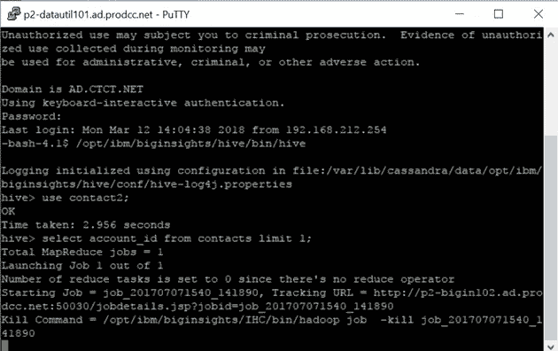
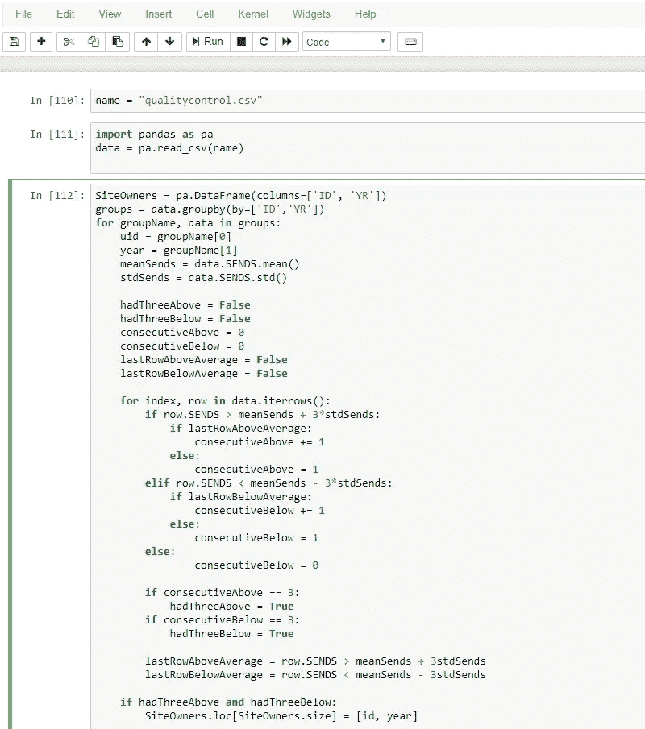

# 在数据科学领域找一份工作会是什么样子

> 原文：<https://towardsdatascience.com/what-getting-a-job-in-data-science-might-look-like-f94ddb788a5e?source=collection_archive---------0----------------------->

备选标题:我的人生故事:)

我读过一些文章，这些文章阐述了进入分析和数据科学领域有多难。这不是我的经历，所以我想分享一下。我们将看看面试，我目前使用的工具，我在学校没有准备好的行业，以及我的职业轨迹是什么样子的。但不是按那个特定的顺序。

在我们开始之前，快速回顾一下我的教育可能是有意义的！

2004 年——获得了麻省理工学院达特茅斯分校的数学学士学位

*   我的专业平均成绩为 3.8 分
*   在那里学了 FORTRAN(不擅长)
*   没有实习
*   我热爱数学，热爱我在学校的时光

老实说，2004-2007 年没什么值得注意的。我在“寻找自我”，或者别的什么。

2007 年——开始在 WPI 兼职统计学硕士，同时为考德威尔银行家房地产经纪公司工作。

*   “房地产泡沫”破裂(大衰退的开始)，与此同时，我很幸运地获得了 WPI 的助教职位。
*   搬到伍斯特，完成了我的全日制硕士学位(2010 年毕业)
*   在课堂上使用 SAS & R
*   仍然没有实习机会(经济不景气，我还没有学会很多找工作、建立关系网的知识，也没有利用职业中心)
*   我想在社区大学教书，但是两位教授问我是否有兴趣去当地的公用事业公司面试(而那家公司刚好离我父母家 3 英里)。

我在那家公司面试并接受了那份工作。

我毕业后的第一份行业工作是 NSTAR(现在是 Eversource)，我是一名预测分析师，使用计量经济学时间序列分析来预测天然气和电力负荷(阅读——我们需要多少天然气和电力来服务客户)。

我每天都在构建 ARIMA 模型，使用各种统计测试来测试数据中的结构突变，单位根测试来测试平稳性，我写了一个证明来解释为什么我选择的值大于 1 的 t-stats(即使 p 值可能是 0.2)有利于模型的预测。

我建立了很酷的神经网络来预测每小时的电力负荷。这种方法很有意义，因为电力负荷和天气之间存在非线性关系。模型结果非常好，并被用来决定如何在预计需要高负载的日子里满足容量。

这是我第一次了解到，一旦你完成了一个人们关心的项目，你很可能会写一套解释问题和结果的材料..然后你去“巡回演出”。也就是说，我制作了 PowerPoint 幻灯片，并向其他团队展示了我的作品。我的第一个幻灯片不是很好。我花了多年的经验才达到这样一个地步，现在我认为我的套牌在视觉上很吸引人，适合我演讲的观众(有正确的信息“水平”)，而且引人入胜。

在 NSTAR 我也用了一点 SAS。这是以重新运行他人先前编写的代码的形式。它有时也涉及到稍微修改别人写的代码，我肯定不会认为这是一项密集的工作。更像是“SAS 按键”。

我每天构建的模型都是在“点击”软件中构建的。

到目前为止，NSTAR 是我最“统计”的工作，但是时间序列只是统计世界中的一小部分。我想拓展我的视野，并了解到在分析领域有大量的机会…

# 我其余职位的快速概述:

**silver link communication s 分析顾问**

*   提供市场研究、细分、研究海报和宣传活动，旨在支持管理式医疗机构(mco)、药房福利经理(pbm)和疾病管理(DM)客户。

**vista print 分析经理**

*   Vistaprint 在网上销售名片和其他营销产品。他们的主要客户群是小企业。
*   管理一个分析师团队来优化 Vistaprint 网站。
*   担任过许多其他角色，并在分析领域从事大量不同的项目

**资深数据科学家，常接触**

*   Contant Contact 提供电子邮件营销解决方案。也是电子商务，也针对小企业。

两个月来我一直保持联系。我的第一个目标是:

*   检查已经存在的模型的有效性
*   改进他们目前的测试方式。**然后自动化！**
*   试图在客户群中识别季节性客户。
*   学习很多新东西！

# 关于标题的说明:

标题很棘手。一个头衔可能听起来很时髦，报酬也不高，有时一个较低的头衔可能会比你预期的报酬更高！

随着将数据用于商业目的变得越来越流行，人们对某个职位通常包含哪些角色、职责和技能更加困惑。探索你所有的选择！你可以在许多不同的网站上查看职位的平均工资。

*   [www.glassdoor.com](http://www.glassdoor.com)
*   [www.payscale.com](http://www.payscale.com)

# **我使用的工具(从最基础的开始):**

我去过的地方都用过 Excel。做以下事情的能力:

*   数据透视表
*   垂直查找
*   使用“记录”按钮编写一个简单的宏来自动执行一些数据操作
*   这些类型的东西可以让你看起来像一个其他领域的商业奇才。(没说是对的，只是说事情就是这样)
*   在我的职业生涯中，我一直使用这些东西。

随着数据变得越来越大，公司开始走向 **Tableau。**我自己对它还不熟悉，但它让我不用看着一份 Excel 文档花很长时间保存。我认为等待大型 Excel 文件的日子已经成为过去。

*   对于 Excel 来说，数据很快变得太大，我发现任何高于 400k 行(多列)的数据都变得很难操作。
*   漂亮的可视化，可以是交互式的，快速的，点击式的。

Screenshot of Analysis in Tableau

*   Tableau 还可以直接从 SQL(一个. csv 和一堆其他格式)中获取数据。

SQL 中数据科学工作的真正核心。我认为没有人会反驳这一点。

在学校，大部分数据都以一种很好的形式给了我，我所要做的就是分析和建模。在工业中，在 100 或 1000 个不同的表中有数百万行。需要使用相关标准从相关表格中收集这些数据。大多数时候，您将操作 SQL 中的数据，使其变成您非常熟悉的漂亮/可用的形式。这是一个时间密集型的过程，你会开始意识到，在你用 R 或 Python 写一行代码之前，你工作的很大一部分就是决定你需要什么数据，找到数据，转换数据使之适合建模。

我在工业界的前 3 份工作都涉及到 SQL，而我只做过 4 份工作。

你可以直接从 SQL 中提取数据到 Excel 或 R 或 Python 或 Tableau 中，这个列表还在继续..

SQL 有许多不同的“风格”。如果你知道一个，你可以学习其他任何一个。过去，我曾被列出 AP 或其他变体的招聘信息吓到。语法上可能会有细微的差别，但它们实际上只是要求你了解 SQL。不要被吓倒！

下面是一个简单查询的例子。我选择了一些 id、月份、年份，以及基于“where”语句中给定标准的变量“sends”的计数。该查询还显示了一对表连接，用“join”表示，然后我给出了连接的条件。

SQL has been invaluable in my career. Couldn’t live without it

一旦您理解了 SQL，转向大数据就不那么困难了。使用 Hive(在工作描述中看起来也很吓人)，很像 SQL(加上一些您可能需要处理的嵌套数据)，您可以从 Hadoop 中查询数据。

我使用命令行来访问 Hive，但是很好的 ui 已经出来了。如果你仔细看，你会看到我的查询只是“从联系人限制 1 中选择 account _ id，只说“给我一个联系人表中的 account_id”，它看起来就像 SQL。

At the time of this screenshot, I had just kicked off this query. Because there is so much data. It may take over a minute to get me 1 account id from this table

当我获得统计学硕士学位时，每个人都在使用 r。甚至一些统计学家现在也在转向 Python。以前，我所有的建模都是在 R 中进行的，但是我自己正在测试 Python waters！

我在 Coursera 自学了 Python，目前正在我的新工作中使用。这就是互联网的美妙之处。想学一个新工具？去学吧，资料唾手可得。

下面是我在 JupyterLab 中的 Python 代码的一个例子。这是全新的，而且我的截图并没有做到这一点。你可以在这里阅读更多关于木星实验室的信息:[木星实验室](https://blog.jupyter.org/jupyterlab-is-ready-for-users-5a6f039b8906)

This is what JupyterLab looks like. Although I don’t have any pretty charts here (sorry), I’m just working on a little Quality Control problem.

> 一个的小纸条。我把我上过的课程放在 LinkedIn 的“成就”下面。这是个不错的主意。

# 关于工业我不知道的事情:

你可能会有一些旅行的机会——目的地的乐趣会有所不同

*   我去过拉斯维加斯、奥兰多、巴塞罗那、温莎安大略、新泽西州和马里兰州工作。

通常会有个人发展预算

*   一本你想读的相关的书？你可能会花掉它。
*   Coursera 上有相关的课程吗？你可能会花掉它。
*   他们有时会送你去参加会议
    ——我在 3 月 21 日参加了 Jupyter 弹出窗口，我将参加 5 月份的开放数据科学大会。
*   不要羞于问你的老板是否有预算。对大多数人来说，看起来你很关心自己的事业，并对其进行了投资！

裁员是一件事。我最近才了解到这个第一手资料。我的经历很棒。

Vistaprint 决定裁员 2000 万美元(182 人)。

*   我得到了一份相当丰厚的遣散费。
*   小费！可以同时领取失业和遣散费！

这是我多年来第一次有机会真正思考文化和方向，并真正思考我的下一步行动。

Vistaprint 支付了一个职业蔻驰帮助我:

*   简历(他们更新了我的内容和格式)。
*   求职信提示(描述如下)
*   建立工作关系网
*   采访
*   谈判！

我从来没有见过这种风格的求职信，但它有惊人的回复率！

I literally took the requirements from the job and pasted them on the left. Then took my qualifications from my resume and posted them on the right. Took less than 15 minutes for each cover letter.

# 采访

我从教练那里学到的最大收获和我自己面试数据科学家职位的经历是…

以星形格式练习回答问题。
[https://www.vawizard.org/wiz-pdf/STAR_Method_Interviews.pdf](https://www.vawizard.org/wiz-pdf/STAR_Method_Interviews.pdf)

在一个电话屏幕上(和克罗诺斯在一起)，我被问到所有我已经准备好的问题:

*   告诉我你向非技术观众解释技术结果的一次经历？
*   告诉我你改进流程的一次经历？
*   告诉我一个与难相处的利益相关者一起工作的例子，以及它是如何解决的？

连续两天，和不同的公司(其中一家是 Spotify)，我被要求回答 FizzBuzz。

*   做好准备应对初级编码问题或 SQL 问题，这是工作描述中要求的技能之一。
*   http://rprogramming.net/fizz-buzz-interview-test-in-r/

准备以面试你的人(可能没什么背景)能够理解的方式谈论你的一个项目。高水平，注重结果。说真的，在你开始谈论这个项目之前，先描述一下目标是什么，很容易一头扎进某样东西，却意识不到对方根本不知道你在说什么。

我真的可以一直谈论上面列出的话题，但我想简要概述一下我的一些不同经历。也许我稍后需要详细说明。

谢谢你看了我的经历。我希望你在进入数据科学领域的道路上取得巨大成功。当你到了那里，我希望你会觉得很充实。我知道。

访问我的网站！[这里](https://datamovesme.com/)

报名接收我的新文章:[这里](https://visitor.r20.constantcontact.com/d.jsp?llr=u87kgk7ab&p=oi&m=1129918591860&sit=ahj5pbfmb&f=5ed033f5-5740-4951-9beb-a17a4bb51fdc)