# Tensorflow Dev Summit 2017 上发生了什么-第 1/3 部分:社区和应用

> 原文：<https://towardsdatascience.com/what-happened-at-the-tensorflow-dev-summit-2017-part-1-3-community-applications-77fb5ce03c52?source=collection_archive---------0----------------------->

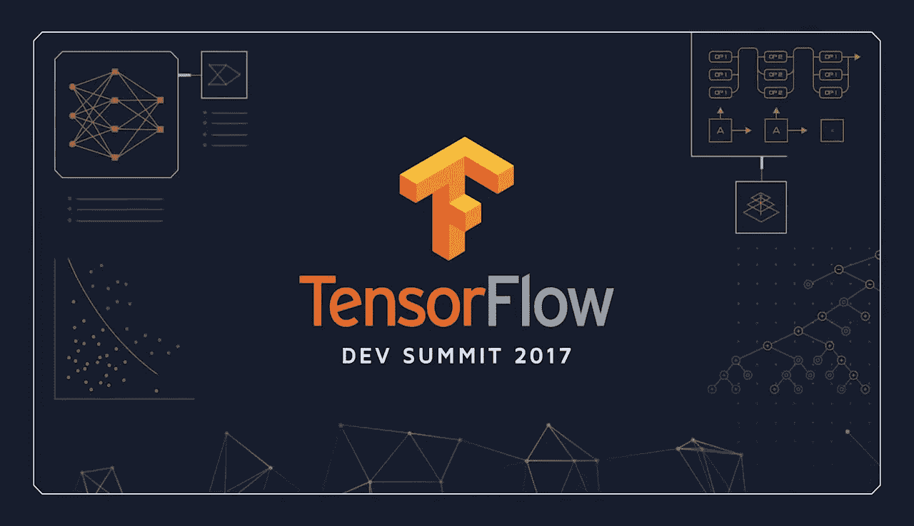

# TL；速度三角形定位法(dead reckoning)

2017 年 2 月 15 日，[人工神经网络软件框架 tensor flow](https://www.tensorflow.org/)1.0 版本在加州山景城的谷歌 TensorFlow Dev 峰会上发布。

活动期间，在项目的四个不同领域进行了演示和公告:社区、应用、部署策略、工具和技术。这次活动是现场直播的，[所有的视频都可以在网上看到](https://events.withgoogle.com/tensorflow-dev-summit/videos-and-agenda/#content)。

通过这一系列的帖子，我将重点介绍最有趣的部分，并就活动期间涉及的主题给出实用的建议。

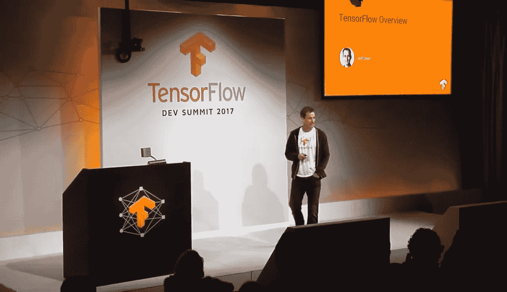

# 社区

传奇人物[杰夫·迪恩](https://research.google.com/pubs/jeff.html)给我们讲述了这个项目的故事，拉开了峰会的序幕。Tensorflow 并不是[谷歌大脑](https://research.google.com/teams/brain/)团队创建通用机器学习框架的第一次尝试。之前关闭的源代码项目被称为 [DistBelief](https://research.google.com/archive/large_deep_networks_nips2012.html) 。

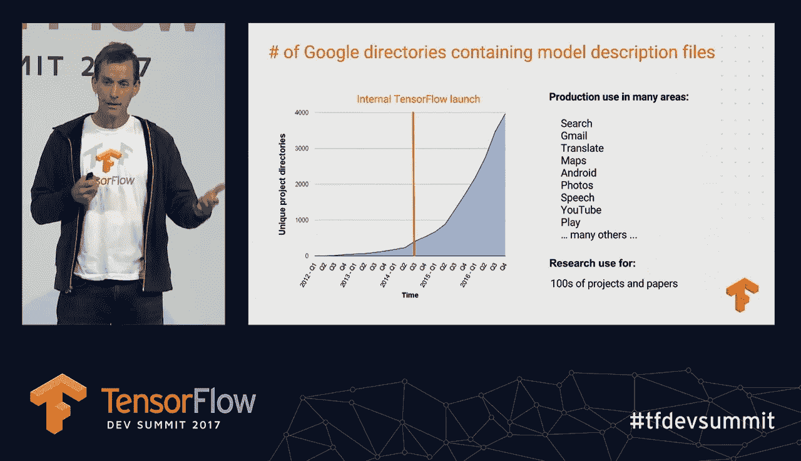

Tensorflow 于 2015 年 11 月开源，从其公开发布开始，谷歌内部和社区的采用情况令人印象深刻。

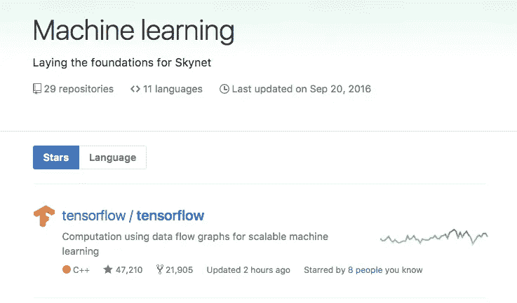

在一年多一点的时间里，[开源 Github 库](https://github.com/tensorflow/tensorflow)成为了[“机器学习”类别](https://github.com/showcases/machine-learning)中的第一名，拥有超过 44，000 颗星，500 名程序员开发并提交了他们的软件，每月提交数千份，5500 个名为 Tensorflow 的独立库现在出现在 Github 上。各大高校已经开始使用 TensorFlow 教授机器学习。

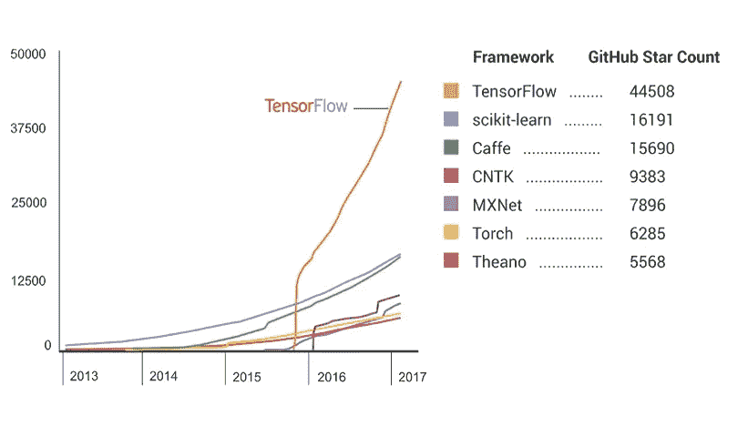

许多公司也支持这个项目。IBM、 [Movidius](https://www.movidius.com/) 和[高通](http://qualcomm.com/)正与谷歌合作，全力支持 Tensorflow 平台的硬件加速。[来自高通的 Travis Lanier](https://www.linkedin.com/in/travislanier/) 展示了 tensorflow 的 [InceptionV3 模型](https://arxiv.org/abs/1512.00567)在[Hexagon DSP](https://developer.qualcomm.com/software/hexagon-dsp-sdk/dsp-processor)上运行时的 8 倍性能(114.495 毫秒对 1968.753 毫秒或其他指标 8.7 帧每秒对 0.5 帧每秒)，同样在对移动设备至关重要的功效方面。

Jeff Dean 说 Tensorflow 是为每个人准备的，我们鼓励每个人使用它，并把他们的想法变成现实。

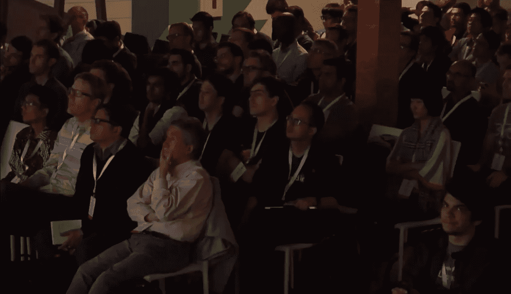

有趣的是，围绕这个项目的社区发展得如此之快。峰会会场挤满了来自不同公司、城市和背景的与会者。该活动是现场直播的，世界各地的许多 Tensorflow 社区，如[纽约](http://www.digital.nyc/events/tensorflow-dev-summit-2017)、[马德里](https://www.eventbrite.com/e/tensorflow-dev-summit-streaming-madrid-tickets-31442948706#)、[阿姆斯特丹](https://www.eventbrite.co.uk/e/tensorflow-dev-summit-viewing-party-google-amsterdam-tickets-31704053678#)、[开罗](https://www.facebook.com/events/1280211058692506/)、[吉隆坡](http://tfxkl2017.peatix.com/event/235332/view)和其他各种城市，组织了当地聚会来现场观看该活动。

但是为什么这么感兴趣呢？用 Tensorflow 可以做什么？做了什么？

# 应用程序

峰会期间有许多应用程序，如著名的[日本黄瓜分类农场](https://cloud.google.com/blog/big-data/2016/08/how-a-japanese-cucumber-farmer-is-using-deep-learning-and-tensorflow)，其中通过形状选择黄瓜的*过程由所有者手动执行，直到他们的儿子使用 Tensorflow、相机和[树莓皮](https://www.raspberrypi.org/)创建了一个自动分类器。*

检测黄瓜的形状听起来很有趣，也很实用，但是我们还能检测什么呢？

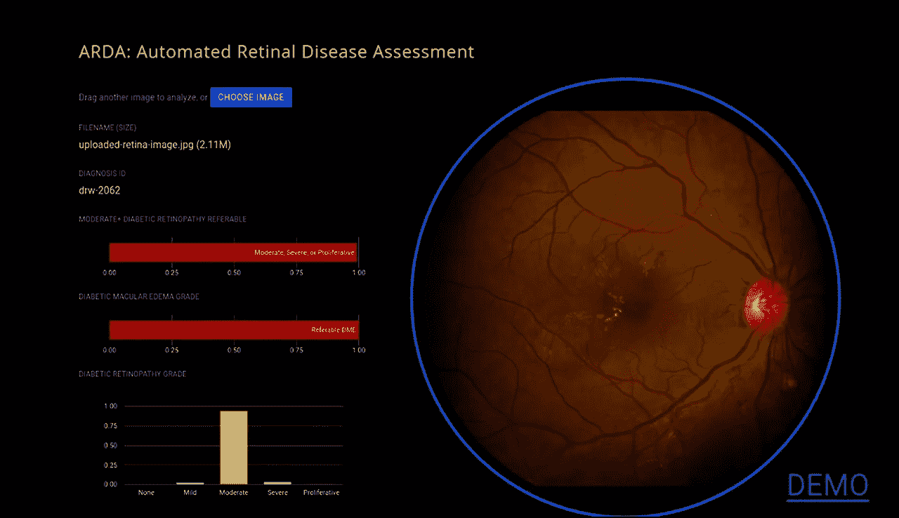

Lily Peng 医学博士、博士兼谷歌研究院产品经理研究并开发了一种检测[糖尿病视网膜病变](https://research.googleblog.com/2016/11/deep-learning-for-detection-of-diabetic.html)的工具。这种疾病是世界上导致失明的主要原因之一。如果及时发现，它是可以治疗的，但在世界上的一些地方，如印度，缺乏眼科医生，45%的患者在能够接受诊断之前就遭受视力下降。

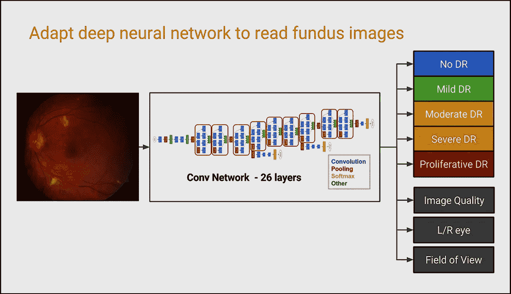

该网络在由 54 名眼科医生标记的 130，000 幅图像上进行训练，生成 880，000 幅标记图像的数据集。

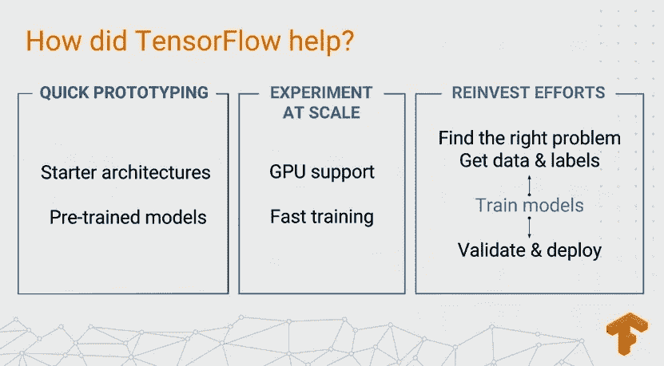

她强调，工作的重点不再是机器学习部分，他们在预先训练的数据集上使用重新训练的、众所周知的架构，并将工作更多地转移到理解问题、获取数据和构建工具来优化这一过程。

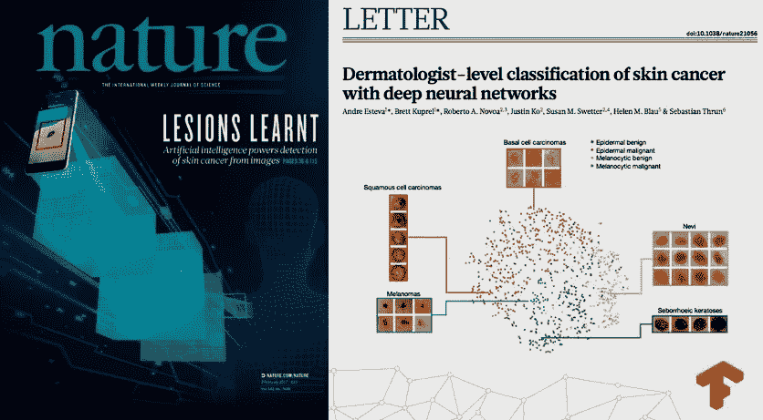

Nature cover and article

使用 Tensorflow， [Brett Kuprel](https://twitter.com/kuprel) 展示了他如何训练一个[神经网络来检测皮肤癌](http://news.stanford.edu/2017/01/25/artificial-intelligence-used-identify-skin-cancer/)，其表现优于一般的皮肤医生。发表在《自然》上的研究[登上了封面。使用 Inception V3 模型训练神经网络，在 129K 个图像的数据集上进行迁移学习，其中约 2K 个图像是疾病(707 个](http://www.nature.com/nature/journal/v542/n7639/full/nature21056.html)[癌](http://www.cancercenter.com/terms/carcinoma/)，225 个黑色素瘤+ 1010 个黑色素瘤皮肤镜检查)。

How 20 Doctors classified around 100 images

一个有趣的方面是算法性能与所选皮肤科医生的比较。首先，这 20 名医生只分类了大约 100 张图像，(正如 Brett 评论的那样，他们有比分类成千上万张图像更好的事情要做)，其次，与机器(蓝线)相比，他们的性能是可变的(图中的红点)。

这项皮肤癌研究并不是第一次获得《自然》杂志的封面，谷歌 Deepmind 的另外两项技术过去也获得过。

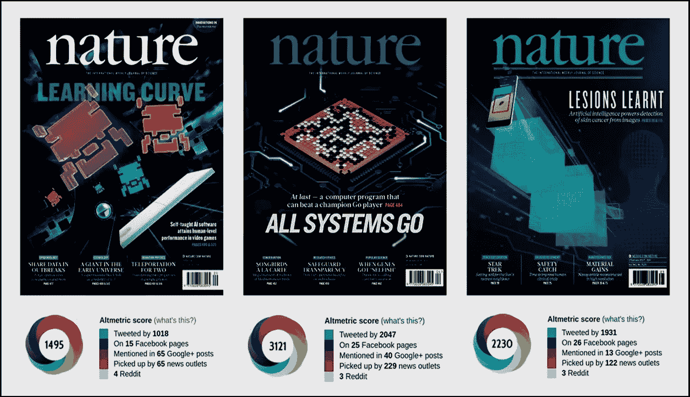

Nature front page of deep learning algorithms

第一期和第二期《自然》封面由谷歌的 Deepmind 获得。第一场展示了 DQN，第二场展示了 AlphaGo，这是一个神经网络，能够击败人类世界冠军之一。

Deepmind 的研究工程师 Daniel Visertin 表示，Tensorflow 是实现的关键，因为训练这种神经网络的过程非常复杂。Deepmind [于 2016 年 4 月宣布全面采用 tensor flow](https://research.googleblog.com/2016/04/deepmind-moves-to-tensorflow.html)。

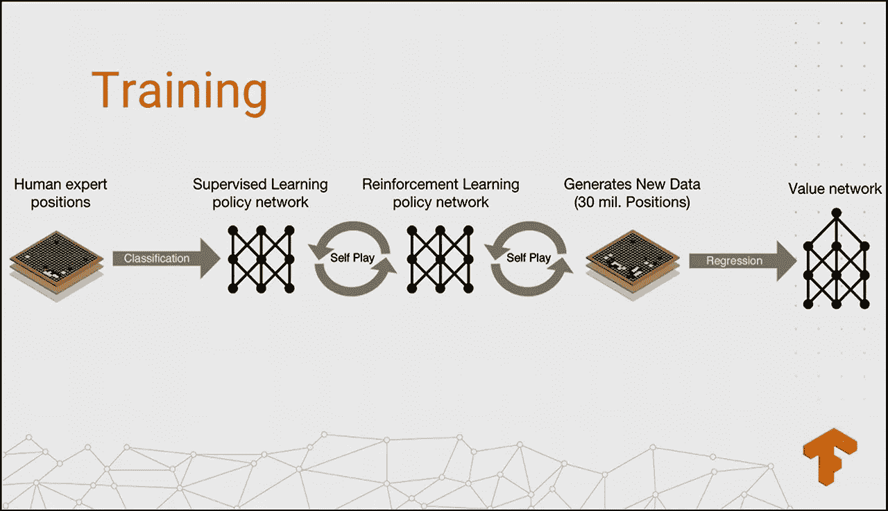

AlphaGo 使用强化学习的理论来决定在特定状态下可能的行动中的最佳移动。这一决策过程也可以应用于其他场景，如通过调节冷却系统来优化数据中心的能源消耗。

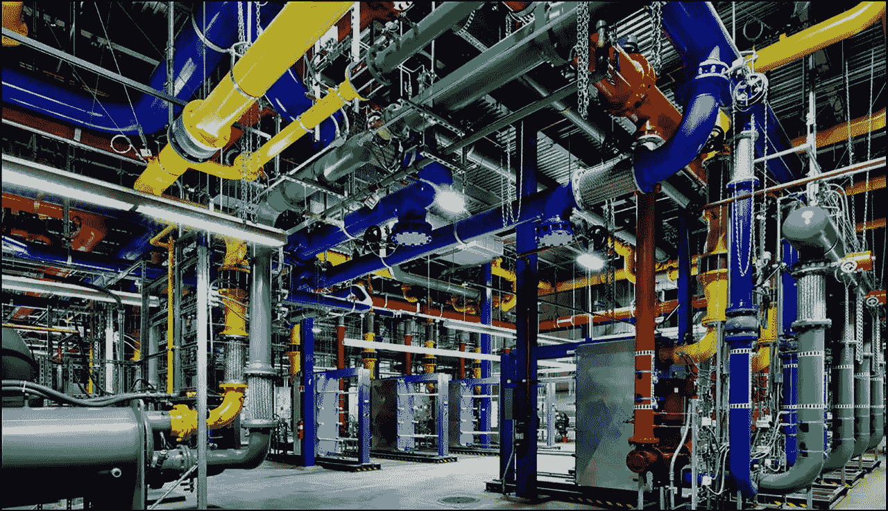

Cooling System of Google’s Datacenter

建模是在模拟器中离线完成的，以确保算法不会开始尝试随机的事情，并可能摧毁数十亿美元的数据中心。该模型不仅使用可用的数据，而且还进行一些探索性分析，以便可以从人类操作员的基线进行改进。探索性分析对于找到更好的策略是很重要的(否则只会有操作人员已经在做的事情)。

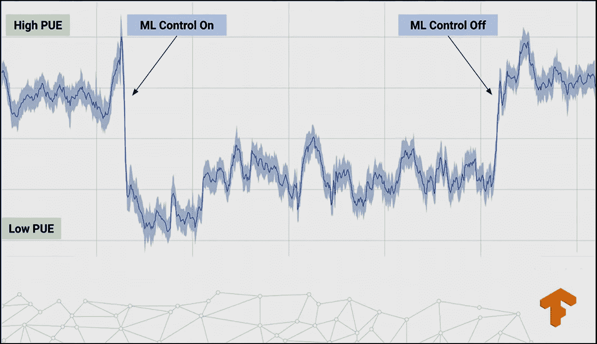

Graph of the energy effectiveness after activating the model.

在初步研究和实施之后，该系统被打开，显示出[电力使用效率](https://en.wikipedia.org/wiki/Power_usage_effectiveness) (PUE)的明显下降，导致数据中心的账单减少了 40%。

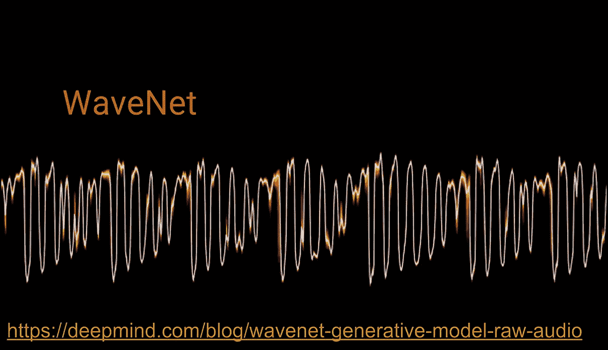

保持时间序列的主题，Deepmind 的另一大成就是创造了 [Wavenet](https://deepmind.com/blog/wavenet-generative-model-raw-audio/) 。这种神经网络可以以前所未有的精确度将文本转换成语音和音乐。这个网络改变了以前在文本到语音合成中使用的范例，从使用预先录制的语音片段的连接/参数方法到直接产生声波的*。使用[**【MOS】**](https://en.wikipedia.org/wiki/Mean_opinion_score)**(**MOS 是主观声音质量测试的标准衡量标准)，结果清楚地显示了性能的提高。*

*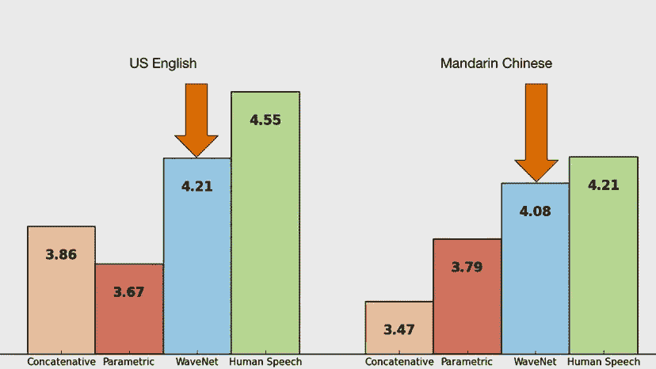*

*这个神经网络也能够生成完整的音乐波形！这些只是 Deepmind 团队在 2016 年取得的众多成果中的几个精选例子。*

*音乐和艺术生成的主题非常有趣，Tensorflow 有一个完整的项目致力于让所有艺术家都可以使用这项技术:[Magenta 项目](https://magenta.tensorflow.org/)。*

*Magenta 是由谷歌大脑的研究科学家[道格拉斯·埃克](https://twitter.com/douglas_eck)创造的，他回答了一个问题:深度学习和深度强化学习能否产生像音乐和艺术一样引人注目的媒体？*

*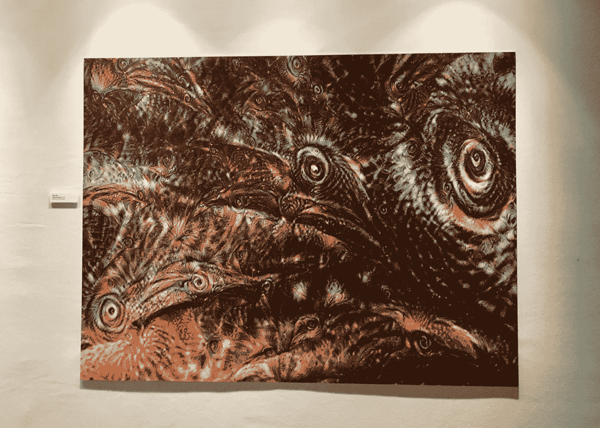*

*The Art exhibition by Mike Tyka that was installed at the event is an example of generative art.*

*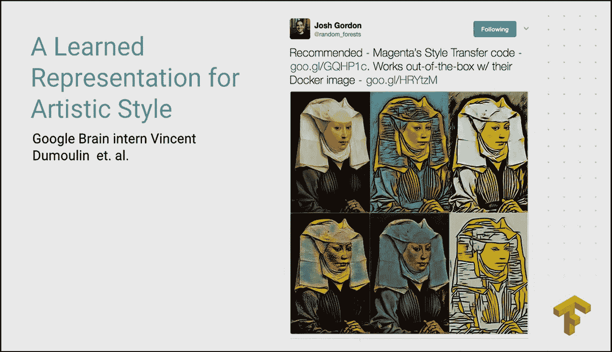*

*谷歌大脑团队还通过他们的[学习艺术风格的表现](https://arxiv.org/abs/1610.07629)例子，设法改进了艺术风格的原始[神经算法。虽然第一项工作发现了如何教会*单个*神经网络如何将风格从*单个*绘画转移到*单个*图片，但这项工作能够训练一个*新的*神经网络，它能够学习并同时应用一组不同的风格。](https://arxiv.org/abs/1508.06576)*

**

*Tensorflow 对计算机视觉的另一个创造性应用是图像修复，卷积神经网络被训练生成任意图像区域的内容。图像的一部分被移除，并且神经网络能够从可用的环境中重建缺失的部分。*

**

*这种输入的概念也可以应用于音乐，给定一组乐曲的音轨，神经网络可以以与歌曲其余部分合拍的方式填充空白部分。*

*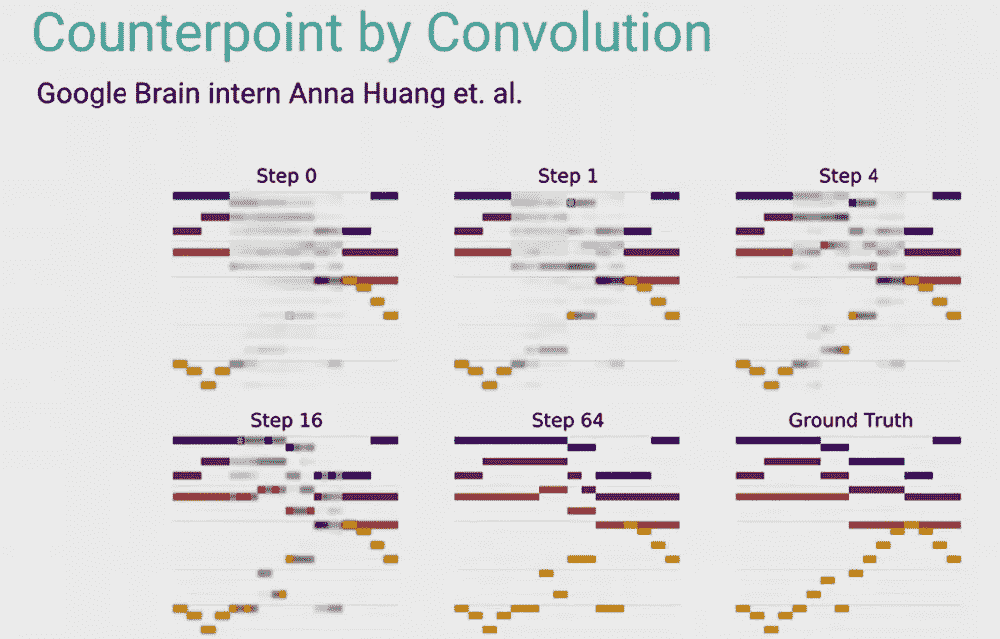*

*Example of counterpoint generation from music context*

*神经网络可以诊断皮肤癌，可以玩游戏，可以管理数据中心，可以说话，甚至可以播放音乐。那为什么不自己编程呢？我们当然有这方面的神经网络！*

**

*[学习用梯度下降法学习用梯度下降法学习](https://github.com/deepmind/learning-to-learn)和[用强化学习的神经架构搜索](https://arxiv.org/abs/1611.01578)是神经网络自身产生和改进神经网络的两个例子。*

*这里的想法是使用 AlphaGo 中相同的决策原则，但不是进行游戏移动，而是网络试图决定在定义神经网络的操作序列中使用什么数学函数。*

*神经架构搜索神经网络生成了一个名为 NASCell 的新细胞，它优于之前所有人类生成的细胞，以至于[已经可以在 Tensorflow 中使用。](https://github.com/tensorflow/tensorflow/blob/f821ce046df71f5784ed4ce7fb6b87f77d96b031/tensorflow/contrib/rnn/python/ops/rnn_cell.py#L1257)神经网络的这种特殊应用真正引起了我的兴趣和兴奋，因为每次神经网络优化技术有所改进*所有的神经网络都会立即改进*，创建那些指数反馈循环，最终导致更接近“真正”人工智能预期的系统。*

# *第一部分的结论*

*这是第一部分的结尾。我们讨论了 Tensorflow 项目的两个方面:社区和应用。在第 2 部分中，我将介绍工具和技术，在第 3 部分中，我将回顾部署策略。*

*这篇文章故意写得有点高，非专业读者也可以阅读。在接下来的文章中，我将更多地讨论框架的内部结构以及如何使用这些工具，看到更多的代码片段，可能还会展示一些操作视频。*

*如果你喜欢这篇文章，你想知道下一部分什么时候出来，请在 medium 和 twitter 上关注我，不要忘记分享这篇文章:)*

*保持饥饿，保持愚蠢，保持关注*