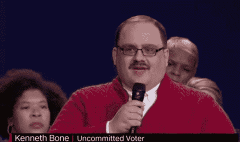
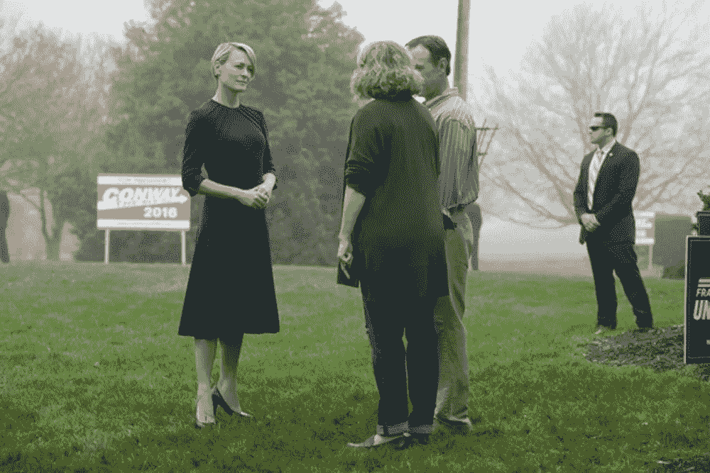
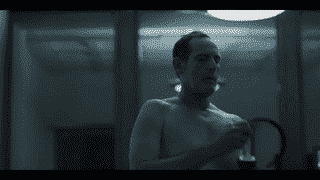
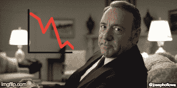

# 关于数据科学，什么样的纸牌屋是正确的(和错误的)

> 原文：<https://towardsdatascience.com/what-house-of-cards-got-right-and-wrong-about-data-science-41218f69c7f5?source=collection_archive---------2----------------------->

鉴于最近发布的两部 [《纸牌屋》第五季预告片](https://www.youtube.com/watch?v=UW8Zyt8SF_U)和即将发布的值得狂欢的《T4》网飞系列第五季，这是做两件事的绝佳机会:

*   观看(或重新观看！)立即串联。
*   回顾一下《纸牌屋》第四季如何使用数据科学家，以及他的工作如何很好地反映了现实世界的数据科学。

> ***剧透预告:*** 本帖包括《纸牌屋》第四季之前的剧透。如果你还没有看完第四季，我建议就此打住。

## *快速回顾:*

在第三季和第四季中，弗朗西斯·安德伍德(凯文·史派西饰)是美国总统。他和妻子克莱尔·安德伍德(罗宾·怀特饰)分别以总统和副总统的身份竞选 2016 年总统大选。他们聘请琳恩·哈维(内芙·坎贝尔饰)担任竞选经理，负责监督和管理他们的总统竞选活动。她聘请艾丹·麦卡伦(达米安·杨饰)担任竞选活动的数据科学家，他的工作是收集选民的数据和信息，以便做出更好的竞选决策。

*你可以在这里* *找到第 1-4 季* [*更详细的总结。*](http://www.vulture.com/tv/house-of-cards/)

# 小组讨论

总统的幕僚长道格·斯坦普(Doug Stamper)认为，安德伍德总统选择他的妻子作为竞选伙伴将会是竞选的一场灾难。即将成为竞选经理的 Leann Harvey 反对他使用焦点小组作为证据:

> 丽安:你做了一些民意调查，那又怎么样？
> 
> 道格:焦点小组也是。
> 
> 丽安:毫无意义。

《纸牌屋》做对了什么:焦点小组通常由 30 人组成，他们坐在一个房间里，被问及对一个人、一个想法或刚刚看完的一个广告的感受。Leann 是正确的，焦点小组并不能很好地反映人们会如何投票；如果我们对 30 名随机投票者进行投票，[该投票的误差率将高达 18%](http://www.dummies.com/education/math/statistics/how-to-calculate-the-margin-of-error-for-a-sample-mean/) 。(相比之下，美国大多数总统民调的误差率在 4%左右。)18%的误差率意味着你的选举预测将非常不精确。例如，一项民意调查显示 60%的人会投票给克林顿，误差率为 18%，这意味着**美国人投票给克林顿的“真实比例”估计在 42%到 78%之间**！用一个焦点小组作为证据来证明为什么克莱尔会成为一个好的或坏的副总统候选人，嗯，有点傻，不是一个好主意。

此外，焦点小组包括参与者之间的讨论。在这些讨论中，人们经常改变他们的想法或说出一个在群体中似乎受欢迎的观点，即使他们实际上并没有这样的感觉。心理学家 Solomon Asch 对这个想法进行了一项臭名昭著的研究。如果你以前在美国投过票，你就会知道你是独自去投票站，在没有其他人压力的情况下做出决定的。这表明焦点小组没有提供选举结果的准确估计——因为他们没有反映我们实际投票的情况！

《纸牌屋》出了什么问题:正如 Leann 所说，尽管焦点小组对选举结果既不提供准确的估计，也不提供精确的估计，但这并不意味着它们完全没有意义。焦点小组通常用于定性研究:例如，人们如何感知信息或人们如何对他人的意见做出反应。听取焦点小组成员对他们刚刚观看的广告的反应，可以洞察例如一个家庭或一群朋友如果在家观看广告可能会有什么反应。理解参与者反应的言辞和想法对营销人员或政治家来说是非常宝贵的。

[Ken Bone](http://knowyourmeme.com/memes/ken-bone), American hero and global meme.

# 监督学习

**背景:**数据科学家 Aidan Macallan 和活动经理 Leann Harvey 在一家爵士乐俱乐部会面，背景音乐是表演者的演奏。Leann 想知道安德伍德夫妇需要做些什么才能赢得更多的选票，但 Aidan 还没有找到任何答案。

> Leann:“我们给了你权限——我需要的比我们得到的更多。你应该告诉我人们想要什么。”
> 
> 艾丹:“直到第一次听到爵士乐，人们才知道他们想要爵士乐。我可以让他们喜欢这音乐——我不会作曲。给我一些我可以用的东西。”

Claire Underwood discovering “beyond” in South Dakota.

正如 Aidan 和 Leann 讨论的那样，Aidan 没有能力为 Underwoods 在竞选中说些什么……但是一旦 Frank 和 Claire 说了一些能引起选民共鸣的话，Aidan 就能抓住选民的情绪，鼓励 Underwoods 一遍又一遍地说。艾登发现克莱尔在南达科他州的一次演讲中使用了“超越”这个词，开始让选民转向安德伍德一家。然后他们尽可能频繁地使用“超越”这个词——交谈

**纸牌屋做对了什么:**数据科学不是魔法。在现实世界中，如果我们想测试一个政治广告是否会使选民转向一个方向，首先必须有人制作这个广告， ***，然后*** ，我们可以运行一个实验来测试它。这不仅限于政治。实验(在非学术环境中通常称为 [A/B 测试](https://conversionxl.com/ab-testing-guide/))在许多领域都很常见，包括[临床试验](https://www.nhlbi.nih.gov/studies/clinicaltrials)、[网站布局](https://vwo.com/ab-testing/)以及电子邮件营销活动。

在没有观察到选民更有可能投票给你的任何情况下，预测会导致选民投票给你的情况是可以理解的困难。艾丹的观点是，他无法预测选民会开始改变主意的情况，但一旦他观察到选民改变主意，他就能确定为什么会发生这种情况。(在数据科学中，我们使用术语[监督学习](https://www.quora.com/What-is-the-difference-between-supervised-and-unsupervised-learning-algorithms)来指代类似这样的情况，我们已经观察到一些输出，如增加的投票者认可。)

虽然“超越”这个词对于选民“想听的”来说可能是一个奇怪的选择，但 2016 年美国总统大选中有许多词可能有助于打动选民。想想唐纳德·特朗普给那些反对他的人起的绰号:

*   说谎的泰德(克鲁兹)
*   小马可(卢比奥)
*   高飞·伊丽莎白·沃伦
*   弯曲的希拉里(克林顿)
*   低能杰布(布什)

知道哪些词语会对选民产生影响对竞选公职的人来说是无价的。

**什么纸牌屋出了问题:**数据科学家可以在这个问题上取得进展，而不需要一个特别好的广告或短语。想想超级碗广告中的常见主题——狗、情感诉求和政治主题似乎是谈论最多的广告主题。数据科学家可以使用像[回归](http://www.investopedia.com/terms/r/regression.asp)这样的机器学习技术来查看什么产生了最多的流量，即使他们还不能检测出什么会导致选民以特定的方式投票。类似地，数据科学家可以观察现有的政治广告，试图区分什么是“好”广告，什么是“坏”广告。

# 使聚集

**背景:**数据科学家艾丹·麦卡伦(Aidan Macallan)正在推销他的分析公司，以赢得一份美国国家安全局的合同，该合同监控所有美国人的手机，以识别和跟踪潜在的恐怖分子。(然而，安德伍德夫妇希望利用这些数据来确保他们赢得选举。)

What data scientists do when their code is running.

> 艾丹:以枪支为例。如果我们从每个合法拥有枪支的人开始，通过他们的手机追踪地理定位模式，我们就开始描绘出枪支拥有者的生活、饮食、购物等一切。由此，我们预测了每个可能想要枪支但没有登记的人。他们可能会表现出和正常人一样的行为。你可以用它来帮助那些对阿拉伯语感兴趣的人，那些想去中东旅行的人，那些对美国政府失望的人。

《纸牌屋》做对了什么:数据科学家确实可以使用技术来找到符合某一类别的个人。在缺乏“拥有枪支”和“绝对不想拥有枪支”这两个类别的实际数据的情况下，数据科学家可能会使用[聚类分析](https://home.deib.polimi.it/matteucc/Clustering/tutorial_html/)来识别不同的选民群体，了解枪支所有者倾向于在哪里生活、吃饭和购物，然后开始关注那些在相同地方生活、吃饭和购物但没有枪支的人。聚类分析包括查看数据，并通过观察看起来彼此“接近”的观察结果或个人来识别组。一个经常被引用的聚类分析的真实例子是，Target 的统计学家在一个女孩的父亲知道她怀孕之前就知道她怀孕了，因为她的购物习惯与其他孕妇相匹配(理解为“接近”)。

**什么纸牌屋出了问题:**某人把手机放在哪里——也就是艾丹提到的地理定位模式——并不是数据科学家进行预测的唯一方法。事实上，目标怀孕预测模型是基于购物习惯。数据科学家将经常使用购买历史和人口统计信息等变量来组织消费者、投票者，甚至基于他们的“相似”程度来组织字体。一个很酷的例子是[Ideo](http://fontmap.ideo.com/)设计的这个字体地图，它依靠[人工智能](https://medium.com/ideo-stories/organizing-the-world-of-fonts-with-ai-7d9e49ff2b25)来直观地布局不同字体有多相似。

Credit to [Joseph Nelson](https://medium.com/u/690e8d667b35?source=post_page-----41218f69c7f5--------------------------------) for putting this GIF (pronounced “jif”) together.

# 结论

总而言之，《纸牌屋》在展现最佳数据科学实践方面做得很好。该节目的编剧没有将数据科学视为解决故事的杀手锏。老实说，“纸牌屋出了什么错”主要是为了更完整地描述数据科学是如何运作的，而不是展示者的错误陈述。对于一个组织来说，这并不奇怪，因为它不仅雇佣了数据科学家，还举办了一场挑战，利用数据科学来改进推荐算法。

我的意思是，即使是克莱尔·安德伍德也知道价值观是怎么回事。

Ba-dum-tiss.

感谢[约瑟夫·尼尔森](https://medium.com/@josephofiowa)、[劳拉·李波芙](https://theindex.generalassemb.ly/@laura.leebove)和[丽贝卡·路易](https://theindex.generalassemb.ly/@rebeccalouie)的编辑，这篇文章有了很大的改进！