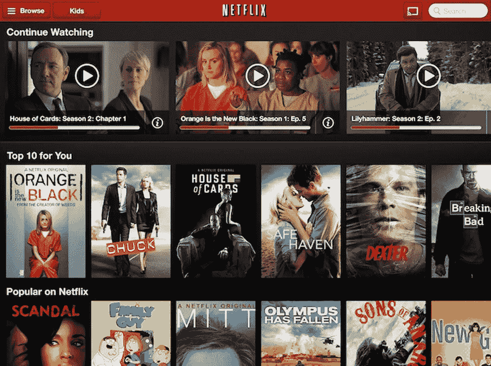
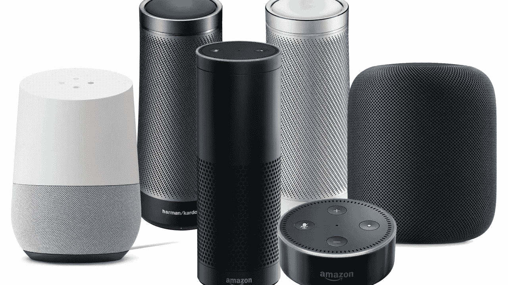

# 我在硅谷学到的人工智能

> 原文：<https://towardsdatascience.com/what-i-learned-about-artificial-intelligence-in-silicon-valley-7d30b47ab751?source=collection_archive---------3----------------------->

上周，我在加州帕洛阿尔托的技术革命中心呆了一周。我去过机器人大会，AI 研讨会，深度学习讲座，虚拟助理演示。

我了解到人工智能无处不在，虽然它已经融入了我们的日常生活，但我们还没有看到任何东西…

为什么是现在？人工智能一词是由约翰·麦卡锡在 1956 年的达特茅斯会议上提出的，在过去的几十年里，它经历了两个“冬天”，一个在 70 年代，一个在 90 年代。软件和硬件的问题受到了冲击，留给了学者去解决。

> “我们正在从移动优先的世界向人工智能优先的世界发展”,谷歌首席执行官桑德尔·皮帅

有三种不同类型的人工智能:

人工狭义智能——一匹只会一招的小马，它们可以下棋、识别人脸或翻译外语

**AGI**——人工通用智能——能够将智能应用于任何问题。

**ASI**——人工超级智能——比最好的人类大脑更聪明，能够将其应用于任何事情。(这是斯蒂芬·霍金和埃隆·马斯克这样的人害怕的人工智能)

由于以下三个因素，人工智能最终能够发挥其全部潜力:

1.  GPU 功耗和成本
2.  大数据
3.  算法复杂性和效率

## GPU 功耗和成本

随着 NVIDIA 在 2007 年发明 CUDA，一种允许图形处理单元(GPU)用于计算和 3D 渲染的 API，一种更强大的处理方法被创建出来。最初用于视频和游戏软件，现在用于机器学习，这是人工智能的核心。

CPU 由几个针对顺序串行处理进行优化的内核组成，而 GPU 则具有大规模并行架构，由数千个更小、更高效的内核组成，旨在同时处理多项任务。

## 大数据

人类在过去两年中创造的数据比人类历史上的总和还要多。每分钟有 300 个小时的视频被上传到 YouTube，每秒钟有 40，000 次谷歌搜索，在脸书每分钟有 510，000 条评论被发布，293，000 条状态被更新，136，000 张照片被上传。

以及健康数据、银行业务、短信、电子邮件、照片等等，这些数据让计算机以惊人的速度进行学习。

## 算法复杂性和效率

计算机过去由程序员编程，有特定的输出设置。现在，随着处理器能力和大数据的可用，数据和所需的输出可以输入计算机，而计算机不需要编程。

例如，你可以将一百万张动物照片输入电脑，根据学习的类型，有监督的或无监督的，你可以将这些照片分类:猫、狗、马等等。到那时，你就可以停止贴标签，计算机将能够自己识别一只猫。

实际上，机器学习就像教孩子，孩子通过观察和经验学习，计算机使用数据而不是经验，并在失败时继续测试自己，重新测试，学习和理解。

# 应用程序

人工智能能够做一些不可思议的事情，其中一些我已经了解如下:

## 翻译

谷歌最近发布了 Pixel Buds，可以进行 40 种语言的实时语音翻译。他们使用谷歌助手语音识别和翻译服务。

## 娱乐

网飞推荐了你。

网飞将观众分成两千多个口味组。你在哪一个决定了你得到的建议。网飞的工作人员观看每一个节目的每一分钟，并标记发生的一切，例如打架、接吻、争吵等，然后网飞算法根据你“竖起大拇指”或在两个晚上狂看的节目显示建议

## 自动驾驶汽车

人工智能允许自动驾驶汽车根据交通、环境、路况、天气等做出数以千计的决定。你可以在这里阅读我关于自动驾驶汽车未来的文章[。](https://medium.com/@AdamLGreenwood/behind-the-wheel-9ddb7e735863)

## 卫生保健

斯坦福大学的研究人员创造了一种可以像专业医生一样识别皮肤癌的人工智能。该程序使用深度学习对近 13 万张痣、皮疹和病变的图像进行了训练。它的创造者说，它的表现与人类一样准确(“至少”91%一样好)。

## 数字助理

Just some of the digital assistants available today.

最近出现了一个完整的数字助理世界，Siri、Cortana、Alexa、谷歌助理，事实上到 2021 年，它们将超过世界人口。这已经开始了一个新的#noui 系统的状态，我将在我们的下一个寓言中谈到，在这里[订票](https://www.eventbrite.co.uk/e/fable-bots-the-future-of-immersive-ai-tickets-38579344859?aff=es2)。

## 物联网(IOT)

人工智能可以通过 IOT 改善一切，它可以预测你什么时候回家并打开暖气，什么时候睡觉并调暗灯光，什么时候你将用完牛奶和鸡蛋……任何与互联网连接的东西都可以受益于数据、学习和最终的智能。

# 未来

The future of AI?

任何技术都可能是一把双刃剑…人工智能可以解决所有的人类问题:贫困、不平等和气候变化，或者它可能是人类的末日。

谷歌人工智能主管 Ray Kersell 认为奇点可能会在 2029 年到来。奇点理论认为，人工智能将超越人类智能，并将突然引发失控的技术增长，从而给人类文明带来不可估量的变化。

## 失业

人工智能和机器人肯定会失去工作，电话销售员、收银员、法律助理、出租车司机、快餐厨师都将受到威胁。但是我们以前见过这种情况，动物被引入农业，机器首次进入生产线。我们适应，我们调整，我们找到新的工作让我们去做，例如，33.8 万人为谷歌、脸书、苹果、思科和甲骨文工作。事实上，仅在美国，就有 670 万人受雇于科技行业。这些工作在 30 年前并不存在。

## Robopocalypse？

一些非常聪明和见多识广的人害怕 AI 会把我们带到哪里，一些同样聪明和见多识广的人认为我们应该 100%接受它。

埃隆·马斯克(特斯拉和 SpaceX 的首席执行官)、雷德·霍夫曼(LinkedIN 的创始人)和一小群互联网企业家成立了 [openAI](https://openai.com/) ，一家负责研究和俯瞰人工智能发展的公司。

> “一旦开发出来，致命的自主武器将允许武装冲突以前所未有的规模和人类无法理解的速度进行。”埃隆·马斯克

马克·扎克伯格(脸书首席执行官)不同意，他说人工智能末日理论是不负责任的。

> 马克·扎克伯格说:“在未来的 5 到 10 年里，人工智能将会极大地改善我们的生活质量。”

那么，在不远的将来，人工智能会给我们带来什么呢？硅谷的专家认为，它将改变我们日常生活的每一个元素，从我们与他人互动的方式，到我们的家，我们的汽车等等。我非常期待看到它将带我们走向何方…