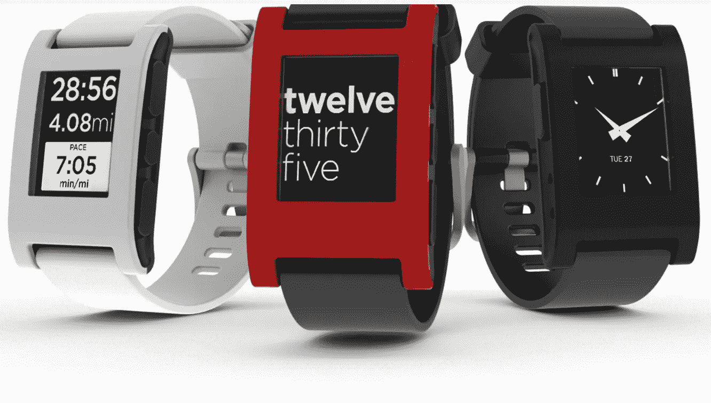

# 作为一名数据科学经理，我希望自己做得与众不同

> 原文：<https://towardsdatascience.com/what-i-wish-id-done-differently-as-a-data-science-leader-on-centralizing-siloed-data-d7492fd0d03c?source=collection_archive---------7----------------------->

## 集中孤立的数据

I still get nostalgic looking at the very first Pebbles. (Photo courtesy of Pebble’s first [Kickstarter](https://www.kickstarter.com/projects/getpebble/pebble-e-paper-watch-for-iphone-and-android/description))

2014 年，我加入了后来被 Fitbit 收购的智能手表制造商 Pebble，领导他们的数据科学和分析团队。

我对在硬件公司管理数据组织的挑战很感兴趣。我上一份全职工作是在脸书平台的一家视频游戏开发商那里，分析是公司的命脉。我们对从游戏内机制到用户获取的一切都进行了集中登录。

我知道在硬件公司工作会有所不同。我们会有很多我在以前的工作中遇到的相同的业务问题——客户在哪里找到我们的产品？他们如何使用它？我们怎样才能让它变得更好？—但要回答这些问题，可利用的数据有限得多。当顾客在百思买购买你的产品时，很难推断他们是从哪里听说你的，也很难衡量你的营销努力的影响。当客户被动地将您的产品戴在手腕上时，很难知道哪些客户每天都会使用该产品，哪些客户通常会将手表放在抽屉里。

My favorite watch face, on the Pebble Time Round.

在我在 Pebble 工作的两年中，我们想出了许多方法来了解人们如何使用 Pebble，并确定我们如何改进它。**但是我们在分散在不同系统的数据上苦苦挣扎。**

关键信息分布在多个存储库中:来自手表的日志保存在一个可查询的数据库中。营销数据存储在谷歌分析中，有时访问受到限制。销售数据存储在来自零售分销商的巨大、难以解析的电子表格中。客户支持查询和退货数据被锁定在不可查询的第三方工具中。

## 筒仓的问题

许多公司面临着同样的问题:集中分析团队只能访问公司不同业务职能部门的一小部分信息，而**他们无法获得跨职能部门的支持，将孤立的数据集中到一个中心位置。**

把所有数据放在一个地方的好处很容易得到口头上的支持。但实际上实现这一目标并不是一件轻而易举的事情，需要多个岗位的多个人坐下来达成共识。

如果孤立的数据没有直接和明确定义的增值，每个人都将难以将集中化优先于他们手头的所有其他任务。即使您使用的工具应该使数据集中化变得“简单”，您也必须找到合适的人，比如说，让您获得适当的身份验证令牌，以将孤立的数据源连接到您的中央数据存储，并且这个“简单”的任务可能会拖上几天，直到您取消优先级并有效地放弃它。

也可能有合理的理由保持数据孤岛，而组织的不同部分并不完全理解。例如，有些公司拥有敏感的客户数据，出于隐私原因，整个组织都不能访问这些数据。

The fence between the data you have and the data you need.

## “可是我们没有数据啊！”

“我们没有数据”是数据工作者哀叹的标准部分。作为一名经理，我觉得我工作的一部分就是让我的团队向我倾诉他们日常工作中的琐事所带来的挑战。

我知道数据工作有多令人沮丧。您花了几个小时清理一堆杂乱的数据，只是为了可以对其运行一个简单的脚本，您发现日志中的漏洞和错误弄乱了您的整个方法，或者您发现自己无法回答高管们提出的问题，因为您需要的数据根本不存在。处理数据需要用头撞墙，作为经理，我的工作就是承认这种挫败感，并尽可能有效地帮助团队克服它。

有时，经理可以提供建设性的解决方案，实际上解决这些问题。实现一个 ETL 脚本来保持数据整洁！与工程部门讨论如何修复日志记录错误！与另一个团队合作，访问您需要的数据！**但是通常最好的选择是鼓励团队找到变通的解决方案**。人们很容易被问题的细节所困扰，开始让完美成为美好的敌人。尽可能经常地，我想让我的团队成员回到鸟瞰图，这样他们可以找到一个足够好的解决方案来有效地解决他们的问题。

## 为什么管理者会让“我们没有数据！”关注幻灯片

这就是为什么，当我团队中的人提出我们*应该*集中访问谷歌分析、Zendesk 或零售销售数据的时候，**我经常不予理会。**这些数据通常对解决他们眼前的问题并不重要，而且**作为一名经理，我倾向于不优先考虑那些“值得拥有”的东西**

我也有一种直觉，我们的团队可能并不了解为什么这些数据最终会成为孤岛的所有复杂的组织原因，所以我不想花费宝贵的时间和精力去追逐那些最终会成为死胡同的数据。

但是我希望，无论何时，当我的团队抱怨他们无法使用某些东西时，我会告诉他们去解决他们自己的问题。

去找电商团队谈 Google analytics 吧！

去和支持团队谈谈 Zendesk 吧！

去和销售团队谈销售渠道数据吧！

如果你想要数据，让它发生！**没有人会比你更关心这些数据，所以*你*会优先考虑这些数据。我会给你所有你需要的工具，把它输入我们的中央数据库。如果你没有访问数据的权限，那是你要解决的问题。去拿吧！**

Collect ALL the data!

## 让你的团队继续前进

我尽最大努力让我的团队去追逐他们需要的数据。但是在这些情况下，他们通常会带着一个新的理解回来，为什么他们认为容易的事情实际上很难，他们会放弃他们的担忧，继续他们的下一个任务。

**我希望我进一步鼓励了他们，并告诉他们坚持下去。**

虽然集中式数据的直接价值并不总是显而易见的，但我确实相信将所有数据放在一个地方会有剩余和复合效应。但是，经理们通常无法确定集中化任务的优先顺序。有太多的孤岛，太多的团队需要加入，太多的令人担忧的问题需要优先考虑。

自上而下的数据集中化方法—数据科学副总裁与营销副总裁、销售副总裁、运营副总裁和首席执行官合作—过于庞大。**但是零敲碎打——让一个有积极性的数据工作者在另一个部门找到一个合作者，并继续集中他们能集中的任何一点点数据——可能会成功。**

Pebble 拥有适合这种自下而上方法的文化。总的来说，我们是一群友好、体贴、慷慨、思想独立的人。我们的组织文化强调自主意识，没有人会因为初级团队成员主动解决他们关心的问题而被冒犯。

自下而上的数据集中化方法可能并不适用于每家公司，但总的来说，我认为数据科学经理可以受益于将数据获取的责任交给他们团队中投资于所述数据的任何成员。他们才是将要使用它的人——为什么他们不应该有责任倡导获取他们需要的数据呢？