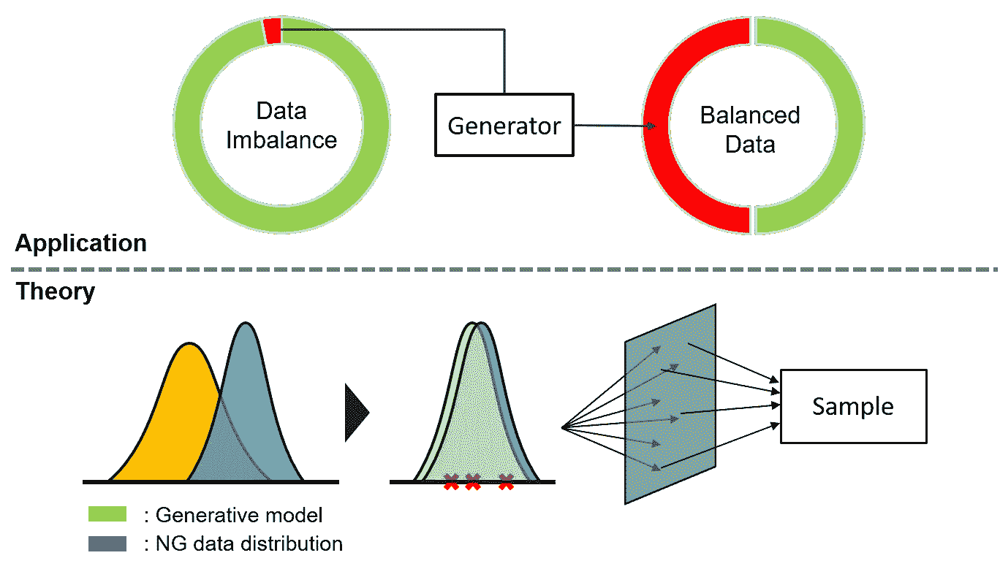
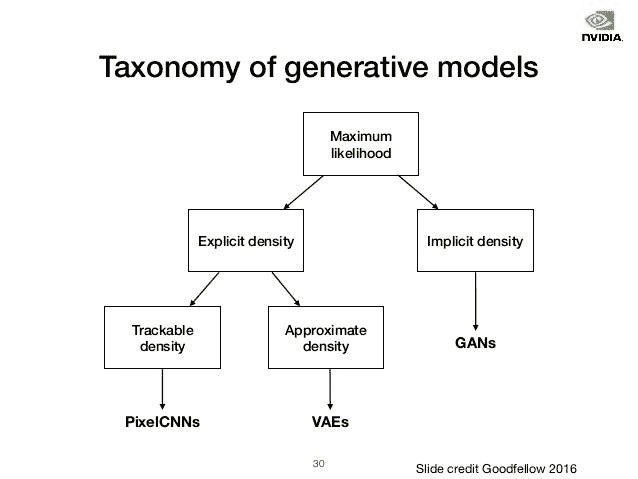
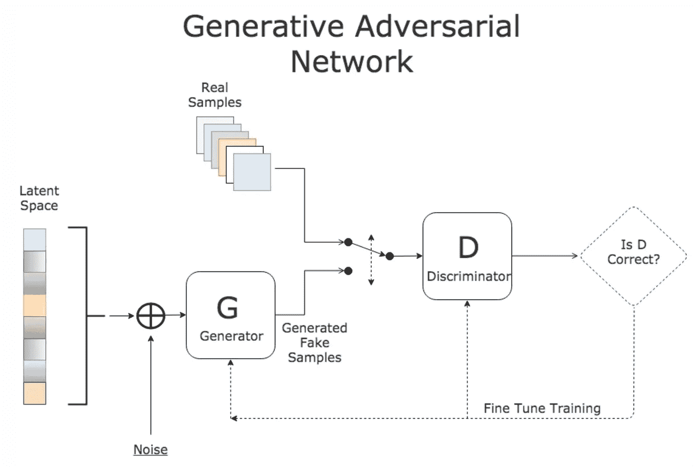
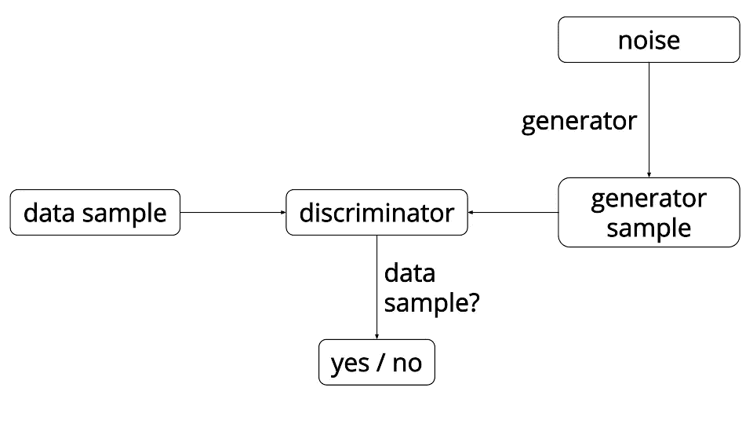
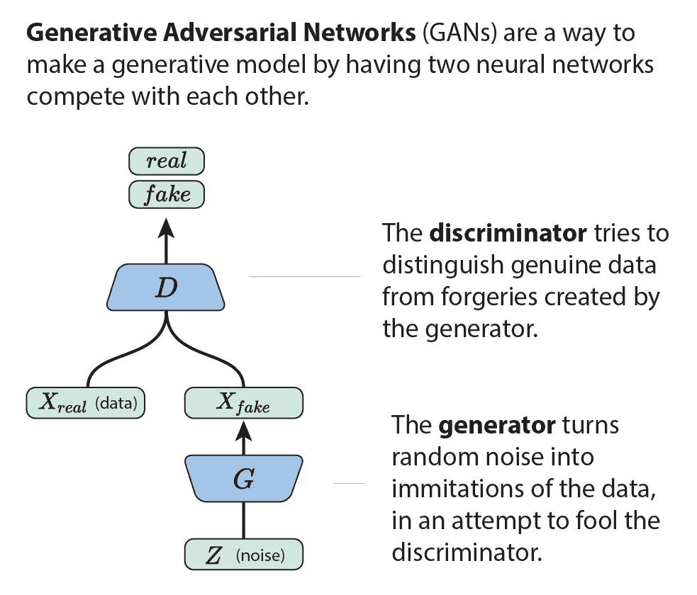

# 什么是生成性对抗网络？

> 原文：<https://towardsdatascience.com/what-is-a-generative-adversarial-network-76898dd7ea65?source=collection_archive---------6----------------------->

# 生成模型中有什么？

在我们开始讨论[生成对抗网络](https://arxiv.org/pdf/1406.2661.pdf) (GANs)之前，有必要问一个问题:生成模型中有什么？为什么我们甚至想拥有这样的东西？目标是什么？这些问题可以帮助我们思考如何更好地与 GANs 合作。

那么我们为什么想要一个生成模型呢？嗯，名字里就有！我们希望创造一些东西。但是我们希望产生什么呢？通常，我们希望生成数据(我知道，不是很具体)。除此之外，我们很可能希望生成以前从未见过的数据，但仍然适合某种数据分布(即我们已经放在一边的某种预定义数据集)。

这样一个生成模型的目标是什么？变得如此善于提出新生成的内容，以至于我们(或任何正在观察样本的系统)再也无法区分什么是原创的，什么是生成的。一旦我们有了一个可以做这么多的系统，我们就可以自由地开始产生我们以前从未见过的新样本，但仍然是令人信服的真实数据。

为了更深入一点，我们希望我们的生成模型能够准确地估计我们真实数据的概率分布。我们会说，如果我们有一个参数 W，我们希望找到使真实样本的可能性最大化的参数 W。当我们训练我们的生成模型时，我们找到这个理想的参数 W，使得我们最小化我们对数据分布的估计和实际数据分布之间的距离。

分布之间距离的一个很好的度量是 [Kullback-Leibler 散度](https://en.wikipedia.org/wiki/Kullback%E2%80%93Leibler_divergence)，它表明最大化对数似然相当于最小化这个距离。采用我们的参数化生成模型，并最小化它与实际数据分布之间的距离，这就是我们如何创建一个好的生成模型。它还把我们带到了两种类型的生成模型的分支。

# 显式分布生成模型

显式分布生成模型提出显式定义的生成模型分布。然后，它通过对数据样本的训练来改进这种明确定义的参数化估计。显式分布生成模型的一个例子是[变分自动编码器](https://arxiv.org/pdf/1606.05908.pdf) (VAE)。VAEs 需要一个明确假定的先验分布和似然分布。他们使用这两个组成部分得出一个“变分近似”来评估他们的表现。由于这些需求和这个组件，vae 必须显式分布。

# 隐式分布生成模型

就像你可能已经放在一起的一样，隐式分布的生成模型不需要对它们的模型分布进行显式定义。相反，这些模型通过从其参数化分布中间接采样数据来训练自己。你可能已经猜到了，这就是 GAN 所做的。

它到底是怎么做到的？让我们深入研究一下 GANs，然后开始描绘这幅画面。

# 高级 GAN 理解

生成敌对网络的名字有三个组成部分。我们已经谈到了生成方面，网络方面是不言自明的。但是对抗性的部分呢？

GAN 网络由两部分组成，一个发生器(G)和一个鉴别器(D)。这两个组件一起出现在网络中，作为对手工作，推动彼此的性能。

# 发电机

生成器负责生成虚假的数据示例。它将一些潜在变量(我们称之为 z)作为输入，输出与原始数据集中的数据形式相同的数据。

潜变量是隐藏变量。当谈到甘时，我们有一个“潜在空间”的概念，我们可以从中取样。我们可以不断地滑过这个潜在的空间，当你有一个训练有素的 GAN 时，它会对输出产生实质性的影响(有时是可以理解的影响)。

如果我们的潜在变量是 z，我们的目标变量是 x，我们可以把网络的生成器看作是学习一个从 z(潜在空间)映射到 x(希望是真实的数据分布)的函数。

# 鉴别器

鉴别者的作用就是鉴别。它负责接收样本列表，并预测给定样本是真是假。如果鉴别器认为样本是真实的，它将输出更高的概率。

我们可以把我们的鉴别器想象成某种“扯淡检测器”。

# 对抗性竞争

这两个组成部分走到一起，一决雌雄。生成器和鉴别器彼此对立，试图最大化相反的目标:生成器希望创建看起来越来越真实的样本，而鉴别器希望总是正确地分类样本来自哪里。

事实上，这些目标是彼此直接对立的，这也是 GANs 名字中对抗性部分的由来。

谁不爱用一个好的比喻来学习理解一个概念呢？

# 艺术品赝品

当我第一次了解甘斯时，我最喜欢的比喻是伪造者对批评家的比喻。在这个比喻中，我们创造者是一个试图伪造艺术品的罪犯，而我们的鉴别者是一个艺术评论家，他应该能够正确地鉴别一件作品是赝品还是真品。

两者来回往复，彼此直接对立。试图超越他人，因为他们的工作依赖于此。

# 伪造的货币

如果不是艺术品伪造任务，而是我们有一个试图制造假币的罪犯和一个试图确保他们不接受任何假币的银行实习生。

也许在开始的时候罪犯是非常坏的。他们进来，试图递给实习生一张纸，上面用蜡笔画着一美元钞票。这明显是假美元。但也许实习生也真的不擅长他们的工作，并努力弄清楚这是不是真的假的。两个人都会从他们的第一次互动中学到很多。第二天，当罪犯进来的时候，他们的假钱会变得更难辨别真假。

在日复一日的活动中，这两个人来来回回，变得非常擅长他们的工作。然而，在某一点上，可能有一天两者会达到某种平衡。从那里，罪犯的假美元变得如此逼真，甚至没有一个经验丰富的专家甚至可以开始告诉它是假的还是真的。

那是银行实习生被解雇的日子。

这也是我们利用我们的罪犯变得非常富有的一天！

# 鹦鹉

前两个例子非常直观。但是一个稍微不同的例子呢。

假设我们的发电机是我们的宠物鹦鹉，我们的鉴别者是我们的弟弟。每天，我们坐在窗帘后面，我们的鹦鹉坐在另一个窗帘后面。我们的鹦鹉会试着模仿我们的声音来愚弄我们的弟弟。如果他成功了，我们就请他吃一顿。如果我们的兄弟猜对了我们在哪个窗帘后面，我们会给我们的兄弟一份礼物(希望不是给我们的鹦鹉的礼物)。

可能一开始，鹦鹉真的不擅长模仿我们的声音。但是日复一日的练习，我们的鹦鹉也许能够发展出完美地模仿我们声音的技能。在这一点上，我们已经训练我们的鹦鹉像我们一样说话，我们可以成为网络名人。

得分！

# 怪物背后的数学

在我们结束对 GAN 的介绍之前，有必要稍微详细地探索一下 GAN 背后的数学。gan 的目标是通过求解以下 minimax 方程，在网络的两部分之间找到平衡:

我们称这个方程为极大极小方程，因为我们试图联合优化两个参数化网络 G 和 D，以找到两者之间的平衡。我们希望最大化 D 的混乱，同时最小化 g 的失败。当求解时，我们的参数化的、隐式的、生成的数据分布应该相当好地匹配底层的原始数据分布。

为了进一步分解等式的各个部分，让我们多分析和思考一下。从 D 这一边，它想最大化这个方程。当一个真正的样本进来时，它希望最大化它的输出，当一个假样本进来时，它希望最小化它的输出。这就是等式右半部分的本质所在。另一方面，当 G 得到一个假样本时，它试图欺骗 D 使其产量最大化。这就是为什么 D 试图最大化而 G 试图最小化。

由于最小化/最大化，我们得到了 minimax 这个术语。

现在，假设 G 和 D 被很好地参数化，因此有足够的学习能力，这个极大极小方程可以帮助我们达到两者之间的纳什均衡。这是理想的。

# 如何实现这一点？

简单:我们只是来回迭代。

开玩笑的。其实并不简单。但是我们可以简单地描述一下。

首先，我们将首先训练 D 成为固定版本 G 上的最佳分类器。从那里，我们固定 D 并训练 G 以最好地愚弄固定 D。通过来回迭代，我们可以优化我们的极大极小方程，直到 D 不再能够区分真实和虚假样本，因为我们的生成数据分布或多或少无法与实际数据分布区分开来。此时，D 将为它遇到的每个样本输出 50%的概率。

# 包扎

这就是我们对甘斯的介绍。但是男孩还有更多！我们只是刚刚开始触及表面，在高层次上触及一切。然而，还有更多的错综复杂的事情要发生。并非所有事情都像我们目前概述的那样简单，在真实环境中训练 GAN 实际上可能非常困难。出于这个原因，我们将在后面的帖子中更深入地讨论 GANs 的组件、问题、突破、变化等等。现在，只要陶醉于这样一个事实:你正在理解生成模型和 GANs 的神奇世界！

如果你喜欢这篇文章，或者发现它在任何方面都有帮助，如果你给我一大笔[一美元或两美元](https://www.gofundme.com/hunter-heidenreich-research-fund)来资助我的机器学习教育和研究，我会永远爱你！每一美元都让我离成功更近一步，我永远心存感激。

敬请关注近期更多 GAN 博客！

P.S .非常感谢[生成性对抗网络及其变体如何工作:GAN 概述](https://arxiv.org/pdf/1711.05914.pdf)的作者，他们帮助启发了我，让我对 GAN 如何工作有了更多的了解。如果没有他们的论文，这个系列是不可能完成的。

*最初发表于*[T5【hunterheidenreich.com】](http://hunterheidenreich.com/blog/what-is-a-gan/)*。*