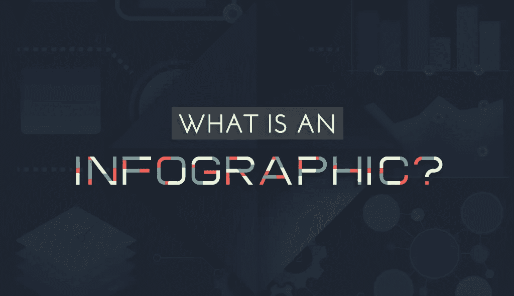
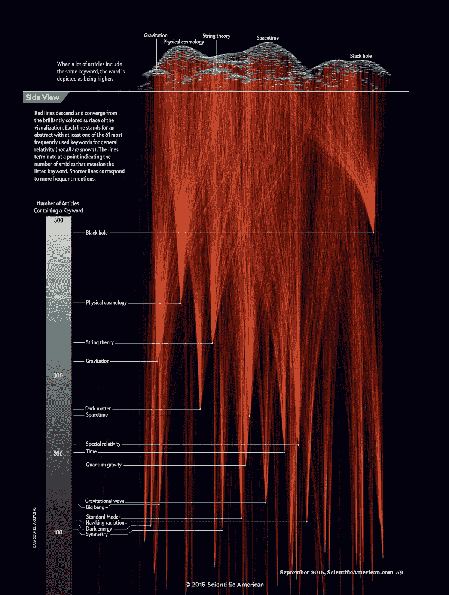
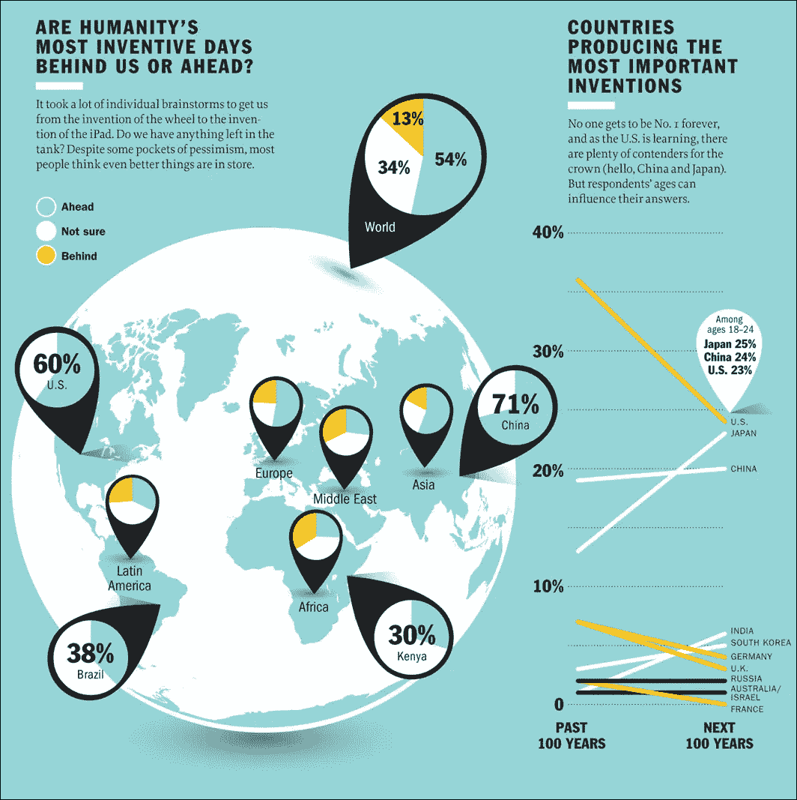
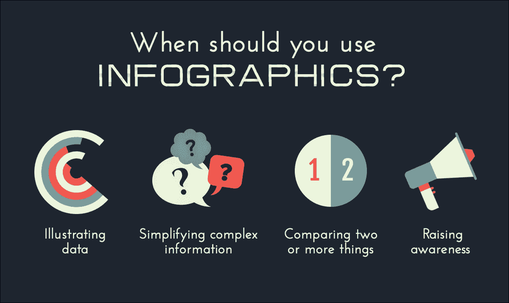
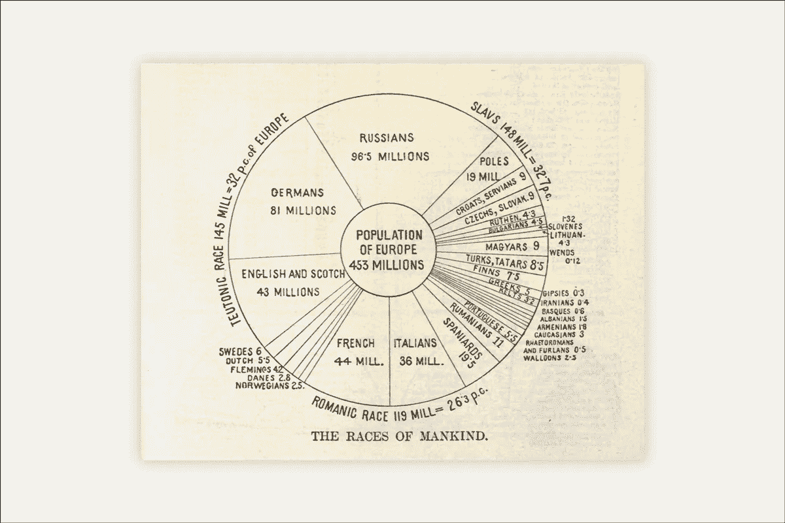
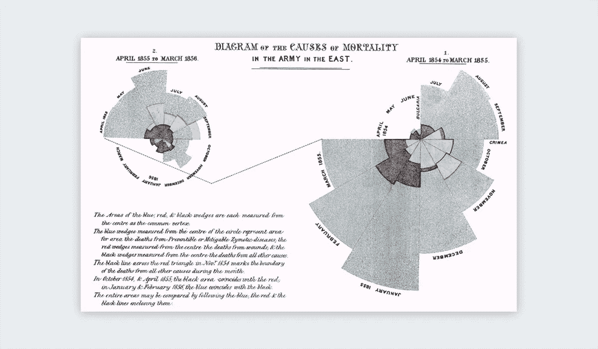
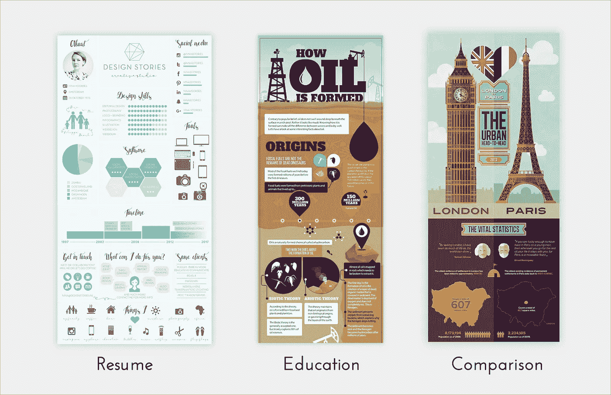
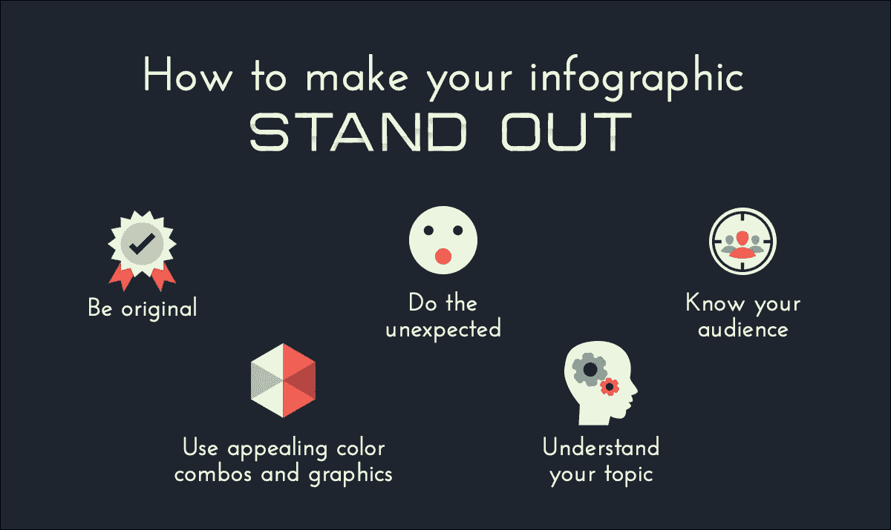

# 什么是信息图？它与数据可视化有什么不同？

> 原文：<https://towardsdatascience.com/what-is-an-infographic-and-how-is-it-different-from-a-data-visualization-a92c23b35197?source=collection_archive---------4----------------------->

你在任何地方都能看到它们——从教室到企业，[信息图表](http://blog.visme.co/what-is-an-infographic/)充斥着我们的生活和媒体。很难一天不在我们的脸书 feed 或网络上的其他地方看到他们。有了信息图表制作软件，创建这些有趣的视觉效果比以往任何时候都更容易，许多人正在利用这一点。

然而，随着这个词被如此频繁地使用，人们不禁要问——信息图到底是什么？这些视觉效果很容易与其他形式混淆，尽管它们有自己独特的历史、设计和目的。

先来一个大概的定义。根据 dictionary.com[的说法，信息图是“以图表、图形或其他图像的形式伴随着最少文字的信息的视觉呈现，旨在给出一个容易理解的概述，通常是一个复杂的主题。”](http://www.dictionary.com/browse/infographic)

你可能会问:“但是这和数据可视化有什么不同？”根据《哈佛商业评论》的指南 [*好图表*,有四种不同类型的信息图形:陈述性的、概念性的、探索性的和数据驱动的。为了找出特定图形的位置，您需要问自己两个问题:](https://hbr.org/product/good-charts-the-hbr-guide-to-making-smarter-more-persuasive-data-visualizations/15005-PBK-ENG)

*   我拥有的信息是概念性的还是数据驱动的？
*   我是在宣告什么还是在探索什么？

如果你对第一个问题的回答是“概念性的”或“数据驱动的”,对第二个问题的回答是“声明某事”,那么你可能正在处理一个信息图，绘制在下面图表的上半部分。

如果您对第一个问题的回答是“数据驱动”,对第二个问题的回答是“探索某物”,那么您很可能希望创建一个数据可视化，它绘制在此图表的右下象限。

# 每种图形类型的视觉示例

这个方便的图表可能会让你更好地了解如何对信息图形进行分类，但是要真正训练你的眼睛来识别每一个，你可能需要看一些例子。下面，我们提供了一些现实生活中的例子来帮助你识别它们之间的区别。

# 数据即:数据驱动和探索

[Image Source](https://www.scientificamerican.com/article/relativity-s-influence-is-still-going-strong-on-its-100th-birthday/)

在爱因斯坦的想法首次出现一个世纪后，看看这张关于广义相对论对当前物理学研究的影响的迷人的数据可视化图。它允许用户通过放大数据点并从各种不同的角度查看来与信息进行充分的交互。这使得读者可以随心所欲地深入或浅显地研究数据。

# 图表:声明性或探索性

[Image Source](https://dribbble.com/shots/1684631-Mixpanel-Trends-Design/attachments/266979)

图表经常在信息图中使用，但并不等同于后者。图表直观地显示特定的数据集，本质上可以是声明性的，也可以是探索性的。

如果你的星盘中的一切都是为了制造一个特定的、预先确定的点，那么你可以确定它是声明性的；然而，如果它在显示数据时没有将注意力吸引到某一点上，让浏览者得出自己的结论，那么它可能是探索性的。

尽管信息图可能包含图表，但它们使用其他图像和文字来为一个点服务。您可能会使用图表来显示单个数据集，而不是试图在一个视图中包含一大部分信息。

# 信息设计

[Image Source](http://techland.time.com/2013/11/14/the-time-invention-poll/)

由于名称非常相似，很容易将信息设计与信息图混淆。然而，这两者仍然服务于明显不同的目的。根据 [Dirk Knemeyer](http://boxesandarrows.com/information-design-the-understanding-discipline/) 的说法，信息设计并没有一个固定的定义。有各种各样的方法来理解它，正如你在这里看到的。一个这样的潜在定义是:“语言学科、艺术和美学学科、信息学科、传播学科、行为和认知学科、商业和法律以及媒体制作技术之间的交叉点。”

信息设计尤其用于连接和整合不同的学科。它不是一个特定的视觉类别，如信息图，因为它包含了广泛的概念。例如， [Clare McDermott](http://contentmarketinginstitute.com/2010/05/how-to-use-information-design-to-improve-content-marketing/) 建议使用“标注框”形式的信息设计来吸引对特定点的注意。

# 那么我们什么时候使用信息图表呢？

[Jaime Nacach](http://www.business2community.com/infographics/why-how-and-where-to-use-infographics-01407374#yZwhyypMdyFzXoWi.97) 通过解释信息图表的四种用途给出了答案:

*   **图解数据:**这意味着从调查(和类似的功能)中获取数据，并使它们比你的平均图表更有趣。
*   **简化一个复杂的主题:**如果你有一个令人难以置信的概念，并且需要一种快速简单的方法来分解它，信息图是一个不错的选择。
*   **进行比较:**信息图非常善于展示两件事是多么相似还是不同。
*   **知名度:**无论是与商业、政治还是任何其他领域相关，您都可以通过可共享的信息图表迅速提高品牌或事业的知名度。

问问你自己，“我想呈现什么样的信息？”如果你想要吸引眼球的东西，有大量简化的数据，信息图是正确的选择。

如果信息图已经演变成一套独特的视觉效果，那么这些图形最初是如何发展的，在哪里发展的？事实上，它们的起源可以追溯到很久以前。

# 开始的时候…

[Image Source](http://www.slate.com/blogs/the_vault/2016/02/17/a_treasure_trove_of_awkward_early_20th_century_infographics.html)

可能最早被认为是“信息图表”的图片实际上是洞穴壁画。这些不是今天大多数人知道的信息图表，但它们仍然有类似的目的:将一个困难的主题，如一个故事或一课，转化为一种易于可视化和理解的格式。象形文字和地图可以被认为有类似的目的。

我们今天所知的信息图的最大功臣是 1626 年的克里斯托夫·席耐尔，他利用信息图追踪太阳的轨迹。他在 *Rosa Ursina sive Sol* 重印了这些，一份遗产就这样诞生了。

席耐尔可能已经播下了这个信息图表的种子，但是一个名叫威廉·普莱费尔的苏格兰人真的在它上面展开了。根据克莱夫·汤普森的说法，Playfair 最初绘制专利，后来意识到他可以将他的插图应用于经济学，使数据更具视觉吸引力。

随着 Playfair 掌舵，这些新兴的信息图表在 19 世纪开始在欧洲蓬勃发展，有几个著名的例子。安德烈·米歇尔·盖里(André-Michel Guerry)是第一个使用阴影来说明某种物质或主题密度较高的区域的人，例如犯罪较为常见的区域，许多人随后采取了其他措施。

19 世纪后期，弗洛伦斯·南丁格尔使用信息图表向维多利亚女王陈述了她的情况——具体来说，她希望克里米亚战争的参战者获得更好的医疗服务。

事实证明，信息图表已经从简单地展示科学或经济数据转变为展示道德和政治主题。这些被带到了美国，在那里“[奴隶地图](http://www.smithsonianmag.com/history/surprising-history-infographic-180959563/)被用来决定内战中的战场。本质上，黑暗的区域意味着更多的奴隶，因此他们是应该首先关注的目标。

信息图在 20 世纪的使用更加多样化。[丽贝卡·洋葱](http://www.slate.com/blogs/the_vault/2016/02/17/a_treasure_trove_of_awkward_early_20th_century_infographics.html)发布了一些来自*科学美国人*的 20 世纪早期的信息图表，这些图表聚焦于各种主题(例如，离婚的原因)。美国宇航局甚至向太空发送了信息图表，以先锋 10 号和先锋 11 号上的“先锋徽章”的形式。

21 世纪信息图的使用扩展到了许多媒体形式，包括电视节目、视频游戏和报纸文章。Adobe 等程序的出现使得创建视觉效果变得不那么费力，并为现在的程序和信息图表铺平了道路。

今天，信息图仍然用于新闻和其他媒体，但已经扩展到其他领域，如课堂和内容营销。

# 要避免的常见错误

如今，信息图有多种使用方式，也有多种出错方式。

[Emilie Flutterman](https://thenextweb.com/dd/2013/10/16/10-ways-use-infographics/#.tnw_Snc4hsmU) 给出了各种信息图表常用方式的例子。例如，她提到信息图经常被视为简历，可以用来进行比较和招募他人。

凯西·施勒克提到信息图表可以很好地用于评估，并为教师列出了各种资源，以及许多有创意的信息图表示例。她的博客值得一读，尤其是如果你是一名有兴趣将这些概念融入课堂的老师。同样，Catlin Tucker 评论了教授信息图表如何给她的学生提供有用的技能，并给出了他们工作的几个例子。

随着信息图表出现在课堂环境中，它们也出现在学生的演示中也就不足为奇了。许多学生自然看到了使他们的信息更吸引人和更容易获取的吸引力，这也使他们的信息更有娱乐性。

信息图表应用增长最快的领域可能是内容营销。这张信息图说明了许多人想在营销中使用信息图的几个原因，从制作病毒式内容到让你的主题更容易理解。[乔·普利兹](http://contentmarketinginstitute.com/2012/02/best-content-marketing-infographics/)列出了一些最好的内容营销信息图，让你知道什么最有效。

虽然您可能已经准备好直接创建信息图，但首先有几件事您应该警惕。创建一个糟糕的信息图实际上会迷惑他人，让他们对你的主题不感兴趣，而不是吸引他们的注意力，让数据更加清晰。

[Nayomi Chibana](http://www.business2community.com/infographics/10-reasons-infographics-fail-make-succeed-01796705#QzzQazD6GwP2QC47.97) 给出了一些信息图表半途而废的 10 个原因。例如，她警告说，你应该从一个另类和原创的角度来接近一个广泛覆盖的主题，否则你可能会失去观众的注意力。他们还警告诸如糟糕的设计或信息图表太长等缺陷。

以下是一些让你的信息图脱颖而出的额外技巧:

*   **别出心裁:**做别人没做过的事，或者用新的方式去做。
*   做意想不到的事:给你的观众一个惊喜，但不要做得太安全。但是记住，要确保这个惊喜不会转移你的主题。
*   了解你的观众:记住你的观众，设计一些吸引他们的东西。
*   **使用吸引人的颜色组合和图形:**学习色彩理论，看看哪些颜色搭配起来很好，它们能唤起什么样的情感，然后开始运用它们。
*   **理解你的主题:**在你的信息图中包含信息之前，先弄清楚事实。

记住这些提示，你就可以开始创造一些惊人的视觉效果了。

# 敬未来

信息图现在非常流行，并且在过去几年里以惊人的方式发展，但是未来会怎样呢？

毫无疑问，信息图表将继续被企业、教育工作者和媒体频繁使用，但它们很有可能会像我们的技术一样发展。或许在未来，我们将开始看到更多互动的、类似游戏的信息图，以及融入虚拟现实体验的 3D 沉浸式信息图。

信息图仍在发展和变化，所以如果你以前没有使用过它们，现在是开始的最佳时机。你可以从下面的**免费的** **初学者指南中获取创建可共享的信息图**，带着你的新的创新想法，把它们变成能被人们长久记住的东西。

*本帖* [*原版*](http://blog.visme.co/what-is-an-infographic/) *最早出现在 Visme 的* [*视觉学习中心*](http://blog.visme.co/) *。*