# 什么是智能？

> 原文：<https://towardsdatascience.com/what-is-intelligence-a69cbd8bb1b4?source=collection_archive---------7----------------------->

大约 7 年前，当我还在上高中的时候，我是一名网站开发人员，并把学习心理学作为一种爱好，我偶然发现了一篇关于人工神经网络的文章。令人兴奋。就在我读完它之后，我开始寻找一种智力理论，这种理论可以解释我已经了解的人类智力，并以某种方式将其与人工智能联系起来。我研究过心理学、神经科学、控制论、认知科学、计算机科学、生物学、化学、物理学、神学、社会学和许多其他领域。上千篇文章论文，几百本书，几十门课过去了，我还是没有找到让我满意的答案。于是这篇文章诞生了。

让我们从维基百科对智力的定义开始，这实际上是我迄今为止看到的最好的定义之一:

> 感知或推断信息的能力，并将其作为知识保留，以应用于环境或背景中的适应性行为。

这与情报机构(CIA & Co .)通常使用的方式非常不同。他们的定义更接近于*数据*，特别敏感和有价值。然而，人工智能和生物智能的大多数定义是完全不同的，通常将智能描述为某种智能体的属性。此外，这个主体不可能完全孤立地存在，而是以某种方式体现在其环境中。

我将从人工制剂的概述开始，因为它们比生物制剂简单得多。之后，我将过渡到生物和他们有什么共同点。

# 人工智能

虽然很难确切说明第一个人工智能代理是什么，但巴贝奇的分析引擎可能是最佳候选。它没有任何特殊的“适应”能力，但是非常灵活。不幸的是，尽管理论上令人难以置信的美丽，没有一个原型已经完成。

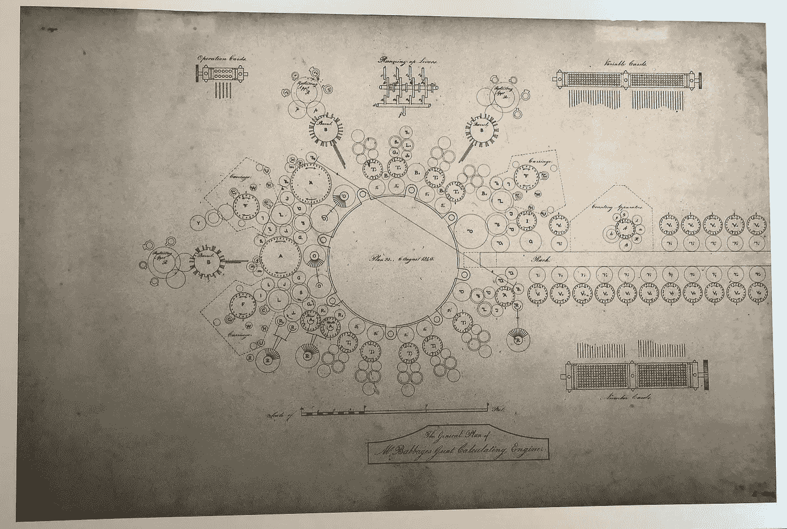

Plan diagram of the Analytical Engine from 1840\. Source: Wikipedia

有趣的是，在图灵出生前大约 50 年，图灵完成了。理论上，它可以将任何带数据的*可计算*函数作为输入，并在完全机械的情况下产生输出。大约比你的智能手机慢 1.000.000.000.000 倍。

这导致了算法复杂性理论的发展和一个普遍的认识，即建立一个通用计算机是一个相对容易的任务。此外，算法可以以多种方式实现。尽管一路上出现了技术挑战，但在过去的 70 年里，你可以以同样的价格购买的计算量大约每两年翻一倍。

换句话说，建立一个有能力计算任何政策的人工智能代理是很容易的。然而，它总是受到所提供的数据/输入以及处理它所需的时间的限制。这反过来提出了一个有趣的问题:如果每台计算机的能力都受到可用数据的限制，我们能称它们中的任何一台是智能的吗？我鼓励读者思考一下。

为了了解背景，让我们简单回顾一下人工智能研究的历史。从早期开始，它大致分为两个学派:象征主义学派和 T2 联结主义学派。符号方法更强调形式逻辑和手工制作的知识，而连接主义者更关注统计学习和人工神经网络(ann)的变体。他们的历史大致是这样的:

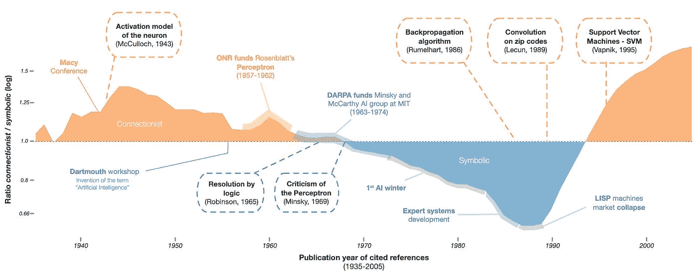

Relative popularity of Connectionist vs Symbolic approaches to AI. Source: [Intuition Machine](https://medium.com/intuitionmachine)

“橙色”阵营之所以领先，首先是因为它与神经科学和人类大脑的关系，人类大脑仍然被认为是“强人工智能”或“AGI”的唯一成功实现。然而，最初的人工神经网络在处理现实世界的问题时过于局限。其中许多是线性的，能力非常有限，明斯基对此进行了深入的批评。与此同时，“蓝色”阵营发展了严谨的数学理论，能够创造出更多有用的东西。

随着手工知识的积累，扩展这些系统变得越来越困难。在输入或输出空间大于几千个选项的情况下，它们总是失败。此外，就像通常的法律可能相互冲突一样，专家系统中的规则也可能相互冲突。他们的规模需要越来越多的“法官”来解决这些问题。发展停滞。

与此同时，“橙色”阵营获得了足够的标记数据和计算资源，在合理的时间内“训练”他们的网络，让世界各地的研究人员开始实验。然而，在经历了最初的失败后，人工神经网络花了相当一段时间才重新获得公众的信任。开发人员花了一段时间才适应模糊逻辑和统计的概念，而不是布尔逻辑和清晰的对应概念。

但是在更详细地讨论人工神经网络之前，我想强调几个已经证明在许多领域有用的其他方法。此外，到这个时候，很明显，与混合方法相比，纯符号或连接方法的性能较差。我需要指出的是，我将只描述算法的大类，因为即使是所有人工智能方法的简要描述也需要至少几本书。

在我看来，最值得注意的是决策树、概率模型和进化算法。

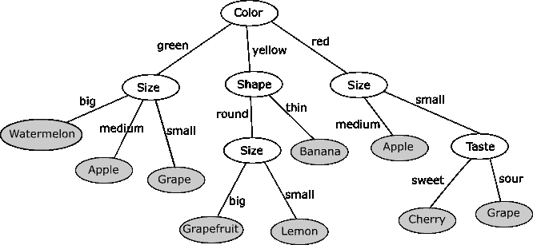

Schematic decision tree. Source: [prognoz.com](http://www.prognoz.com/blog/platform/benefits-of-decision-trees-in-solving-predictive-analytics-problems/)

决策树是最简单和最有效的算法之一。简而言之，他们的“学习”是通过依次检查数据的每个属性，并找出哪一个对特定输出最有预测能力来进行的。像随机森林这样更高级的变体使用更复杂的学习技术，并在同一模型中组合多棵树，它们的输出是通过“投票”得出的。然而，基本原理和直觉是一样的。

**概率模型**代表统计方法，是人工神经网络的近亲。他们经常共享架构、学习/优化过程，甚至符号。但是概率模型大多受到概率逻辑(通常是贝叶斯)的约束，而 ann 可能没有这样的联系。

**进化计算**最初是受生物进化的启发。特别是关于随机突变和适应度的观点。考虑到修改通常是随机的，限制噪声的效果令人惊讶。这个课程是一种引导式搜索，在许多方面类似于退火过程。

Evolution of “walkers”. Source: [alanzucconi.com](https://www.alanzucconi.com/2016/04/06/evolutionary-coputation-1/)

所有这些方法都有一个共同点:它们通常从非常差的政策开始，但逐渐改进以在某种性能评估函数上获得更好的分数。

如今，机器学习技术，特别是**深度学习**正在主导人工智能的研发。与大多数使用 1 或 2 个抽象中间层的 ML 方法(所谓的*浅层*模型)相比，DL 可能有数百甚至数千个堆叠的可训练层。

*Deep network and learned features. Image from:* [*edureka.co*](https://cdn.edureka.co/blog/wp-content/uploads/2017/05/Deep-Neural-Network-What-is-Deep-Learning-Edureka.png)

在进行实际实验之前，人们普遍认为需要发现全新的优化程序来训练这样的深度网络。然而，事实证明，传统的**反向传播**(又名链式法则)和**梯度下降**可以很好地完成这项工作。数学家们在几个世纪前就知道这些算法了。更现代的算法，如 Adam 或 RMSProp，被发明来解决 GD 的一些问题，但在大多数现实情况下证明是不必要的。

简而言之，神经网络的训练工作如下:

1.  取一堆可能的输入
2.  计算各自的输出
3.  计算性能
4.  将误差传递给前一层以调整其参数(并对网络中的每一层重复)
5.  对每一组可能的输入重复上述步骤，直到性能足够好

梯度下降不是唯一的最大似然训练算法，但是其中绝大多数算法的基本原理是相同的。只需通过策略取回错误，并调整参数以将其最小化。这种方法的一个主要问题是，人们普遍认为网络会陷入局部最小值，无法实现最佳设置。然而，最近的理论进展表明，在温和的假设下，许多神经网络可能确实达到全球最低水平。

Gradient Descent example. Source: [distill.pub](https://distill.pub/2017/momentum/)

DL 中另一个有趣的经验结果是训练可以高度并行化，这就是所谓的**分布式学习**。如果您在多台机器上同时训练相同的架构，同时不时地在它们之间交换梯度，您可以获得超过 1000 倍的加速，这个乘数直接取决于可用计算机的数量。

此外，经过训练的层可以重复用于类似的任务。这种现象被称为**迁移学习**，是人工神经网络广泛流行的重要原因。例如，为图像分类而训练的网络可以在以后用于其他计算机视觉任务。同样的原则也适用于自然语言处理和其他领域。不仅如此，同一个网络可以用来解决不同模态的问题。

所有这些经常会在**强化学习**领域聚集在一起。RL 背后的最初想法是从行为心理学借来的，在行为心理学中，研究人员研究了奖励如何影响学习和塑造动物的行为。

对于人工智能研究人员来说，RL 方法特别有趣，因为它们不需要完整的正确输出来进行训练。例如，不是精确地向机器人展示他应该如何移动，而是使用 RL 技术，你可以根据它走的多远或多快来奖励它，它会自己解决剩下的问题。然而，这种培训模式在实践中也是最具挑战性的，即使对于相对简单的任务，通常也需要付出很大的努力才能正确设置。

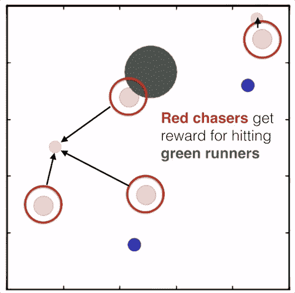

Source: [blog.openai.com](https://blog.openai.com/learning-to-cooperate-compete-and-communicate/)

我想强调的是，对于现实世界的问题，通常很难指定环境中的奖励，现在研究人员更关注内部奖励模型。

与 RL 并行的是逆向强化学习方法的发展，其中代理接收由专家产生的输入和输出，试图逼近可能驱动其行为的奖励函数。

除了上面提到的方法之外，一些对 AGI 的研究有明显不同的基础。这些框架有些来自严格的数学理论，有些受神经元回路的启发，有些基于心理学模型。然而，他们大多数人的共同点是关注他们受欢迎的同行失败的方面。我想强调的框架是 HTM、AIXI、ACT-R 和 SOAR。

让我们从**分级时间记忆** (HTM)开始。最初，它是基于新大脑皮层回路启发的一些想法。但是，请记住，这些电路还没有得到足够的理解，HTM 可能只是一个粗略的近似。

然而，在 HTM 理论的核心有一个特别重要的概念——**稀疏分布表示**或 SDR。实际上，它只是一个通常包含几千个元素的位数组，它们的构造方式是将语义相关的输入映射到有许多重叠位的 SDR。从概念上讲，这类似于用神经网络导出的矢量化表示，但是稀疏性和过大的容量是主要的区别。这些想法特别相关，因为 DNN 收敛证明背后的关键假设之一是网络的过度参数化。

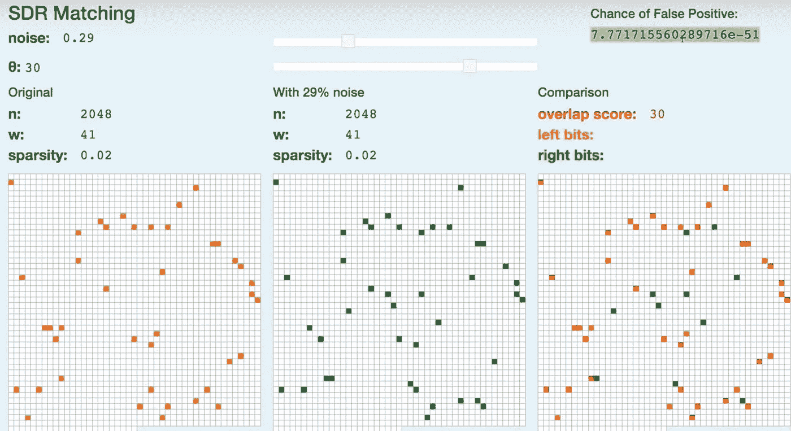

Example of SDR overlapping in the presence of noise. Source: [numenta.com](https://numenta.com)

在我看来，HTM 理论的其他观点没那么有趣。抑制类似于批量归一化和一些其他正则化技术，boosting 是 ML 中一个相对较老的概念，层次结构似乎过于严格，而新皮层具有更复杂的连接模式，拓扑似乎是普通 NN 的架构的同义词，一般来说，这种理论对对象赋予了很大的权重，而对它们之间的关系则给予了很小的权重，甚至 SDR 也可以用普通的 ann 构建，使用大量神经元，同时惩罚激活。总的来说，HTM 仍然需要太多的调整才能达到与其他大联盟竞争对手相当的表现。无论如何，我相信 Numenta(HTM 背后的公司)对这些想法简单直观的解释值得称赞。

我的下一位“客人”——**艾西**，没有这么简单，但有更坚实的数学基础。然而，它有一个显著的缺点——它是不可计算的。事实上，许多最大似然算法不可能精确计算，我们必须处理近似。无论如何，这些近似法在实践中经常表现良好。艾西可以用一句话来形容:

The model has an agent and an environment that interact using actions (outputs), observations (inputs), and rewards (might be described as a specific part of the input). The agent sends out an action **a**, and then the environment sends out both an observation **o** and a reward **r**,and term **l(q)** denotes the complexity of the environment. This process repeats at each time k…m. Source: [lesswrong.com](https://www.lesswrong.com/posts/i3BTagvt3HbPMx6PN/embedded-agency-full-text-version)

它在很多方面都被证明是最优的，而且在我看来，它是对我们现在所拥有的 AGI 的最好的数学描述。此外，AIXI 是一个通用强化学习代理，在许多方面与 Schmidhuber 开发的**哥德尔机器**相似。然而，这两者都是 AGI 的描述模型，而不是创造它的配方。无论如何，它们是人工智能研究人员的巨大灵感来源。

相反，ACT-R，或者说**思想理性的自适应控制**，不仅仅是一个理论，还是一个用 LISP 编写的软件框架。它的发展已经持续了几十年，为其他语言带来了许多副产品，并对原始模型进行了修改。

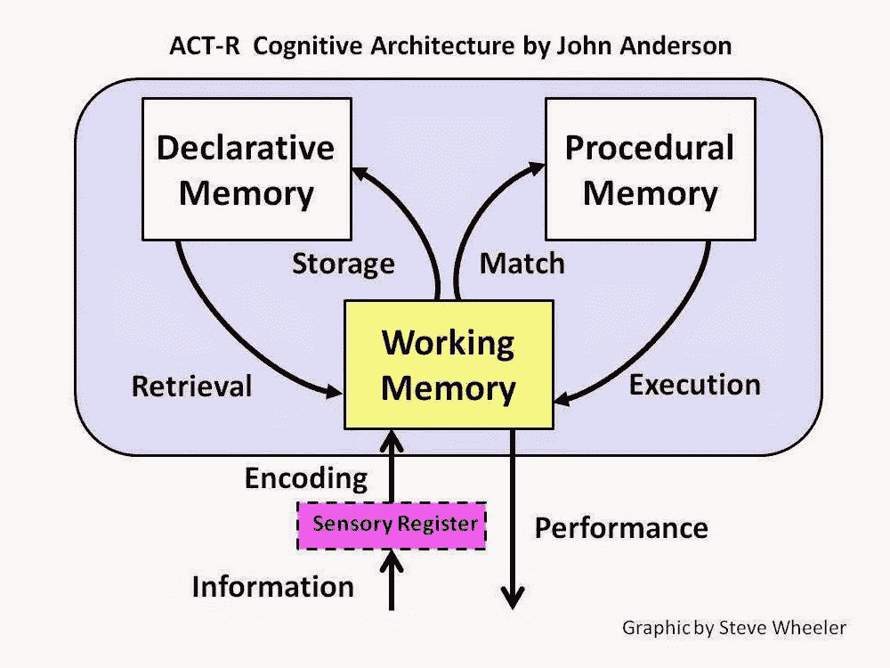

Source: [teachthought.com](https://www.teachthought.com)

ACT-R 主要关注不同类型的内存，而较少关注内存中数据的转换。它是作为人类思维的计算模型开发的，并在一定程度上取得了成功。它已被应用于预测 fMRI 成像结果以及一些关于记忆的心理学实验。然而，它在实际应用中总是失败，仍然只是研究人员的一个工具。SOAR 与 ACT-R 有着相似的根源和潜在的假设，但更侧重于实现 AGI，而不是人类认知的建模。

ACT-R 和 SOAR 是人工智能符号方法的经典代表，相对于连接主义方法，它们都逐渐失去了流行性。它们在认知科学的发展中发挥了重要作用，但是它们的应用比现代连接主义 ML 对应物需要更多的配置和先验知识。此外，神经成像和其他用于研究思维的工具正变得越来越详细和准确，而 ACT-R 和 SOAR 都落后了，从某种意义上说，它们过于僵化，无法保持相关性。

然而，在我看来，人工智能的未来必须是象征性的，至少在某种程度上，人工智能主体可以理解并遵循我们用人类友好的符号组成的法律。

## 野外的人工智能代理

上面我主要描述了定义现有人工智能代理策略的算法。但是，它们中的每一个都有某种身体:计算机、机器人或服务器，以及它们运行的环境，这通常是由它们所连接的互联网服务来定义的。

大多数个人电脑、智能手机和其他设备的硬件性能非常相似。他们的策略是由操作系统定义的，他们通过下载额外的软件来“学习”。虽然早期的计算机完全依靠与人类的互动来学习，但现在大多数计算机都通过互联网接收更新。

随着越来越多的数据转移到云中，服务器代理的作用越来越大。这些代理负责大多数计算密集型任务，有点类似于中枢神经系统。相反，面向消费者的小工具正在提高它们的输入/输出能力，变得有点类似于外周神经。

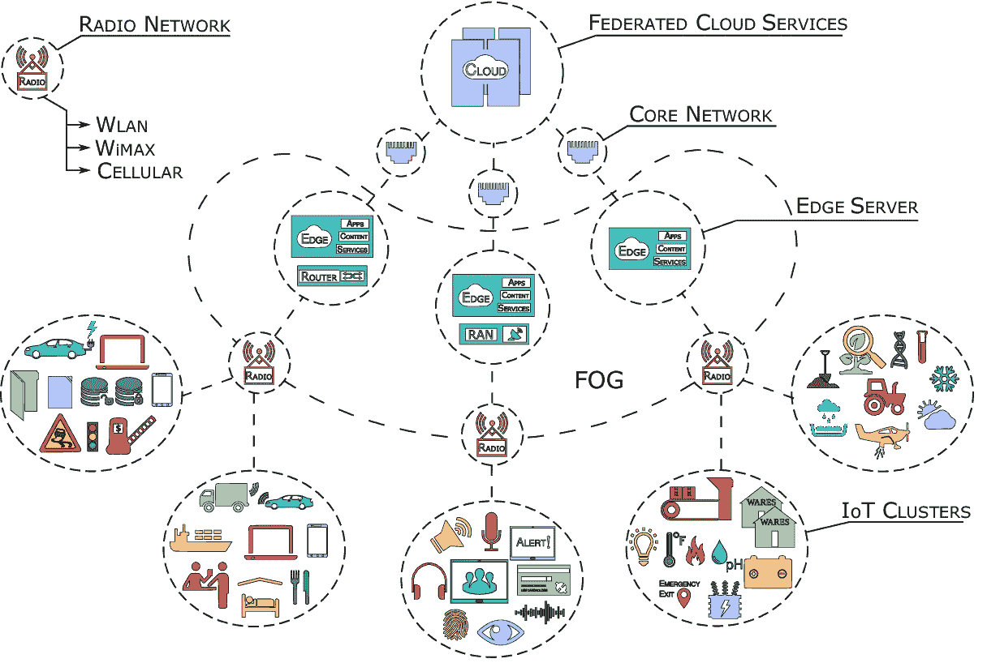

Source: [researchgate.net](https://www.researchgate.net/publication/282853869_A_Survey_on_Energy_Conserving_Mechanisms_for_the_Internet_of_Things_Wireless_Networking_Aspects?_sg=FAoQq7Bz75EgyJnjNFyR9fZJrUgst_q7ezgWdc0HzXpn7SytKazJAinF5YhAoz2FcWdwEKVOUw)

一个极端的例子通常被称为物联网，在物联网中，几十个高度专业化的微型设备各自只执行一项或几项功能，而基于云的中央“大脑”协调所有这些设备来控制房屋、工厂甚至整个区域。

相比之下，机器人通常专注于更加自主的代理。这些机器人通常必须实时处理复杂的真实世界输入/输出通道。无人驾驶汽车可能是最著名的例子:

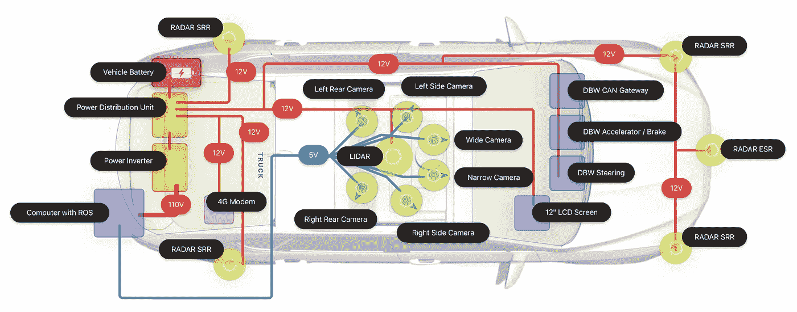

The system-level overview of Voyage self-driving taxi. Source: [news.voyage.auto](https://news.voyage.auto/under-the-hood-of-a-self-driving-car-78e8bbce62a6)

这只是一个简化的情况，而实际系统通常有超过 100 个传感器，这些传感器具有恒定的输入流，而它们的输出可以决定生死。设计这样的智能体是当今人工智能研究中最困难的领域之一。

不仅如此，面向消费者的机器人只是其中的一小部分，也是一个相对较新的趋势，而大多数是为工业和军事需求而设计的。考虑到这一点，与武装无人机或核电站控制人员的失误相比，自动驾驶出租车的不当行为看起来像是一场小事故。这种系统的策略编程不能依赖于黑盒学习算法，但通常涉及到他们工作的每个方面的严格数学规范。

总而言之，人工智能代理以各种形状和颜色出现，但趋势是外围设备越来越小，而数据中心越来越大。

## 量子世界

虽然这一部分可能看起来与智能的主题无关，但我相信物理学，尤其是量子物理学，由于一些原因值得特别关注。

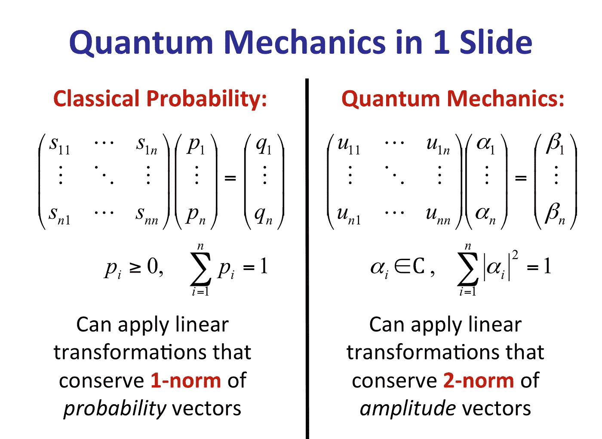

Source: [physics.stackexchange.com](https://physics.stackexchange.com)

首先，QM 是所有人工和生物制剂的共同点。半导体和生化试剂的工作原理都是基于量子效应。虽然谈论原子或亚原子水平的智能没有多大意义，但完全有可能用各种材料建造通用计算机。

第二，300 多年前开发的计算行星运动的数学工具成为反向传播和梯度下降的基础。不仅如此，概率论、统计力学和矩阵力学是质量管理的基础，也是现代人工智能的近亲。目前，深度学习就像炼金术，但我相信物理学可以帮助我们比现在更好地理解它。

三、**量子计算**的兴起。虽然量子计算机仍处于起步阶段，但当前的实验已经显示出某些优化问题的显著加速潜力。例如，Boltzmann Machine 是一种在大多数实际场景中难以处理的 ann，因此实践者提出了一种受限制的变体，这种变体成为了首批深度神经网络之一。然而，也许量子计算机将允许我们利用 BMs 以及许多其他概率模型的全部能力。

最后，QM 比上面描述的任何东西都更难理解。概率幅度、对经典概率逻辑的违反以及对亚原子水平上发生的一切的模糊描述只是冰山一角。具有讽刺意味的是，尽管许多人批评人工神经网络的可解释性差，但即使是人类也无法用直观的术语描述量子物理。

# 生物制剂

与只存在了大约 100 年的人工智能相比，生物智能已经存在了大约 30 亿年。地球上有数百万个物种，它们都有一个共同点: **DNA** 。

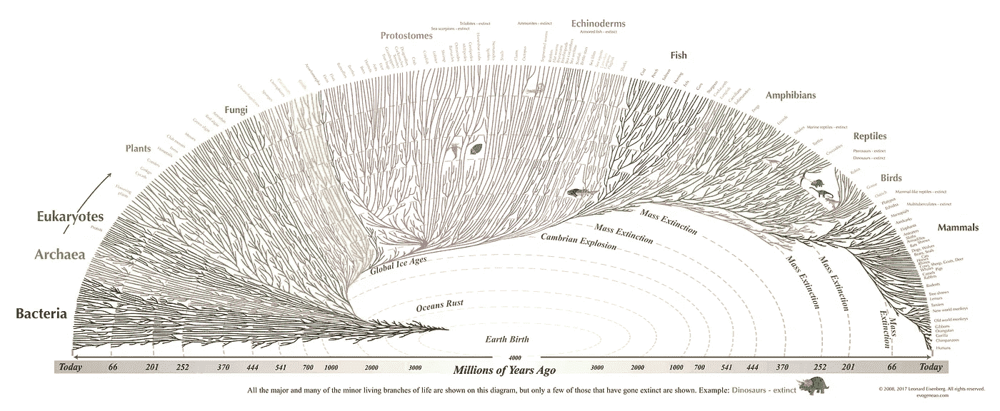

Source: [evogeneao.com](https://www.evogeneao.com/learn/tree-of-life)

为什么 DNA 如此重要？一般是细胞的“中枢神经系统”。此外，人们普遍认为，在以 DNA 为基础的生命出现之前，就有以 RNA 为基础的生物，但它们在功能和结构上非常相似。

Source: Wikipedia

大多数 DNA，大约 98%的人类 DNA，不编码蛋白质，并且在很长一段时间内被认为是无用的。然而，它的相当大一部分在控制编码 DNA 的哪些部分应该根据环境而活跃方面起着至关重要的作用。此外，DNA 本身的部分可能会因甲基化而失活，这也是可逆的，可能在整个生命周期中发生多次。

所有这些都允许基因组以不同的方式对不同的输入组合做出反应，决定宿主细胞应该专门扮演何种角色以及应该有多活跃。此外，DNA 实际上并不需要宿主细胞的存在。细胞外 DNA 正在降解，但较小的片段可能存活多年。

顺便说一下，现代生物技术让我们可以随心所欲地合成和编辑 DNA，所以在这一点上，人工和生物制剂的区别基本上消失了。

## 细胞

基本功能细胞被称为**原始细胞:**

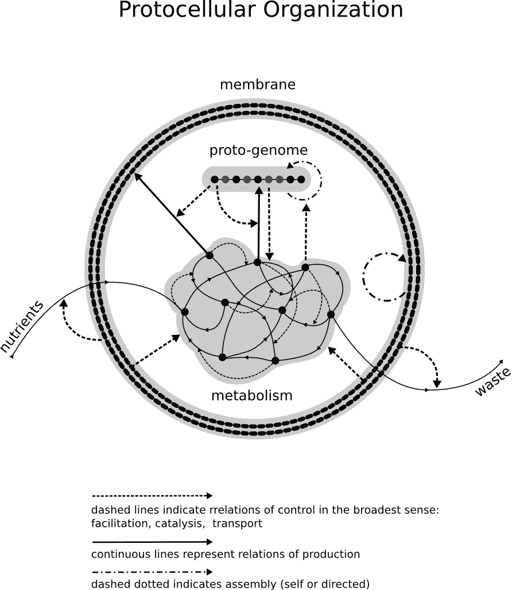

Source: [xabier.barandiaran.net](https://xabier.barandiaran.net/research/origins-of-life/)

它们代表了第一个生命体可能的样子。大约 30 至 40 亿年前地球上的环境模型表明，脂质气泡可能已经捕获了足够多的核苷酸，从而偶然创造了第一个基因组，而第一个基因组可能已经通过从周围环境中捕获营养物质开始复制。在基因和其他化学物质积累到临界量后，这些气泡在内部压力的作用下分裂。

另一个简单的例子是**病毒**。两者的主要区别在于，病毒不维持内部代谢，需要利用其他生物因子进行复制。它们的基因组通常很短，可能只编码 1 或 2 种蛋白质。然而，在被称为水平基因转移的过程中，病毒可以通过与宿主的 DNA 交换进行“交流”。许多单细胞生物都有这种能力，它在整体进化中起着重要作用。

相比之下，**细菌**可以对不同的化学物质、光线、压力、温度和其他东西有多个传感器。它们中的许多都有在分子尺度上类似普通内燃机的运动机制。

Bacteria E. Coli. Source: [gfycat.com](https://gfycat.com)

此外，他们有相当先进的通讯技术，可以成群结队。他们的产出不再仅仅是废物。它们的基因组及其周围的各种蛋白质使它们能够消化广泛的营养物质，并执行相当复杂的行为。然而，总的来说，它们的结构与原始细胞和古细菌非常相似。

相反，**真核**细胞有相当多的细胞器。其中一些，像线粒体和叶绿体，有自己的 DNA 片段，在过去可能是独立的有机体。此外，线粒体在所谓的克雷布斯循环中起着至关重要的作用，这对新陈代谢至关重要。

Source: [biochemanics.wordpress.com](https://biochemanics.wordpress.com/2013/03/29/differences-between-prokaryotes-and-eukaryotes/)

典型的真核细胞内部有更复杂的化学机制，但缺乏自行移动的能力。不仅如此，动物细胞还缺乏叶绿体和细胞壁，这进一步损害了它们的自主性。一般来说，上面从左到右描绘的进化树上的生物的细胞逐渐失去了依靠自己生存的能力，同时获得了更复杂的“社会”政策和专门的功能。

细胞对环境变化做出反应的最快方式之一是通过**动作电位**。当一些传感器检测到化学物质、压力或其他刺激时，它们可以导致细胞膜中电势的快速变化，这反过来可能会引发一连串的化学反应，导致各种结果。

Venus Flytrap plant. Source: [giphy.com](https://giphy.com/explore/venus-flytrap)

然而，动作电位信号仅限于起源细胞和与之有直接膜-膜连接的细胞。它可以通过信号分子与其他细胞交流，但这个过程要慢得多。为了避免这个瓶颈，大多数动物都有专门的细胞——**神经元**。

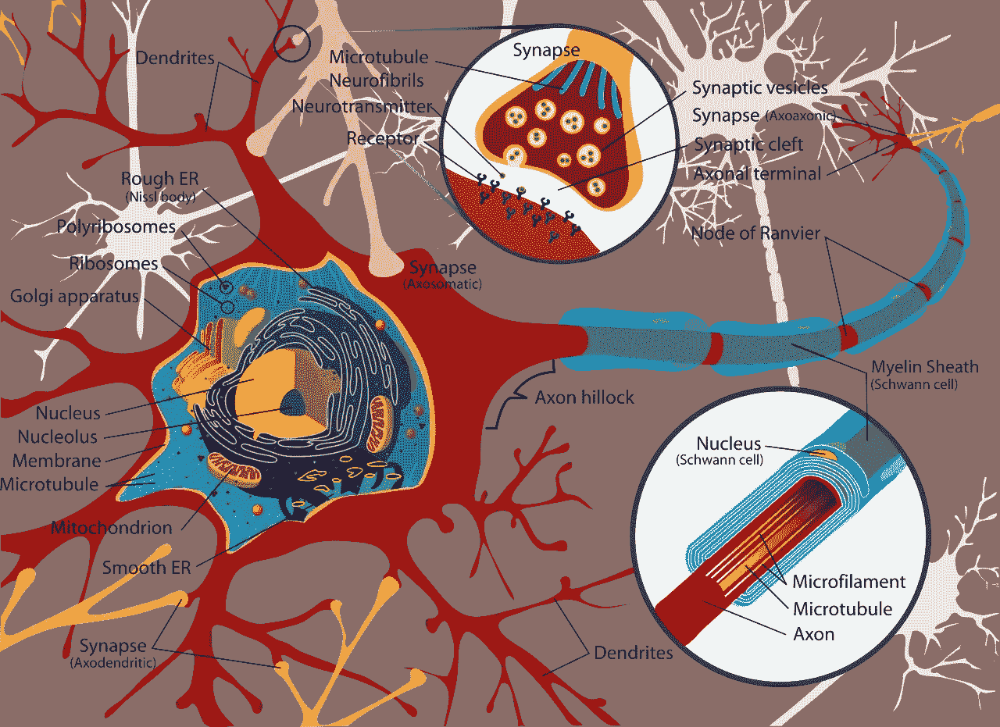

Schematic view of a neuron. Source: Wikipedia

它们有不同的形状，在其一生中可以生长新的突触或去除旧的突触。外围神经元通常只有几百个连接，而中间神经元可以有超过 10，000 个。所有这些机制使它们能够快速传递信号，并通过调整突触强度来转换信号。此外，脊椎动物的许多轴突都有髓鞘，允许电位移动得更快，同时激活更少的膜通道并节省能量。

然而，神经元来自高度互联的系统，为了理解它们在宏观尺度上做什么，你需要考虑整个连接体。迄今为止研究得最好的神经系统之一是线虫:

Overview of the *C. elegans* nervous system. The majority of neurons are located in several ganglia near the nerve ring. Source: [stb.royalsocietypublishing.org](http://rstb.royalsocietypublishing.org/content/370/1677/20140212)

它已经被研究了 50 多年，我们已经知道它所有 302 个神经元和 5000 多个突触的详细结构:

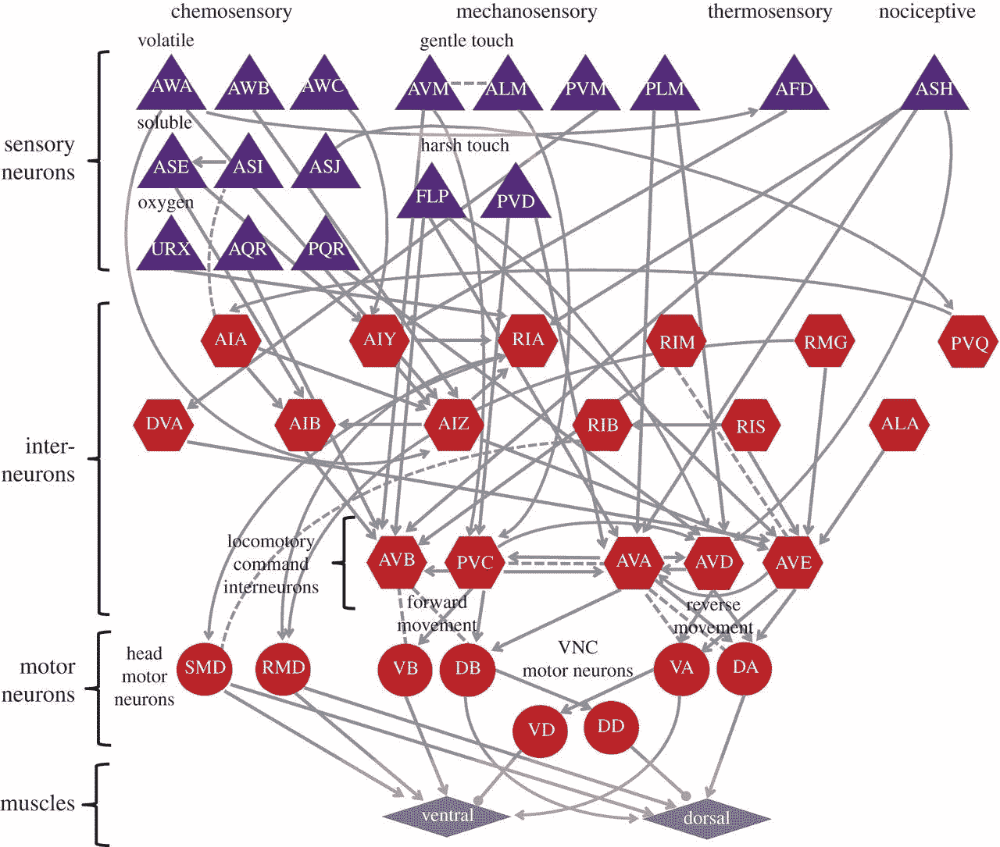

Partial circuit diagram of the *C. elegans* somatic nervous system and musculature. Sensory neurons are represented by triangles, interneurons are represented by hexagons, motor neurons by circles and muscles by diamonds. Arrows represent connections via chemical synapses, which may be excitatory or inhibitory. Dashed lines represent connections by electrical synapses. VNC, ventral nerve cord. Source: [rstb.royalsocietypublishing.org](http://rstb.royalsocietypublishing.org/content/370/1677/20140212)

正如你可能看到的，即使是 302 个神经元也对理解每个神经元在做什么构成了真正的挑战。这变得更加复杂，因为它们正在“学习”,它们的功能可能会实时变化。现在试着想象一下人类大脑中的数十亿个细胞会发生什么。

鉴于所有这些复杂性，神经科学的大多数研究都集中在特定的区域、途径或细胞类型上。大多数进化的旧结构负责呼吸、心跳、睡眠/觉醒周期、饥饿和其他至关重要的功能。然而，**大脑皮层**受到的关注比其他任何东西都多。

在结构上，皮层是一个折叠的分层薄片，厚度约为 2-3 毫米，面积约为餐巾纸大小，包围着大脑的其他部分。

Cross section of the cortex. Source: [etc.usf.edu](http://etc.usf.edu/clipart/55800/55800/55800_cortex.htm)

它涉及所有我们认为是高级认知功能的东西，如语言、意识、计划等。在人类中，大约 90%的皮层由**新皮层**代表，这是大脑中最近的进化发明之一。

另一个被充分研究的区域是**海马**:

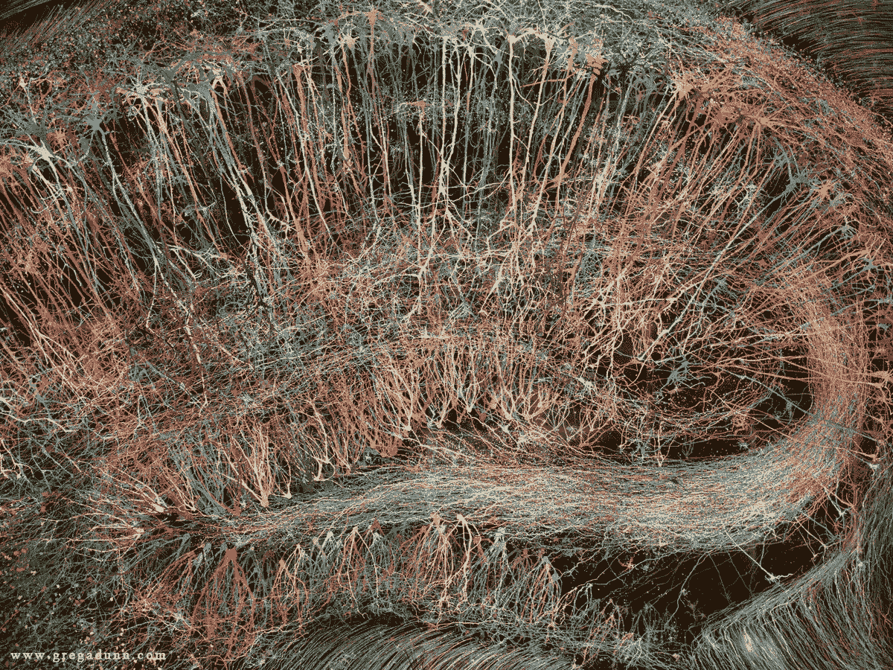

Source: [gregadunn.com](http://www.gregadunn.com/)

所有的脊椎动物都有一个类似的结构，叫做大脑皮层，但是只有哺乳动物有上面描述的更进化的结构。它在空间和情景记忆中起着至关重要的作用。简单来说，它的功能是一个认知时空地图。有了这张地图，大脑可以在其他部分储存复杂的记忆，这些部分专门负责视觉、听觉和其他类型的表达。

对大脑的最初研究集中在损伤和病变上。然而，大脑皮层缺失区域和认知功能缺失之间的相关性相对较弱。事实证明，记忆分布在整个大脑皮层，甚至在手术切除某个部分后，邻近的神经元可能会重新学习缺失的功能。此外，通常很难准确界定伤害的界限。这些研究提供了这样的地图:

Source: [pinterest.fr](https://www.pinterest.fr/pin/526287906430361181/?lp=true)

这些地图的主要问题是在实践和理论两方面都缺乏精确性。在实验环境中，你可以刺激大脑的小部分，观察反应。但是，除了主要的感觉和运动区域，它通常产生相当模糊的结果。另一方面，现在你可以使用功能性磁共振成像来跟踪受试者在执行一些任务时大脑的哪些部分是活跃的，但由于这些区域并不专门针对少数任务，所以结果通常是模糊的。此外，功能性核磁共振成像实际上是测量氧气供应水平，所以像这样在单个神经元水平上测量活动是不够的:

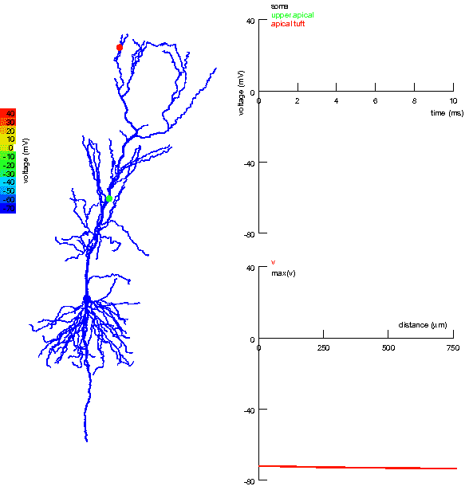

Spike propagation in a hippocampal neuron. Source: [nature.com](https://www.nature.com/articles/nn1599)

目前神经科学研究中最有前途的方向之一是光遗传学。它允许我们使用为神经元提供光传感器的基因，以更高的精度控制单个神经元的活动。然而，它需要基因操作，不能用于人类实验。

大脑活动的另一个有趣的特征是它以波的形式进行:

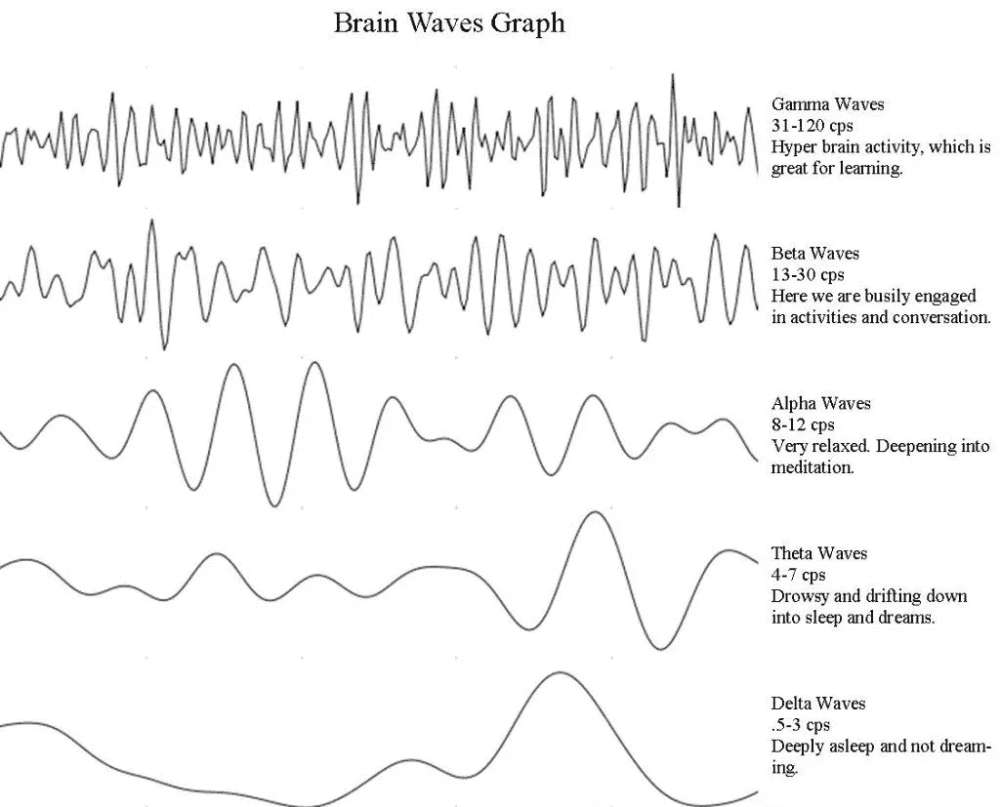

High-level interpretation of EEG recordings (cps = cycles per second). Source: [dickinson.edu](http://blogs.dickinson.edu/writingsciencenews18/2018/02/alpha-waves-attention-anxiety-oh-my/)

所有这些研究都有助于我们理解和治疗神经系统疾病，但它们远不能描述人类的行为，除了某些部位的活动与这个人正在做什么或在想什么的模糊描述之间的相关性。无论如何，这种自下而上的思维研究方法导致了许多重要的发现，如根据神经活动预测某人选择的可能性，以及大脑没有“中央”部分。

另一方面，从心理学角度进行的行为研究受遗传、文化和环境因素的影响很大。这项研究最广为人知的成果之一是**智商**以及测量智商的测试。也有许多理论试图解释智力，如**多元智能理论**、**三元智能理论**和其他理论。然而，到目前为止，它们都没有被广泛接受。

心理学理论的主要问题是它们的描述性，这种描述性不能提供一种定量证明它们的方法。即使像走路或说“嗨”这样简单的行为背后的神经元级过程的数量也是极其巨大的，再加上考虑到每个细胞内 DNA 和其他生物机械的复杂性，神经科学研究的心理解释往往比实验本身更复杂。然而，一些人类认知模型在行为和神经活动之间建立了牢固的联系。

在我看来，最有趣的一个是**综合信息理论** (IIT)，它基于这些公理:

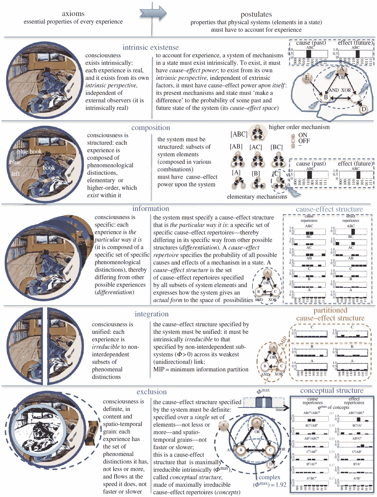

Axioms and postulates of IIT. Source: [wikipedia.org](https://en.wikipedia.org/wiki/Integrated_information_theory#/media/File:Axioms_and_postulates_of_integrated_information_theory.jpg)

其他理论包括强化学习及其在大脑中的实施方式，大量的记忆、视觉、听觉、语言和其他模型。然而，在我看来，IIT 提出了其中最普遍的理论框架。

虽然上面提到的模型主要集中在个人的行为上，但“社会心理学”对大多数生物体来说是至关重要的。从你肠道中的细菌群落开始，一直到鱼、蚂蚁、蜜蜂、鸟类和人类社会都是从社会互动中产生的。我们已经对蚂蚁的化学语言和蜜蜂如何通过“跳舞”进行交流有了相当多的了解，但理解人类的情感却是一个巨大的挑战。随着语言、法律和宗教的发展，事情变得越来越复杂。

## 那么，什么是智能呢？

答案有很多，但我们还没有一个被广泛接受的生物和人工智能的统一理论。然而，我相信艾西和 IIT 的杂交可能会让我们更接近它。为了把它们结合起来，我们需要一个奖励/效用的物理概念，这个概念可能来源于医学和经济学，适用于每一种人工和生物制剂，这本身就是一个巨大的问题。

几乎所有当前的智能测量都是基于某些任务的表现，这在现实世界中造成了一个问题，在现实世界中，环境以及智能体可能偶然遇到的任务都在不断变化。另一方面，将意识定义为“任何可能的经验”以及相关的 IIT 框架与艾西背后的智力框架一起可能会提供认知表现的更广阔的图景。

从内部的观点来看，任何代理人的工作都可以被描述为量子系统的波函数，但是在几乎所有的情况下，它都是难以计算的。此外，对习得的中间表征的解释对生物和人工智能都是一个巨大的挑战。

最重要的是，我相信没有单一的算法或机制最终负责智能，但它是一个代理如何与其环境交互的属性。

# 下一步是什么？

虽然人工智能的进步和对人类智能的更深入理解有很多好处和大量的实际应用，但它们也揭示了我们需要应对的许多挑战，其中大多数都属于以下类别之一:

*   隐私。以前——你的数据属于你，在某种程度上，属于政府，有严格的法律规范其流动。现在，数以百计的跟踪服务，社交网络和其他公司几乎没有披露这些数据是如何使用的。
*   偏见。除了人工筛选的数据集，每个训练数据集都有其偏差，它们往往会在像推荐引擎这样的闭环系统中放大。
*   对齐。大多数人工智能训练都是基于效用最大化或错误最小化，那些目标函数并不代表所有的人类价值和道德。
*   位移。一段时间以来，技术已经在许多任务中取代了人类，但人类的进化比人工智能慢得多。就在几十年前，计算机还是专业人士的稀有工具，但现在不每天使用它们就很难保持相关性。
*   网络攻击。以前，网络攻击通常需要做大量准备才能瞄准一个人，但现代人工智能可以比人类更快地收集信息、猜测密码、生成钓鱼内容并伪装成其他人，同时在这个过程中改进自己。
*   心理工程。无数的心理学实验和历史教训表明，即使没有任何暴力倾向的人，如果被恰当地操纵，也会造成真正的伤害。脸书、谷歌和其他大公司可能有足够的关于我们的信息来瞄准、筛选和强迫我们做任何事情。

在控制全球经济主要部分的交易机器人的情况下，我们如何可靠地解决偏差和对齐问题？谁应该为人工智能代理在他们没有得到足够好的训练的场景中的错误负责？我们如何才能制造出容错的脑机接口，使其无法控制我们的思想？此外，这些问题中的大部分与人类和人工智能一样相关。

我们将在 5 年、10 年或 20 年后走向何方？我不知道，我也鼓励你对任何关于人工智能的预测持怀疑态度。历史表明，大多数预测，甚至来自领先的人工智能研究人员的预测，最终都被证明是错误的，有时是错误的幅度很大。然而，我相信人工智能和生物智能的共生是不可避免的，如果我们承认相关的问题并解决它们，这可能对我们非常有益。

# 资源

*   arxiv.org/cs/0309048——《哥德尔机器:自我参照的通用问题解决者做出可证明的最佳自我改进》，作者于尔根·施密德胡伯
*   numenta.com/hierarchical-temporal-memory-white-paper[——杰夫·霍金斯的《分级时间记忆(HTM)》](https://numenta.com/neuroscience-research/research-publications/papers/hierarchical-temporal-memory-white-paper/)
*   amazon.com/Soar-Cognitive-Architecture-John-Laird[——约翰·莱尔德的《腾飞的认知建筑》](https://www.amazon.com/Soar-Cognitive-Architecture-John-Laird/dp/0262122960)
*   ——约翰·r·安德森、丹尼尔·博瑟尔、迈克尔·d·伯恩、斯科特·道格拉斯、克里斯蒂安·勒比尔、秦玉林的《整合的心智理论》
*   [arxiv.org/1812.06162](https://arxiv.org/abs/1812.06162)——open ai Dota 团队的 Sam McCandlish、Jared Kaplan、Dario Amodei 的“大批量训练的经验模型”
*   [arxiv.org/1606.06565](https://arxiv.org/abs/1606.06565)——Dario Amodei、Chris Olah、Jacob Steinhardt、Paul Christiano、John Schulman、Dan Mané的“人工智能安全的具体问题”
*   [、](https://arxiv.org/abs/1811.03962)——《通过过参数化实现深度学习的收敛理论》，作者·艾伦-朱，
*   arxiv.org/1805.08974[——“更好的 ImageNet 模型传输得更好吗？”西蒙·科恩布利斯，黄邦贤·史伦斯](https://arxiv.org/abs/1805.08974)
*   apps.dtic.mil/708563.pdf[——彼得·菲什伯恩的《决策的效用理论》](https://apps.dtic.mil/dtic/tr/fulltext/u2/708563.pdf)
*   ——《深度神经网络的安全性和可信赖性:一项调查》，作者:、丹尼尔·克罗宁、玛尔塔·夸特考斯卡、阮、孙友成、埃姆斯·塔莫、、易新平
*   [archive.org/CerebralMechanismsInBehavior](https://archive.org/details/CerebralMechanismsInBehavior)——《行为中的大脑机制》作者劳埃德·a·杰弗里斯
*   [cognitivemap.net](http://www.cognitivemap.net/)——《海马作为认知地图》，作者约翰·奥基夫、林恩·纳德尔
*   [mitpress.mit.edu/spikes](https://mitpress.mit.edu/books/spikes)——《尖峰信号:探索神经代码》作者:威廉·比亚莱克，罗伯·德鲁伊特·范·斯蒂文宁克，弗雷德·里克，大卫·沃兰德
*   [psyarxiv.com/d6qhu/](https://psyarxiv.com/d6qhu/)——《怪异心理学的起源》，作者乔纳森·舒尔茨、杜曼·巴拉米-拉德、乔纳森·比彻姆、约瑟夫·亨利克
*   nature.com/articles/d41586–018–05097-x——“意识是什么？”作者克里斯托夫·科赫
*   [arxiv.org/0706.3639](https://arxiv.org/abs/0706.3639)——《智力定义集》，作者沙恩·莱格，马库斯·哈特
*   amazon.com/Frames-Mind-Theory-Multiple-Intelligences——《心智框架:多元智能理论》作者哈沃德·加德纳
*   amazon.com/Beyond-IQ-Triarchic-Theory-Intelligence——《超越智商:人类智力的三元理论》，作者罗伯特·斯腾伯格
*   [archive.org/tom_bingham_the_rule_of_law](https://archive.org/details/tom_bingham_the_rule_of_law)——汤姆·宾汉姆的《法治》
*   【link.medium.com/cDzwHQm0YR[——乔纳森·奥尔布赖特的《脸书和 2018 年中期选举:看数据》](https://link.medium.com/cDzwHQm0YR)
*   【intelligence.org/all-publications 
*   [integratedinformationtheory.org](http://integratedinformationtheory.org/)
*   [portal.brain-map.org](http://portal.brain-map.org/)
*   [github.com/OpenWorm](https://github.com/openworm/OpenWorm)

以及[coursera.org](https://www.coursera.org/)、[edx.org](https://www.edx.org/)等众多开放教育平台。当我开始研究所有这些时，我并没有打算发表任何东西，所以我没有收集参考文献的列表，如果你的工作如上所述而不在列表中，我很抱歉(请随时通过 twitter @eDezhic 或电子邮件 edezhic@gmail.com 联系我)。