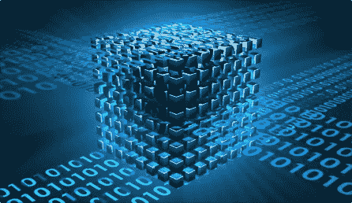

# 什么是机器学习？

> 原文：<https://towardsdatascience.com/what-is-machine-learning-891f23e848da?source=collection_archive---------8----------------------->

这是一系列文章中的第一篇，旨在让没有受过技术培训的人更容易理解机器学习。希望有帮助。

过去几十年中计算机技术的进步意味着在人类努力的大多数领域中收集电子数据已经变得更加普遍。许多组织现在发现自己拥有跨越许多年的大量数据。这些数据可能涉及到人、金融交易、生物信息等等。

与此同时，数据科学家一直在开发被称为算法的迭代计算机程序，这些程序可以查看大量数据，对其进行分析，并识别人类无法识别的模式和关系。分析过去的现象可以提供非常有价值的信息，告诉我们在相同或密切相关的现象中未来会发生什么。从这个意义上说，这些算法可以从过去学习，并使用这种学习对未来进行有价值的预测。

虽然从数据中学习本身并不是一个新概念，但机器学习与其他学习方法的区别在于它能够处理大量数据，并且能够处理结构有限的数据。这使得机器学习可以成功地用于广泛的主题，这些主题以前被认为对其他学习方法来说太复杂了。

# 机器学习的例子

以下是你在日常生活中可能遇到的更成熟的机器学习应用的例子:

*   **信用评分:**金融机构长期收集客户的详细信息，例如收入、资产、工作、年龄、金融历史。可以对这些数据进行分析，以确定哪些特征与消极结果(如拖欠贷款)关联更大，或者哪些特征推动积极结果(如及时偿还贷款)。因此，可以构建预测关系，该预测关系可以基于客户违约的可能性对客户进行分类，并且金融机构可以使用该预测关系来做出更有效的贷款决策。
*   **购物篮分析:**当顾客在杂货店或网上结账时，购买的特定商品的信息将最终存储在一个大型数据库中。该数据库可以被分析以确定典型的购买行为或关联。例如，购买了牙刷的客户还会购买牙膏的可能性有多大？在许多情况下，可以收集个人客户数据，这有助于分析这种行为在特定人口统计或收入群体中的变化。分析这些数据可以为营销和广告策略以及决策提供信息。它还可以带来更加个性化的广告，客户可以收到他们更有可能感兴趣的产品的报价。
*   基因科学:23andme.com[在线 DNA 检测服务的成员](https://www.23andme.com/)提供个人信息和健康信息，并提供他们的唾液样本进行 DNA 分析。这些成员经常收到关于他们健康和个人特征的调查问卷。报告相似健康状况或特征的人的遗传密码可以在大量个体中进行分析，以寻找频繁出现的字符串或部分。如果这样的字符串或部门被发现，他们可以用来预测未来可能出现的特征或可能的医学问题。这种学习也可用于确定服役人员之间的生物关系，在某些情况下，使因收养或其他情况而失散的家庭成员团聚。
*   **估价:**可以对一段时间内的汽车销售数据进行分析，以确定汽车的哪些特征对价格影响最大，以及价格对这些特征的敏感度。基于此，在线估价工具现在可以根据车主输入的信息给出汽车的价格范围。
*   其他常见应用包括医疗诊断、手写到文本转换、语音识别、人脸识别、图像压缩、机器人、自动驾驶汽车和许多其他用途。

# 机器学习的类型

机器学习可以分为三大类:

1.  **监督学习**算法利用输入和输出数据的训练集。该算法从训练集中学习输入和输出数据之间的关系，然后使用该关系来预测新数据的输出。最常见的监督学习目标之一是分类。分类学习的目的是利用学习到的信息来预测某一类的成员。信用评分示例代表分类学习，因为它预测拖欠贷款的人。
2.  **无监督学习**旨在通过推断数据中的潜在模式和结构，在没有已知结果或结果的数据中进行观察。关联学习是最常见的无监督学习形式之一，其中算法搜索输入数据之间的关联。购物篮分析示例代表关联学习。
3.  **强化学习**是一种“试错”学习形式，输入数据刺激算法产生响应，算法根据响应是否是期望的而受到“惩罚”或“奖励”。机器人技术和自主技术充分利用了这种学习形式，

# 机器学习成功的必要条件是什么？

近年来，机器学习和“大数据”变得越来越广为人知，并引发了大量报道。因此，许多个人和组织正在考虑如何以及是否可能适用于他们的具体情况，以及是否有从中获得的价值。

然而，为成功的机器学习建立内部能力(或利用外部专业知识)可能成本高昂。在接受这一挑战之前，明智的做法是评估是否存在合适的条件，使组织有机会取得成功。这里的主要考虑与数据和人类洞察力有关。

有效的机器学习有三个重要的数据要求。通常，并非所有这些要求都能令人满意地得到满足，一个方面的缺点有时会被另一个或两个方面抵消。这些要求是:

*   **数量:**机器学习算法需要大量的例子，才能提供最可靠的结果。大多数监督学习的训练集将涉及数千或数万个示例。
*   **可变性:**机器学习旨在观察数据的异同。如果数据过于相似(或过于随机)，它将无法有效地从中学习。例如，在分类学习中，训练数据中每个类别的样本数量对成功的几率至关重要。
*   **维度:**机器学习问题往往在多维空间中运行，每个维度都与某个输入变量相关联。数据中丢失的信息量越大，阻碍学习的空白空间就越大。因此，数据的完整程度是学习过程成功的一个重要因素。

机器学习也可以得到高质量人类洞察力的帮助。从一组给定的数据中可以研究的分析和情景的排列和组合通常是巨大的。这种情况可以通过与主题专家的交谈来简化。基于他们对情况的了解，他们通常可以突出数据中最有可能提供见解的方面。例如，招聘专家可以根据多年的参与和观察，帮助确定哪些数据点最有可能推动公司的选择决策。了解组织内部的底层流程也有助于数据科学家选择最能模拟该流程的算法，从而获得最大的成功机会。

下一章将讨论机器学习是如何工作的。在这里 *读一下* [*。*](/how-does-machine-learning-work-6dd97f2be46c)

最初我是一名纯粹的数学家，后来我成为了一名心理计量学家和数据科学家。我热衷于将所有这些学科的严谨性应用到复杂的人的问题上。我也是一个编码极客和日本 RPG 的超级粉丝。在 [*LinkedIn*](https://www.linkedin.com/in/keith-mcnulty/) *或*[*Twitter*](https://twitter.com/dr_keithmcnulty)*上找我。*