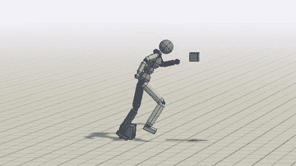
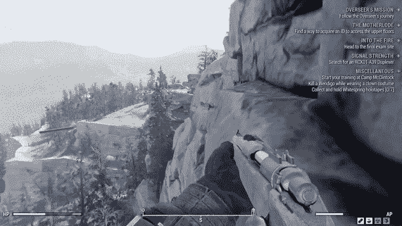
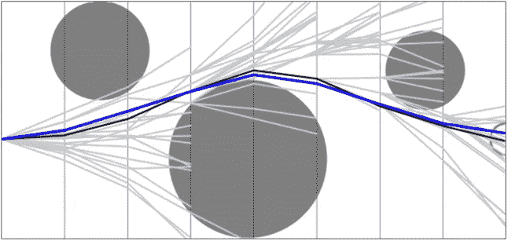
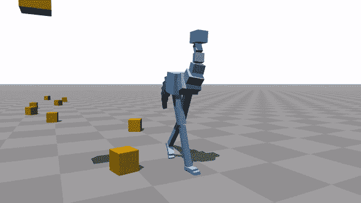
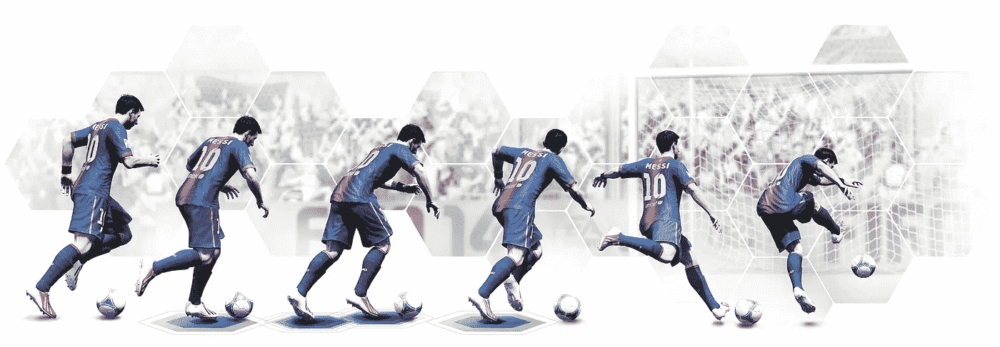

# 什么是基于物理的动画？

> 原文：<https://towardsdatascience.com/what-is-physically-based-animation-cd92a7f8d6a4?source=collection_archive---------12----------------------->

*基于物理的动画(PBA)* 指的是计算机图形学的一个领域，其目标是使用*人工智能(AI)* 生成物理上看似真实的动画。动画通常使用 2D 或 3D 模拟环境中的虚拟角色来播放。下面是一个使用 PBA 的最新最先进结果的好例子:

An example of a 3D humanoid character running under heavy perturbations*. Physically-based animation enables the character to dynamically adjust its movements to the environment [1].*

PBA 与传统关键帧动画的一个主要区别是，PBA 可以根据环境的变化进行动态调整。另一方面，关键帧动画本质上是静态的和无响应的，必须小心处理，否则很容易产生不自然的运动，如下所示:

If not handled carefully, traditional keyframe animation easily produces unnatural movements (footage from [Fallout 76](https://fallout.bethesda.net/)).

在这篇文章中，我将简要概述 PBA 的基本概念以及解决这个问题的研究现状。

# 1.常见的方法有哪些？

近二十年来，许多研究人员一直致力于 PBA 的研究，迄今为止，已经提出了无数的方法来解决这个问题。我将这些方法分为两类:1)基于搜索的方法，和 2)强化学习。在这一节中，我将解释这些方法背后的核心思想。

## 1.1.基于搜索的方法

解决 PBA 的一类经典而强大的方法是使用基于搜索的方法来优化运动。这些方法背后的基本思想相当简单:1)生成多个动作序列，2)使用正向模拟和计算一些成本函数来评估它们，最后，3)选择最小化成本函数的动作序列。这个过程的简单说明如下所示:

This picture demonstrates the basic mechanism in search-based methods using a simple example. Here the aim is to control an object from the left side to the green circle in the right. The optimal trajectory is shown in blue, and the gray lines indicate the randomly generated trajectories. After computing the cost function for all generated trajectories, the trajectory with minimum cost (shown in black) is considered as the solution [2].

迄今为止，已经提出了大量基于搜索的方法来求解 PBA。使用此类方法的最佳示例之一获得的最终动画如下所示:

The result of a search-based method, in which offline optimization is used to optimize a parameterized controller that generates the movements [3].

这项工作有趣的一点是，它没有直接优化运动。相反，它首先定义一个用于合成运动的参数化控制器，然后优化该控制器的参数。这使得角色能够稳健地处理环境中的随机扰动[3]。

## 1.2.强化学习

*强化学习(RL)* 是*机器学习(ML)* 的一个热门领域，研究从交互中学习的计算方法【4】。RL 的基本定义包括一个与某些环境交互的主体，其目标是随着时间的推移最大化累积的回报。在每个时间步中，代理观察当前状态并采取行动。之后，代理人观察到一个标量奖励以及新状态的观察结果。目标是优化代理，使其通过采取最佳行动获得最大可能的回报。这种相互作用的示意图如下所示:

The agent-environment interaction in reinforcement learning [4].

在过去的几年里，由于雅达利游戏[5]和围棋游戏[6，7，...]中的*深度强化学习(DRL)* 的显著成果，RL 受到了更多的关注。这些进展也激发了连续控制 RL 的几项突破。这些类别中的一种最先进的方法如下所示:

An example of using reinforcement learning to imitate acrobatic movements by watching Youtube videos [8].

上述工作中使用的流水线包括三个阶段:1)姿态估计，2)运动重建，和 3)运动模拟。输入视频首先由姿势估计阶段处理，姿势估计阶段预测演员在每一帧中的姿势。接下来，运动重建阶段将姿态预测合并到参考运动中，并修复可能由姿态预测引入的伪像。最后，参考运动被传递到运动模仿阶段，在那里模拟角色被训练来使用 RL [8]模仿运动。

# 2.哪些游戏使用基于物理的动画？

由于其在计算资源方面的高要求，PBA 在视频游戏的动画流水线中没有被广泛使用。然而，有趣的是，几乎所有拥有密集动画系统的游戏都至少使用了一些 PBA 技术。在我看来，最好的例子包括 [FIFA](https://www.easports.com/fifa) 、 [PES](https://www.konami.com/wepes/2019/us/en-us/) 和[刺客信条](https://assassinscreed.ubisoft.com/game/en-us/home)。

[FIFA](https://www.easports.com/fifa) is a good example of a big game title that uses PBA in its animation pipeline.

抛开大型游戏不谈，也有一些独立游戏已经完全使用 PBA 实现了他们的动画管道。在这些游戏中， [QWOP](http://www.foddy.net/2010/10/qwop/) 和 [Toribash](http://www.toribash.com/) 是其中最成功的两个(如果你知道这里其他值得一提的好例子，请告诉我)。你可以在 Youtube 上找到很多这些游戏的游戏性视频。但是，我强烈建议您自己下载并测试它们，这样您就可以感受到 PBA 的强大和复杂。您可以从下面的 [Toribash](http://www.toribash.com/) 中看到一个示例动作:

A few games have implemented their whole animation pipeline using physically-based animation (footage from [Toribash](http://www.toribash.com/)).

# 3.有哪些开放性的问题？

到目前为止，我只告诉了你这个好消息。坏消息是，目前解决 PBA 的方法仍然不能以适中的计算成本合成鲁棒的运动。所以在这个领域有很多公开的问题。我试图在下面解决最重要的问题(从我的角度来看):

1.  我们如何开发有效的方法来解决 PBA？
2.  如何在实时应用和游戏中使用 PBA？
3.  我们如何评价一部动画的质量(流畅度，自然度等)。)?
4.  如何利用 PBA 设计出新颖的游戏机制或者人机交互界面？
5.  PBA 如何影响不断发展的增强、混合和虚拟现实技术？

# 4.结论

这篇文章是对 PBA 的简单介绍。与传统的关键帧动画技术相比，PBA 具有以更大的灵活性和多样性合成运动的潜力。当前解决 PBA 的方法使用基于搜索的方法和/或强化学习。尽管该领域最近取得了显著进展，但在计算能力和鲁棒性方面，仍有很大的空间来改进当前的方法。这就是为什么 PBA 还没有完全进入游戏开发管道的原因。

我希望这篇文章能帮助你对基于物理的动画问题有所了解。最后，我希望听到您的任何意见或问题。

**参考文献**

1.  彭；阿贝耳，p。Levine，S. & van de Panne，m .，*“DeepMimic:基于物理的角色技能的示例引导的深度强化学习。”* *ACM Trans。图表。，ACM，*， **2018** *，37* ，143:1–143:14
2.  哈姆莱宁，p。rajamki，J. & Liu，C. K .，*“使用粒子信念传播的模拟人形机器人的在线控制”，* *《美国计算机学会图形学报(TOG)》,美国计算机学会，* **2015** *，34* ，81
3.  Geijtenbeekvan de Panne，M. & van der Stappen，A. F .，*“两足动物基于肌肉的灵活运动”，* *《美国计算机学会图形学汇刊》，* **2013** *，32*
4.  萨顿，R. S. &巴尔托，A. G .，*《强化学习:导论》，* *麻省理工出版社，* **2018**
5.  Mnih，v；Kavukcuoglu 白银，d；鲁苏公司；Veness，j；贝勒马尔；格雷夫斯，a。里德米勒，m；菲吉兰，又名:奥斯特洛夫斯基、g .等人、*《通过深度强化学习的人类级控制》、《自然》、《T33》、《T34》、《T35》、《T36》、《2015》、《T37》、《T38》、《518》、《T39》、《529》*
6.  白银，d；黄；马迪森，首席法官；Guez，A 西弗尔湖；范登德里斯切；Schrittwieser，j；安东诺格鲁岛；Panneershelvam，v。Lanctot，m .等人，*“用深度神经网络和树搜索掌握围棋游戏”，* *《自然》，* **2016** *，529* ，484–489
7.  白银，d；Schrittwieser，j；西蒙扬，k；安东诺格鲁岛；黄；Guez，A 休伯特，t。贝克湖；赖，男；波顿，a . .等人，*《掌握没有人类知识的围棋游戏》，* *自然，* **2017** *，550* ，354
8.  彭；金泽，a；j .马利克；Abbeel，P. & Levine，s .，*《SFV:从视频中强化学习身体技能》，* *ACM Trans。图表。、ACM、*、T4 2018、37