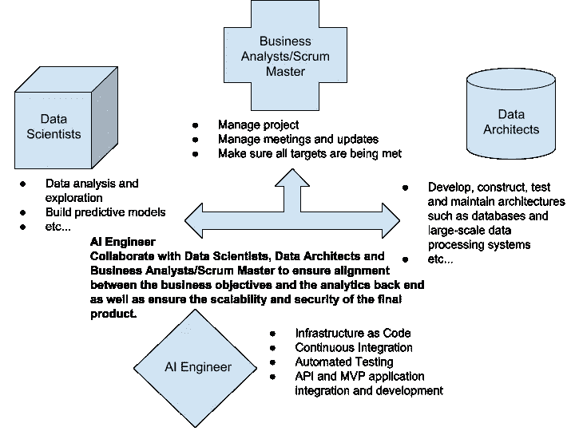

# AI 软件工程师在数据科学团队中的角色是什么？

> 原文：<https://towardsdatascience.com/what-is-the-role-of-an-ai-software-engineer-in-a-data-science-team-eec987203ceb?source=collection_archive---------4----------------------->

Photo by [Marvin Meyer](https://unsplash.com/@marvelous?utm_source=medium&utm_medium=referral) on [Unsplash](https://unsplash.com?utm_source=medium&utm_medium=referral)

我最近加入了埃森哲都柏林全球创新中心的 Enterprise Insight Studio 团队，担任人工智能(AI)软件工程师。鉴于这是团队中的一个新角色，以及在整个领域中，围绕人工智能软件工程做什么以及该角色如何适应数据科学团队，仍有许多问题。为了帮助回答其中的一些问题，我在这篇文章中强调了人工智能软件工程师带来的一些关键技能，以及他们如何融入数据科学团队。实际上，数据科学团队中有几个人在构建分析和数据产品。最终产品的好坏取决于负责收集、构建和分析底层数据的团队。不久前，数据科学团队主要由数据科学家、数据架构师和业务分析师组成。然而，要将数据科学工作转化为可扩展和稳定的产品，仍然有很大的差距需要填补，人工智能软件工程师也有确切的发挥作用的地方。

人工智能软件工程师在数据科学团队中的主要角色是将数据科学工作产品化，以便为内部利益相关者或外部客户服务。人工智能工程师必须与数据科学家、数据架构师和业务分析师合作，以确保业务目标和分析后端之间的一致性。此外，为了证明职位名称中的人工智能部分是正确的，人工智能软件工程师负责保持最新并了解具有转变业务、劳动力或消费者体验潜力的突破性人工智能技术，以及数据科学团队如何利用这些技术。这听起来很好，但实际上，它到底意味着什么呢？简单地说，这意味着人工智能工程师负责将软件工程文化引入数据科学过程。这是一项艰巨的任务，包括以下内容:

## **按照代码**构建基础设施

数据科学团队基础设施的自动化。这一重要的软件工程概念是成功的数据科学项目的关键部分。人工智能软件工程师负责确保在模型开发和培训过程中创建的环境可以很容易地管理和复制到最终产品中。用于 Python 包管理的 Anaconda 和用于创建可轻松传输的自包含环境的 Docker 或 vagger 等工具应该成为数据科学团队流程的一部分，以帮助团队成员之间的协作和轻松部署的模型。人工智能软件工程师的责任是建立和管理管道，让数据科学家专注于模型开发。

## **持续集成和版本控制**

这是软件工程师在数据科学团队中容易忽略的另一个重要事实。像 TFS 或 GIT 这样的工具应该成为数据科学项目日常流程的一部分。在模型开发期间，有如此多的迭代和不同的更新，如果没有适当的版本控制系统，就不可能跟踪所有已经完成的工作。候选版本、不同类型问题/用户故事的不同分支、团队中每个人都可以访问的同一位置等概念对于将数据科学工作转化为实际产品极其重要。这也允许引入代码审查等概念，这保证了更多的数据科学家将了解代码/模型是如何工作的，这将有助于提高所创建工作的质量。

## **测试**

任何产品，无论是具有简单用户界面的模型还是完全集成的应用程序，都应该经过彻底的测试。显然，从软件工程师的角度来看，那些测试应该完全自动化。这意味着单元测试、分支测试、集成测试和安全测试应该嵌入到数据科学的核心流程中。当然，这不包括 A/B 测试，它们是不同的情况，在开发的不同阶段完成，但是它们同样重要，不应该被丢弃。

## **API 开发**

开发 API 以帮助将数据产品和源集成到应用程序中。人工智能软件工程师负责构建和维护一个平台，以便轻松地将模型“转换”成可供其他应用程序使用的 API。这意味着遵循标准方法和公共语言的工具或定制 API 的开发。这也意味着数据科学团队可以快速地将模型转化为 API，供“外部世界”使用。这是将科学模型转化为产品的关键步骤，人工智能软件工程师应该发挥他/她的所有专业知识，以保证从模型中创建的 API 是可扩展的、灵活的和可靠的。

## **试点和 MVP 应用的开发**

虽然并不总是需要，因为一些数据科学工作可以通过 Jupyter 或其他数据可视化工具简单地呈现，但在数据科学过程中，飞行员和 MVP 的开发仍然非常重要。MVP 是最终产品，它包含了我到目前为止提到的所有其他方面，从模型的创建和测试，通过 API 开发，一直到最终产品可以被最终用户演示和消费。这里的要点是应用程序——无论是 MVP 还是最终版本——是如此的坚实，以至于最终用户甚至不会意识到它下面有一个数据产品。

AI 软件工程师还应该考虑在数据科学团队中实施其他软件工程师概念，例如连续交付、应用程序监控和自动扩展，这些也应该是核心流程的一部分。然而，在深入到它的工程方面之前，上面提到的几点，我认为是整个过程中最重要的，应该已经被实现并完全融入到团队的文化中。只有这样，更先进的工程概念才会被提出来。

总之，我们可以认为人工智能软件工程师是负责让数据科学家和数据架构师的生活变得更容易的人。他们应该专注于他们工作的重要方面:分析数据和创建高精度的模型，或者致力于项目的整体架构。人工智能软件工程师将负责创建 API，测试和部署模型，创建任何可能需要的用户界面来显示更相关的模型视图-模型可视化，自动化我们的基础设施等-并弥合数据科学家和数据架构师之间的差距。简而言之，人工智能软件工程师负责将数据科学工作包装成最终产品。

*Overview of a Data Science Team*

这只是对人工智能软件工程师在数据科学团队中的角色以及此人带来的贡献的基本概述。希望这将帮助你理解这个角色需要什么，以及为什么在数据科学工作背后有软件工程概念是重要的。鉴于这是数据科学范围内的一个新角色，仍然有许多问题需要回答，人工智能软件工程师必须足够灵活，以便在团队中实施他/她的想法，并在不一定与软件工程相关的领域采取行动。尽管如此，这是一个非常令人兴奋的职位，有很多学习和成长的机会。对于软件工程来说，这也是一个进入激动人心且不断发展的数据科学领域的绝佳机会。如果你有兴趣谈论更多关于人工智能软件工程师的事情，或者如果你有任何问题或建议，请随时联系我，我很乐意听到你的意见。与此同时，保持好奇，继续编码。