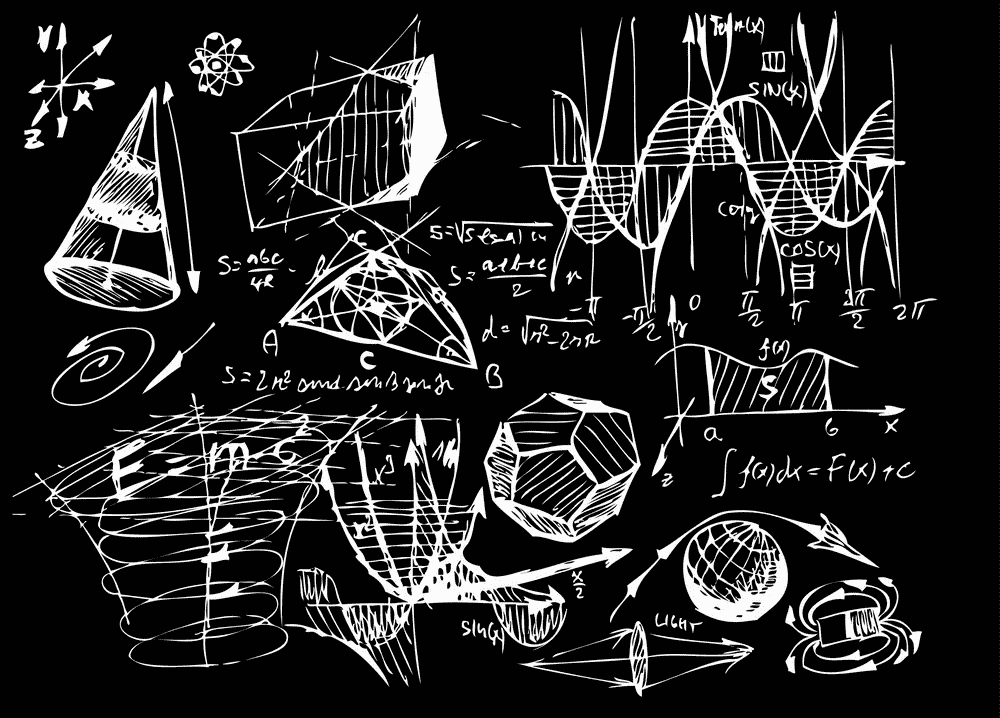

# 在数据科学中“做”数学意味着什么

> 原文：<https://towardsdatascience.com/what-it-means-to-do-math-in-data-science-843f454fddf6?source=collection_archive---------3----------------------->

当下一代热切的年轻人寻求做出他们的第一个主要职业选择时，许多人会认为数据科学是一个令人兴奋的可能性。随着软件正式蚕食世界，数据作为我们经济的新石油牢牢扎根，从事数据行业的机会从未像现在这样多。公司正准备在一个全新的范式下构建软件，在这个范式中，数据和分析驱动着他们最重要的产品功能。在寻求洞察力和预测的过程中，组织将目光瞄准了有希望的候选人，他们对一切数据的热情与对工作中预期的数字熟练程度的担忧相匹配。

如果你要一份成为成功的数据科学家所需的才能清单，你会看到通常的大多数与 STEM 相关的技能清单；不仅仅是数学和统计学。这应该不足为奇。历史上，所有类型的分析师都使用数学来帮助做出和确认他们的发现。假设良好的数字工作知识会给数据科学职位带来好处是很自然的。

但是，当我们说数学和统计学在数据科学中很重要时，这意味着什么呢？他们在大学里的样子重要吗？我们渴望的年轻人应该把时间花在微积分和概率的基础知识上，为数据驱动的职业生涯做准备吗？如果个人不是天生倾向于传统的数学思维，这是否会妨碍他们进入数据科学职业？用手做数学和训练依靠数学得出结果的机器有区别吗？

如果没有上下文，说我们在某个特定领域做某事没有多大意义。从核物理学家到会计师，每个人都做数学。在科学领域，数学让我们用具体的术语来表达思想，从而帮助我们模拟我们的世界。我们可以利用数学的机制带领我们走上新的道路，并保持我们的发现的一致性。数学可以帮助我们在巨大的复杂程度上争论，并帮助我们用数据讲述故事。与数据科学最相关的是将数学编码成机器的能力，这为解决其他棘手的问题打开了大门，并使我们的核心工具机器学习成为可能。

但是将事物的来源等同于它在现实世界中的应用是理解抽象的失败。那些实现学术发现的人不应该沉浸在他们工具的起源中。医疗从业者没有花时间去研究生物化学的细微差别或控制核磁共振成像机的物理原理。这并不是说良好的基本面工作知识不起作用。但是，如果他们主要关心的是他们的机器内部是如何工作的，医生们将会从使用工具解决病人问题这一更重要的任务中靠边站。

事实是，如果数据科学家把他们的时间花在解方程和讨论定理上，他们在软件世界里将一事无成。软件运行得很快，并从失败的尝试和迭代中获益；不仅仅是写在白板上的公式。重要的是要认识到，这不是为了把产品推出去而进行的廉价分析。快速开发和迭代是解决真正复杂问题的唯一途径。虽然数学有助于控制我们数据的高维度，但它只是原始信息和提供价值的产出之间更艰巨旅程的开始。

在白板上进行数学计算和理解如何实现数学机器是两码事。是的，统计学和数学在数据科学中很重要，但这仅仅是因为它们浮出水面的*概念*和它们使之成为可能的*工具*。成为一名伟大的数据科学家意味着知道机器的终点和人类的起点。在数据科学中，我们把数学的求解和执行留给了机器。人类有责任帮助*引导*我们的系统做出更好的预测，并实现其适应环境的目标。这不是解方程，而是让数学和机器产生人们觉得有用的东西；甚至可能是愉快的。

构建智能软件的学术化、简单化的方法是对复杂性的严重缺乏。在数学和传统软件中，使用简化的硬编码规则将输入转换为输出。但是，当我们寻求创建机器学习应用程序时，复杂程度远远超过简单的输入和输出。在数据科学中，唯一重要的产出(和结果)是那些从我们无法直接进入的数字游戏中产生的结果。任何能够接近“智能”行为的系统都有一层神秘的面纱，认为它可以用基本逻辑解码并拼凑起来是非常短视的。

在数据科学中，我们解释结果，并使用数学推理来考虑我们对模型所做的调整的有效性。这不同于在纸上操作方程和推导结果。在物理学中，求解薛定谔方程和理解为什么它适合于模拟物理系统中随时间的变化之间有很大的区别。你解方程的能力与你知道何时何地使用它的能力无关，而正是后者给数据科学专业带来了好处。

当机器在做数学运算时，我们追求的不是候选人的数学技巧，而是他们对概念的理解。重要的是掌握一种方法的适当性或不适当性；不是比机器能做的更慢更少的解方程的能力。抽象是学术发现的支柱，这也是数据科学家工作的地方。当我们在深层技术细节上运作时，我们能够使用数学驱动的工具来应对困难的挑战，并使用软件解决有趣的问题。如果我们在学术意义上使用数学，这些都是不可能的。

显而易见的反驳观点是，手动推导数学表达式有助于建立我们希望在对模型进行推理时使用的直觉。但这种听起来不错的叙述被赋予了过多的分量，而且只在远离现实的课堂上起作用。虽然人工推导公式确实有助于加深理解，但这种知识缺乏真实世界的背景。你最好构建一个你不理解的工具，而不是用教科书上的积木拼凑出一些在真空中也能玩得很好的东西。当这个世界像在软件开发中一样多次击败你时，你已经有了最伟大的老师。失败。

这并不是远离学习数学，这只是意味着数学需要被理解**在那一刻**。在失败之前用数学来解决问题，向我们展示了障碍的本质与现实世界中解决问题的方式是相反的。如果你要理解如何用数学给一台复杂的机器带来价值，你的产品必须产生*错误的*结果。我们的下一代数据科学家需要先学习如何构建，然后再解决。

这种关于擅长数学意味着什么的开明且更恰当的观点超越了职业准备。当我们将数据科学视为传统的 STEM 学科时，我们阻碍了大量原本可以为该领域带来好处的人才。我们寻求的是能够与机器一起工作的个人，利用对数学在适应性机器中所扮演角色的概念性理解，哄骗它们适应它们的环境。这些人来自各行各业，正是他们的多样性为我们带来了最强大的解决方案。

未来数据驱动型公司的主人是那些雇佣能够以更柔和的方式制造机器的人。重要的是，我们的下一代热切的候选人不能将数据科学视为数学上严格的领域，在这个领域中，解决问题的学术方法是驱动结果的因素。数学知识总是有用的，但只有当它被用于我们的机器已经能够做的事情时。这是未来对数学思维的定义，也是数据科学的定位。