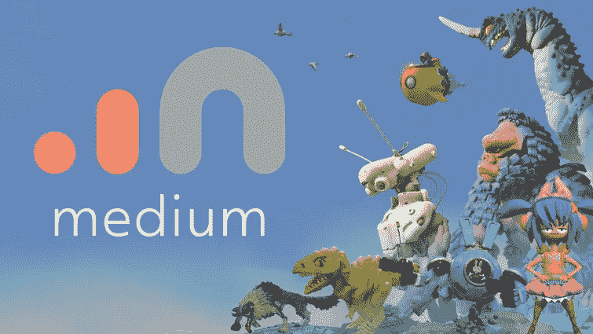
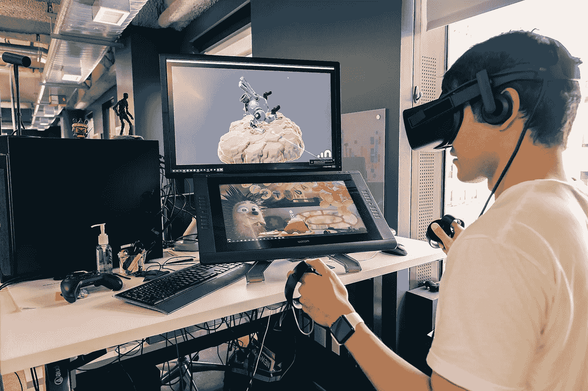

# 我在虚拟现实雕刻中所学到的——Oculus Medium

> 原文：<https://towardsdatascience.com/what-ive-learned-sculpting-in-virtual-reality-oculus-medium-15ba6b16d93a?source=collection_archive---------0----------------------->

更新编辑:带着对这篇不起眼的文章的兴趣，我终于有时间写一些关于 3D 建模和 VR 的后续文章。我将很快在我的网站上发布它们，你可以在这里找到[****]。注册我的新*** [***【快讯】***](https://mailchi.mp/f75162f1141a/design-x-code_newsletter) ***或通过[***[***RSS***](https://www.jackalope.tech/feed/)***]订阅，以便在这些更新上线后立即查看。我还将发表关于神经网络在艺术中的应用以及其他艺术/技术相关主题的文章。****

*虚拟现实令人兴奋的事情之一是它开辟了互动的新途径，不仅在游戏中，而且在应用程序和工具中。自从 Oculus 宣布以来，我最大的愿望是一个 3D 建模应用程序，虽然还有很多东西需要解决，但 Oculus Medium 已经提供了一个非常引人注目的未来。我来说说我的过程和我学到的东西。*

**

*首先让我说，我不是一个专业的建模师。我在 Blender 上过课，在 Zbrush 上过一些在线课程，但我是一名 UX 设计师。我在学校学过传统美术，所以我知道传统的雕刻技巧，但是由于 3D 艺术/设计的高度技术性(相对于更直接的 2D 的东西)，有很多我不知道的。Oculus Medium 非常棒，因为它模拟了现实生活中的雕塑，但它也不像从 Zbrush 或 Mudbox 切换到 Oculus 那么简单。*

**

*Not me, just a google image search to give you an idea of what the set up looks like*

*Oculus Medium 是基于体素的。这实质上意味着它使用 3D 像素。图片+元素=像素，体积+元素=体素。像素是网格，体素是网格的网格，构成立方体。很像游戏 minecraft。体素就像光栅图形。传统的 3D 渲染和 3D 软件使用的是顶点，基本就像 3D 矢量一样。如果你熟悉 Adobe Illustrator/Flash 和 Adobe Photoshop 之间的区别，那么 Oculus Medium 更像是 3D Photoshop。*

*体素通常不用于渲染 3D 对象，因为它们占用大量内存。如果你想要一个更专业的解释，我强烈推荐 Craig Perko 的视频，他深入描述了原因:*

*但是为了满足我的需求，你真正需要知道的唯一一件事是体素占用大量内存。很多。我的 windows 桌面机有 16g 内存，在做这些项目的过程中，我设法让我的电脑崩溃了几次，并轻松地在我的 SSD 中存储了大约 50g 的分页文件。我将解释这一点的一些含义，因为它关系到一个人如何在虚拟现实中雕刻。*

*我的第一个项目是一个简单的骷髅战士。简单、坚硬的表面，没有太多细节，基本上都是一种材料，就像我在用 3D 打印机打印一样。*

*与传统的顶点建模相比，体素有很多优点。体素雕刻对我来说感觉更直观，我发现自己真的很享受在虚拟现实雕刻的时间。这个雕塑花了两天的时间，有点长，但大部分时间都花在了弄清楚界面和如何最好地处理这件作品上。*

*做完骷髅战士后，我决定四处寻找新的挑战。facebook 上的一个朋友建议我试着模仿碧昂斯在格莱美上穿的服装。恐怕我对她的大部分作品都不太熟悉，但我最近读了伦敦桂冠诗人、碧昂斯最新专辑的撰稿人沃桑·夏尔的一首非常优美的诗。她的诗《留下来的不可承受之重》很美。https://warsanshire . band camp . com/track/the-unability-weight of-staying-the-end-of-relationship 她的服装也非常酷，似乎提供了许多方面，这对于 Oculus Medium 中的造型来说尤其困难。*

*碧昂斯造型的困难之处在于它与人类的相似性(人类已经花了数百万年来完善我们的面部识别湿件，因此我们非常非常擅长它)，细节层次的变化，以及她穿着的薄纱般的裙子。*

*体素建模的直观本质非常简单。你点击按钮，一个球出现在空中，跟在你手的移动后面。你把它设置为擦除，你可以有选择地把你不想要的东西刻掉。本质上就是这么简单。您甚至可以创建自定义画笔，称为“图章”，功能类似于 Photoshop。Photoshop 笔刷是从缩略图中提取的重复像素图案。邮票没有 Photoshop 笔刷复杂的额外功能(还没有！)但它们的工作原理是一样的。你拖动一个球，你会得到一个直径很大的管子。你拖动一个圆盘，你会得到一个平而细的笔画，你可以把它像一层粘土一样放在雕塑上。*

*体素雕刻的本质可以与谷歌的一个类似的程序形成对比，该程序被称为使用顶点的倾斜画笔。熟练的艺术家可以使用它来制作看起来像空中绘画一样的美丽艺术作品(查看下面我最喜欢的倾斜画笔艺术家伊丽莎白·爱德华的作品)，但它的顶点性质也在某些方面限制了它。这意味着当你想要删除一个笔触时，你必须删除整个笔触，而不能只擦除它的一部分。每个笔划都有自己的顶点组，类似于 Illustrator 中每个矢量笔刷笔划都有自己的子层。你可以在 Illustrator 中选择性地擦除部分矢量，所以我想 Tilt Brush 或 Quill(另一个基于顶点的 3D 艺术程序)最终也会如此，但目前为止，你只能擦除整个笔画，或者完全擦除。即使修复了这一点，顶点也是在 3D 空间中应用了着色器/纹理的 2d 平面形状笔划，没有深度/质量，因此您只能真正制作一个粗略的绘画作品，这在其他应用程序(如游戏)中的使用有限(尽管显然一个聪明的人可能会将它用于他们想要的用途)。*

*体素有质量，因为它们是 3D 立方体，然后对它们应用平滑算法，给它们一个一致的表面，而不是《我的世界》的块状外观。如果你想将你的作品用于更传统的基于顶点的动画或游戏引擎应用程序，你必须使用导出功能将其转换为 OBJ。这带来了基于体素雕刻的第二个困难。顶点模型不像体素那样占用那么多内存，因为它们只描述组成模型网格表面的点。体素不仅包含表面，还包含每个内部 3D“像素”。如果你有一个巨大的平面空间，在顶点模型中，这个巨大的平面空间基本上可以由 4 个点组成，而同一个平面空间必须由数百个体素组成，就像一个 900px 乘 900px 的光栅图像将比一个 90px 乘 90px 的图像大，即使它们基本上是相同的东西。*

*在同一个网格中，顶点可以有不同的分辨率级别。大型无差别几何区域可以用较少的点来表示，然后在高细节区域可以有一堆顶点。因此，如果你想在一个大而简单的身体上安装一个非常详细的头部，那么你必须浪费大量额外的内存来保持这个简单的身体与高度详细的面部具有相同的分辨率。所以为了解决碧昂斯造型的问题，我把她的脸和身体分成两部分，并用她的珠宝来掩饰。这些元素中的每一个都在一个单独的层上，并且具有不同级别的分辨率，然后被拼凑在一起。她的脸比她的身体高 6 级分辨率。因此，尽管在 Oculus Medium 中，头部在空间中被表示为一个较小的对象，但它实际上包含了 6 倍多的体素。这有点像在 Photoshop 中让一个高分辨率的智能对象在一个低分辨率的图像中播放，也许这可以给你一个想法。*

*即使有了这样的分辨率划分，我仍然遇到了许多内存问题。体素通常不被使用是有原因的，即使 6 倍的分辨率有时在面部也会受到限制。更糟糕的是，我对我的比喻作品也很生疏。虽然这只是一个硬件问题，但最终会成为一个小问题，这就是为什么我相信 Oculus 选择体素渲染是正确的。*

*事实上，像这样在空间的每个点上均匀地定义体素，占用了如此多的内存，这是一个问题，但也是一个很大的好处。由于每个体素都被同等考虑，你可以很容易地挖空物体，或雕刻与主图形无关的物体，而不必创建单独的顶点组等。你可以从碧昂斯的造型和我给她做的发型中看出来。在她的发梢附近，你可以看到独立的头发。这是因为我创建了一个自定义的发刷和羽化头发的方式。类似于 2d 概念艺术家用来快速生成头发、草或树叶的技术，但应用于 3D 空间，我模拟了她头发的一小部分，然后快速重复它的形式来创建她的头发的整体形状和纹理。在最后独立的头发是无意的，但我喜欢这种绘画效果，并保留了下来。一旦你手头有了更多的内存和分辨率(以及像 Photoshop 笔刷一样更多的调整选项)，我可以看到这个系统变得非常非常强大。在具有此功能的 3D 建模中，还有一个完整的维度有待探索。*

*我提到的另一个挑战是制作薄纱般的服装。最初我是用一枚叶子形状的邮票，在裙子的形状上创造一件破旧的裙子，但这被证明是有挑战性的。仅出口一项，这条裙子就卖了 1.5 英镑，价值超过 100 万英镑。太多了！(典型的视频游戏模型即使没有几百个，也有几千个)。这是一个完全混乱的工作。我试图用 Mesh Lab(我强烈推荐:[http://www.meshlab.net/](http://www.meshlab.net/))清理它，但无济于事。我的电脑就是受不了。所以我最后在搅拌机里重塑了这条裙子，并把它设置成透明材质。*

*这让我想到了雕刻体素的关键方面。你必须把你正在做的东西当作一个固体。这就像扔出一块粗糙的陶器不透明的粘土，做精致的东西可能很困难，因为你不能依靠纹理/材料来给出短暂的外观，并且试图从字面上翻译这种花边外观是非常耗费内存的。*

*即使是做像脸部这样精致的五官，完全是立体的，也有点挑战。用顶点程序雕刻允许一定量的表面控制(因为本质上你只是在处理表面，没有像体素那样的“内部空间”)。如果你的手柄在 Oculus Medium 中颤抖，你可能会在你不想要的脸颊或嘴唇上留下一大块草皮。我相信有一些 UI 解决方案可以用来解决这个困难(aaaay，给我一行 Oculus！)但这仍然是一个需要考虑的挑战。*

*总之，我认为 Oculus Medium 是 VR 体素雕刻的一个非常有前途的开始，我向任何 Oculus 或 Vive 用户推荐它(我实际上拥有一台 Vive，只是用 ReVive 运行它没有问题)。我推荐它主要作为一种粗略绘制形状和构图的方法，然后在更传统的顶点程序中清理，如 Blender、Mudbox 等。(或者 Zbrush，虽然从技术上来说，它也是非顶点的，这是另一个完整的故事来解释)。我绝不是一个专业的建模师，我敢肯定，还有大量更高级的功能需要为游戏组件优化(可能是一个完全不同的 VR 盒子建模程序)而设计，但我很高兴继续学习并弄清楚我与该程序的工作流程。*