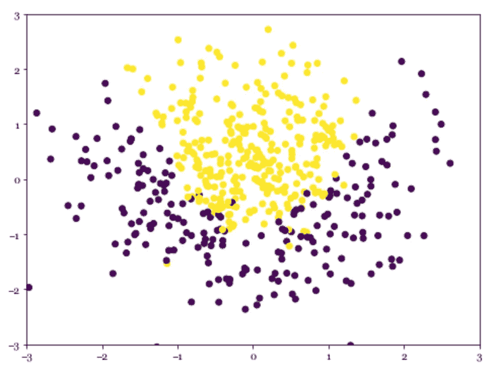
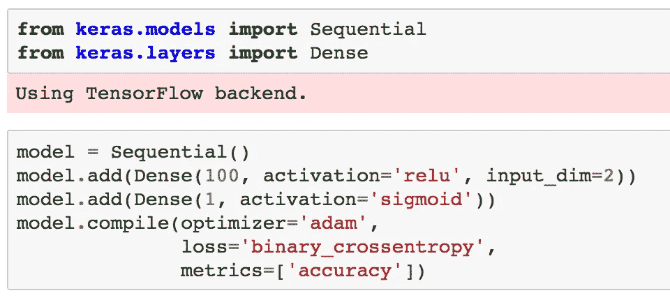
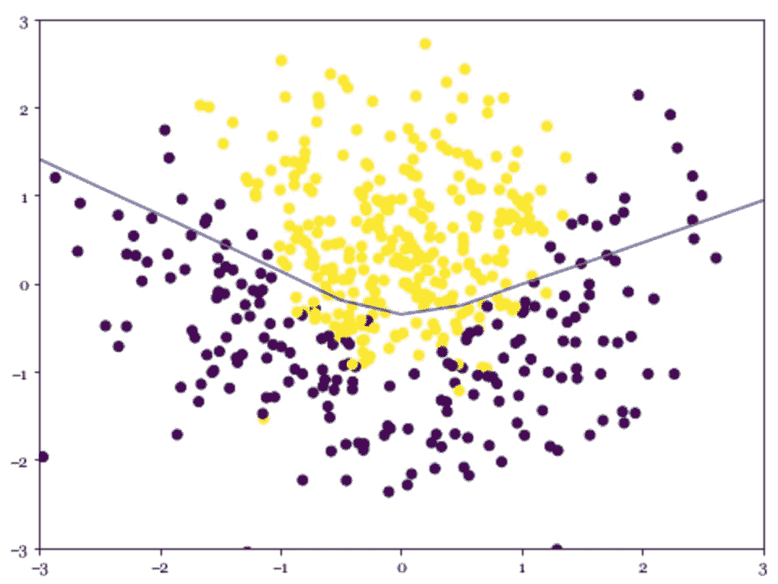
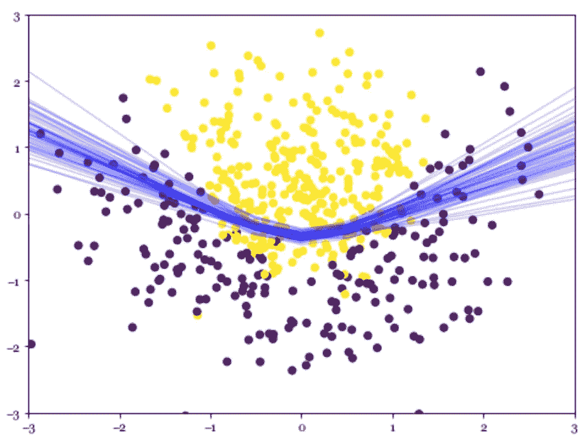
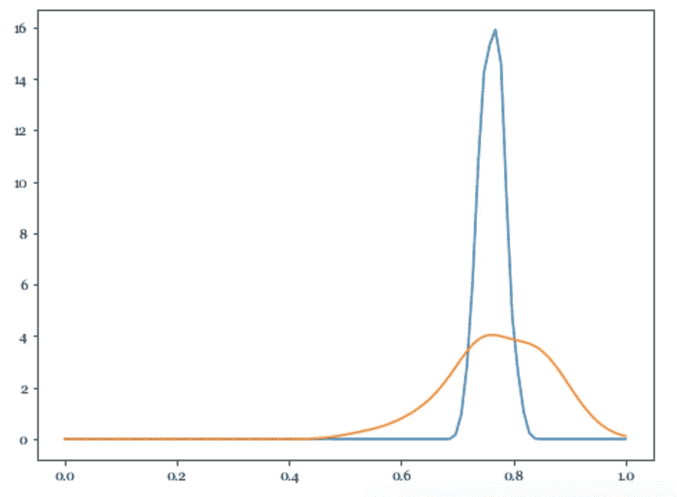

# Keras 车型缺什么

> 原文：<https://towardsdatascience.com/what-keras-models-are-missing-89b47cc5a4fa?source=collection_archive---------11----------------------->

> **TL；Keras 模型缺少“模型信心”我们需要知道一个深度学习模型的“置信度”，才能信任和使用它。模型“信心”比高预测概率更微妙。**

首先，背景故事。我认识一个团队，他们建立了一个很棒的分类模型来识别“重要”的文档，然后将它们传递给人类专家。他们使用了所有很酷的 NLP 技巧:自定义单词嵌入、语言模型、注意力机制……他们用贝叶斯优化找到了最佳的模型架构和超参数。该模型的精确度与人类相当，并有可能节省数百万美元。人们可能想知道还缺少什么？

事实证明，问题在于人类专家不可能审阅模型预测为重要的所有文档。我不会透露具体的用例，但人们可以想象一个为疾病诊断筛选患者病历的假设场景。无论哪种方式，我们都受到资源的限制，只想追求模型对什么“有信心”，以控制假阳性率。**但是“模特自信”到底是什么意思呢？**

让我们把问题简化为二元分类。模型预测只是 0 到 1 之间的概率。我们可能会认为，预测概率越接近 1，意味着“信心”越高。但实际上模型预测只是一个点估计，它代表了“最佳猜测”，但没有量化“模型置信度”“模型置信度”的最佳量化是一个置信区间，或[贝叶斯可信区间](https://en.wikipedia.org/wiki/Credible_interval)。

我们可以有两个 0.8 的点估计，但一个置信区间可以是(0.5，0.9)，而另一个置信区间是(0.75，0.85)。第二个估计会比第一个更“有信心”。另一方面，我们可以有两个区间估计:(0.5，0.6)和(0.3，0.9)。尽管区间估计值较低，但区间估计值越窄，提供的信息就越多，因为模型更“可靠”

> 对我来说，(0.5，0.6)表示“模型知道它不知道”，(0.3，0.9)表示“模型不知道它是否知道。”

怎么会这样？同样的预测概率怎么会有不同的置信区间？让我们看一个玩具二维例子。下面是 500 点，两个维度都遵循标准正态分布。当一个人将真实数据居中并缩放至平均值 0 和标准差 1 时，这是理想的情况。然后使用二次决策边界对这些点进行着色/分类。

Simulated data points to be classified.

由于这些点显然不能线性分离，神经网络将是一个强大的模型选择(如果我没有告诉你真正的模型是二次的)。这里我们建立一个简单的一层神经网络，有 100 个隐藏单元。

Shallow neural network with relatively large hidden layer.

在仅仅训练了几个时期之后，神经网络做得相当好，并且恢复了决策边界。在这一点上，有人可能会说“喀拉斯万岁”，然后就到此为止。当新数据出现时，我们会采用模型预测的高概率，可能高于某个阈值。这可能是机器/深度学习在实践中的大部分时间是如何完成的，没有数据工程和模型调整。

Neural network decision boundary.

然而，到目前为止，我们真的没有“模型信心”为了得到那个，我们可以[引导](https://en.wikipedia.org/wiki/Bootstrapping_(statistics))数据 50 次，并获得决策边界的经验分布。下图显示了决策界限可能会有很大变化。特别是，模型在中心附近最“自信”,因为蓝色波段在那里最窄。当我们向两边移动时，模型变得不那么“自信”,正如蓝色曲线的高可变性所暗示的那样。

Empirical distribution of decision boundaries.

考虑两个数据点的模型预测，一个靠近中心，一个向右。如果两个数据点离决策边界的距离相等，则它们的点估计值将相同，但置信区间可能会非常不同。实际上，我们有两个预测分布，它们具有大致相同的均值/中值，但形状截然不同，因此完全没有可比性的“众数置信度”在前面的上下文中，我们会将更多的资源分配给模型更“有信心”的数据点

Predictive distributions at two different data points

> “模型可信度”本质上是数据不确定性的产物。凭直觉认为，在数据可预测的情况下，模型应该更“自信”，而在数据不确定的情况下，模型应该更“不自信”。

回到良好的旧回归模型，数据不确定性表现在[杠杆](https://en.wikipedia.org/wiki/Leverage_(statistics))方面。从数学上来说，数据不确定性出现在 X 分布的边界附近，这里附近的数据点很少。这种想法在深度学习中尤为重要，原因有二。

首先，深度学习模型倾向于更高维度，尽管有过多的数据，但[维数灾难](https://en.wikipedia.org/wiki/Curse_of_dimensionality)将会杀死我们。第二，当我们对图像和文本等数据使用深度学习时，很难想象边界上有什么，因为图像/文本的空间远比数字的欧几里德空间复杂。

这意味着，深度学习模型仍然可能不“自信”，即使它们在数百万个数据点上进行训练。此外，我们将更难评估深度学习模型的“可信度”。事实上，这是一个重要而令人兴奋的研究领域。最有希望的解决方案是[贝叶斯深度学习](http://bayesiandeeplearning.org/)。最后，我推荐牛津大学的 Yarin Gal 撰写的一篇深入的[博客文章](http://www.cs.ox.ac.uk/people/yarin.gal/website/blog_3d801aa532c1ce.html)，以供进一步阅读。