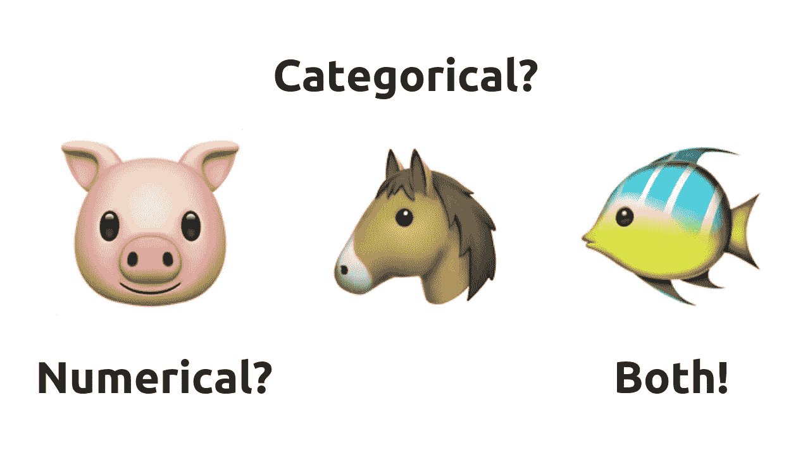

# 你的公司有什么样的数据？

> 原文：<https://towardsdatascience.com/what-kind-of-data-does-your-company-have-7341991a73a?source=collection_archive---------8----------------------->

你的企业有一些数据，你想知道从中能学到什么。是数字还是范畴？它是否具有高维度或基数？

维度是什么？

数据无处不在已经不是什么秘密了。但重要的是要认识到，并非所有的数据都是一样的。您可能以前听说过数据清理这个术语。如果你没有，这和定期清洗没什么区别。

当你决定是时候整理你的房子了，你把地板上的衣服收起来，把桌子上的东西放回该放的地方。你让混乱的环境恢复了秩序。

同样的事情也发生在数据上。当机器学习工程师开始查看数据集时，他们会问自己，“这个应该放在哪里？”，‘这应该是什么？’就像把衣服放回壁橱一样，他们开始移动东西，改变一列的值，并使另一列的值正常化。

但是等等。您如何知道如何处理每一份数据？

回到打扫房间的比喻。如果你有一张凌乱的餐桌，你怎么知道每样东西放在哪里？

香料放在食品柜里，因为它们需要保持干燥。牛奶要放回冰箱，因为它必须保持低温。而你还没打开的那堆信封，大概可以进书房了。

现在假设你有一个混乱的数据表。一列有数字，另一列有单词。你想用这些做什么？

一种简便的方法是将这些数据分解成数字和分类数据。

在我们进一步讨论之前，让我们认识一些朋友来帮助解开这两种类型的价值观。

小猪哈罗德喜欢数字。他每天数他的食物。

Klipklop 马观察所有经过场地的汽车，知道每一种类型。

鱼桑迪两样都喜欢。她知道人多力量大，喜欢海底各种不同的海洋生物。

Harold the pig loves numerical data, Klipklop favours categorical data and Sandy the fish loves both.

# 数据

像哈罗德一样，计算机喜欢数字。

对于任何数据集，目标通常是以某种方式转换它，以便所有的值都处于某种数值状态。通过这种方式，计算机可以通过执行大规模计算来找出数字中的模式。

在 Harold 的例子中，他的数据已经处于数字状态。他记得在过去的三年里他每天吃了多少粒食物。

他知道周六他会得到一点额外的报酬。所以他会留一些到周一供应量较少的时候。

你不一定需要电脑来弄清楚这种模式。但是如果你在处理更复杂的事情呢？

比如根据其他类似公司的价值和最近关于 X 公司的新闻头条预测 X 公司明天的股价？

好，那么你知道 X 公司和其他四家类似公司的股票价格。这些值都是数字。现在你可以用电脑很容易地模拟这些。

但是如果你想加入标题“X 公司打破新记录，创历史新高！”融入其中？

哈罗德很擅长数数。但是他对他一直在吃的不同种类的谷物一无所知。如果谷物的种类影响了他收到的谷物数量呢？就像新闻标题如何影响股票价格一样。

这种不以简单的数字形式出现的数据称为分类数据。

# 分类数据

分类数据是任何不能立即以数字形式获得的数据。这通常是你会听到维数和基数这两个术语的地方。

这就是克利普克洛普这匹马出现的地方。他每天看着汽车经过，知道每辆车的品牌和型号。

但是假设您想使用这些信息来预测汽车的价格。

你知道品牌和型号对价值有一定的贡献。但是到底是什么呢？

你如何让一台电脑明白一辆宝马和一辆丰田是不同的？

用数字。

这就是特征编码概念的由来。或者换句话说，把一个类别转换成一个数字，这样计算机就能知道每个数字之间的关系。

假设今天很安静，Klipklop 只看到了 3 辆车。

一辆宝马 X5，一辆丰田凯美瑞和一辆丰田卡罗拉。你怎么能把这些汽车变成机器能理解的数字，同时又保持它们固有的差异呢？

有许多技术，但是我们将看两个最流行的——一热编码和顺序编码。

## 顺序编码

这是汽车和它的制造商被分配一个数字在他们出现的顺序。

假设宝马先经过，接着是凯美瑞，然后是卡罗拉。

*Table 1: Example of ordinal encoding different car makes.*

但这有意义吗？

按照这个逻辑，一辆宝马+丰田应该等于一辆丰田(1 + 2 = 3)。不完全是。

序号编码可以用于某些情况，如时间间隔，但它可能不是这种情况下的最佳选择。

一次热编码

一键编码将适用于每辆汽车的每个值指定为 1，将不适用的每个值指定为 0。

*Table 2: Example of one-hot encoding different car makes and types.*

现在，我们的两辆丰田车彼此相似，因为它们都有丰田的 1，但它们的品牌不同。

One-hot-encoding 可以很好地将类别值编码成数字，但是有一个缺点。请注意，用于描述汽车的数值是如何从 2 增加到 5 的。

这就是术语“高维度”的用法。现在有更多的参数来描述每辆车是什么，而不是车的数量。

为了让计算机学习有意义的结果，您希望相反的比率很高。

换句话说，你更希望有 6000 个汽车的例子，并且只有 6 种方式来描述它们，而不是相反。

但是当然，事情并不总是这样。你可能会有 6000 辆汽车和 1000 种不同的描述方式，因为 Klipklop 见过 500 种不同的品牌和型号。

这就是高基数的问题——当你有许多不同的方式来描述一件事，但每种方式都没有很多例子。

对于一个理想的价格预测系统，你需要 1000 辆丰田花冠，1000 辆宝马 X5 和 1000 辆丰田凯美瑞。

好了，车说够了。

我们的股价问题呢？如何将新闻标题整合到模型中？

同样，您可以通过多种方式做到这一点。但是我们将从二进制表示开始。

## 二进制编码

你出生在 2000 年之前，对还是错？

假设你回答正确。你得了 1 分。2000 年以后出生的人都得 0 分。简而言之，这就是二进制编码。

对于我们的股票价格预测，让我们把新闻标题分成两类——好的和坏的。好标题得 1 分，坏标题得 0 分。

有了这些信息，我们就可以浏览网页，收集新出现的标题，并把它们输入到我们的模型中。最终，有了足够多的例子，它将开始根据标题的价值来感受股票价格的变化。

有了这个模型，你开始注意到一个趋势——每次坏消息出来，股价就会下跌。没有惊喜。

我们在这里使用了一个简单的例子，二进制编码并不能准确地捕捉一个好的或坏的标题的强度。中立呢，很好还是很差？这就是我们之前讨论的顺序编码的用武之地。

-2 代表非常差的标题，-1 代表差，0 代表中性，1 代表好，2 代表非常好。现在很不好+很好=中性是有道理的。

有更复杂的方法将单词引入机器学习模型，但我们将这些留给未来的文章。

需要注意的重要一点是，有许多不同的方法可以将看似非数字的信息转换成计算机可以理解的东西。

# 你能做什么？

机器学习工程师和数据科学家花了很多时间试图像鱼桑迪一样思考。

桑迪知道她和其他鱼群呆在一起会很安全，但她也知道在探索未知世界的过程中有很多东西要学。

仅仅依靠数字信息来获得洞察力是很容易的。但是有如此多的信息隐藏在不同的方式中。

通过使用数字和分类信息的组合，可以建立更现实和有用的世界模型。

利用价格信息模拟股市是一回事，但当你将新闻标题加入其中时，情况就完全不同了。

如果你希望开始利用机器学习和数据科学等技术来利用数据的力量，有几件事情可以让你充分利用它。

## 标准化您的数据

如果你在收集数据，它是以什么格式存储的？

格式本身不一定像统一性那么重要。收集它们，但要确保它们都以同样的方式存放。

这适用于数值和分类数据，尤其是分类数据。

## 越多越好

理想的数据集在基数和维度之间有一个很好的平衡。

换句话说，每个特定样本都有大量的例子。

在学习方面，机器还没有人类好。我们可以看到哈罗德

猪只看一次就能记住它的样子，而计算机需要成千上万张猪的照片才能记住它的样子。

机器学习的一般经验是，更多(高质量)的数据意味着更好的模型。

记录每条信息的相关内容

随着收集的数据越来越多，了解每条信息的相关内容非常重要。

在 Max Kelsen，在运行任何类型的机器学习模型之前，工程师都会花大量时间与熟悉数据集的主题专家联系。

## 为什么这很重要？

因为机器学习工程师可能能够建立一个 99%准确的模型，但如果它预测错误，那就没用了。或者更糟，99%的数据是错误的。

很好地记录你的数据有助于防止这类失误。

不管你得到的是数字数据、分类数据还是两者的组合，如果你想从中获得更多，Max Kelsen 可以帮你。

*这篇文章最早出现在***上。**