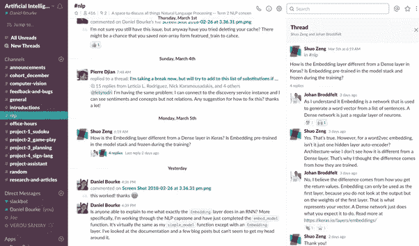

# 应该上哪门领先的人工智能课程，之后该做什么？

> 原文：<https://towardsdatascience.com/what-leading-artificial-intelligence-course-should-you-take-and-what-should-you-do-after-261a933bb3da?source=collection_archive---------1----------------------->

A photo of me being slightly (very) proud of my recent graduation from Andrew Ng’s deeplearning.ai course.

我[于去年年底从 Udacity 的深度学习纳米学位(DLND)](https://youtu.be/f5ZyqIueWPc) 毕业，吴恩达的 [deeplearning.ai 专业](http://bit.ly/courseradl) [于 2 月](https://youtu.be/VLQHpvuwsV0)为我收官。

我目前大约 70%通过了 Udacity 的人工智能纳米学位(AIND)，作为我[自创 AI 硕士学位](http://bit.ly/AIMastersDegree)的一部分。

这篇文章开始于我对 Quora 上一个问题的回答。

Original question on Quora.

我根据我对这两门课程以及 DLND 的体验回答了这个问题。

# 简短回答

双管齐下。

如果你想提高你在这个领域的技能，我强烈推荐这两个课程。

去年我编程知识为零，也没听过深度学习这个名词。

由于这些课程的结合，我现在每周都在构建世界级的深度学习模型。

我按以下顺序选修了这些课程。

1. [Udacity 深度学习纳米度](https://www.udacity.com/course/deep-learning-nanodegree--nd101)
2。 [Udacity 人工智能纳米度](https://www.udacity.com/course/artificial-intelligence-nanodegree--nd889) Term 1(传统 AI)
3。[Coursera deep learning . ai](http://bit.ly/courseradl)吴恩达的专业化
4。【本期】Udacity 人工智能 Nanodegree Term 2(深度学习聚焦)

如果我能再有一次机会，我会用下面的顺序。

1.吴恩达的 coursera deep learning . ai specialization
2。Udacity 深度学习纳米学位
3。Udacity 人工智能纳米学位术语 1
4。Udacity 人工智能纳米学位术语 2

## 为什么？

吴恩达的 deeplearning.ai 采用了一种全新的方法来进行深度学习。这是我学习最好的方法。

Udacity 的课程质量非常高，但通常会直接进入高水平的项目。这是一个很好的学习方法，但是如果你没有基础知识，会非常困难。

如果你已经拥有一些深度学习和机器学习的基础知识，或者已经是一名优秀的 Python 程序员，那么 Udacity 的 AI Nanodegree 可能是你开始的理想地方。

## 为什么两者都做？

交叉知识。

在学习完这两门课程后，我发现它们相辅相成。

当安德鲁的航向下降时，AIND 会上升，反之亦然。

昨天一个真实的例子发生在我身上。我被 AIND NLP capstone 项目中的一个问题卡住了，特别是一个关于单词嵌入的问题。

我在论坛上发帖说我在理解单词嵌入方面有困难。

Thanks for the help Vadim!

在 Vadim 的建议下，我回顾了 deeplearning.ai 专业化中关于单词嵌入的讲座。在做这件事之前，我在网上搜索了几个小时，寻找一个我能理解的解释。

***自我提醒:*** *不要忽略你已经复习过的材料！*

最后，它们都是很棒的课程。如果你必须选择一个，我倾向于 deeplearning.ai specialisation。安德鲁的教学风格有些地方真的很合我意。

# 更长的答案

对于那些对我的课程体验感兴趣的更深入的回答，请继续阅读。

我将把它分成八类。

1.成本和时间——这些课程不是免费的，也不容易。
2。先决条件—开始之前您需要什么。
3。支持选项—遇到困难时该怎么办。
4。课程质量——材料有多好？
5。提交项目——你的工作会有什么变化？
6。课程结构——课程如何进行？
7。未来的选择——课程结束后做什么？
8。其他学习资源—还有哪些其他学习资源？

## **1。成本和时间**

deeplearning.ai 专业化要求每月支付 64 澳元(约 50 美元)的订阅费，才能获得五门课程中的每一门。每门课程都被列为大约一个月。总共五个月意味着大约 250 美元。

如果你够快的话，你可以在一个月内完成。我设法在三分钟内完成它。我本可以在两个月内完成，但是，生活。

DLND 要求预付 750 澳元(约 580 美元)。您需要在开始后的四个月内完成所有与 DLND 相关的项目，否则您将不得不再次付款。如果你按时完成，它算出每月 145 美元。

Udacity 的人工智能 Nanodegree 是三者中最长也是最贵的。包括两个三个月的期限，1000 澳元(约 775 美元)。同样，如果你在六个月的时间框架内完成了要求的项目，它算出每月 258 美元。

根据我的经验，这两个 Udacity 课程每周至少要花 15-20 个小时(有时更多)来保持进度。

另一方面，我能够每天完成价值一周的课程(6-8 小时)的 deeplearning.ai specialisation。这主要是因为我认同吴的教学方法。

## 2.先决条件

每门课程都将 Python 的中级知识列为先决条件。

需要一些数学知识，但 Python 应该是你的主要重点。

如果你能阅读 GitHub 上的 Python 脚本，并理解至少 60%的内容，你应该可以尝试这些课程。

如果 Python 是你的弱项，我会在开始之前多练习一下。

当我开始学习 DLND 时，我已经学习了三周的 Python 知识。在此之前，我从未编程。

最初几个月我很挣扎，但随着我的信心增加，我最终按时完成了。我仍然认为自己是 Python 新手。

至于数学，高中阶段对微积分、线性代数和几何的理解足以完成课程。这是因为大多数数学工作都是在 TensorFlow 和 Keras 等库的幕后进行的。

除了高中，我一门数学课都没上过。如果我的数学没有达到某个特定概念的标准，我会利用可汗学院来提升我的数学技能。

如果你正在考虑进入人工智能或深度学习博士项目，你将 ***需要*** 数学技能。

然而，要用你从这些课程中学到的技能构建应用人工智能，并不需要对幕后的数学有深刻的理解。

如果我有时间再来一次，我会在开始之前三倍地提高我的 Python 技能。

## 3.支持选项

在每门课程中，我都遇到了许多障碍。我发现支持服务对我扫清道路非常有价值。

DLND 和 AIND 有自己的 Slack 频道和专门的论坛。

在这两个松弛频道中，还有几个频道专门用于不同的主题。

Sometimes the Slack channels can be a little noisy.

两个频道都有成千上万的人，大多数话题至少有几百个用户。导师们也经常主持*问我任何问题*会议(AMA 的)并浏览频道来回答他们能回答的任何问题。

根据我的经验，Slack 频道非常嘈杂。除了发布自己的问题或者搜索其他有类似问题的人，我不怎么用它。

论坛是一种完全不同的体验。我很少发表问题，因为我遇到的许多问题，其他人已经遇到了。答案并不总是清晰的，但如果是，那就不是学习了。

如果我陷入困境，我会在试图解决自己的问题之前，利用论坛在脑海中勾勒出一幅画面。

deeplearning.ai 专业化的论坛也是类似的体验。主要的区别是用户不允许直接从作业中发布任何代码，但是伪代码是可以的。我发现这里的论坛足以回答我的问题。

当你注册 AIND 时，你会被指派一个导师。我的导师叫阿尤什。她是来自印度的软件工程师。

导师的角色是在必要时提供进一步的支持，同时也是一个可以交谈的人。很多时候当我和阿优士谈论我面临的一个问题时，它似乎已经自己解决了。

永远不要贬低大声说出你的问题的力量。永远不要害怕寻求帮助。

发布问题时的一个技巧是尽可能有效地交流。帮助他人通过彻底解释你所面临的问题来帮助你。这是我正在研究的东西。

## 4.课程内容

每门课程的内容都是世界级的。我经常在我的视频中说这些是我上过的最好的课程。

DLND 分为六个部分，其中五个部分附有重要项目。

1.简介
2。神经网络——创建你的第一个神经网络。
3。卷积神经网络-建立一个狗品种分类器。
4。递归神经网络——使用神经网络生成电视脚本。
5。生成性对抗网络——建立一个面部生成器。
6。深度强化学习——教四轴飞行器如何飞行。[新]

每个项目都专注于给你某种深度学习技术的实践经验。如果你以前没有做过太多的 Python 编程，它们会很难，但不是不可能完成。

***注:*** *第 6 节是 DLND 的新增内容，我还没有尝试过。*

吴恩达的 [deeplearning.ai](http://bit.ly/dlcoursera) 分为五个部分。

1.神经网络和深度学习
2。改进深度神经网络:超参数调整、正则化和优化
3。构建机器学习项目
4。卷积神经网络
5。序列模型

课程 2 和课程 3 对我来说是突出的。我觉得这种材料在 DLND 中丢失了。

其他课程在结构上与 DLND 提供的课程类似。完成课程 4 和课程 5 后，我对 DLND 中涵盖的内容有了进一步的了解。

AIND 有两个术语。学期 1 侧重于传统的人工智能方法，学期 2 侧重于深度学习。

对于那些从未做过深度学习的人来说，第二学期开始时有一门衔接课程。因为我已经完成了 DLND，所以我可以跳过这一步。

**期限 1**

1.构建一个游戏代理——使用带有启发式评估的对抗性搜索来构建一个数独解决和隔离游戏代理。
2。实施规划搜索—使用规划图试探法构建航空货运物流系统。
3。设计一个手语识别系统——使用隐马尔可夫模型来识别美国手语中的手势。

如果您尚未完成 DLND，AIND 的条款 2 将包含以下内容之一，并提供购买更多内容的选项。注册时我已经完成了 DLND，所以我可以访问所有三个。*

第一学期的内容对我来说很难理解。由于我已经学习了深度学习和其他机器学习技术，由于我缺乏编程能力，第一学期涵盖的主题很难。

**这可能已经改变，请务必发送电子邮件给 Udacity 支持部门进行澄清。*

**第二学期**

1.计算机视觉集中——利用深度学习和 OpenCV 构建面部关键点检测系统。
2。自然语言处理集中——建立一个机器翻译模型，将英语翻译成法语。【我目前在这里】
3。语音识别系统—构建语音检测系统。

在每一个浓度中，你将经历一系列的小项目和讲座，直到最后的项目。

我目前正在进行第二学期的第二次集中学习。最近，我一直在练习实现自然语言处理流水线的步骤(文本预处理、特征提取和建模)。这一切都是在为机器翻译项目做准备。

## 5.提交项目

为 DLND 和 AIND 提交项目非常相似。通过 Udacity 教室，您可以提交项目文件或带有代码的 GitHub 链接。

在 24 小时内，Udacity 的评审员会给你回复你的分数(通过或需要更多的工作)。然而，这不是普通的审查。评审者通常会在你的代码中留下一些带有反馈或建议的评论，以便了解更多。

我对评论家的评价再高也不为过。我总是期待听到他们的观点。

对于 deeplearning.ai specialisation，所有项目和迷你测验都会自动评分。这是节省时间的，因为你得到了直接的结果，虽然，你错过了学习更多和改进的建议。

## 6.课程结构

Udacity 结合了简短的讲座(大部分在 2-8 分钟之间),并贯穿了信息丰富的图表。浏览器中基于 Python 的编程测试通常会遵循一个重要的主题。

在每个主要里程碑结束时，可能会在项目结束前提供一个热身项目作为可选练习。

例如，在 AIND 的 NLP 集中期间，在尝试机器翻译顶点之前提供了情感分析项目。

deeplearning.ai 的专业化结构与吴恩达著名的机器学习 MOOC 在 [Coursera](http://bit.ly/CourseraDanielBourke) 上非常相似。5 分钟以下的视频很少，平均在 10 分钟左右。我以 1.5 倍的速度看着他们。

安德鲁使用屏幕上的一系列幻灯片作为他教学的基础。在介绍一个主题时，他经常在幻灯片上写下例子，并讨论每个例子背后的思想。

在每个系列讲座结束时，学生需要完成一个非编程的多项选择测验。每个测验的通过门槛为 80%(允许多次尝试)。

测验涵盖了讲座中涉及的理论知识，少数问题需要一些数学计算。

通过测验后，就可以获得 Jupyter 笔记本形式的编程作业。每个编程作业都需要 80 分或以上才能通过。

如果你在专题或任何课堂材料上遇到问题，论坛是你的朋友。

## 7.未来选项

完成课程后，有时会不知所措，不知下一步该做什么。至少，这是我在经历了一个重要的里程碑后的感受。

显而易见的答案是运用你所学到的东西。

但是怎么做呢？

**博客帖子。**

只要你有空，就喜欢写作。写下你所学到的东西将有助于巩固你的记忆。

与他人分享你的写作将有助于他们学习。

公开写作也会让其他人评论你的作品，这是另一个宝贵的学习机会。

**制作视频。**

也许写作不是你的专长。但是你读这篇文章的设备上可能有摄像头。谈论你学到的东西和写下来一样好。这些视频不必是最好的质量。

在摄像机前讲话将有助于你的公共演讲技巧。

在任何情况下，与他人谈论你所知道的都是有帮助的。

分享你所学到的。

**在 HackerRank 或者 Kaggle 上练习。**

HackerRank 和 Kaggle 都提供了大量的资源来练习你一直在学习的技能(同时也帮助你学习新的技能)。

Kaggle 非常适合获得真实数据科学、机器学习和深度学习项目的实践经验。你甚至可以建立自己的声誉，成为一名 Kaggle 大师。许多 Kaggle 的顶级竞争对手在进入任何与数据科学相关的角色时都不会有任何问题。

HackerRank 更侧重于提高你的编码技能。它提供了通过不同的编码挑战工作的能力，同时建立了你所做的投资组合。把你的简介作为简历的补充，向未来的雇主展示你的能力。

**造东西**

有想法吗？运用你所学的技能来实现它。把它运送给其他人，他们可能也会从中发现价值。如果失败了，与他人分享你在这个过程中学到的东西。如果成功了，恭喜你！

所有这些都指向一件事。

***当老师。***

你花了几个小时学习一些有价值的东西，并遇到了许多障碍。别人如何避免你的错误？他们如何从中获得一些东西？

***注:*** *我还在研究这些！*

## 8。其他学习资源

人工智能在线学习空间正在爆炸式增长。信息那么多，很难知道要注意什么。

就我而言，在我完成 AIND 后，我将前往 [fast.ai](http://fast.ai) 。

从那以后，我一直在关注 [Coursera](http://bit.ly/CourseraDanielBourke) 上的数据结构和算法专业，以弥补我编程能力的不足。

对于人工智能，我强烈建议以下资源。*

*   [西拉杰·拉瓦尔的 YouTube 视频](https://www.youtube.com/channel/UCWN3xxRkmTPmbKwht9FuE5A)
*   [科拉的博客](http://colah.github.io/)
*   [机器学习大师博客](https://machinelearningmastery.com/)
*   [Francois Chollet 用 Python 进行深度学习](https://www.manning.com/books/deep-learning-with-python)

**如果你还有，我很乐意在这里补充。*

# 定论

如果你追求的是硬技能，尽你所能完成所有的课程，并通过教别人或建造一些东西来实现你所学到的东西。

如果你想快速进入人工智能，并了解如何制作每个深度学习模型及其能力，请从 Coursera 上的[deep learning . AI specialization 开始。](http://bit.ly/courseradl)

无论你决定做什么，记住，学东西从定义上来说是很难的。

当它变得困难时，想想你为什么开始。

**更新(2018 年 3 月 29 日):**在写这篇文章之后，Udacity 彻底检查了他们的人工智能课程。这里的许多具体细节(课程价格/材料)可能不完全适用，但学习的原则和下一步该做什么仍然有效。

与此同时，去看看艾的 Udacity 学校。

**观看:**YouTube

**日常文章:**www.mrdbourke.com

**连接:** [LinkedIn](http://linkedin.com/in/mrdbourke)