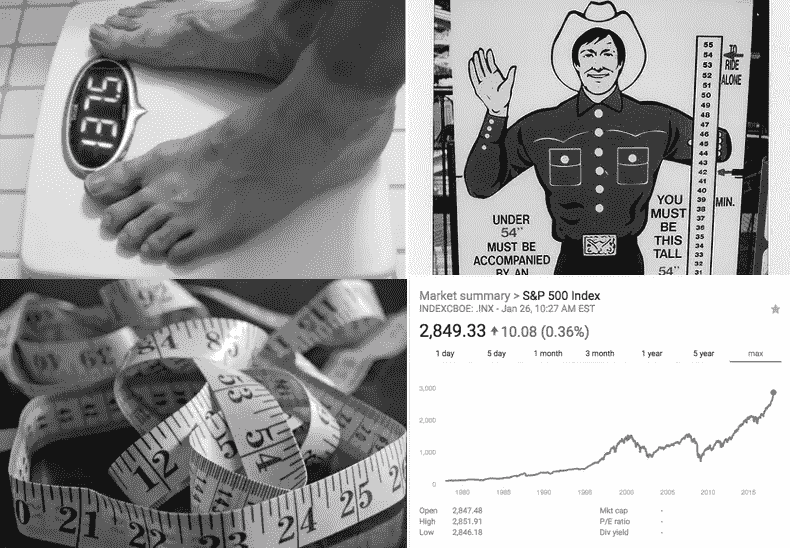
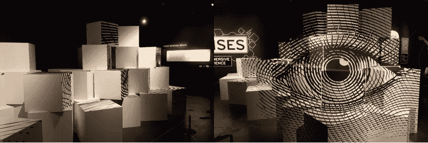
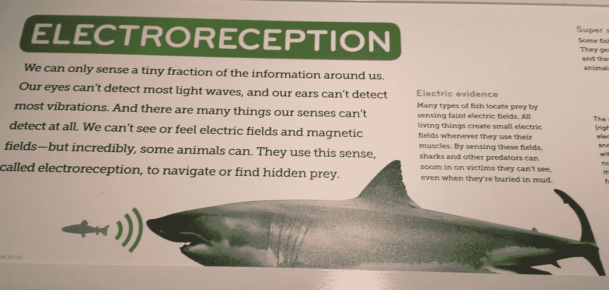

# 重要的不是衡量

> 原文：<https://towardsdatascience.com/what-matters-isnt-measured-dacf77f1a0a7?source=collection_archive---------10----------------------->

我们衡量什么很重要
重要的是我们衡量什么……或者说，重要的是*我们能够衡量的*是被衡量的。我们衡量的东西决定了什么是重要的。如果重要的东西不能被衡量，我们使用代理，然后成为重要的东西。
重要与我们衡量它的能力相关:我们做得有多好？我们达到目标了吗？我们如何达到标准？
我们怎么回事？

# 你必须这么高才能骑…

Ways we measure up. Collage images from (counterclockwise from top) [Daniel Oines](https://www.flickr.com/photos/dno1967b/), Google Finance, [Nancy L. Stockdale](https://www.flickr.com/photos/futurowoman/), and [Jaime](https://www.flickr.com/photos/jamiesrabbits/)

这些措施旨在客观地反映事实。
4 绝对大于 3。10 比 7 多。
4.0 比 3.6 好……看尺度或者范围。这不是绝对的，而是由易犯错误的人和他们的选择性感知选择的。

度量并不代表全部事实，而是其中的一部分。对真相的不完整描述。

衡量是有帮助的，但不是绝对的。尤其是在人类负责制定衡量标准的时候。只要人类参与其中，总会有一些主观因素，比如他们选择什么作为他们的标准。

我写这封信是因为我关心我们已经放弃了多少权力给那些易错的数字和衡量价值、成功和价值的标准。我担心我们遗漏了描绘不同画面的替代措施。数据科学、大数据、人工智能风靡一时，然而，我们的社会缺乏基本的数据素养——关于数据能做什么和不能做什么的关键区别——最终(并迅速)会咬我们的屁股。我写作是因为数据并不可怕，它和收集(或编写)它的人一样容易出错……但这并不意味着我们不应该使用它。

我写这篇文章是因为我希望我们在采矿时要有意识，用数据来衡量自己。

# 我们衡量的东西很重要

我感到很幸运，在我的职业生涯中发现了如此多的数据失误。我感到幸运的是，我对数字绝对优势的谬论有着发自内心的了解；跨部门，跨意图，跨国家。这是我个人最喜欢的一个例子:

几年前，我在印度帮助一个新生的非营利组织为捐赠者评估业绩。达到目标是确保业务资金持续流动的重要途径。任务很明确:帮助农民合作社组织起来，并与主要制造商谈判合同。例如，我们会教导一群种植番茄的农民提高作物的质量和产量，或者帮助他们与当地番茄酱生产商谈判供货合同，从而为农民提供稳定的收入，为生产商提供稳定的原材料。双赢！

要求我们报告的一些指标似乎很直接:接触到的农民家庭数量、举办的研讨会数量、每次研讨会的平均出席人数、有多少农民参加了多次研讨会。其他人感到虚幻:种子的平均价格，农业设备的平均价格，或者受影响社区的女性识字率。

有些措施感觉不可能准确收集。比如食物腐败率逐年下降。捐助者实际上是想知道我们是否鼓励使用冷藏车将集体的产品运送给制造商。但他们问的不是这个。他们要求一个在年度报告中和对其他基金会和捐赠者来说听起来更性感的数字。“呜！你看到今年我们糟蹋的食物少了多少了吗！”

预期结果的形成方式极大地改变了信息的收集方式。那么，我应该给那个农民一个拍纸簿和一张纸，让他数一数在去工厂的路上有多少西红柿坏了？这不是我们所提供的正确衡量标准，我认为这甚至不能很好地衡量我们所产生的有益影响。

作为一个题外话(希望是另一篇文章的主题)，非营利组织与捐助者和整个社会的这种有害关系，在这种关系中，非营利组织被认为是低效、腐败和管理不善的，这使得第三部门失去了权力，心灰意冷，并陷入了永久的匮乏对话中。使命和价值观可以吸引最优秀和最聪明的人，但这些组织很难留住他们，让许多人筋疲力尽，因为我们，社会，这些人从他们提供公共产品的努力中获得了最大的利益，如安全的街道，医疗保健和教育——坦率地说——有时像对待狗屎一样对待他们。

也许，不是作为一个题外话，是因为我们用错误的标准来衡量他们。

# 我们的感知限制了我们可以测量的范围

Before and after a shift in perspective. Part of the “[Our Senses](https://www.amnh.org/exhibitions/our-senses)” exhibit at the Natural History Museum in NYC

数字是一个方便的抽象概念——但是通过以更短的形式映射复杂性，我们错过了细微的差别。在我们无休止地追求任意“价值”的过程中，我们把自己客体化了，把我们所做的工作和我们为他人所做的贡献客体化了，我们正在走向社会、经济和生态的毁灭。很可能不是过度夸张。

但是如果我们没有用正确的标准来衡量自己和他人呢？如果我们没有更合适的测量方法，因为我们还没有找到一种方法来计算对品质的感知，如:爱、同情、宽恕、怜悯、慷慨、感激，以及无数其他我们还没有找到方法来评价或测量的价值。

“We can only sense a tiny fraction of the information around us…” What more are we missing? Part of the “[Our Senses](https://www.amnh.org/exhibitions/our-senses)” exhibit at the Natural History Museum in NYC

同样，我们已经建立了工具来帮助我们在可见光光谱之外，或者在我们的听觉范围之外感知、构想和测量，所以我们也可能不得不发现、重新想象或重新解释对我们来说重要的替代措施。

它始于接受我们认为是真理的标准并不总是看起来那样。

让你的测量变得重要。让你衡量的东西变得重要…因为它很重要，我在某种程度上