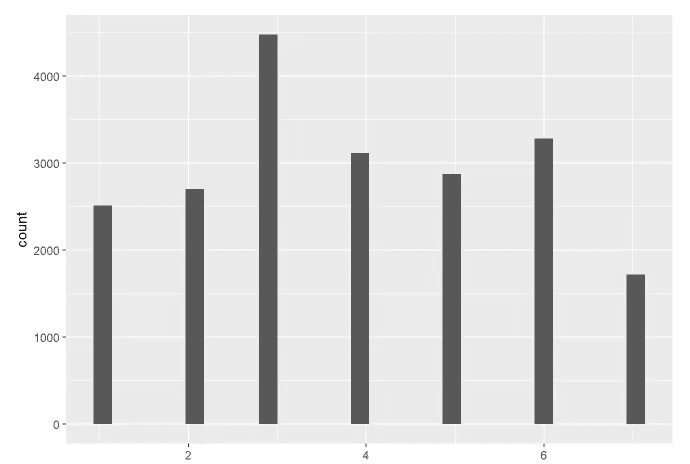
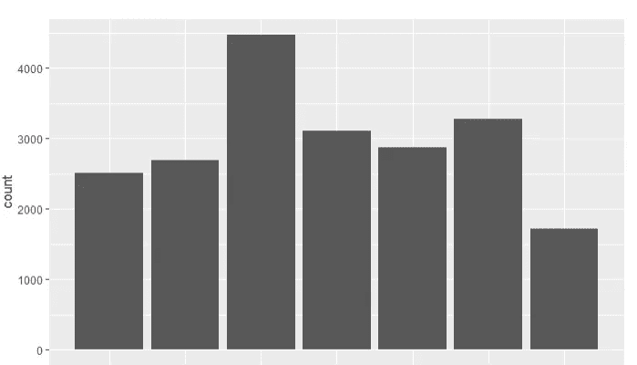
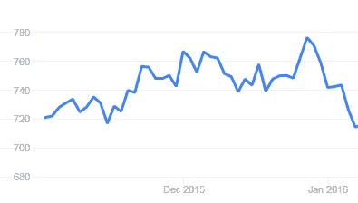
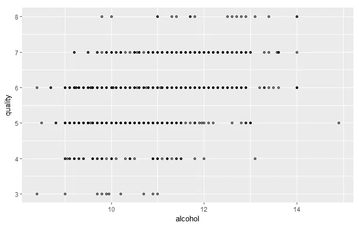
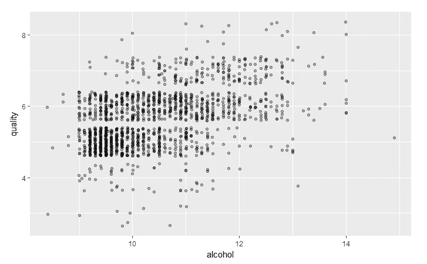
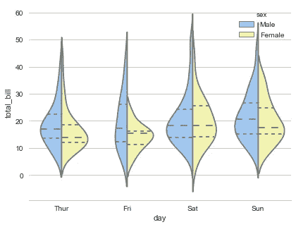

# 什么情节？为什么有这个情节，为什么没有！

> 原文：<https://towardsdatascience.com/what-plot-why-this-plot-and-why-not-9508a0cb35ea?source=collection_archive---------2----------------------->

因此，在我上一篇文章发表一年后，我来到了这里。发生了各种各样的事情，但有一件事是不变的，就是这个问题“嘿，我应该使用哪个情节？”这是我从我的学生那里收到的一个特别的问题，我在审查 Udacity 的项目时也发现了对 plot 的误用。

所以今天，我将涵盖一些常见的错误，在策划阴谋。

作为一名数据分析师/科学家，知道哪个图适合数据是非常重要的！

让我们以这个非常简单的非常著名的**葡萄酒数据集为例。**

数据集由不同的数据点组成，包括硫酸盐、残糖、密度、酒精(%)以及最后但并非最不重要的质量。质量基本上是葡萄酒消费者给出的一个等级，这最终使它成为一个有序的数据点。有序数据点的**直方图错误！**一个关键的错误是，人们试图通过改变宽度和添加颜色来适应和美化情节，但是你猜怎么着？这是不对的。这个博客是关于应该在什么时候使用哪个情节？

## 条形图与直方图

当世界为各种不同的事情而争斗的时候，学习者在处理这个特殊的问题上几乎没有问题。许多学习者试图以这样的方式调整他们的直方图，使得图形看起来很棒。但是真正的问题是直方图应该只用于连续变量。直方图的基本思想是显示连续点集的频率分布，这将有助于读者理解点的分布。你甚至可以把它作为一个图来检查异常值，偏斜度和分布。

Histogram representation of ordinal data

另一方面，条形图显示分类数据，实际上不能用于查找异常值或检查偏斜度。简单来说，您能为一组点(如苹果、香蕉和橙子)找到异常值吗？很遗憾，没有！那一套就把两者区别出来了！还在迷茫？

假设您有一个特定的表，其中给出了字符串变量的值。你不能使用直方图，它会抛出一个错误，因此你会移动到条形图。这证明至关重要的部分是**理解数据。**

下面是如何使用条形图绘制上述相同的图。

Bar plot representation of the ordinal data

正如你所见，这看起来更抛光和真棒！

那么这个故事的寓意是什么呢？**了解数据！**

## 折线图的“过度”滥用

到目前为止一切顺利！我们看到条形图和直方图实际上是不同的。现在，我们将研究折线图的过度滥用。

从更直观的意义上来说，折线图特别适用于趋势分析，它基本上被视为一个图表，用于检查从上一点开始是否有增加或减少。让我们以强大的股票市场为例，你不会期望新闻在条形图上显示公司的实时股票价格，但你会看到使用折线图来显示特定股票的趋势/表现。

更简单地说，我们可以说**折线图基本上是用来以直观的方式比较一个值相对于其他值的变化。**

折线图主要用于寻找特定时间段内的趋势，但也可用于有序数据。

Loss! But a line chart.

所以人们确实记得折线图=序数、时间序列和一点与另一点之间的比较。

## 分散点！

这可能会让一些人感到惊讶，但它比你想象的更常见。散点图的简要概述是，它在一个图中表示大多数(或设定数量)数据点。因此，基本上这是一个美丽的图，使读者能够建立变量之间的关系(如线性)，也能够看到点的分布，更重要的是看到离群值变得活跃起来。但是最近，我注意到许多学习者在有序数据上使用散点图来绘制平均值，而平均值恰好在 y 轴上。这个令人震惊的事件激发了我写这/包括这一节。

散点图可能是双变量分析的最佳方法之一。它给人一种点与点之间关系的感觉，也给人一种关于数据的视觉前景。所以请记住，如果您有任何连续的数据，请使用散点图

现在你可能想知道，有序数据呢？有序数据也可以绘制在散点图上，但更准确地说，这些点应该是抖动点，这意味着这些点应该抖动，以避免过度绘制。这是一个非常重要的方法，可以帮助读者更有效地理解，让我们通过一个例子来更深入地了解这一点。

overplotting

如果仔细观察，Y 轴变量本质上是序数，这里使用的技术基本上是点绘图。如果你注意到你实际上看不到这两点之间的任何联系或趋势，你能吗？来电:抖动！

Jitter it!

看起来好多了！但是为了让它更棒，我们需要记住几个要点。

质量作为一个序数数据，作为一个良好的做法，我建议绘制序数数据作为 x 轴变量。这可能不一定适用于所有的图，有时在 y 轴上绘制分类数据会给我更好的表示，但这种体验仅限于条形图。

箱线图怎么样？我们可以一起绘制箱线图和散点图，以便从图中推断出更多信息，下面是完整的图！

Beauty!

正如你所看到的情节是可怕的！它给我们提供了点的信息，散点图也显示了质量和酒精之间的关系。

## 盒子里小提琴美妙的旋律

小提琴的情节让任何报告都好看。让我们接受它，它们显示了从概率分布到统计数据以及异常值的一切。他们都在里面！虽然箱线图很棒，但小提琴图更棒，尤其是在数据分布是多峰的情况下(不止一个峰)。在此期间小提琴曲显示了不同的峰值和位置。

Titanic 数据集是一个很好的数据集，可以用来绘制年龄与性别，年龄与存活，甚至班级的小提琴图。这里有一个例子，

Violin plot

由此你能推断出什么？它有最小年龄，最大年龄(最小年龄是一个异常值)，平均年龄，更重要的是根据存活和不存活的年龄分布。这个图还可以进一步增强成一个多元图，上面包含性别！比如这个来自 seaborn 网站的例子！

Total bill , gender wise in terms of days!

可怕的情节不是吗？所以什么盒子情节不能小提琴情节可以。

***至此，我总结了这个常见的错误片段，接下来是过度渲染以及如何处理它！所以请留意这个地方。在那之前继续策划！***