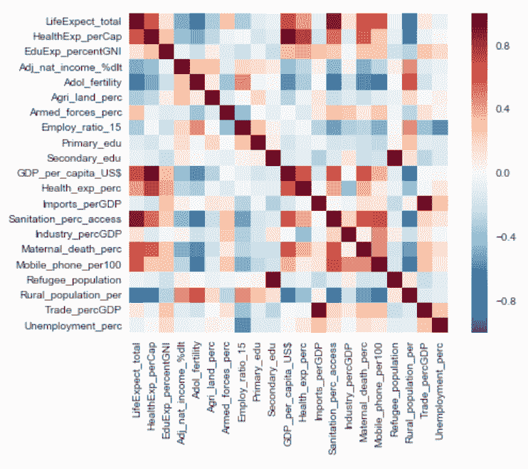
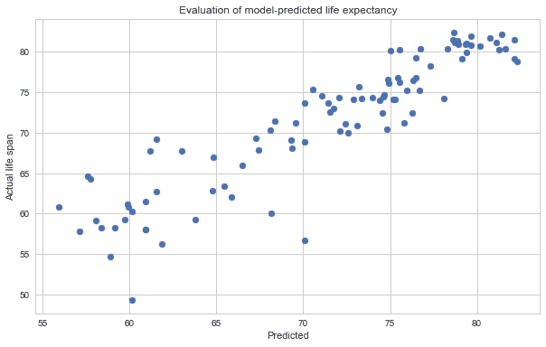

# 机器学习预测预期寿命

> 原文：<https://towardsdatascience.com/what-really-drives-higher-life-expectancy-e1c1ec22f6e1?source=collection_archive---------8----------------------->

我们正处于一个前所未有的时代，人类的寿命越来越长([尽管 2015 年& 2016 年是一个令人恐惧的上升趋势)](https://www.washingtonpost.com/national/health-science/us-life-expectancy-declines-for-the-first-time-since-1993/2016/12/07/7dcdc7b4-bc93-11e6-91ee-1adddfe36cbe_story.html?utm_term=.9b347e44271f)。然而，众所周知，全球各地的预期寿命差异很大。

作为一名生物医学工程师，我一直将长寿归因于现代科学和医疗保健的增加。为了检验这一假设并理解什么能最好地预测预期寿命，我研究了世界卫生组织 1，345 项发展指标(从 1960 年到 2015 年)的国家级数据。

我将数据缩减为指标子集，这些指标不仅与预期寿命合理相关，还代表了主要指标类别(经济政策和债务；健康；基础设施；贫困；私营部门和贸易；公共部门；社会保护和劳动)。

其中，最具统计意义的预期寿命指标是获得卫生设施的情况。仅使用卫生设施来预测预期寿命有 77%的准确性，并表明预期寿命每增加一岁，就有 0.25%的人口获得现代卫生设施。

## "向右上方"

几乎不管数据如何被切割，1960 年至 2015 年间的预期寿命趋势看起来就像初创企业宣传资料中的销售预测:向右上方。

**Life span by country income levels:** The gap between high and low income countries is closing

根据收入水平对国家进行分类，我们可以看到经济如何影响健康:在 1960 年至 2015 年期间，收入越高，预期寿命越长。高收入国家的预期寿命稳步增长，但速度较慢；中等收入国家在 20 世纪 60 年代经历了大幅增长，预期寿命也相应提高。在低收入国家，预期寿命在 80 年代中期至 90 年代中期几乎停止增长，随后是近年来预期寿命的大幅增长。区域分组(下图)揭示了 1960 年代和 1980 年代哪些地理区域推动了这些变化。

**Life expectancy by region:** Sub-saharan Africa (red, bottom) has a noticeable plateau in the mid-80s, coinciding with the HIV/AIDs epidemic.

我将 1.3 千个发展指标缩减为 21 个有代表性的子集。将这些指标与预期寿命相关联，可以快速评估相对重要性。

预期寿命与卫生设施(r = 0.88)、人均国内生产总值(r = 0.698)和人均医疗支出(r = 0.63)之间的正相关性最高。与农村地区的人口百分比(r = -0.80)和青少年生育率(r = -0.77)有很强的负相关关系。

In case you’re new to reading heat maps: A dark red square indicates a high positive correlation between the column & row header; whereas a blue square represents a negative relationship.

## 机器学习预测预期寿命

为了确定哪些指标具有统计学意义，并预测预期寿命，我运行了几个具有各种特征组合的不同模型。这个应用程序是回归的完美用例，它确定一个因变量(预期寿命)和多个自变量(发展指标)之间的关系。

**Actual vs. predicted ( model) life expectancy:** The model tends to better predict higher life expectancy, and does not preform as well for lower life expectancies (as indicated by wide-spread data in the bottom left).

使用 21 个特征的整个子集的准确率为 89.7%，并显示卫生设施和农村人口(%)都具有统计学意义。

即使只有这两个变量，这个模型预测预期寿命的准确率也有 80.4%。平均预期寿命为 63 岁，卫生设施每增加 0.18%，农村人口比例每减少 0.11%，预期寿命就增加一岁。将医疗保健支出加入到模型中只会略微提高准确性(81%)。

**探究卫生设施**:为了更深入地了解卫生设施的具体情况，我根据儿童死亡率的统计数据评估了卫生设施的使用情况。毫不奇怪，卫生条件和死亡率之间有很强的负相关性:随着卫生条件的改善，新生儿、婴儿和 5 岁以下儿童的死亡率下降。

卫生设施作为预期寿命的主要预测指标——特别是儿童死亡率——是出乎意料的，但也是合乎逻辑的。恶劣的卫生条件增加了共享威胁生命的传染病的风险。

> *据世界卫生组织***报道，腹泻病是五岁以下儿童死亡的主要原因，是由恶劣的卫生条件传播的:**
> 
> *腹泻是由大量细菌、病毒和寄生虫引起的感染症状，其中大多数是通过粪便污染的水传播的。*

*一旦社区的卫生条件得到改善，这些举措就可以解决预期寿命的其他关键指标(如教育、医疗保健、青少年生育率)。此外，由于卫生设施与儿童死亡率高度相关，首先解决卫生设施问题应该会让更多儿童受益于其他举措。*

* [## 格西/跳板 _ 数据 _ 科学

### 有关数据和源代码(Jupyter 笔记本)，请查看我的 github。

github.com](https://github.com/gussie/Springboard_data_science/tree/master/Predicting_Life_Expectancy)*