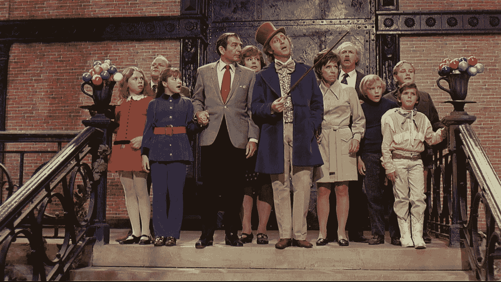
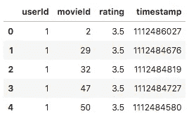
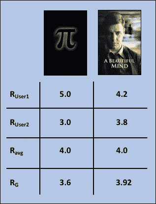
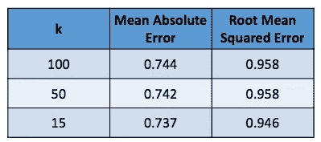

# 今晚我们应该看什么？

> 原文：<https://towardsdatascience.com/what-should-we-watch-tonight-96e6cc9323bf?source=collection_archive---------6----------------------->

## 一个或两个用户的电影推荐系统



Scene from Willy Wonka and the Chocolate Factory (Image courtesy of: [https://www.moviehousememories.com](https://www.moviehousememories.com/willy-wonka-and-the-chocolate-factory-1971-movie-synopsis/))

我一直喜欢看一部好电影。当我还是个孩子的时候，当地图书馆的图书管理员会跟我开玩笑:“本，今天我们要租什么电影？”。当然，她知道十有八九会是*威利·旺卡和巧克力工厂*(1971 年的原版)。所以，当我手里拿着我选择的东西来到收银台时，通常不会有什么惊喜。我们会有一些笑声，然后我会去廉价商店买一点糖果，然后回家把电影放进我们的 VHS 播放器。

我们喜欢的电影类型感觉像是我们非常个人化的品质。例如，我很难向你解释为什么我如此喜欢电影《T2》和《陈月娇》。是因为音乐吗？还是电影的艺术性？还是奥黛丽·塔杜？还是我对欧洲的迷恋？还是以上都有？尽管我们对电影的偏好看起来独特而不可预测，但很有可能世界上还有其他人和我们有着非常相似的品味。

这正是协同过滤推荐器背后的想法。协同过滤是一种基于找到具有相似品味的其他用户来向用户推荐电影的技术。我们可以根据我们都看过的、评分相似的电影，找到口味相似的用户。吴恩达在他的 [ML 课程](https://www.coursera.org/learn/machine-learning)中对协同过滤推荐系统做了很好的介绍。

这篇博文的目的是与您分享(1)我如何为单个用户构建一个标准的电影推荐系统，以及(2)我对向想要一起观看电影的两个用户推荐电影的问题的解决方案。我和我的另一半经常坐在电视机前浏览网飞或亚马逊的视频，试图决定一起看什么电影，似乎我们中的一方经常不得不做出妥协，以适应另一方的偏好。因此，目标 2 的目的是试图找到这个问题的解决方案，这样我们都可以对我们的电影选择感到满意。

# 数据的描述

对于我的推荐系统，我使用了[movie lens 2000 万收视率](https://grouplens.org/datasets/movielens/)数据集。该数据集由 138，000 个用户对 27，000 部不同电影的 2，000 万个评级组成。数据创建于 1995 年 1 月 9 日至 2015 年 3 月 31 日之间。因此，没有电影包含在 2015 年 3 月 31 日之后的发行数据中。收视率数据在 0.5 星到 5.0 星的范围内。这个数据集中的每个用户至少评价了 20 部不同的电影。我在这个项目中使用的两个数据文件是收视率文件和电影文件。这些被读入熊猫数据帧。下面提供了这两个数据帧的屏幕截图。


The first 5 rows of the Movies DataFrame



The first 5 rows of the Ratings DataFrame

数据的一个重要方面是收视率数据非常稀少。这是因为在 27，000 部电影中，每个用户只评价了电影的一小部分。因此，如果我们构建一个完整的矩阵，其中 138，000 行对应于用户，27，000 列对应于电影，那么我们的大部分值将是 NaN。由于这种稀疏性，我使用了 SciPy 稀疏矩阵包来处理这些数据，我将在下一节中更详细地讨论这些数据。

# 我的方法

为了构建一个协同过滤推荐系统，我使用了一类叫做低秩矩阵分解的算法。具体来说，我使用奇异值分解(SVD)将具有大量特征的评级矩阵缩减为具有较小特征子集的矩阵，这允许我们近似原始矩阵。Nick Becker 写了一篇很棒的博客文章,描述了 SVD 以及如何将它应用于构建推荐系统。因此，如果你想了解更多，我强烈建议读者看看他的帖子。

然后，我实现了以下步骤来构建基于协同过滤的推荐系统:

*   过滤掉少于 10 分的电影
*   创建了一个 movie_index 列，允许我们将 movieId 映射到一个唯一的 movie_index
*   对评级数据进行训练/测试分割
*   通过电影实现均值归一化
*   使用 SciPy 稀疏矩阵包构建稀疏矩阵，其中索引对应于 userId 和 movie_index，数据对应于平均标准化收视率数据
*   使用 SciPy svds 方法执行 SVD
*   通过计算𝐑=𝐔σ𝐕ᵀ生成预测评级矩阵𝐑，其中𝐔是用户特征矩阵，σ是对角线值是奇异值的矩阵，𝐕是电影特征矩阵
*   将电影平均值标准化组件添加回预测评级
*   对前 N 个预测收视率进行排序并打印出结果电影列表

我用训练数据做了模型调整。SVD 的一个自由参数是分量的数量 k，它对应于奇异值的数量。在使用选定的 k 值构建模型之后，我计算了测试集数据的预测评级。随后进行误差分析，根据实际评级数据计算平均绝对误差(MAE)和均方根误差(RMSE)。导致最低误差的 k 值然后被用于构建我的最终推荐系统模型。

如前所述，这个项目的最后一部分是建立一个推荐系统，可以为两个想一起看电影的用户提供推荐。根据一份非常有用的出版物(见[奥康纳*等人*](https://dl.acm.org/citation.cfm?id=1241867.1241878) )，有两种一般的方法可以做到这一点。一种方法是创建一个伪用户，代表两个用户的口味。为了实现这种方法，在执行 SVD 之前，需要合并每个用户的评级。另一种方法是为每个组成员生成单独的推荐列表，并以特别的方式合并这些列表。我选择了第二个策略来构建我的推荐系统。

合并两个列表的方法需要一些额外的思考。如果我们简单地取两个预测评级的平均值，那么我们将不考虑两个组成员之间的预测得分非常不同的电影。这在下表中的假设示例中示出:为两部电影*和*美丽心灵提供了用户 1 和用户 2 的预测评级。*在 *Pi* 的情况下，用户 1 和用户 2 之间的预测评分比*美丽心灵*的差异大得多，但平均评分是相同的。这是一个问题，因为我们推荐的电影中，一个用户可能不太喜欢这部电影，而另一个用户可能非常喜欢。因此，这种方法没有实现我最初的目标，我想最大化整个团队的幸福。这个问题的解决方案是开发我自己独特的小组评级功能，如下所述。*

**

*Table demonstrating how two different movies with very different predicted ratings for User1 and User2 resulted in the same average rating, but different group ratings*

*我的组评级功能定义如下:*

**

*其中，R₁和 R₂分别是用户 1 和用户 2 对特定电影的预测得分，Rg 是组评级。此组评分功能计算平均预测得分减去与两个个人评分之差成比例的惩罚项。惩罚项的目的是给予具有更相似预测得分的电影更大的权重。回到我们的例子，我们可以看到电影 *Pi* 导致 Rg=3.6，而 *A Beautiful Mind* 导致 Rg=3.92 的更好的总得分。因此，基于这一结果，我们会有更大的信心，认为看了*美丽心灵*之后，整个群体的幸福感会比看了 *Pi 之后更高。**

# *结果*

*模型调整的结果如下表所示。我们观察到，k=15 的值产生了最低的 MAE 和 RMSE 值。这与这里引用的参考文献的结果一致(参见[克雷莫内西*等*](https://dl.acm.org/citation.cfm?id=1468327) )。*

**

*Table displaying error analysis results as a function of the number of components k*

## *单用户结果*

*接下来，我将为单个用户演示我的电影推荐器的输出示例。在这种情况下，UserId 9 对通常可以归类为惊悚片或犯罪片的电影给予了高评级。在这种情况下，最受推荐的电影也是这些流派中评价很高的电影。因此，看起来我们的标准电影推荐器做得很好。*

```
*A subset of original ratings provided for UserId: 9
Rated 5.0 for movie What Lies Beneath (2000)
Rated 3.0 for movie General's Daughter, The (1999)
Rated 2.0 for movie Entrapment (1999)
Rated 3.0 for movie Austin Powers: The Spy Who Shagged Me (1999)
Rated 3.0 for movie Return of the Living Dead, The (1985)
Rated 3.0 for movie Psycho (1960)
Rated 3.0 for movie Stigmata (1999)
Rated 4.0 for movie American Pie (1999)
Rated 2.0 for movie Vertical Limit (2000)
Rated 1.0 for movie Traffic (2000)
Rated 2.0 for movie Deep Blue Sea (1999)
Rated 4.0 for movie Fast and the Furious, The (2001)
Rated 4.0 for movie Cast Away (2000)
Rated 2.0 for movie Scary Movie (2000)
Rated 5.0 for movie Hannibal (2001)
Rated 2.0 for movie Creepshow (1982)
Rated 2.0 for movie Urban Legends: Final Cut (2000)
Rated 5.0 for movie Fight Club (1999)
Rated 5.0 for movie Exorcist, The (1973)
Rated 4.0 for movie There's Something About Mary (1998)Top recommendations for UserId: 9
Predicting rating 5.0 for movie Shawshank Redemption, The (1994)
Predicting rating 5.0 for movie Silence of the Lambs, The (1991)
Predicting rating 4.9 for movie Pulp Fiction (1994)
Predicting rating 4.9 for movie Braveheart (1995)
Predicting rating 4.8 for movie Schindler's List (1993)
Predicting rating 4.7 for movie Usual Suspects, The (1995)
Predicting rating 4.6 for movie Seven (a.k.a. Se7en) (1995)
Predicting rating 4.6 for movie Zero Motivation (Efes beyahasei enosh) (2014)
Predicting rating 4.5 for movie Fugitive, The (1993)
Predicting rating 4.5 for movie Terminator 2: Judgment Day (1991)
Predicting rating 4.5 for movie Godfather: Part II, The (1974)
Predicting rating 4.4 for movie Saving Private Ryan (1998)
Predicting rating 4.4 for movie Dances with Wolves (1990)
Predicting rating 4.4 for movie Matrix, The (1999)
Predicting rating 4.4 for movie American Beauty (1999)
Predicting rating 4.4 for movie One Flew Over the Cuckoo's Nest (1975)
Predicting rating 4.4 for movie Goodfellas (1990)
Predicting rating 4.3 for movie Apollo 13 (1995)
Predicting rating 4.3 for movie Raiders of the Lost Ark (Indiana Jones and the Raiders of the Lost Ark) (1981)
Predicting rating 4.3 for movie American History X (1998)*
```

## *合并用户结果*

*最后，两个用户的推荐系统结果如下所示。其中一个用户对应于我自己，另一个用户对应于我的另一半(正确猜测哪个是哪个的额外加分)。组合推荐采用了前面讨论的组评级函数。我的团体推荐者的结果令人鼓舞，因为推荐给我们的许多电影都是我们实际看过并真正喜欢的。*

```
*A subset of original ratings provided for UserId: 138494
Rated 4.5 for movie Like Water for Chocolate (Como agua para chocolate) (1992)
Rated 4.0 for movie Mr. Holland's Opus (1995)
Rated 4.0 for movie Sense and Sensibility (1995)
Rated 2.0 for movie Fargo (1996)
Rated 4.0 for movie Pi (1998)
Rated 4.5 for movie Garden State (2004)
Rated 4.0 for movie What's Eating Gilbert Grape (1993)
Rated 1.0 for movie Lemony Snicket's A Series of Unfortunate Events (2004)
Rated 4.0 for movie Apollo 13 (1995)
Rated 4.5 for movie Buffalo '66 (a.k.a. Buffalo 66) (1998)
Rated 4.5 for movie Mission, The (1986)
Rated 4.5 for movie River Runs Through It, A (1992)
Rated 5.0 for movie Spanish Apartment, The (L'auberge espagnole) (2002)
Rated 5.0 for movie Willy Wonka & the Chocolate Factory (1971)
Rated 3.0 for movie Sideways (2004)
Rated 5.0 for movie Amelie (Fabuleux destin d'Amélie Poulain, Le) (2001)
Rated 4.0 for movie Bend It Like Beckham (2002)
Rated 1.0 for movie Dumb & Dumber (Dumb and Dumber) (1994)
Rated 4.0 for movie Dead Poets Society (1989)
Rated 4.0 for movie O Brother, Where Art Thou? (2000)A subset of original ratings provided for UserId: 138495
Rated 1.0 for movie Indiana Jones and the Kingdom of the Crystal Skull (2008)
Rated 4.5 for movie Mephisto (1981)
Rated 5.0 for movie Life Is Beautiful (La Vita è bella) (1997)
Rated 3.5 for movie Out of Africa (1985)
Rated 4.0 for movie Sense and Sensibility (1995)
Rated 4.5 for movie Virgin Suicides, The (1999)
Rated 1.0 for movie Dumb & Dumber (Dumb and Dumber) (1994)
Rated 4.0 for movie Three Colors: Blue (Trois couleurs: Bleu) (1993)
Rated 1.0 for movie Star Trek: Insurrection (1998)
Rated 4.5 for movie Postman, The (Postino, Il) (1994)
Rated 4.0 for movie Steel Magnolias (1989)
Rated 4.0 for movie Gattaca (1997)
Rated 2.5 for movie Dangerous Minds (1995)
Rated 3.5 for movie Seven (a.k.a. Se7en) (1995)
Rated 0.5 for movie Terminator 2: Judgment Day (1991)
Rated 2.5 for movie Driving Miss Daisy (1989)
Rated 0.5 for movie Home Alone (1990)
Rated 4.0 for movie Love Actually (2003)
Rated 4.0 for movie Leaving Las Vegas (1995)
Rated 5.0 for movie Cinema Paradiso (Nuovo cinema Paradiso) (1989)Top combinded recommendations for UserIds: 138494 and 138495
Predicting rating 4.5 for movie Zero Motivation (Efes beyahasei enosh) (2014)
Predicting rating 4.5 for movie Shawshank Redemption, The (1994)
Predicting rating 4.5 for movie Fight Club (1999)
Predicting rating 4.4 for movie Forrest Gump (1994)
Predicting rating 4.3 for movie Usual Suspects, The (1995)
Predicting rating 4.3 for movie Matrix, The (1999)
Predicting rating 4.3 for movie Schindler's List (1993)
Predicting rating 4.3 for movie American Beauty (1999)
Predicting rating 4.3 for movie Memento (2000)
Predicting rating 4.3 for movie Death on the Staircase (Soupçons) (2004)
Predicting rating 4.3 for movie City of God (Cidade de Deus) (2002)
Predicting rating 4.3 for movie Star Wars: Episode V - The Empire Strikes Back (1980)
Predicting rating 4.3 for movie Seven Samurai (Shichinin no samurai) (1954)
Predicting rating 4.3 for movie Spirited Away (Sen to Chihiro no kamikakushi) (2001)
Predicting rating 4.3 for movie Dark Knight, The (2008)
Predicting rating 4.3 for movie Princess Bride, The (1987)
Predicting rating 4.3 for movie O Auto da Compadecida (Dog's Will, A) (2000)
Predicting rating 4.3 for movie Band of Brothers (2001)
Predicting rating 4.3 for movie Rear Window (1954)
Predicting rating 4.3 for movie One Flew Over the Cuckoo's Nest (1975)*
```

# *包扎*

*在这篇博文中，我演示了(1)如何通过在 MovieLens 20M 收视率数据集上应用 SVD 来构建电影推荐器，以及(2)如何向想要一起观看电影的两个用户提供推荐。当然，有许多可能的方法来建立一个推荐系统。如果有更多的时间，我想实现一个比普通的 SVD 更高级的算法。例如，赢得网飞奖竞赛的团队开发了一种协作过滤算法，可以更好地捕捉数据中的用户和电影偏见。因此，如果某些电影的评级高于平均水平，这些电影不会完全主导推荐算法。我确实通过实现电影评级数据的平均标准化部分解释了这一事实，但网飞奖获得者采用了一种更先进的方法来解决这个问题，这种方法可能做得更好(见[耶胡达](https://www.netflixprize.com/assets/GrandPrize2009_BPC_BellKor.pdf))。*

*最后，我想感谢你阅读这篇博文。如果你想探索我为这个项目写的代码，请查看我的 Github repo。我很高兴写这篇文章，并与你分享我对机器学习的热爱，当然还有*威利·旺卡和巧克力工厂*。*