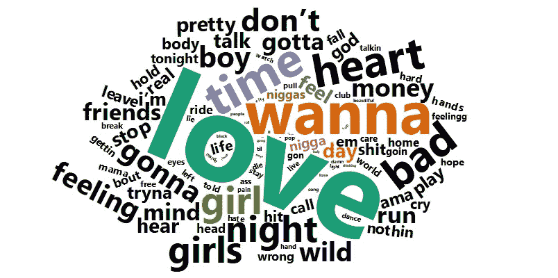
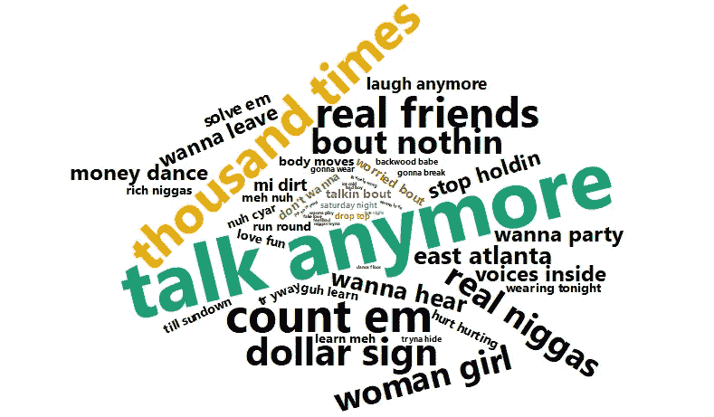
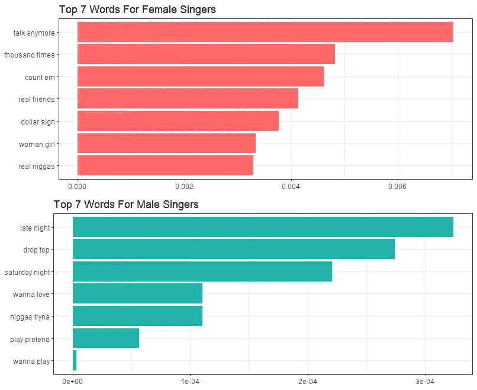
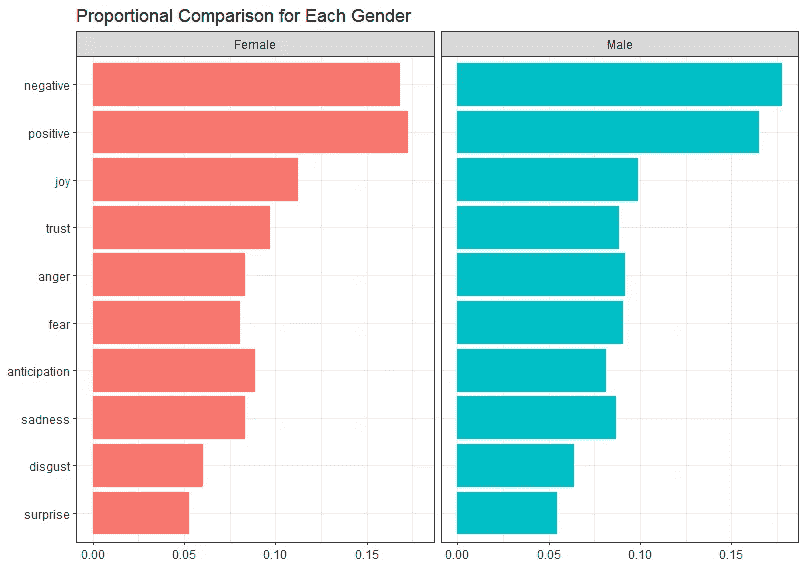
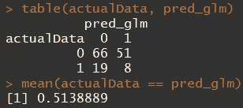
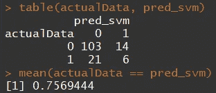
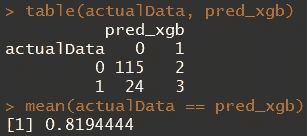
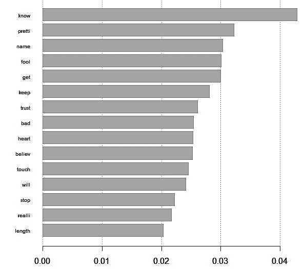

# 歌曲告诉我们什么:歌词文本挖掘

> 原文：<https://towardsdatascience.com/what-songs-tell-us-about-text-mining-with-lyrics-ca80f98b3829?source=collection_archive---------12----------------------->

*Billboard 排行榜热门歌曲文本挖掘项目。*

Bradley Cooper and Lady Gaga in *A Star Is Born.*

记得第一次遇到数据科学能做什么样的神奇。这本书名叫《T2:代词的秘密生活:我们的话语对我们的影响》，作者是詹姆斯·w·彭尼贝克。它告诉我们日常用语是如何与我们的个性、性别和社会背景联系在一起的。如果你想知道更多关于我们语言的秘密，我推荐你去读读[这本书](https://www.amazon.com/Secret-Life-Pronouns-Words-About/dp/1608194965)。或者你也可以选择观看作者的 ted 演讲。

对我来说，这是一个激动人心的故事。我们如何从不可挖掘的无声数据中发现隐藏的秘密。虽然这项研究的方法论更多的是关于统计的，但这是我第一次开始模糊地思考数据科学，并一次又一次地成为我选择 NLP 作为我的第一个数据科学项目的原因。在完成了几个文本挖掘讲座后，我计划展示我们在性别之间如何使用不同的词语。我选择研究歌词，因为它们比任何其他形式的文本数据都具有最直接的表达方式。男女歌手的歌词有区别吗？仅凭歌词就能确定哪些歌是男唱女唱的吗？

我把名单限制在 Billboard 排行榜上的前 100 名艺术家，并搜集了每个艺术家的五首歌的歌词。我选择从每个歌手那里收集五首歌曲，而不仅仅是排名靠前的歌曲，是为了增强每个歌手的倾向，这样任何特定的模式都可以更容易地被感知。从网页抓取到模型拟合和数据集的完整代码可在 [Github](https://github.com/jjone36/lyrics) 上获得。在我们开始之前，我想告诉你，在公告牌排行榜上可能会有一些冒犯性的词语。

# 这是一个自然语言处理项目

自然语言处理是人工智能中最热门和最有前途的领域之一。有大量的论文和帖子揭开了 NLP 概念的神秘面纱，所以我将在这篇帖子中讲述它最基本和最核心的直觉。当我们处理文本数据时，基本的方法是将文本分割成单个单词。例如，我们有一个句子说*‘这是一个自然语言处理项目*’。我们把这个拆分成 7 个字的 ***这个，是，一，自然，语言，处理，*** *和* ***项目*** 。下一步是将这些单词转换成一个热编码。

> 在[自然语言处理](https://en.wikipedia.org/wiki/Natural_language_processing)中，一个热点向量是一个 1 × *N* 矩阵(向量),用于将词汇表中的每个单词与词汇表中的每个其他单词区分开来。除了唯一用于识别单词的单元中的单个 1 之外，所有单元中的向量都由 0 组成。

这不直观吗？挺好的。你可以简单地想象每个单词有一个开关按钮。当' ***语言*** 按钮打开时，表示我们有一个单词 ***语言*** 。当按钮关闭时，我们没有这个词。因此，当按下如下按钮时，它在告诉' ***这是一种语言'*** 。

实际上，这是一个非常简单的例子，我们跳过了其他重要的步骤，比如降低大写字母，去掉数字、标点符号等等。这些是在标记(分割)文本数据之前进行的，您应该采取什么处理取决于您正在处理什么类型的文本以及您的项目有什么目的。都是为了对文字数据进行清理和刷机，使其更适合你的分析。如果你想更深入地研究文本挖掘和 NLP，我想推荐[这篇文章](https://blog.insightdatascience.com/how-to-solve-90-of-nlp-problems-a-step-by-step-guide-fda605278e4e)作为你的开始。它解释了 NLP 问题，从非常基础的到复杂的模型，如 Word2Vec。经过所有这些处理步骤，现在我们准备从这些数据中得出一些意义。歌词中有哪些常用词？男性和女性感兴趣的主要话题是什么？我们在歌词上有什么不同？

# 歌词中使用频率最高的词是什么？

第一步，我查找歌词中常见的常用词。加上词频(可以理解为一个词键在整个歌单中被按了多少次)，我们可以看到这些词，如***【爱、想、女孩、感觉、心、钱、时间、*** *和* ***【天*** 。没什么好惊讶的，因为这些词就像我们的日常用语一样。

我们来比较一下性别之间的话。我计算了一组中每个单词的比例频率，然后得出两组的差异。所以下图显示了差距最大的前 10 个单词。与男歌手相比，女歌手在歌词中使用类似 ***女孩、kitty、感觉和滚动*** 的词语。在男性歌曲中， ***nigga、生活、家、*** *和* ***gang*** 等词汇相对于女性来说是相当独特的。

# 那两个病房呢，不只是一个字？

我不仅查找了单字母词，还查找了双字母词，因为当单词与其他邻居出现时，它们的意思通常完全不同。像下面你能看到的，bigram 词云中显示的词与 unigram 情节完全不同的词，像 ***千次，真正的朋友，想离开*，*想聚会*，*内心的声音*** ，和 ***想听到*** *出现很多*。

起初，我想出了查理·普斯的歌曲，“我们不再说话了”，由词 ***说话了*** 和 ***笑了*** 。然而，它实际上是来自女性的歌曲。当我们比较二元词时， ***不再说话了*** 是最具性别特征的‘女性词’。

有趣的是，女孩谈论 ***谈话，女孩，女人，朋友*** 很多，而男孩似乎渴望 ***周六晚上，玩耍和爱情*** 。

# 我们在性别之间有不同程度的情感吗？

现在让我们更深入地进行感性分析。通过 NRC 词典中的 10 种不同情绪，我得到了每种情绪在不同性别中的比例。两组之间的情绪分布具有相似的模式。但是男歌手的歌词倾向于负面多于正面，而女歌手的歌词倾向于正面多于负面。

我还通过 afinn lexicon 得到了情感分数，分数的分布如下。男歌手的情感水平范围更广，平均得分更低。当我们过滤掉-300 以下的极端异常值时，女性和男性歌手的直方图具有某种程度上相似的分布。

# 我们能预测歌词的“性别”吗？

好了，现在是最激动人心的部分了！我适合能告诉我们歌词“性别”的模型。在拟合模型之前，我做了额外的特征变量，分别是我们提前得到的情感评分，每句歌词的长度，每句歌词的字数。从基本的逻辑模型开始，我建立了支持向量机和 Xgboost 模型。

就像你在上面看到的那样，当我尝试更复杂的模型时，精确度提高了，最终的结果相当令人满意。我将“性别”转换成一个整数变量，0 代表男性，1 代表女性，因为我们的机器算法只能处理数值。我使用的度量标准是非常基本和简单的，但却是检查模型性能的快速方法。

最后一个图是 xgboost 模型的方差重要性。它告诉我们哪些词在分类中起着至关重要的作用。`length`是我添加的变量，作为每首歌词的长度。由于大多数说唱歌手是男性，男歌手的歌词长度可能会更长，因此成为一个重要的指标。

# 结论

我们可以得出这样的结论:性别之间的用词有明显的趋势，歌词也是如此。因为我们一直在唱我们所想的，我们想要的和我们梦想的，它们告诉我们社会想要听到的。因此，歌词文本挖掘对于了解我们自己是一个有趣的话题。这种分析可以应用于针对不同目标客户的营销口号或文案。或者我们可以进一步发展其他类型的作品，如小说、散文、新闻文章等等。

感谢您的阅读，希望您对这篇文章感兴趣。如果你想鼓励一个有抱负的数据科学家，请给一个或两个或三个掌声！我们非常感谢您的任何反馈，所以请在下面分享您的想法，或者通过 [LinkedIn](https://www.linkedin.com/in/jiwon-jeong/) 联系我。我会带着另一个有趣的故事回来，所以直到那时，快乐的机器学习！！