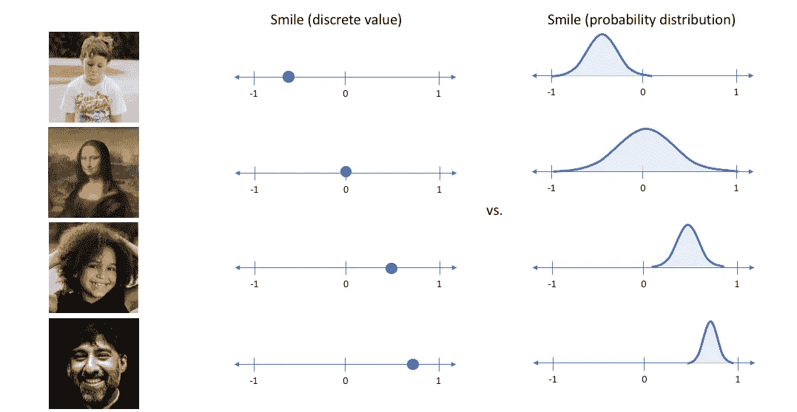
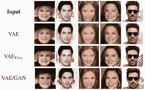

# VAE 根是什么鬼东西？

> 原文：<https://towardsdatascience.com/what-the-heck-are-vae-gans-17b86023588a?source=collection_archive---------3----------------------->

是的，你没看错标题。虽然我的几个朋友是纯素食者，但他们中没有一个人知道任何关于 VAE-甘的事情。VAE-甘代表可变自动编码器-生成对抗网络(这是一个很好的名字。)在我们开始之前，我必须承认我不是这方面的专家(我没有电气工程博士学位，只是说说而已)。但在阅读了几篇研究论文和伊恩·古德菲勒长达 30 分钟的甘斯简介后，我有一个简短(但简洁)的总结:

Image reconstructed by VAE and VAE-GAN compared to their original input images

**变分自动编码器(VAEs)**

解释可变自动编码器的最简单方式是通过图表。或者，你可以阅读 [Irhum Shafkat](https://medium.com/u/cb2327c63f48?source=post_page-----17b86023588a--------------------------------) 关于[的优秀文章，直观地理解变型自动编码器](/intuitively-understanding-variational-autoencoders-1bfe67eb5daf)。在这一点上，我假设你对无监督学习和生成模型有一个大致的概念。教科书上对 VAE 的定义是，它“提供了对潜在空间中观察结果的概率描述”简单地说，这意味着 vae 将潜在属性存储为概率分布。

“[Variational autoencoders](https://www.jeremyjordan.me/variational-autoencoders/)”- Jeremy Jordan

每个输入图像都具有通常可以描述为单个离散值的特征。变分自动编码器将这些值描述为概率分布。然后，解码器可以从输入向量的概率分布中随机采样。让我猜猜，你可能想知道什么是解码器，对不对？让我们后退一步，看看 VAE 的总体建筑。

变型自动编码器的典型设置无非是一个巧妙设计的深度神经网络，它由一对网络组成:编码器和解码器。**编码器**可以更好地描述为变分推理网络，它负责将输入 *x* 映射到后验分布 *q θ (z∣x)* 。可能性 *p(x∣z)* 然后由**解码器**参数化，这是一个生成网络，它将潜在变量 *z* 和参数作为输入，并将它们投影到数据分布 *p ϕ (x∣z).*

VAEs 的一个主要缺点是它们产生的输出模糊。正如 Dosovitskiy & Brox 所建议的，VAE 模型倾向于产生不现实的、模糊的样本。这与如何在 VAEs 中恢复数据分布和计算损失函数有关，我们将在下面进一步讨论。赵等人的一篇 2017 [论文](https://arxiv.org/pdf/1702.08658.pdf)。艾尔。建议修改 VAEs，不使用变分贝叶斯方法来提高输出质量。

**生成敌对网络**

字典对*对抗性*的定义是*涉及冲突或对立*或以此为特点。在我看来，这是对 GANs 的一个非常准确的描述。就像 VAEs 一样，GANs 属于一类用于无监督机器学习的生成算法。典型的 GANs 由两个神经网络组成，一个**生成型**神经网络和一个**鉴别型**神经网络。生成神经网络负责将噪声作为输入并生成样本。然后要求判别神经网络评估和区分来自训练数据的生成样本。与 VAEs 非常相似，生成网络将潜在变量和参数映射到数据分布。

生成器的主要目标是生成越来越“愚弄”判别神经网络的数据，即增加其错误率。这可以通过重复生成看起来来自训练数据分布的样本来完成。一个简单的形象化方法是警察和网络罪犯之间的“竞争”。网络罪犯(生成者)试图创建类似普通公民的在线身份，而警察(鉴别者)则试图区分假的和真的个人资料。

**变分自动编码器生成对抗网络(VAE-甘斯)**

好吧。既然我们已经介绍了 VAEs 和 gan，是时候讨论什么是 VAE-gan 了。术语 VAE-甘首先在 A. Larsen 等人的论文“ [*使用学习的相似性度量对像素之外的内容进行自动编码*](https://arxiv.org/abs/1512.09300)*”*中引入。艾尔。作者认为，变分自动编码器和生成对抗网络的结合优于传统的 VAEs。

VAE-GAN architecture, the discriminator from GAN takes input from VAE’s decoder

还记得 gan 被细分为发生器和鉴别器网络吗？作者建议可以使用 GAN 鉴别器代替 VAE 解码器来学习损失函数。这种修改背后的动机如上所述，vae 在重建阶段往往会产生模糊的输出。这种“模糊”在某种程度上与 VAE 损失函数的计算方式有关。我不会深入这个新的损失函数是如何计算的，但是你需要知道的就是这个方程组

[Learned Losses in VAE-GAN](https://pravn.wordpress.com/category/vae-gan-vaegan/)

现在有很多的 *L* 但是玩笑归玩笑，上面的等式假设鉴频器的第*L*层具有以高斯方式不同的输出。结果，计算第 1 层*和第 5 层*输出之间的均方误差(MSE)就给出了 VAE 损失函数。GAN 的最终输出*D(x)*可用于计算其自身的损失函数。

脸书等顶级科技公司现在将生成模型加入了人工智能研究的清单。杰出的计算机科学家和人工智能梦想家 Yann Lecun 曾经说过*“在我看来，这(生成对抗网络)和现在提出的变体是过去 10 年中最有趣的想法。”*

除了 VAE GANs，许多其他的 GANs 变体已经被研究和实现。DCGANs，或深度卷积生成对抗网络，是在 Ian Goodfellow 介绍最初的 GANs 后不久引入的。我很高兴看到生成模型在未来的人工智能应用中找到它的角色，并潜在地改善我们的生活质量。

感谢您阅读我的文章。