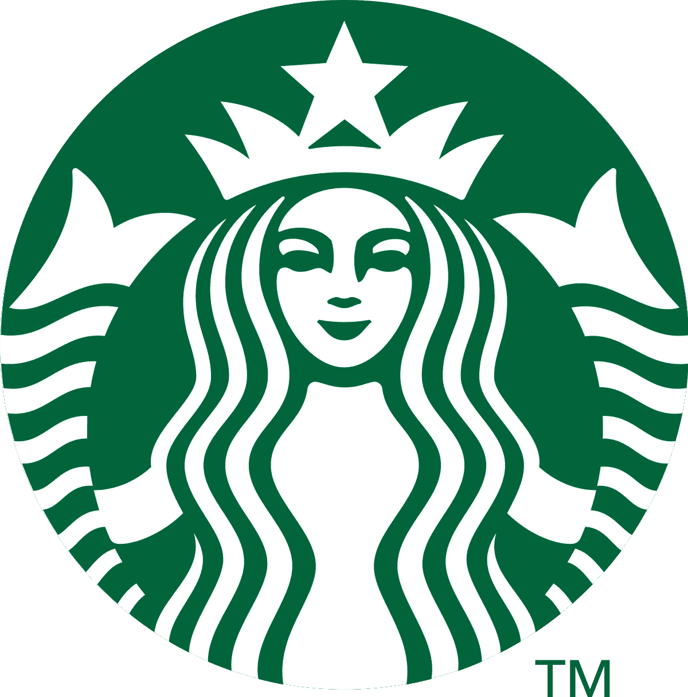
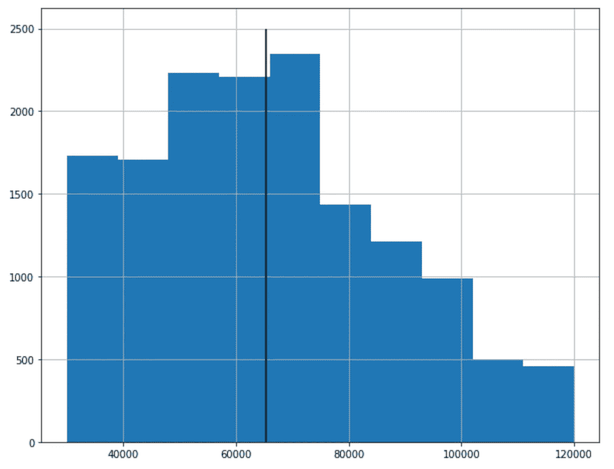
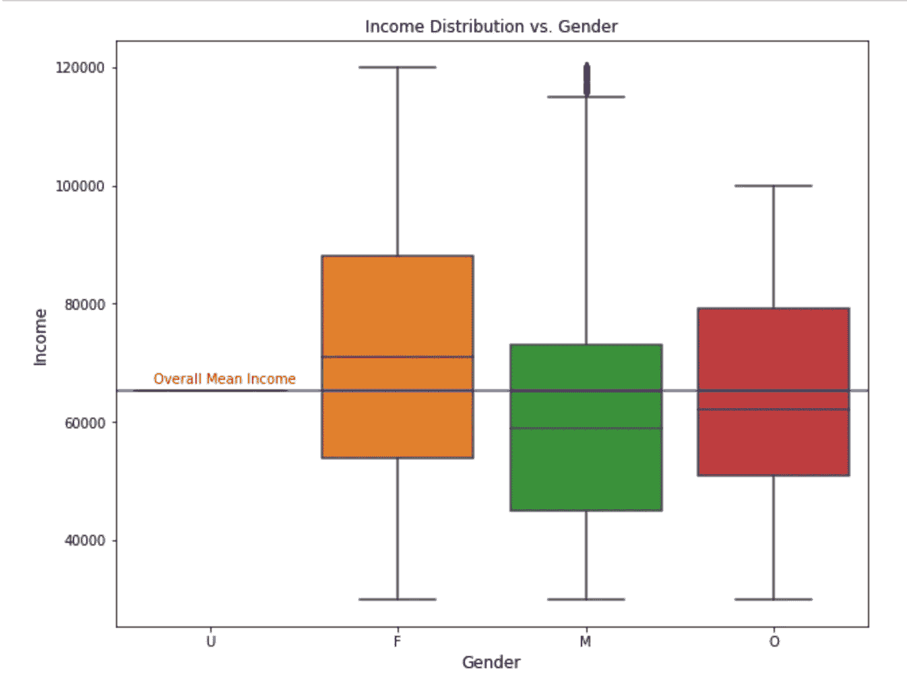
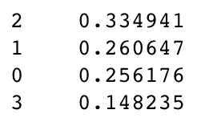
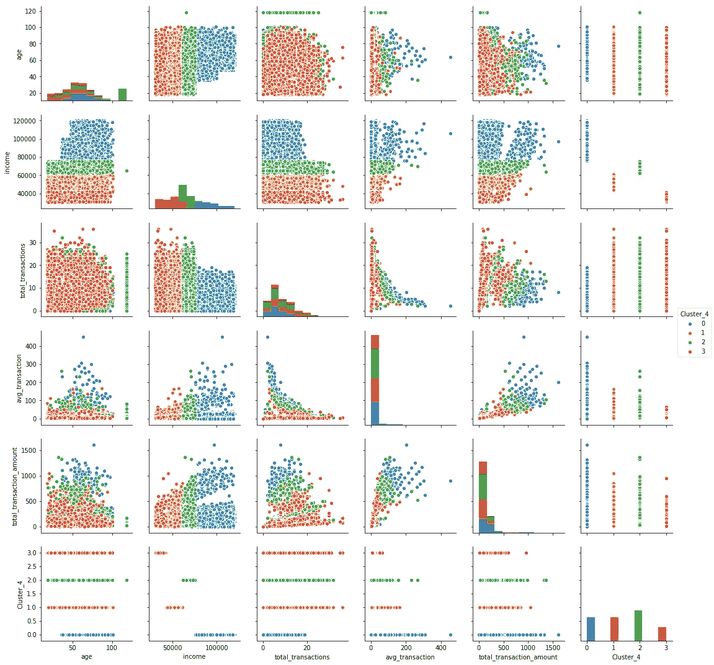
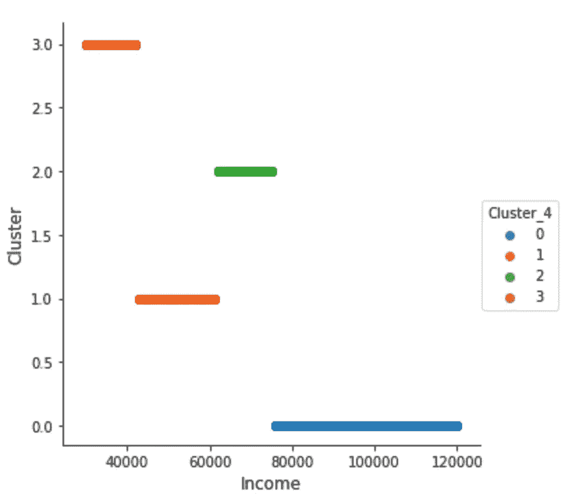
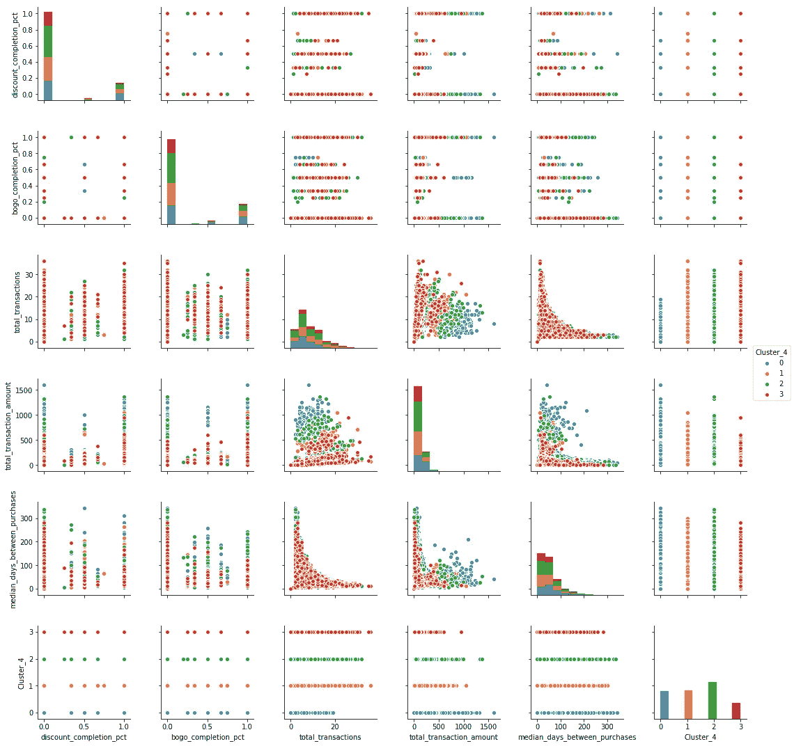
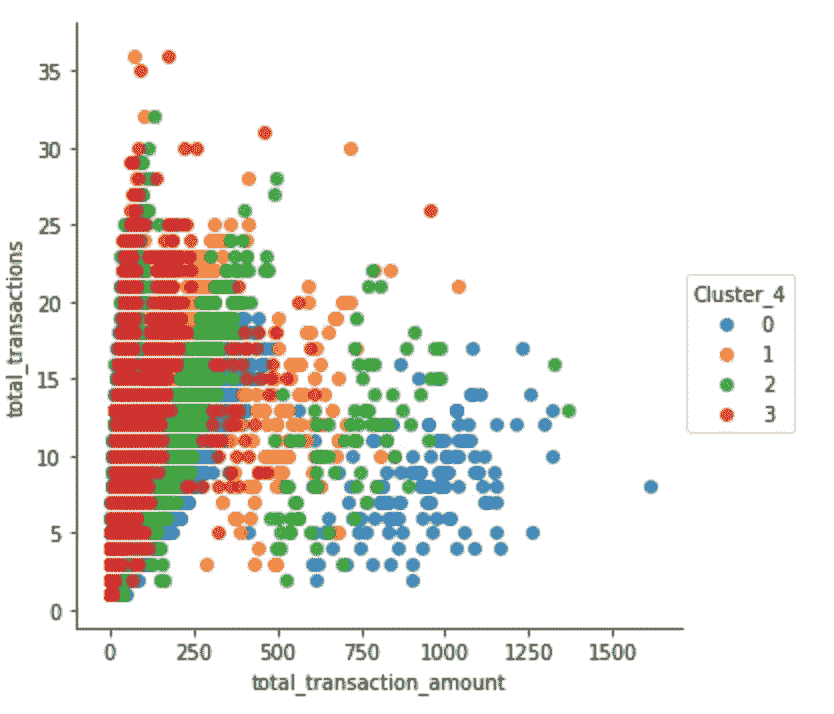
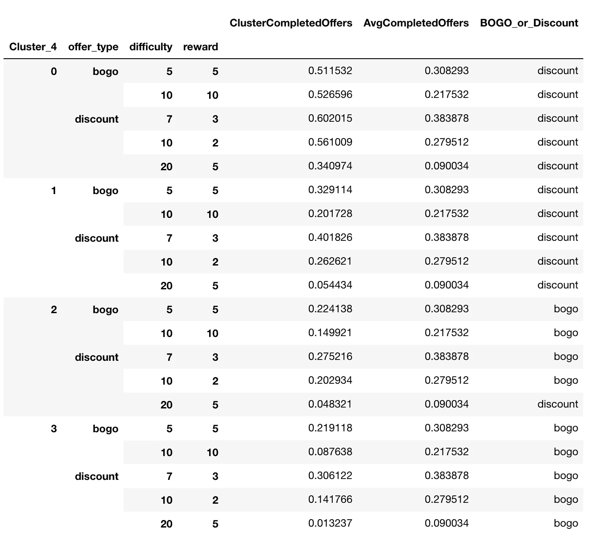

# 你是哪种类型的星巴克顾客？

> 原文：<https://towardsdatascience.com/what-type-of-starbucks-customer-are-you-72f70e45f65?source=collection_archive---------8----------------------->

聚类分析显示星巴克顾客分为 4 个不同的类别。

每个人都有偏好。有些人认为没有什么可以打败墨西哥菜，而其他人则在不断寻找下一个最好的意大利餐厅。你有你最喜欢的汉堡店。你有你最喜欢的冰淇淋店。大多数关于人们喜欢什么和不喜欢什么的偏好会随着你在和谁说话而改变…除非你在谈论咖啡。在世界上所有的咖啡品牌中，几乎每个人都同意星巴克是你永远不会拒绝的地方。你可能不会再去麦当劳买汉堡了，但是你最好相信你会在一周的任何一天在离你最近的星巴克排队买你的浓缩咖啡。

我试着不舒服地坐在我的运动世界里，当我偶然发现星巴克关于他们的顾客、交易和他们收到的促销交易的数据时，我开始感兴趣。促销数据是有趣的，因为人们对他们将做什么来获得折扣购买有非常具体的感觉。对于任何公司来说，它们都非常重要，有助于让客户尝试你的产品，并留住客户。我最喜欢吃的地方是 Chipotle，不管路上有什么障碍，我都会每周至少去 3 次。我参加了他们的买一送一(BOGO)交易，当他们提供薯条和番石榴时，我会去打折餐，如果他们不这样做，我仍然会每天都去。面条和公司是我喜欢的另一个食物链，但我不会特意去那里吃饭；然而，如果他们给我一份 BOGO 的合同，你会看到我站在队伍的最前面。

两家不同的餐厅，对我购买的东西有两种不同的感觉。那么星巴克有哪些不同类型的顾客呢？人们会对不同的折扣促销做出反应吗？如果星巴克对顾客进行适当的分类，他们能在促销上赚更多的钱吗？我对星巴克顾客的分析将回答什么类型的人在他们的商店购物，什么样的促销优惠最适合他们所属的群体。

*一如既往，你可以在 https://github.com/anchorP34/Starbucks-Customer-Clusters*看到我的代码。*请对你想了解更多的话题或我没有探究的想法留下任何评论或问题。*

# 数据清理

Starbucks 数据集分为三个不同的文件: **profile** ，它包含关于客户的低级信息；**portfolio**，它包含关于可以收到的不同促销优惠的信息；以及**抄本**，它包含所有购买历史和关于客户何时收到、查看和完成促销优惠的信息。

Raw profile data

Raw portfolio data

Raw transcript data

**PROFILE** :为了清理 PROFILE 数据，我需要弄清楚如何处理性别和收入为空的数据，并将 begin _ member _ on 字段改为一个实际的日期，而不仅仅是一个字符串。看看缺失的性别，这些记录也是零收入的原因。我决定将未知的缺失性别的值设为“U ”,而不是删除这些记录(它们占数据的 15%)。为了找出合适的收入选择，我研究了整个人口的收入分布:

This needs to be cleaned up a little nicer

黑线显示的是分布的平均值，这看起来是一个不错的选择，因为它不会向我们的收入分布倾斜太多。在创建了 member_date 字段(该字段派生自 became _ member _ on 字段)之后，我还将该日期拆分为 member_year、member_month 和 member_day，以查看这是否有助于提供更多信息。下面是最终输出的样子:

Cleaned profile information

**PORTFOLIO** :每个促销活动都有一个数组，显示了某人接受促销活动的不同方式。将它转换成位标志是一个很好的做法。

Cleaned portfolio information

**抄本**:抄本数据帧中的值列是一个字典，有一个键和值与之相关联。不同的键值是优惠 id 和金额。要约 id 与要约的接收、查看和完成相关联，而金额只是交易金额。我更改了 value 字段以显示促销 id 或交易金额的值，value_type 字段随后成为字典的键。

Cleaned transcript information

# 探索性分析

查看客户数据的第一件事是了解哪些类型的人构成了客户群，而不必太深入。星巴克的顾客大约 50%是男性，35%是女性，其余的是其他人或不认识的人。

M — Male, F — Female, U — Unknown, O — Other

从收入分布来看，女性的收入分布更广，也比男性和其他性别的收入更高。由于我们将所有未知的性别记录替换为整个人口的平均收入，因此没有分布可供分析。

Females are holding up the weight for income distribution and are causing the overall mean income to be higher than both the mean male income and mean other income.

另一个有趣的信息是顾客成为星巴克会员的趋势。看看过去几年注册用户的数量，用户数量有两次大的跃升。我更想知道为什么这些日期如此相关，无论是应用程序升级还是全球推广(下载应用程序，我们会给你一个免费的咖啡杯，等等)。

Number of daily customer sign ups over time

为了让事情更清楚，我改变了图表，以年为线颜色显示每月的客户注册量。我用星号标出了我们在上图中看到的两次主要跳跃，它们看起来像是在完全相同的时间起飞的。那一定是由于营销部门做了些什么。星巴克今年的月订阅量也呈下降趋势，几乎抹去了他们从去年客户注册量激增中取得的任何进展。

Customer subscriptions per month with year being the color code

顾客在注册成为星巴克会员时似乎有相似的模式，并且基于他们的性别输入有不同的收入分配，但这仍然不能很好地代表他们是哪种类型的买家以及他们与其他买家有什么共同特征。为此，我们需要深入了解他们的购买历史，以及他们对不同促销活动的反应。

# 交易和促销分析

通过查看事务性数据，很容易看出一个人何时收到促销、何时查看促销以及何时完成促销。这个例子是一个随机的人在那天查看一个折扣优惠。折扣是消费 10 美元，获得 2 美元的信用。您可以看到，对于所有不同的值，时间都是 0，这意味着他们在收到报价的同一天采取了行动。从这一部分，我们可以尝试得出以下信息:

**1。他们收到了多少次促销(BOGO、折扣、信息)
2。每种促销类型的完成百分比是多少(BOGO 和折扣，每种信息促销都在发布当天完成)
3 .自从成为星巴克会员以来，他们总共交易了多少次。花费的平均交易金额是多少
5。每位顾客的平均购物间隔天数和中位数是多少
6。完成一个报价平均需要多少天**

Random customer receiving, viewing, and completing a promotional offer.

当试图查看人们完成促销优惠的成功率时，我必须将交易数据框架连接到它本身，在 value_type 表示“优惠 id”的地方连接到 person 和 value。我们还需要确保要约在收到时间之后或当天完成，并且符合要约持续时间的窗口。这可能很棘手，因为一个客户可能不止一次收到相同的促销活动(我很难发现这一点，回去弄清楚这一点简直是一场噩梦)。这也引发了其他问题，因为有些情况下，人们在促销截止日期之后才完成报价。一个例子:

This promotion was offered to these people at day 576 to them, and both people completed the offer 18 days later. This doesn’t make sense because the duration was only for 5 days? So maybe I am misunderstanding what duration means, or duration doesn’t really matter. I ended up ignoring the duration column.

从这里，我们可以汇总数据，在较高的层次上查看不同的促销活动、它们的成功率、它们对消费者的净回报以及对星巴克的净值。从整体来看，难度越高(你要花的钱越多)，人们完成报价的可能性就越小。尽管 5 美元买 5 美元的 BOGO 和 10 美元买 10 美元的 BOGO 对消费者来说有着相同的净回报，但人们更倾向于买 5 美元买 5 美元，可能是因为方便。最成功的优惠是 7 美元优惠 3 美元，这实际上最终让星巴克赚了钱。我们还看到，20 美元的 5 美元折扣完全是浪费时间，只完成了 10%的时间。就完成报价所需的平均时间而言，人们更有可能比任何其他报价更快地获得 5 美元兑 5 美元的 BOGO，而 5 美元兑 20 美元的折扣促销需要最长的时间来完成，这可能是因为需要花费的金额更大。

Completed Offers is the success percentage of that offer being completed, Total Completions is the number of times that promotion was completed, Avg Days To Complete is the average days it takes for that promotion to be completed, Net Reward is the reward minus the difficulty, and Net Worth is the Net Reward * Completed offers. This shows how much money Starbucks makes on that promotion.

净资产应该是星巴克最重要的部分。对于 BOGO，星巴克并没有从这项交易中赚到任何钱。他们只是咬紧牙关让人们得到他们的奖励，然后希望在未来花更多的钱。因此，对于 BOGO 的这两笔交易来说，无论何时他们发出促销信息，净值都将永远是 0 美元；另一方面，折扣确实给了星巴克一些货币价值。折扣交易的净值是可以从折扣中获得的总价值乘以促销完成的机会百分比。20 美元买 5 美元的促销活动可能会让星巴克多赚 15 美元，但如果只有 10%的人完成了促销活动，他们应该只能得到 1.35 美元*实际收到促销活动的人数。因此，就净值而言，10 美元买 2 美元的折扣是给客户的最佳促销。

折扣和 BOGO 促销的结构应该以对星巴克来说财务上明智的方式推进。折扣促销应该给予那些经常回来的顾客，他们不需要很高的奖励就能回来。如果他们无论如何都会回来，给他们一杯 BOGO 没有意义，因为你在这笔交易中没有赚钱，但如果你给他们折扣，你会赚更多的钱，这对星巴克和顾客来说是双赢的。不能保证会持续回来的人应该获得 BOGO 氏症，以重新激发他们的兴趣，让他们更有可能在他们的商店花更多的钱。下一步是根据顾客的购买习惯将他们分成更合适的群体，并对谁得到什么样的促销活动做出更好的决定。

# 聚类段

由于没有正确的“答案”，使用机器学习和聚类算法是数据科学家遇到的更有趣的分析之一。预测股票价格或预测欺诈性银行交易可以查看历史是/否答案，但聚类没有与之关联的标签。它只是显示哪些值彼此最相似，并将它们分组在一起。

从技术上讲，您可以选择任意数量的集群来表示您的数据，但是评估您的集群是否在高水平运行的一种方法是运行**肘方法**。在肘方法中，我们寻找从每个点到其附属质心的误差平方和(SSE)的显著下降。由于 K(聚类数)的每一次增加都将创建更多具有更少点数的聚类，因此 SSE 和 K 的增加将呈现总体下降的趋势。由于较低数量的聚类更容易破译和分析，我们希望 K 是 SSE 开始变平之前的最后一个显著下降，因此，在图中寻找“肘部”。

Elbow method chart looking at the number of clusters that should be analyzed.

从图表中可以看出，4 个集群是对数据进行分析的合适的集群数量。这与我们的问题非常吻合，因为这 4 个集群可以分成这些类型的客户:
1。不会对任何促销活动做出反应
2。将有利于 BOGO 的过度折扣
3。相比 BOGO 的
4，更喜欢折扣。将响应 BOGO 的身体和折扣

输入数据将基于包括以下特征的客户矩阵:

> discount_total_offers，discount_completion_pct，
> discount _ min _ completion _ days，discount_max_completion_days，discount_completed_offers，
> discount _ avg _ completion _ days，discount_avg_net_reward，
> bogo_total_offers，bogo_completion_pct，bogo_completed_offers，bogo_min_completion_days，
> bogo _ max _ avg _ completion _ days，
> bogo_avg_net_reward

这是个人属性(年龄、性别、收入)、BOGO 和折扣属性(完成百分比、平均净回报、完成的平均天数、完成所用的最快时间、完成所用的最长时间)、信息促销(他们收到了多少)、以及整体交易趋势(完成的交易数量、总花费、交易之间的平均和中间天数)的组合。如果有任何值为空，它们将被替换为 0，因为客户没有参与该特定的兴趣领域(从未进行过交易，从未完成过促销活动，等等)。我还必须将性别字段从分类变量转换为 4 个虚拟变量，因为聚类算法只接受数值。

由于没有正确或错误的答案，也没有之前和之后的值，因此没有聚类的测试和训练集。一旦聚类被附加到客户矩阵中，我希望可视化不同的分布图，以帮助识别哪些类型的客户被聚集在一起。

集群 2 拥有最大的群体规模，占总人口的 33%(17，000 个客户，总计约 5，694 个客户)，而集群 3 是最小的部分，约占 15%。我对集群 3 最感兴趣，因为与其他集群相比，这似乎是一个非常小的利基市场。

我首先从查看与宣传成功价值无关的信息开始，以了解什么类型的人适合这些群体。我寻找那些看起来色彩分割得很好、几乎没有重叠的地块。

Seaborn pair plot that cross analyzes different distributions and color codes them based on the associated cluster.

看上面不同的情节，最细分的情节似乎是任何与收入有关的情节。看起来第 3 类是低收入人群，而第 0 类是高收入人群。这就解释了为什么第 3 组是所有组中最小的一组，因为大多数星巴克收入较低的四分位数正好在 45K 美元左右，但这个组的收入最高也就这个数。

Income distributions separated out by Cluster

现在来看事务性数据，要分离出集群要困难得多，但我们仍然可以带走一些信息。如果我们看一下 BOGO 和折扣的完成百分比，看起来集群 3 似乎到处都有这两种促销活动，但集群 0 似乎在这两种促销活动中的成功率都在 0.5 以上。

Seaborn pair plots on transactional information

从总交易量与总交易量来看，看起来第 0 类人群在每笔交易中花费更多，并且不经常去，而第 3 类人群则相反。集群 1 和集群 2 都在中间，这是有道理的，它们并不真正倾向于一个方向或另一个方向，因为它们构成了人口的大多数。

Total transactions vs total transaction amount shows how many times customers make transactions and how much they spend total.

> 但那又怎样…

这些都是关于这些集群的相似点和不同点的有趣事实，但是星巴克如何比仅仅在一年中盲目地给人们不同的促销活动赚更多的钱呢？

我们可以通过促销活动的**预期回报**来确定我们的聚类算法是否有助于客户细分。预期回报考虑了星巴克从折扣中可能获得的总价值乘以事件发生的概率(在这种情况下，有人完成了他们的促销交易)。我们希望评估与我们的集群相比，整体人口的净值，以确定我们的集群是否更适合某种类型的推广。

如果我们将每个集群在每项奖励上的表现与总体平均水平进行比较，这有助于利用我们应该关注的促销活动。请记住，BOGO 应该让顾客回到星巴克，折扣应该集中在那些持续光顾的顾客身上，以保留他们购买的一些东西。如果我们看一下集群 0，他们以 34%的成功率回应了 20 美元买 5 美元的促销交易！整个人群的成功率只有 9%，那么你为什么要给他们一份 BOGO 的合同呢？当你给每一个客户这笔交易时，你可以从他们身上赚到 5.10 美元，相比之下，你给所有人的平均收益是 1.35 美元。集群 2 和集群 3 对折扣促销的反应不如集群 1 和集群 2，所以给他们 BOGO 促销来重新吸引他们在星巴克“免费”购物，而不是通过给他们打折来吸引他们，这将是更聪明的做法。

Breakdown of how each cluster responded to each of the promotional deals. The BOGO_or_Discount field is based off a function that looks at the cluster completion percentage and the overall population completion percentage, and if the cluster value is greater than the overall population completion percentage (with a 5% buffer), then you should offer them a discount deal. If not, you should offer them a BOGO deal to get them reengaged.

通过将集群 0 和 1 作为“折扣促销集群”，您将获得更高的折扣预期回报，这将有助于弥补集群 2 和 3 的 BOGO 交易。你留住了每天都会回来的顾客，不管他们会喜欢什么样的小奖励，而你则专注于让第 1 和第 2 类顾客进门并享受你的产品。星巴克通过促销让顾客更开心，同时他们也在这个过程中保留了更多的钱。

# 反思与总结

这是公司必须处理的一个经典问题，我认为 4 个集群是解决这个问题的最佳方法。在我要处理的不同数据集当中，我希望为我们的流程保留尽可能多的未被触及的信息。这就产生了问题，因为有些人的上市年龄是 118 岁，或者有些人在交易到期后才完成报价。这些都是我希望能更清楚地了解的事情，以便获得更清晰的数据和更好的结果。

对于这个项目来说，一些可能对我更有利的改进是使用更好的工具，比如 SQL 数据库来运行我的一些分析。如果我使用 SQL 一次性计算出人们交易的滚动差异，而不是单独计算，那么客户端矩阵会运行得更快。因为我在 python 中没有这种能力，所以单独运行这部分分析大约需要 15 分钟。所以如果我搞砸了，就要再花 15 分钟才能看到结果。我也希望我能有更多的事实信息来处理，比如购买了什么特定的产品，或者这些顾客的大致居住地点。人的居住面积影响消费习惯吗？人们对特定产品使用 BOGO 或折扣交易吗？这些信息将有助于聚类结果，并可能做出更好的促销决策。

利用星巴克的个人、交易和促销数据，可以在顾客的认可和消费习惯方面产生巨大的波动。我的聚类方法表明，有些人是低收入和低消费的顾客，他们应该得到 BOGO 促销，有些人对这两种促销活动都反应良好，有些人是高收入的星巴克常客，他们应该得到更多的折扣促销。当正确地将这些志同道合的人联系在一起时，星巴克可以确保合适的人得到提升，这将提升他们在星巴克的地位，同时继续收获明智商业决策的好处。