# 上个月世界发生了什么:世界新闻分析

> 原文：<https://towardsdatascience.com/whats-happened-in-a-world-last-month-world-news-analysis-b7e540d45d64?source=collection_archive---------11----------------------->

> 第二部在这里！上个月世界发生了什么:世界新闻分析第二部分

分析数据总是有趣的，即使你不像我之前的帖子那样创建数据——[Youtube 频道分析:识别影响者和憎恨者](https://medium.com/p/8d7a4c0790c7?source=your_stories_page---------------------------)。但是，如果我们可以从完全不同的来源、地区、国家和大陆收集最受欢迎的新闻，会怎么样呢？如果我们每天都这样做，比如说一个月或一年，会怎么样？我们会看到什么？这是一个挑战！带着这个想法，我开始准备自己的数据集。我会继续更新那个页面，但即使是现在我们也可能会看到一些见解！主要目的是通过全球新闻更好地了解我们的世界。

我于 2018 年 10 月 23 日开始网络搜集。每天我都会收到大约 3000 篇新文章，涉及全球范围内的各种话题。因此，在开始时，我们将创建一个地图来显示我们数据集中的全球新闻报道的大图。

```
data(worldgeojson, package = "highcharter")test %>% 
  count(name) -> countrieshighchart() %>%
  hc_add_series_map(worldgeojson, countries, value = "n", joinBy = c('name'))  %>% 
  #hc_colors(c("darkorange", "darkgray")) %>% 
  hc_colorAxis(stops = color_stops()) %>% 
  hc_title(text = "Where the most news come from?") %>% 
  hc_subtitle(text = "Count on every country")%>%
hc_legend(layout = "horizontal", align = "center",
floating = TRUE, valueDecimals = 0,
valueSuffix = "%") %>%
hc_mapNavigation(enabled = TRUE)
```

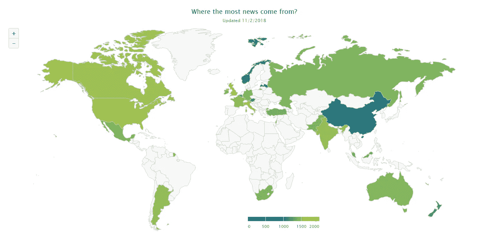

我们试图与每一个大洲取得联系，我认为除了一些第三世界国家之外，这些数据都很有代表性。真正的瓶颈是处理多语言数据。尤其是用一种罕见的语言。文本分析工具有一些限制，这些工具从一些可视化中排除了一些(中文、俄文、土耳其文、挪威语)。这个问题应该进一步解决。现在，**让我们看看新闻在各个国家的分布。**

```
test %>%
  count(name) %>%
  arrange(desc(n)) %>%
  mutate(name = fct_reorder(name, n)) %>%
  ggplot(aes(name, n, fill = name)) +
  geom_col() +
  coord_flip() +
  expand_limits(y = 0) +
  theme(legend.position = "none")+
  labs(title="Where the most news come from?", 
       subtitle = "Breakdown by Country", 
       x = "",
       y = ""
  )
```


英国在我们的数据集中处于领先地位，紧随其后的是美国和意大利(这是一个惊喜)。接下来我们将尝试描述一些流行和重要的话题。

```
test %>%
  filter(
    str_detect(text, " war |warships|wars"))%>%
  filter(name!="Austria")%>%
  filter(name!="Germany")%>%
  ggplot(aes(Date, fill= name))+
  geom_histogram()+
  labs(title="News frequency with a 'war' word", 
       subtitle = "Breakdown by Country/Date", 
       x = "",
       y = ""
  )
```

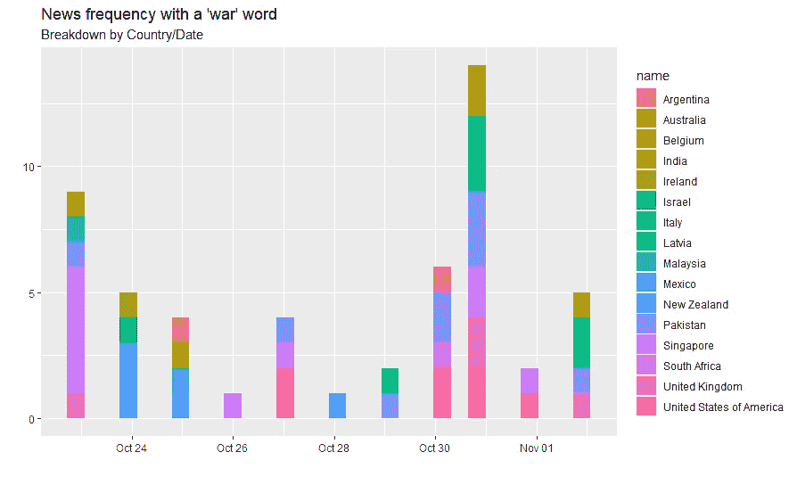

我们看到，有些日子风平浪静，有些日子却用一个“战”字创造了不同的故事。但是我们应该记住,“战争”有不同的含义。仔细看看它:

```
war <- test %>%
  filter(
    str_detect(text, " war |warships|wars")) %>%
  filter(name!="Austria") %>%
  filter(name!="Germany") %>%
  group_by(name) %>%
  View()
```

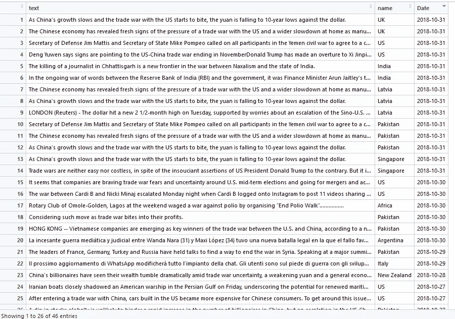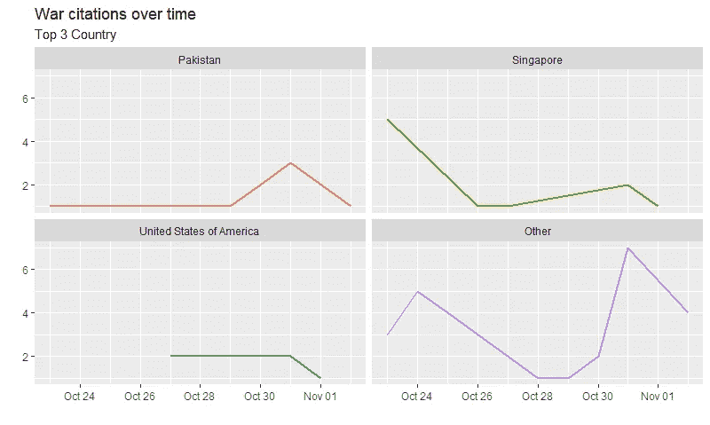

**那么哪个国家谈论“战争”最多呢？**按所有国家和语言细分:

```
war <- test %>%
  filter(str_detect(text, " war |warships|wars|войн| guerra | la guerre |战争")) %>%
  filter(name != "Austria") %>%
  filter(name != "Germany") %>%
  group_by(name) %>%
  count(name)
View()#'war' for a German language means different thing so we process it separately
Austria <- test %>%
  filter((name == "Austria"))
Austria <- Austria %>%
  filter(str_detect(text, " Krieg | Krieges")) %>%
  count(name)Germany <- test %>%
  filter((name == "Germany"))
Germany <- Germany %>%
  filter(str_detect(text, " Krieg | Krieges")) %>%
  count(name)war_full <- rbind.data.frame(war, Austria, Germany)
war_full <- as.data.frame(war_full)#breakdown by country
war_full %>%
  mutate(name = fct_reorder(name, n)) %>%
  ggplot(aes(name, n, fill = name)) +
  geom_col() +
  theme(legend.position = "none") +
  labs(
    title = "News frequency with a 'war' word",
    subtitle = "Breakdown by Country",
    x = "",
    y = ""
  )
```

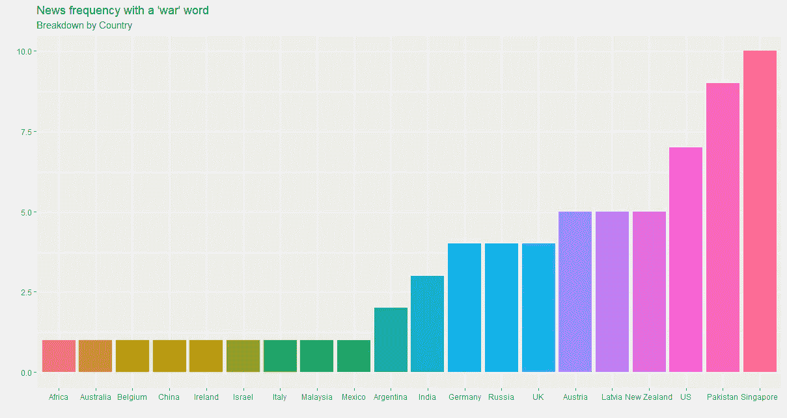

哪个国家谈论**“贸易战”最多？**

```
test %>%
  filter(
    str_detect(
      text,
      " trade war | trade wars | торговая война | guerre commerciale | guerra comercial | Handelskrieg |贸易战"
    )
  ) %>%
  count(name) %>%
  arrange(desc(n)) %>%
  mutate(name = fct_reorder(name, n)) %>%
  ggplot(aes(name, n, fill = name)) +
  geom_col() +
  coord_flip() +
  expand_limits(y = 0) +
  theme(legend.position = "none") +
  labs(
    title = "News frequency with a 'trade war' word",
    subtitle = "Breakdown by Country",
    x = "",
    y = ""
  )
```

**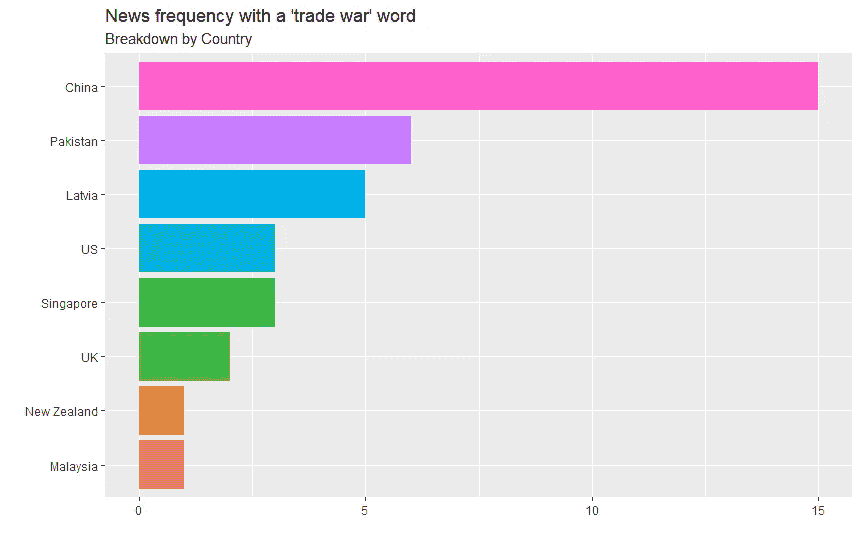**

**但是我们有带**字的“平安”新闻吗？在我们的世界找到和平是真的吗？****

```
**test %>%
  filter(str_detect(text, "peace | frieden | pace | paz |和平")) %>%
  count(name) %>%
  mutate(name = fct_reorder(name, n)) %>%
  ggplot(aes(name, n, fill = name)) +
  geom_col() +
  theme(legend.position = "none") +
  labs(
    title = "News frequency with a 'peace' word",
    subtitle = "Breakdown by Country",
    x = "",
    y = ""
  )**
```

****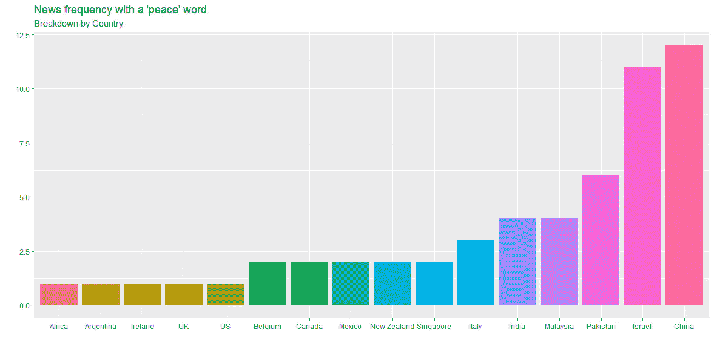****

****而**【假】【真】**新闻呢？新闻机构使用这个词吗，或者它是一个时代错误？****

```
**fake <- test %>%
  filter(str_detect(text, " fake | falso | faux | falschung|假")) %>%
  count(name)
fake$id <- "fake"true <- test %>%
  filter(str_detect(text, " true | wahr | vrai | vero | cierto|真正")) %>%
  count(name)
true$id <- "true"faketrue <- rbind(fake, true)faketrue %>%
  mutate(name = fct_reorder(name, n)) %>%
  ggplot() +
  geom_bar(aes(name, n, fill = id), stat = "identity", position = "dodge") +
  coord_flip() +
  theme(
    legend.position = "bottom",
    legend.title = element_blank(),
    axis.title = element_blank()
  ) +
  labs(
    title = "Frequency of 'fake' and 'true' words in news",
    subtitle = "Breakdown by Country",
    x = "",
    y = ""
  )**
```

****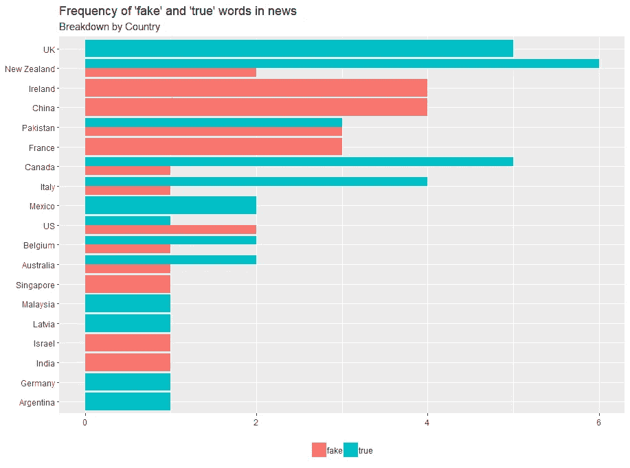****

****“假”新闻在爱尔兰和中国很受欢迎，而新西兰和加拿大、英国的新闻中“真”字出现频率最高。**让我们看看哪个国家有最“震撼”的新闻:******

```
**test %>%
  filter(str_detect(text, " shock | choque | choc | schock|休克|震动|浓密的")) %>%
  count(name) %>%
  mutate(name = fct_reorder(name, n)) %>%
  ggplot(aes(name, n, fill = name)) +
  geom_col() +
  theme(legend.position = "none", axis.title = element_blank()) +
  labs(
    title = "Which countries have the most 'shocking' news",
    subtitle = "Breakdown by Country",
    x = "",
    y = ""
  )**
```

********

****仔细看看:****

****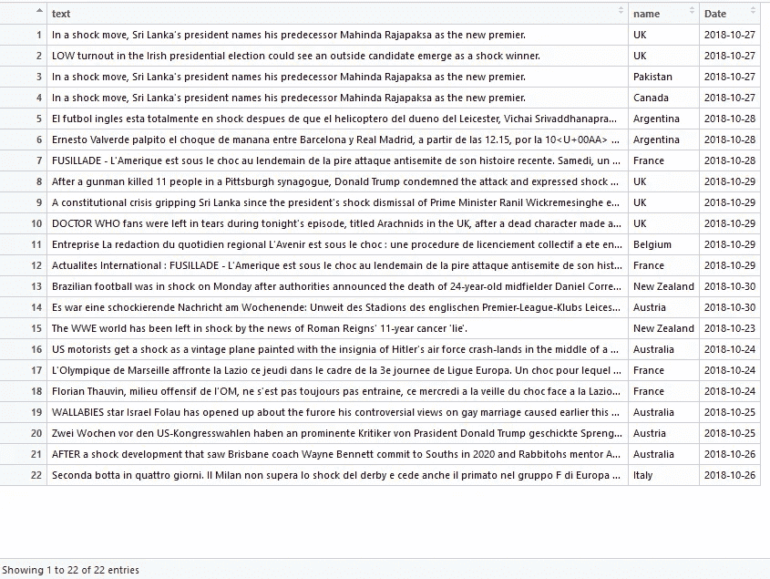****

****That’s a news that shocked our world. From presidential selections to Doctor Who fans. **Which countries have the most “bad” and “good” words in their news?******

```
**bad <- test %>%
  filter(str_detect(text, " bad |坏")) %>%
  count(name)
bad$id <- "bad"good <- test %>%
  filter(str_detect(text, " good |好")) %>%
  filter(name != "Austria") %>%
  filter(name != "Germany") %>%
  count(name)
good$id <- "good"badgood <- rbind(bad, good)badgood %>%
  mutate(name = fct_reorder(name, n)) %>%
  ggplot() +
  geom_bar(aes(name, n, fill = id), stat = "identity", position = "dodge") +
  coord_flip() +
  theme(
    legend.position = "bottom",
    legend.title = element_blank(),
    axis.title = element_blank()
  ) +
  labs(
    title = "Which countries have the most 'bad' and 'good' news?",
    subtitle = "Breakdown by Country",
    x = "",
    y = ""
  )**
```

********

****Well, as we clearly see “good” news are prevail. But is it really true? We will check it later with a sentiment analysis of the whole dataset.****

****Coming next, **we’ll plot a chart with a “death” word frequency through different countries.******

```
**test %>%
  filter(str_detect(text, " death | Tod | muerte | mort| смерть|死亡")) %>%
  count(name) %>%
  arrange(desc(n)) %>%
  mutate(name = fct_reorder(name, n)) %>%
  ggplot(aes(name, n, fill = name)) +
  geom_col() +
  coord_flip() +
  expand_limits(y = 0) +
  theme(legend.position = "none") +
  labs(
    title = "News frequency with a 'death' word",
    subtitle = "Breakdown by Country",
    x = "",
    y = ""
  )**
```

****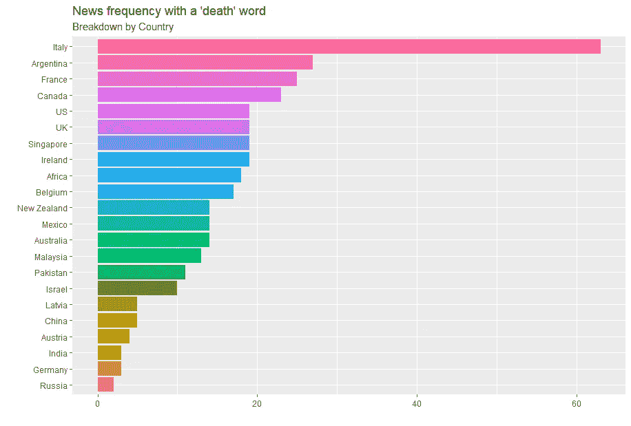****

****Italy has the leading position with a biggest numbers. We should take a closer look on it applying topic modelling technique(LDA algorithm).****

****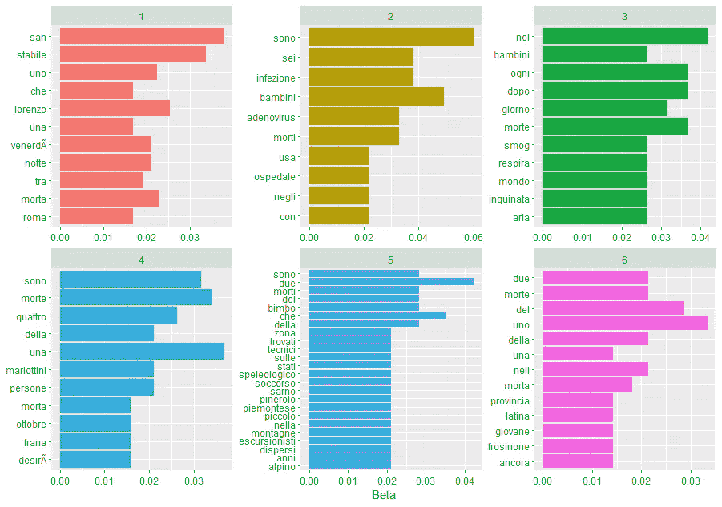****

****Checking our topics with Google Translator we’d get some understanding about what’s going on.****

****Hope that somebody still reading this:) so let’s take a look on a domestic news that always cover government personas at some point. **I think that will be interesting to see some type of popularity between a couple of government leaders through a whole world.** For example, we may choose:****

```
**Trump <- test %>%
  filter(str_detect(text, "Trump|特朗普| Трамп ")) %>%
  count(name)
Trump$id <- "Trump"Putin <- test %>%
  filter(str_detect(text, "Putin |普京| Путин ")) %>%
  count(name)
Putin$id <- "Putin"Merkel <- test %>%
  filter(str_detect(text, "Merkel |默克爾| Меркель ")) %>%
  count(name)
Merkel$id <- "Merkel"Jinping <- test %>%
  filter(str_detect(text, " Xi Jinping |习近平| Си Цзиньпин")) %>%
  count(name)
Jinping$id <- "Xi Jinping"popularity <- rbind(Trump, Putin, Merkel, Jinping)pop <- popularity %>%
  count(id) %>%
  arrange(desc(nn)) %>%
  View()popularity %>%
  mutate(name=fct_reorder(name,n))%>%
  ggplot() +
  geom_bar(aes(name, n, fill = id), stat = "identity", position = "dodge") +
  coord_flip() +
  theme(
    legend.position = "bottom",
    legend.title = element_blank(),
    axis.title = element_blank()
  ) +
  labs(
    title = "Citations on selected national leaders in a news",
    subtitle = "Breakdown by Country",
    x = "",
    y = ""
  )**
```

****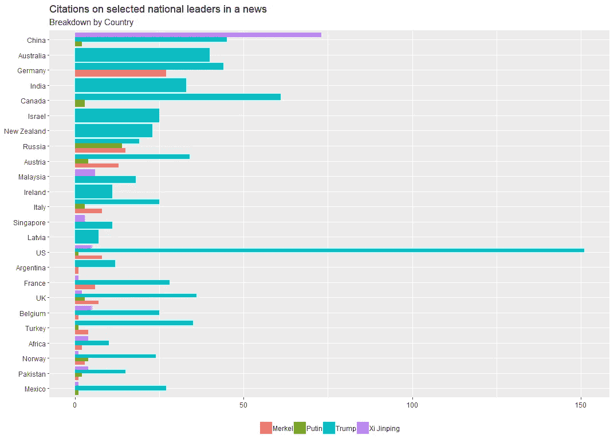********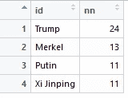****

****President Trump has a leading position covering 24 country at all, but this is obvious for anybody who check news sites quite often. Chancellor of Germany — Angela Merkel takes second place following by President of the People’s Republic of China Xi Jinping and president Putin. Surpsingly there are some countries that covers only US president and nobody else from our selection. China and the United States have biggest numbers covering their national leaders, while Germany and Russia have more coverage on a foreign presidents. **Maybe country citations shows some difference?******

```
**US <- test %>%
  filter(str_detect(text, " United States | US | USA | Stati Uniti | Etats-Unis| США | 美国")) %>%
  count(name)
US$id <- "United States"Germany <- test %>%
  filter(str_detect(
    text,
    " Germany | Deutschland | Alemania | Germania | Allemagne | Германия |德国"
  )) %>%
  count(name)
Germany$id <- "Germany"China <- test %>%
  filter(str_detect(text, " China | Chine | Cina |Китай| 中国")) %>%
  count(name)
China$id <- "China"Russia <- test %>%
  filter(str_detect(text, " Russia | Russland| Rusia | Russie |Россия|俄罗斯")) %>%
  count(name)
Russia$id <- "Russia"popularity <- rbind(US, Germany, China, Russia)pop <- popularity %>%
  count(id) %>%
  arrange(desc(nn)) %>%
  View()popularity %>%
  mutate(name=fct_reorder(name,n))%>%
  ggplot() +
  geom_bar(aes(name, n, fill = id), stat = "identity", position = "dodge") +
  coord_flip() +
  theme(
    legend.position = "bottom",
    legend.title = element_blank(),
    axis.title = element_blank()
  ) +
  labs(
    title = "Citations on selected countries in a news",
    subtitle = "Breakdown by Country",
    x = "",
    y = ""
  )**
```

****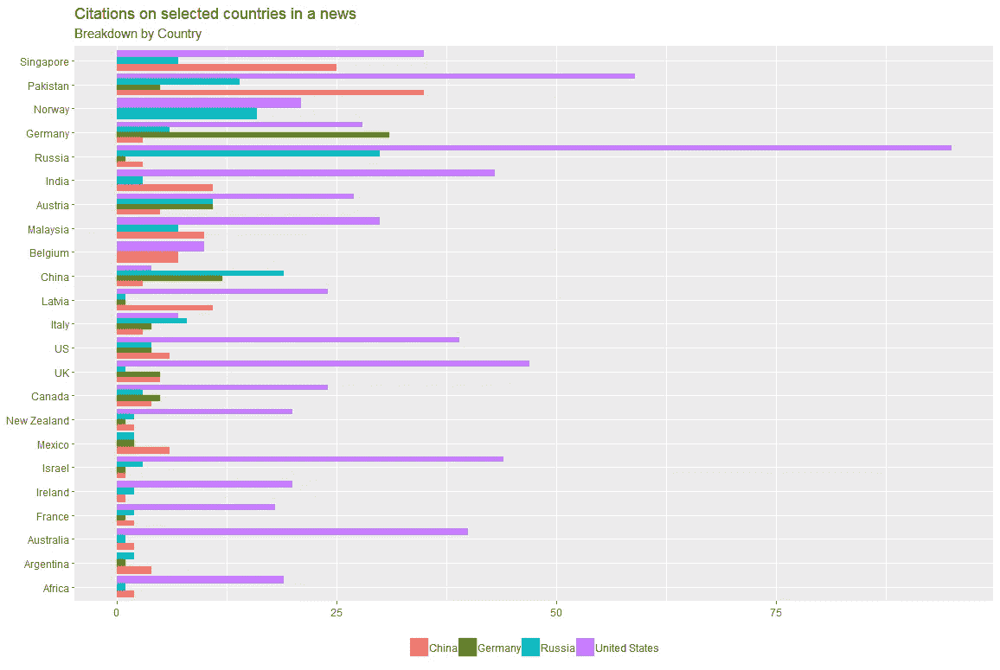********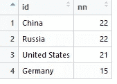****

****So this is how the balance of power looks like (in a global news coverage of course). The United States, China and Russia have something similar coverage level around the globe! China has the most coverage in Pakistan, Singapore (geographical role explain it well). According to our findings Italy has the lowest interest in United States and Russia have the most highest number of citations on the United States.****

****What if we apply same approach to find some **brand awarness**? We’ll select Apple and Samsung as an example of core players on a market.****

```
**Apple <- test %>%
  filter(str_detect(text, " Apple ")) %>%
  count(name)
Apple$id <- "Apple"Samsung <- test %>%
  filter(str_detect(text, " Samsung ")) %>%
  count(name)
Samsung$id <- "Samsung"popularity <- rbind(Samsung, Apple)popularity %>%
  mutate(name=fct_reorder(name,n)) %>%
  ggplot() +
  geom_bar(aes(name, n, fill = id), stat = "identity", position = "dodge") +
  coord_flip() +
  theme(
    legend.position = "bottom",
    legend.title = element_blank(),
    axis.title = element_blank()
  ) +
  labs(
    title = "Citations on selected brand in a news",
    subtitle = "Breakdown by Country",
    x = "",
    y = ""
  )pop <- popularity %>%
  count(id) %>%
  arrange(desc(nn)) %>%
  View()**
```

********

****Both brands have the same coverage by country in our dataset. But what about chart?****

****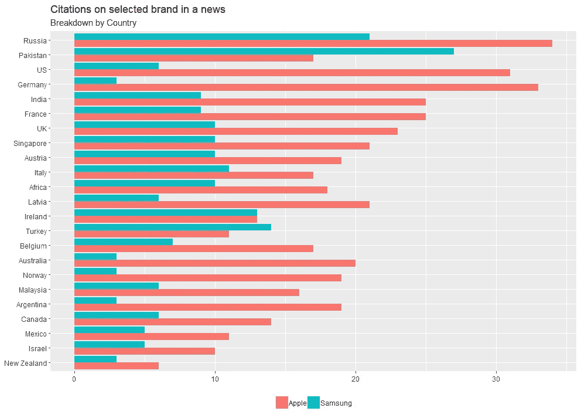****

****Pakistan and Turkey have covered Samsung more than Apple, while other countries prefer to look on a Apple’s products more.****

****What if we would like to see the top 5 most common words that appears in news in a every country? I think that this plot will show some value.****

```
**#I already preprocess dataset and exclude languages that are not supported in tm packagetop10full %>%
  group_by(name)%>%
  filter(name!="Russia")%>%
  filter(name!="Norway")%>%
  filter(name!="China")%>%
  filter(name!="Turkey")%>%
  ggplot(aes(word,freq, fill= name))+
  geom_col() +
  facet_wrap(~name, scales = 'free_x')+
  theme(legend.position = "none")+
  labs(title="The most top 5 words used in a every news article ", 
       subtitle = "breakdown by country", 
       x = "",
       y= ""
  )**
```

****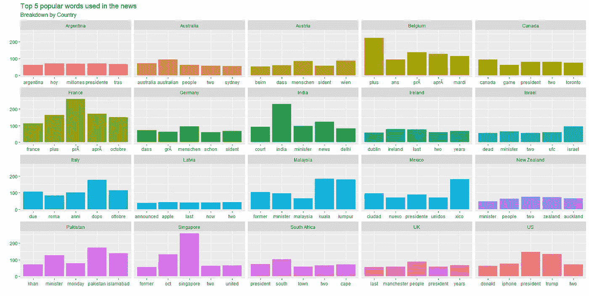****

****From that plot, we could say that there is two types of countries. One of them covers their’s government activity the most due to a strong presence on a international or domestic area. The second type is more into different subjects of life or just their government didn’t provide such information to the public.****

****I think that time to apply sentiment analysis on our dataset. First, we’ll look on a timeseries with a different methods :****

> ****默认的“Syuzhet”词典是由内布拉斯加文学实验室在马修·l·乔克斯的指导下开发的****
> 
> ****“afinn”词典是由 Finn Arup Nielsen 作为 AFINN 单词数据库开发的。参见:参见[http://www2.imm.dtu.dk/pubdb/views/publication_details.php?id = 6010](http://www2.imm.dtu.dk/pubdb/views/publication_details.php?id=6010)AFINN 单词数据库受版权保护，并根据“开放数据库许可(ODbL)1.0 版”【http://www.opendatacommons.org/licenses/odbl/1.0/ 或类似的版权许可发布。****
> 
> ****“冰”词汇是由胡敏清和刘冰开发的意见词汇见:【http://www.cs.uic.edu/~liub/FBS/sentiment-analysis.html】****
> 
> ****“nrc”词典是由 Mohammad，Saif M .和 Turney，Peter D .开发的 NRC 情感词典。
> 参见:[http://saifmohammad.com/WebPages/lexicons.html](http://saifmohammad.com/WebPages/lexicons.html)****

```
**melted %>%
  group_by(variable) %>%
  ggplot(aes(
    timestamp,
    value,
    color = variable,
    label = variable,
    size = value
  )) +
  geom_point() +
  labs(title = "Scores by different sentiment lexicons",
       x = "",
       y = "") +
  geom_smooth(aes(group = 1))**
```

********

****结果每天都在变化，但中位数低于零，所以我们可以假设我们的全球新闻不是那么积极。但是让我们来看看情绪的分解。****

```
**emo_sum %>%
  ggplot(aes(emotion,count, fill=emotion)) +
  geom_col() +
  theme(legend.position = "none",axis.title = element_blank()) +
  labs(title="Recent sentiments on a global news dataset", 
       x = "",
       y = ""
  )**
```

****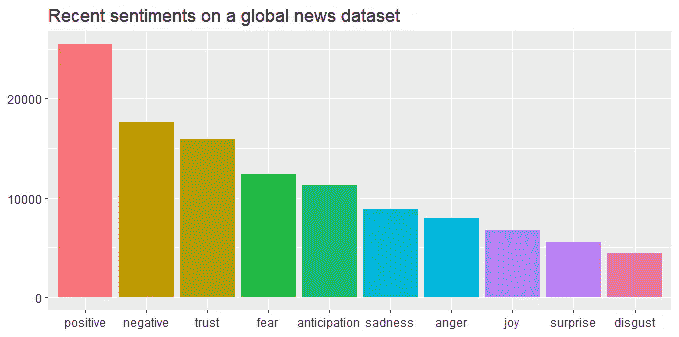****

****我想做的下一件事是另一个主题建模。为此，我们将使用茱莉亚西尔格的精彩教程，她描述了每一步。我们将绘制模型诊断和结果:****

```
**#plot result after preprocessing data and modelling (Assumption of 100 models max)k_result %>%
  transmute(K,
            `Lower bound` = lbound,
            Residuals = map_dbl(residual, "dispersion"),
            `Semantic coherence` = map_dbl(semantic_coherence, mean),
            `Held-out likelihood` = map_dbl(eval_heldout, "expected.heldout")) %>%
  gather(Metric, Value, -K) %>%
  ggplot(aes(K, Value, color = Metric)) +
  geom_line(size = 1.5, alpha = 0.7, show.legend = FALSE) +
  facet_wrap(~Metric, scales = "free_y") +
  labs(x = "K (number of topics)",
       y = NULL,
       title = "Model diagnostics by number of topics",
       subtitle = "These diagnostics indicate that a good number of topics would be around 80")**
```

********

****正如我们在上面看到的，保留的最大似然值和最小残差值大约是 80 个主题。结果是:****

```
**gamma_terms %>%
  top_n(20, gamma) %>%
  ggplot(aes(topic, gamma, label = terms, fill = topic)) +
  geom_col(show.legend = FALSE) +
  geom_text(hjust = 0, nudge_y = 0.0005, size = 3,
            family = "IBMPlexSans") +
  coord_flip() +
  scale_y_continuous(expand = c(0,0),
                     limits = c(0, 0.09),
                     labels = percent_format()) +
  theme_tufte(base_family = "IBMPlexSans", ticks = FALSE) +
  theme(plot.title = element_text(size = 16,
                                  family="IBMPlexSans-Bold"),
        plot.subtitle = element_text(size = 13)) +
  labs(x = NULL, y = expression(gamma),
       title = "Top 20 topics by prevalence in the our dataset",
       subtitle = "With the top words that contribute to each topic")**
```

****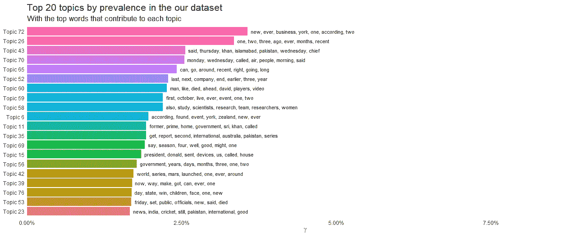****

****我想展示的最后一件事是单词云。就像结尾的一个大点:)一张图中的简单和复杂。这条新闻是关于什么的？****

```
**wordcloud(data, colors = viridis::viridis_pal(end = 0.8)(10), random.order = FALSE, random.color = TRUE, min.words=10,max.words=Inf,rot.per = 0.3)**
```

****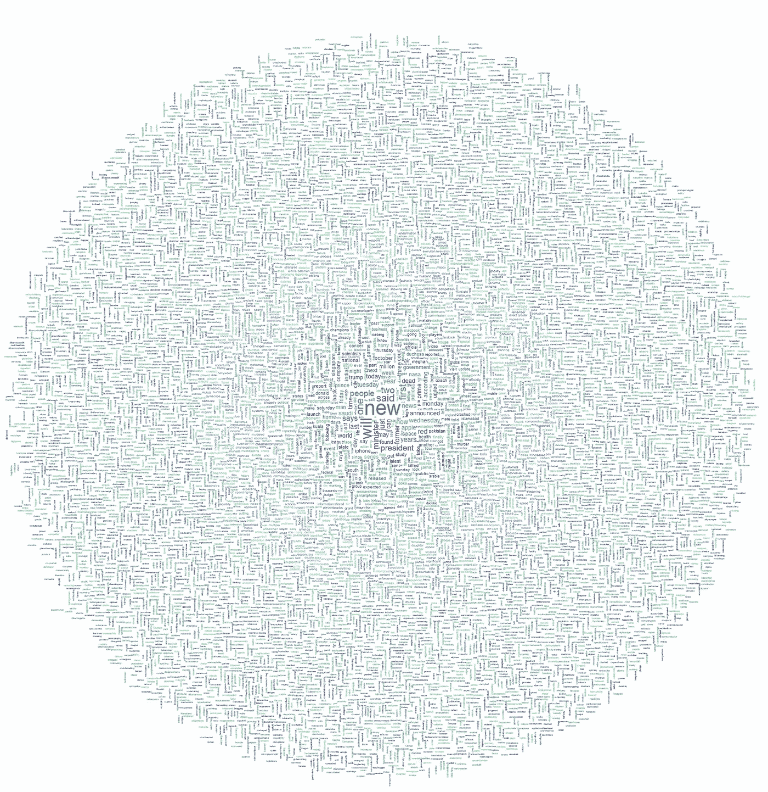****

****这种类型的数据集有很大的潜力去发现你想知道的任何事情。我们所做的只是分析的一小部分，我认为这是获得一些见解的真正有用的工具。随着不断更新，我们可以随时掌握各种主题及其存在的脉搏。我们可能会识别一些品牌意识、人类行为、外交事务和我们世界中每天发生的许多其他事情。****