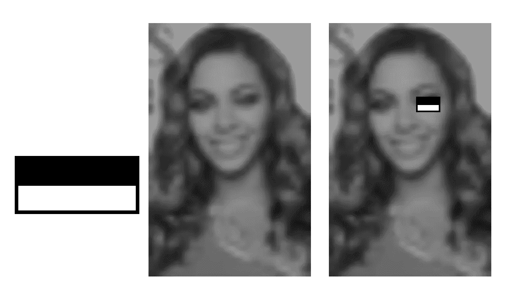

# 哈尔特征分类器和卷积神经网络有什么区别？

> 原文：<https://towardsdatascience.com/whats-the-difference-between-haar-feature-classifiers-and-convolutional-neural-networks-ce6828343aeb?source=collection_archive---------0----------------------->

## 以情感识别模型为例！

“基于哈尔特征的级联分类器”、“类哈尔特征由 Viola 和 Jones 首次提出”……但到底什么是类哈尔特征呢？它与卷积神经网络有什么关系？

Haar-Feature 就像 CNN 中的[核，只是在 CNN 中，核的值是通过训练确定的，而 Haar-Feature 是手动确定的。](http://setosa.io/ev/image-kernels/)

以下是一些 Haar 特性。前两个是“边缘特征”，用于检测边缘。第三个是“线特征”，而第四个是“四矩形特征”，最有可能用于检测倾斜的线。

Image 1: Common Haar-features // [Source](https://commons.wikimedia.org/wiki/File:VJ_featureTypes.svg)

从数字上看，它们可能如下所示:

Image 2: Haar-features represented numerically

正如这里的[所解释的](/what-is-a-neural-network-6010edabde2b)，每个 3x3 内核在图像中移动，并与图像的每个 3x3 部分进行矩阵乘法，强调一些特征并平滑其他特征。

Haar-Features 擅长检测边缘和线条。这使得它在人脸检测中特别有效。例如，在碧昂斯的小图像中，这个 Haar 特征将能够检测到她的眼睛(顶部较暗而底部较亮的区域)。

Image 3: Haar-features can be used to detect facial landmarks, such as the shadow of an eye // [Source](https://commons.wikimedia.org/wiki/File:Ms._magazine_Cover_-_Spring_2013_(cropped).jpg)

然而，由于 Haar 特征必须手动确定，所以它能够检测的事物的类型有一定的限制。如果你给分类器(一个网络，或者任何检测人脸的算法)边缘和线条特征，那么它将只能检测到边缘和线条清晰的物体。即使作为人脸检测器，如果我们对人脸进行一些操作(比如用太阳镜遮住眼睛，或者将头部倾斜到一侧)，基于 Haar 的分类器也可能无法识别人脸。另一方面，卷积核具有更高的自由度(因为它是由训练确定的)，并且能够识别部分覆盖的人脸(取决于训练数据的质量)。

有利的一面是，因为我们不需要训练 Haar 特征，所以我们可以用相对较小的数据集创建一个分类器。我们所要做的就是训练每个特征的权重(即，应该更多地使用哪个 Haar 特征？)这允许我们在没有大量训练图像的情况下很好地训练分类器。此外，它还具有更高的执行速度，因为基于 Haar 的分类器通常涉及更少的计算。

引发对基于哈尔的分类器的这个小调查的是[这个识别情绪的模型](https://github.com/oarriaga/face_classification)。去年，在一个展览会上，我偶然发现了一个情感识别系统。然而，它没有使用神经网络。我很好奇是否能找到一个完全基于 CNN 的情感识别算法。

简单看一下这个模型，我看到它使用 OpenCV 的基于 Haar 的级联分类器来检测人脸。在找到面孔后，该团队训练他们自己的 CNN 来识别脸上的情绪。

因为它使用了基于 Haar 的分类器，我不能真正称它为完全基于卷积神经网络的 T2 算法。如果我把基于哈尔的分类器换成[的 MTCNN 人脸识别系统](https://github.com/ipazc/mtcnn)会怎么样？

最初，它加载了一个基于 Haar 的分类器。我把它换成了一个 MTCNN 探测器:

然后，我做了一点数据处理，因为他们基于 Haar 的分类器输出返回一个方形边界框作为二维数组，而 MTCNN 模型输出返回一个字典中的矩形边界框。

当我改变输出和调试时，我让基于 Haar 的分类器和 MTCNN 检测器都保持运行(以比较它们的输出)。有趣的是，我的电脑似乎无法承受如此大的计算量:程序一直在崩溃。

最后，我运行了程序，现在运行的是 MTCNN，而不是基于 Haar 的分类器。以下是一些观察结果:

*   基于 OpenCV Haar 的分类器要快得多。切换到 MTCNN 检测器后，视频开始滞后。它仍然可以实时运行，但质量没有那么好。
*   MTCNN 检测器能够检测更多种类的人脸。即使我倾斜我的脸，将它部分转向远离相机，或者用手遮住它的一部分，它仍然能够识别它是一张脸。基于 OpenCV Haar 的分类器只能真正识别完整的正面人脸。
*   根据基于 Haar 的分类器训练的情绪识别网络只能准确识别正面人脸上的不同情绪。因此，即使 MTCNN 检测器允许我们在部分模糊的面部周围绘制一个边界框，该程序也无法真正识别面部的情感。

所有这些观察结果都与我的发现一致:虽然训练有素的 CNN 可以学习更多的参数(从而检测更多种类的人脸)，但基于 Haar 的分类器运行更快。根据你的任务，一个可能比另一个更适合。

在此下载您的资源:

*   MTCNN Github 下载:[https://github.com/ipazc/mtcnn](https://github.com/ipazc/mtcnn)
*   情感识别 Github 下载:[https://github.com/oarriaga/face_classification](https://github.com/oarriaga/face_classification)
*   我的代码(把这个放在“src”下，运行这个之前记得把 mtcnn 的“MTCNN”文件夹放到情感识别模型的“src”文件夹里):[https://drive . Google . com/file/d/1 dqyleqv 8 uftieal 687 x3x 5 cht 1 _ TCTG/view？usp =共享](https://drive.google.com/file/d/1dqyLeqV8uftIeal687X3sx5ChT1_TCTG/view?usp=sharing)