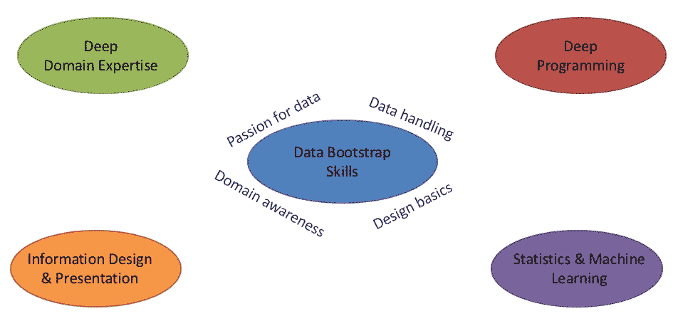
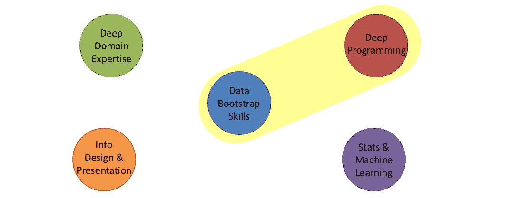
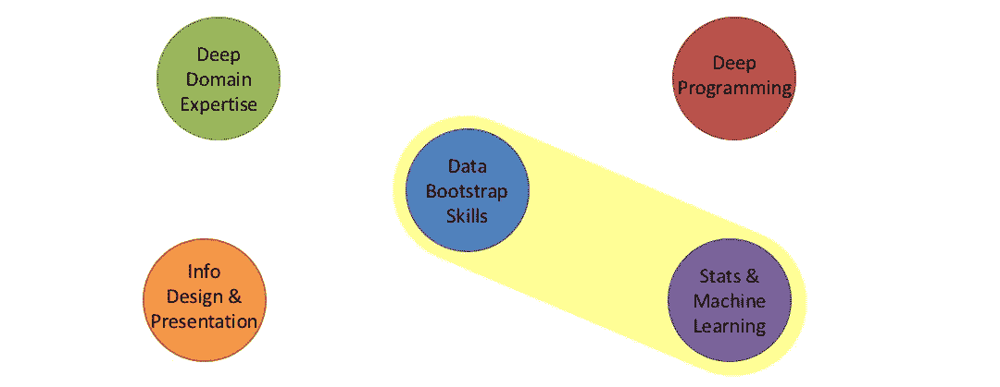
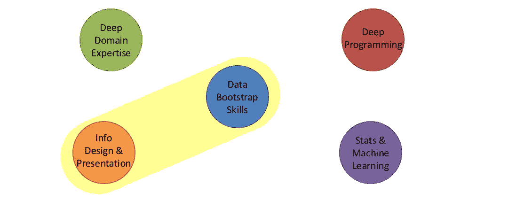
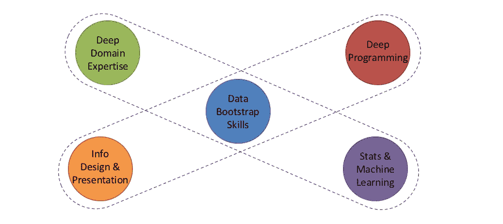

# 转型成为数据科学独角兽的秘笈是什么？

> 原文：<https://towardsdatascience.com/whats-the-secret-sauce-to-transforming-into-a-unicorn-in-data-science-94082b01c39d?source=collection_archive---------3----------------------->

Photo by [andrew jay](https://unsplash.com/photos/OdjhBf4Ar4I?utm_source=unsplash&utm_medium=referral&utm_content=creditCopyText) on [Unsplash](https://unsplash.com/?utm_source=unsplash&utm_medium=referral&utm_content=creditCopyText)

## 分析中的角色，学会成为“无价之宝”的技能

每个数据科学领域的有志之士都有这样一个问题*“我需要什么技能才能进入这个行业？”*，紧随其后的是*“我如何在这个就业市场上变得备受追捧？”*尽管这个行业炙手可热，供需失衡有利于训练有素的专业人士，但获得正确的技能组合并不容易。

现在大家都知道*‘数据科学家* *是本世纪最性感的工作*。但是这到底指的是什么角色呢？一提到这个头衔，就会让人想起数学奇才在多元微积分和线性代数中挥汗如雨的画面，或者是极客们编写代码创造下一代通用人工智能的画面。

然后，一个人还会被要求掌握一系列技能的繁忙的维恩图所困扰。这些加起来就是一个团队经过多年可能已经掌握的领域。*数据科学家*是一个不太常用的术语，这个头衔在业内被严重滥用。挺像*大数据*或者说 *AI* 。

实际上，这个头衔通常被用作相关职位的总称，业内公司对此有不同的解释。我遇到过许多人私下向我坦白，*“给我任何工作和角色，但请用‘数据’和‘科学家’这两个词给我造一个头衔吧*！

Photo by [frank mckenna](https://unsplash.com/photos/DlR32lXV01M?utm_source=unsplash&utm_medium=referral&utm_content=creditCopyText) on [Unsplash](https://unsplash.com/search/photos/confused?utm_source=unsplash&utm_medium=referral&utm_content=creditCopyText)

## 那么，进入数据科学并取得成功需要什么条件呢？

在这种困惑的推动下，人们想知道他们是否必须学习编程才能在数据科学领域有所作为。对于其他人来说，统计学或机器学习可能不是他们的菜。这些似乎是在分析领域取得任何进展的绊脚石。

这尤其让那些对数据感兴趣，但在不同行业的不相关岗位上工作了 10 年的人感到困惑。不得不重新学习编码或设计来重新开始职业生涯的想法难倒了他们。这些错误观念必须被有力地消除，以免它们继续粉碎在数据科学领域的职业梦想。

那么，在数据科学领域发展所需技能的现实期望是什么？此外，有抱负的人能否挑选感兴趣的技能来创造一个更喜欢的角色，一个建立在优势之上，同时又受欢迎的角色？

**是的！**

我们将首先展示数据科学中所需的一系列技能，比如自助餐菜单。然后，我们将通过从这些技能中挑选，构建提供分析价值的关键行业角色，就像定制一顿饭一样。是的，我们也将揭开成为这个行业独角兽的秘密。

A buffet menu of Data science Skills (Photo by [Dan Gold](https://unsplash.com/photos/4_jhDO54BYg?utm_source=unsplash&utm_medium=referral&utm_content=creditCopyText) on [Unsplash](https://unsplash.com/?utm_source=unsplash&utm_medium=referral&utm_content=creditCopyText))

## 数据科学的技能范围

数据科学有 5 项核心技能。再次强调这一点，不，一个人不需要全部学会。在下一节中，我们将介绍角色以及每个角色所需要的技能组合。首先，让我们讨论一个项目中需要的能力的完整列表，以便交付商业价值。

The spectrum of the key data science skills

## **1。数据引导技能(或)数据科学素养**

对数字的热情是在数据科学领域取得成功的先决条件，也是一笔巨大的财富。一个人必须学会数据辩论技巧，才能对数据有感觉——计算平均值，拟合交叉表，并通过探索性分析提取基本见解。重要的是方法，任何工具，比如 Excel、R 或 SQL 都可以。

从数据技术的分析和结果中获得的洞察力就像一颗未经打磨的钻石。对于受过训练的人来说，它们很有价值，但在市场上却一文不值。掌握演示和基本设计技巧来润色这些真知灼见是非常宝贵的。这使得一个人的努力是有效和值得的。

数据处理和基本设计必须以所选领域的良好定位为基础。数据技术的好坏取决于它们对业务问题的适应程度。这些基础知识不能外包给业务分析师，所以任何认真研究数据科学的人都应该掌握领域基础知识。

简而言之，这种技能要求一个人与数据友好相处，并训练他们的眼睛识别数字中的模式。这是一项基本技能，在分析中没有商量的余地。

 [## 如何在数据科学工作面试中炫耀自己对分析的热情？

### 在一个拥挤的市场中，一个人如何显示他们是特殊的，并适合于丰富的数据科学角色？这里…

towardsdatascience.com](/how-to-flaunt-your-passion-for-analytics-in-data-science-job-interviews-2cb432cc3d3d) 

## **2。信息设计和展示**

[信息设计](https://en.wikipedia.org/wiki/Information_design)是以一种促进有效理解的方式呈现数据。重点是能够消费数据的视觉设计，而不仅仅是美化。可视化是让用户从分析中获得价值的最后一英里通信。

要成为这方面的专家，你必须掌握交互设计、用户体验和数据可视化领域的设计技巧。这需要用户映射、信息架构、数据表示、线框、高保真设计和视觉美学方面的专业知识。

> 一幅画最大的价值是当它迫使我们注意到我们从未期望看到的东西——约翰·图基

 [## CSE442:数据可视化

### 这个世界充斥着越来越多的数据，我们必须保持相对恒定的感知和…

courses.cs.washington.edu](https://courses.cs.washington.edu/courses/cse442/17au/) 

## **3。统计学和机器学习**

在大多数数据科学课程中，这一领域受到了极大的关注。这里的重点是统计和建模，而脚本或编程是次要技能。虽然这是从数据中提取价值的一个关键领域，但这里的过度强调可能会转移对数据科学中其他 4 项关键技能的关注。

基于基本的数据争论技能，人们必须更深入地钻研统计学、概率，然后扩展到机器学习的技术和算法。深度学习和其他趋势人工智能技术也属于这一范畴，但这些需要更广泛的编码技能。

 [## 机器学习|课程

### 关于这门课程:机器学习是让计算机在没有明确编程的情况下行动的科学。在…

www.coursera.org](https://www.coursera.org/learn/machine-learning) 

## **4。深度编程**

具有核心编程背景的人在数据科学中有很大的用处，并不是强制他们学习机器学习技能。数据应用程序需要后端编码来连接和处理数据，需要处理数据和构建数据科学应用程序的内部结构。

还强烈需要前端编码技能来向用户展示数据洞察力，这是橡胶真正遇到道路的地方。一个人必须掌握数据在各种 UI 和表单上的处理和表示。像 Python，Java，Javascript，R，SQL 这样的语言很流行。

 [## 为数据科学学习 Python 在线课程|数据营

### DataCamp 的 Python 入门课程通过互动视频教你如何使用 Python 编程进行数据科学…

www.datacamp.com](https://www.datacamp.com/courses/intro-to-python-for-data-science) 

## **5。领域专长**

深入的领域技能有助于为分析带来意义、可解释性和可操作性。将领域专业知识与数据技能相结合的重要性怎么强调都不为过。在整个项目中缺乏对这一领域的足够重视是计划失败的最常见原因。

在这里，第一步是在选定的领域中获得深度并掌握业务流程。然后，我们必须关注数据素养和对分析技术的概念性理解。这带来了通过结合领域技能和数据印章来编织紧密结构的知识，以获得更高的价值。

> *“如果你不知道如何问正确的问题，你将一无所获。——爱德华·戴明"*

## 数据科学中的角色

Roles in data science — making oneself a customized meal (Photo by [Brooke Lark](https://unsplash.com/photos/aGjP08-HbYY?utm_source=unsplash&utm_medium=referral&utm_content=creditCopyText) on [Unsplash](https://unsplash.com/?utm_source=unsplash&utm_medium=referral&utm_content=creditCopyText))

现在我们已经看到了技能的传播，这些技能结合起来形成了分析中的以下 4 个核心角色。这些角色可以在每个认真对待数据科学产品的商店中找到。正如这里所描述的，它们通常被划分为独立的角色，或者被混合成一些重叠的组合。

鉴于该行业的发展状况，职位名称相当不稳定。虽然我们已经看到*‘数据科学家’*是一个经常用来吸引人才的松散头衔，但像*‘数据忍者’*这样的角色可能意味着什么谁也说不准！在这里，我使用了更接近我们在过去 7 年中发展的头衔，在[格拉米纳](https://gramener.com/careers/)。

## **1。数据科学工程师(或)ML 工程师**

Data Science Engineer or Specialist — Skill mix

将数据引导技能与深度编程(前端、后端或全栈)相结合的人属于这一类。这些角色在数据科学应用的应用编程、集成和云实施中至关重要。除了深厚的编码技能，这还需要精通数据处理、自动化洞察和端到端应用实施。一些组织将数据科学家视为这条职业道路上的高级角色。

## **2。数据分析师(或数据科学家**

Data analyst — Skill mix

这些人用统计学和机器学习的技能来补充核心数据。虽然他们是设计分析方法和构建模型的权威，但他们利用自己的基本编程技能和领域定位来实现和评估模型的可解释性。

 [## 是什么让机器学习项目中的数据科学家感到沮丧？

### 分析推销经常许诺月亮。在这个客户期望的幻想世界里，这 8 个神话挫败了…

towardsdatascience.com](/what-frustrates-data-scientists-in-machine-learning-projects-3398919a7c79) 

## **3。信息设计师或可视化设计师**

Information designer or Visualization — Skill mix

拥有核心用户界面和 UX 技能的设计师，同时也具备基础数据技能的强大基础，符合信息清单设计师的要求。从概念化到数据故事的创建，他们都扮演着重要的角色。让用户保持在宇宙的中心，他们迭代地驱动视觉智能层的设计。

 [## 什么是高级数据可视化工程师？

### 最近在推特上有人问我一个问题，自从我成为一名…

medium.com](https://medium.com/@Elijah_Meeks/what-is-a-senior-data-visualization-engineer-eb032996297) 

## **4。功能数据顾问(或)数据翻译**

Functional data consultant — Skill mix

功能数据顾问将他们的领域知识与基本的数据技能相结合，充当业务用户和数据科学团队之间的桥梁。他们在团队中发挥着强大的影响力，让客户了解数据驱动的用例，同时保持分析解决方案的业务驱动性和可操作性。

## 转变为数据科学领域的独角兽

Making of a unicorn — the secret sauce (Photo by [Caroline Attwood](https://unsplash.com/photos/uaMwBQ_wjng?utm_source=unsplash&utm_medium=referral&utm_content=creditCopyText) on [Unsplash](https://unsplash.com/?utm_source=unsplash&utm_medium=referral&utm_content=creditCopyText))

数据科学中的这 4 个关键角色展示了来自不同背景(编程、统计、设计和领域)的人如何将他们的先天技能转化为分析项目中有影响力的角色。正是强大的基础加上对数据和业务应用的热情，使得它们对组织来说是无价的。

如果这 4 个角色中的质量从业者在行业中非常受欢迎，并且供不应求，那么是什么造就了数据科学中的独角兽？什么样的神奇组合能让一个人变得无价？

回想一下我们的数据科学自助菜单，当人们可以从这里检查任何 3 种技能时，这种卓越的能力就诞生了，并且每种技能都有卓越的掌握水平。俗话说，事后看起来总是更容易。让我们回顾一些技能组合，看看这些人在哪些领域是不可替代的。

Making of a unicorn — the special mix of skills

*   **数据引导+统计，ML +深度编程:**一个专家，他负责设计完全打包的数据科学产品。
*   **数据 bootstrap +统计学，ML +深度领域:**构思并原型化深度、垂直化数据科学应用的专家。
*   **数据引导+信息设计+深度编程:**讲述故事的大师，提供令人愉快的数据科学应用。
*   **数据引导+信息设计+深度领域:**经营领域深度 UX 咨询的专家，设计企业数据科学应用。
*   **数据引导+深度领域+深度编程:**罕见的技术功能数据科学专家的属性。

正如您在上面看到的，只需再增加一项具有高水平专业知识的数据科学技能，就可以转变一个人的角色。这将一个人的能力、贡献和价值推出公园，从而产生更大的影响。

你可能会问，如果你能积累 4 种或更多这些技能呢？好吧，那你就当自己是数据科学的半神吧。或者，正如著名的万事达卡活动所说，你在数据科学行业的价值变得*‘真正无价！’。*

## 摘要

为了成功解决客户的问题，数据科学项目需要关键技能的组合。通常，公司对一个职位的工作描述可能会要求大部分或所有这些技能。考虑到候选人能力的巨大差异，这只是一个尽可能多的重叠的尝试。

> 一个人不能组成一个团队。它需要十一点。—贝尔·布莱恩特，传奇足球教练

实际上，项目团队是根据人们的核心技能水平动态地配备各种角色的。可能会有分析计划设法在 3 个人中实现这种混合，而其他人可能会在 5 个人中实现。通常，为了更好的协调和更有效的结果，组织更喜欢具有跨学科技能的小团队。

人们进入这个行业时，不是没有建议的基础数据技能的广度，或者在关键技能领域缺乏深度吗？是的，但他们的贡献水平与其他人相比相形见绌，这一切都归结为在数据科学领域*生存*与*繁荣*的问题。

候选人在上述两个或更多技能领域的能力越强，就越有可能做出有影响力的贡献。这因此转化为更高的感知价值，从而在面试中获得更好的谈判能力。为了更进一步，一个人需要有意识地选择另一种技能，并通过真正的深入投资于自己。

> 为了让你的钱得到最好的回报，把你的钱包投入到你的头脑中。—本杰明·富兰克林

*如果你觉得这很有趣，你会喜欢我写的这些相关文章:*

*   [*让你在数据科学生涯中不可或缺的 4 种超能力*](/4-superpowers-that-will-make-you-indispensable-in-a-data-science-career-6571e8e7d504)
*   [*数据科学家面试失败的 4 种方式*](/4-ways-to-fail-a-data-scientist-job-interview-d9c4c85c683)

*对数据科学充满热情？随时在*[*LinkedIn*](https://www.linkedin.com/in/gkesari/)*上加我，订阅我的* [*简讯*](https://gkesari.substack.com/) *。*