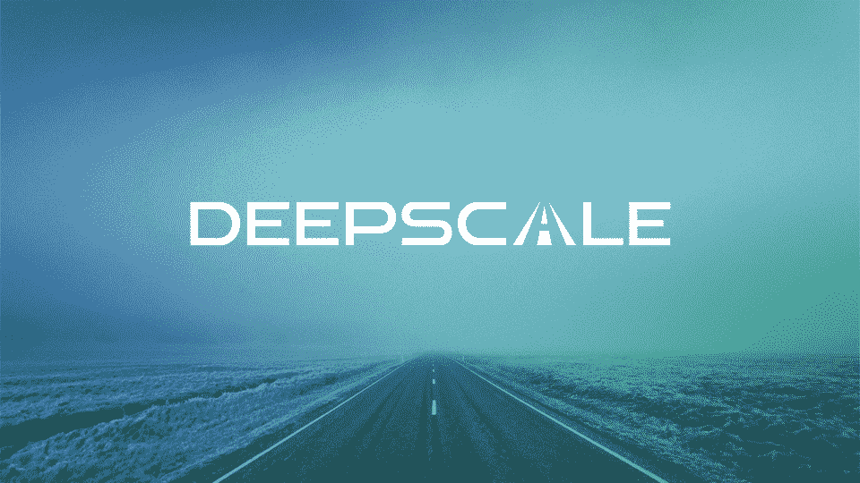
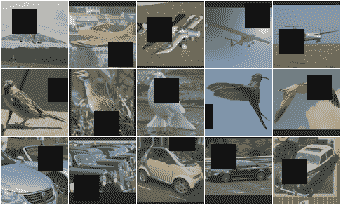
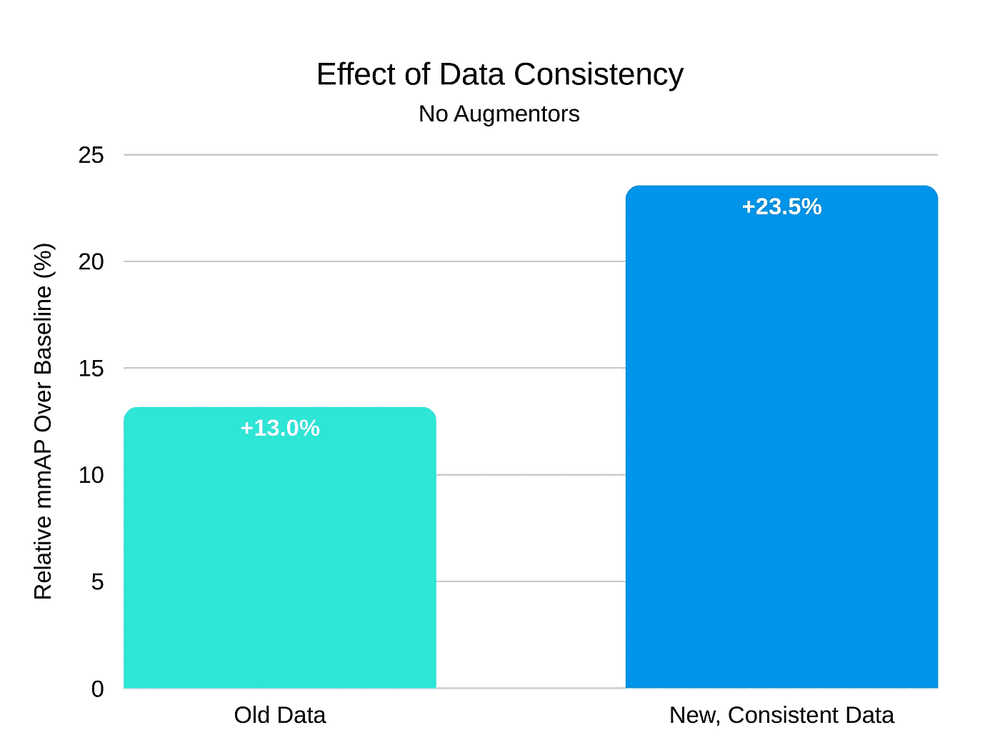
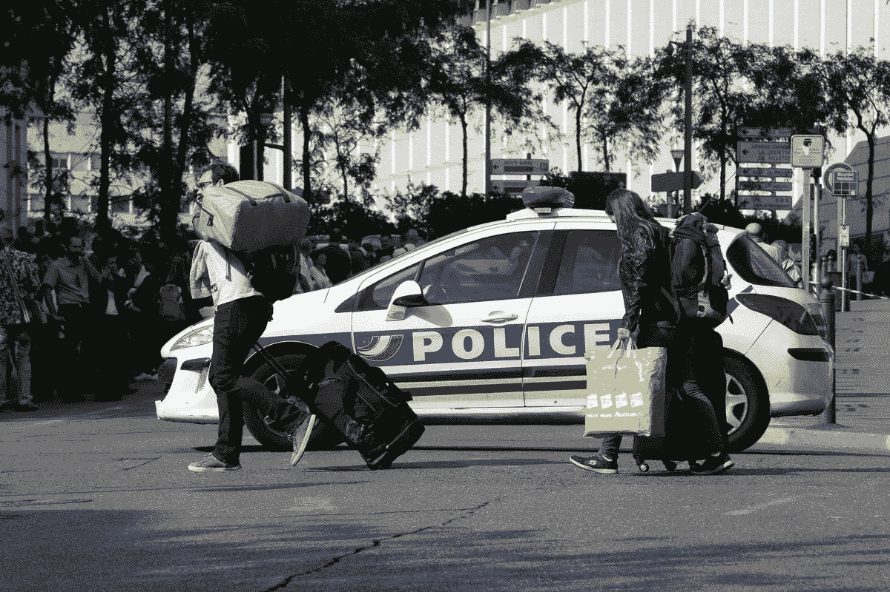
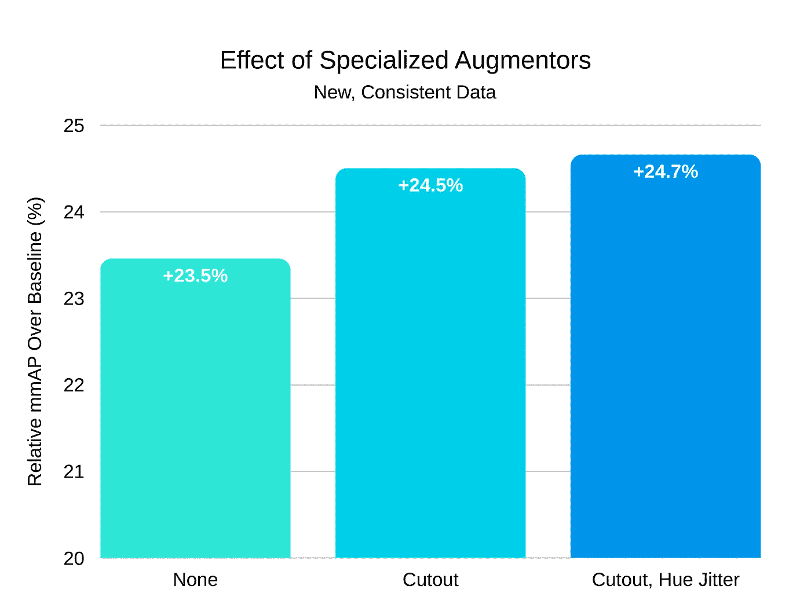
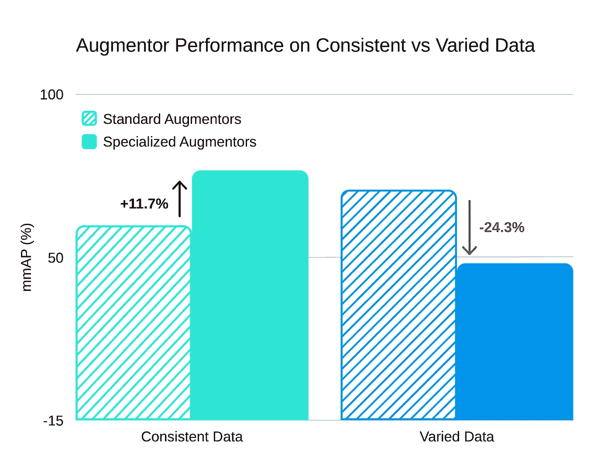

# 当传统智慧失败时:重新审视自动驾驶汽车的数据增强

> 原文：<https://towardsdatascience.com/when-conventional-wisdom-fails-revisiting-data-augmentation-for-self-driving-cars-4831998c5509?source=collection_archive---------0----------------------->

DeepScale 一直在寻找提高我们的对象检测模型性能的方法。在这篇文章中，我将讨论我们为此启动的一个项目，以及我们在这个过程中的非直觉发现。

# 增强实验和不直观的结果

在我开始在 DeepScale 实习时，我的任务是实现一个新的数据增强器，以改善我们的对象检测工作。其中一个突出的是一个简单的技术，叫做[剪切正则化](https://arxiv.org/abs/1708.04552)。简而言之，剪切将输入图像中随机定位的正方形涂黑。

**Cutout applied to images from the** [**CIFAR 10 dataset**](https://www.cs.toronto.edu/~kriz/cifar.html)**.**

原始论文表明，剪切可以显著提高视觉应用的精度。正因为如此，当我将它应用于我们的数据时，我很惊讶我们的检测 mmAP 下降了。我在我们的数据管道中搜索这个问题，发现了更令人惊讶的事情:*我们已经在使用的所有增强器都极大地损害了性能。*

在这个探索的开始，我们使用翻转、裁剪和权重衰减正则化，这是对象检测任务的标准方案。通过一项消融研究，我发现这些都损害了我们内部数据集的检测性能。相对于网络的初始性能，移除默认增强器后，mmAP*提升了 13%。

**mmAP 是* [*COCO 对象检测挑战*](http://cocodataset.org/#detection-2018) *的默认评估指标。它代表“平均平均精度”AP 表示单个类的所有例子的边界框检测的平均精度。对所有类别的 AP 求平均值得到 mAP，对交集/并集阈值范围(从 0.5 到 0.95)的 mAP 求平均值得到 mmAP。*

**Generally, we would expect adding weight decay, flip and crop to improve performance by a few points each, as shown in the dashed bars. In our case, however, these augmentors hurt mmAP by a relative 8.4%, 0.1% and 4.5%, respectively. Removing all augmentors lead to a total performance boost of 13%.**

那么，为什么这些标准增强器会损害我们的表现呢？为了解释我们不直观的结果，我们不得不从基本原理出发，重新审视图像增强的概念。

# 我们为什么使用数据增强

(本节介绍数据扩充背后的直觉。如果你已经熟悉增强，请随意跳到“为什么自动驾驶汽车数据不同。”)

过拟合是深度神经网络的常见问题。神经网络极其灵活；然而，考虑到公共数据集的大小，它们经常被过度参数化。这导致模型学习数据集中的“噪声”而不是“信号”换句话说，他们可以记住数据集的非预期属性，而不是学习关于世界的有意义的一般信息。因此，当给定新的真实世界数据时，过度拟合的网络无法产生有用的结果。

为了解决过度拟合的问题，我们经常“增加”我们的训练数据。扩充视觉数据的常用方法包括水平随机翻转图像(翻转)、改变图像色调(色调抖动)或裁剪随机部分(裁剪)。

**A picture of a giraffe (top left) shown with several common image augmentors: flip (top right), hue jitter (bottom left) and crop (bottom right). Despite these transformations, it is clear that each image is of a giraffe.**

像翻转、色调抖动和裁剪这样的增强器有助于克服过度拟合，因为它们提高了网络的泛化能力。如果你训练一个网络来识别面向右的长颈鹿*和面向左的长颈鹿的翻转图像上的*，该网络将学习长颈鹿是长颈鹿，不管方向如何。这也迫使网络学习更有意义和更普遍的关于什么使某物成为长颈鹿的信息——例如，棕色斑点皮毛的存在。

像 COCO 对象检测挑战赛这样的公共数据集表明了泛化的必要性。因为这些数据集包含从许多来源聚合的图像，这些图像是在各种条件下从不同相机拍摄的，所以网络需要概括许多因素才能表现良好。网络需要应对的一些变量包括:光照、比例、相机内在因素(如焦距、主点偏移和轴倾斜)和相机外在因素(如位置、角度和旋转)。通过使用许多数据增强器，我们可以训练网络来概括所有这些变量，就像我们在前面的例子中能够概括长颈鹿的方向一样。

**These examples from the COCO dataset were taken with different cameras, from different angles, scales and poses. It is necessary to learn invariance to these properties to perform well on COCO object detection.**

# 为什么自动驾驶汽车数据不同

与 COCO 和其他公共数据集的数据不同，自动驾驶汽车收集的数据令人难以置信地一致。汽车通常相对于其他车辆和道路物体具有一致的姿态。此外，所有图像都来自相同的摄像机，安装在相同的位置和角度。这意味着同一个系统收集的所有数据都具有一致的相机属性，就像上面提到的 extrinsics 和 intrinsics 一样。我们可以使用将用于生产的相同传感器系统来收集训练数据，因此自动驾驶汽车中的神经网络不必担心概括这些属性。正因为如此，*过度适应系统的特定相机属性实际上是有益的。*

**These examples from a single car in the** [**Berkeley Deep Drive dataset**](http://bdd-data.berkeley.edu/) **were all taken from the same camera, at the same angle and pose. They also have consistent artifacts, such as the windshield reflection and the object in the bottom right of each frame.**

自动驾驶汽车数据可能如此一致，以至于 flip 和 crop 等标准数据增强器对性能的影响大于帮助。直觉很简单:翻转训练图像没有意义，因为摄像头将始终处于同一角度，汽车将始终位于道路的右侧(假设美国驾驶法律)。汽车几乎永远不会在道路的左侧，摄像头也永远不会翻转角度，所以对翻转数据的训练迫使网络过度概括它永远不会看到的情况。类似地，裁剪具有移动和缩放原始图像的效果。由于汽车的摄像头总是在相同的位置，具有相同的视野，这种移动和缩放迫使泛化。过度泛化会损害性能，因为网络会浪费其预测能力来学习不相关的场景。

**A front-view of the sensor array on DeepScale’s data collection car. All sensors are permanently mounted, so all data will have consistent extrinsics — position, angle and rotation. Because we use the same sensors at test-time, all data also has consistent intrinsics — focal length, principal point offset and axis skew. By harnessing the properties of a specific car’s sensors, we can boost vision performance when deploying the same sensor system.**

# 更多改进

自动驾驶汽车数据唯一一致的认识解释了我们令人惊讶的增强结果。接下来，我想看看我们是否可以利用这种一致性来进一步提高性能。在引入任何新的增强器之前，我检查了我们的数据集，看看我们是否可以在数据级别进行任何改进。我们的训练集最初包括来自两个广角相机和一个带变焦镜头的相机的图像。变焦镜头产生类似于裁剪放大的缩放和移动效果。在测试时，我们只使用广角摄像机，所以对变焦图像的训练迫使网络过度概括。我发现从我们的训练集中移除缩放图像给了我们 mmAP 另一个巨大的提升。这证实了我们的假设，即训练集和测试集之间的一致性对于性能非常重要。

**After removing the original image augmentors, I trained and tested on a new, more consistent dataset. This improved mmAP by an additional 10.5% relative to our original scheme.**

在此之后，我考虑了可以在不改变相机属性的情况下改变我们的训练数据的增强器。Cutout 是我在这个项目开始时实现的增强器，看起来是个不错的选择。与翻转和裁剪不同，剪切不会以显著影响相机属性的方式改变输入(即翻转、移动或缩放)。相反，剪切模拟障碍物。障碍物在现实世界的驾驶数据中很常见，障碍物的不变性有助于网络检测部分被遮挡的对象。

**Obstructions are common in real-world driving data. In this image, two pedestrians block our view of the police car, while large bags block our view of the pedestrians.**

色调抖动增强也可以在不影响相机属性的情况下帮助泛化。色调抖动只是将输入的色调随机移动一个量。这有助于网络对颜色进行归纳(即红色汽车和蓝色汽车应该被相同地检测到)。正如所料，抠图和色调抖动都提高了我们的新测试集的性能。

**Adding cutout and hue jitter augmentation to the new dataset increased relative mmAP by 1% and 0.2%, respectively. This gives us a total 24.7% boost over our original data scheme (flip, crop and weight decay on the old dataset). Note that the y axis is scaled to better show the difference of small improvements.**

# 警告

值得注意的是，这些增强技巧对包含不同相机类型、不同角度和比例的图像的数据集不起作用。为了演示这一点，我通过向原始测试集引入随机翻转和裁剪，创建了一个具有不同相机属性的测试集。正如预期的那样，我们新的专门的增强方案在更一般的数据集上比我们原来的标准增强器表现更差。

**When applied to consistent self-driving car data, our specialized augmentation scheme (cutout and hue jitter) provides an 11.7% boost in mmAP over the standard augmentation scheme (flip, crop and weight decay); however, when applied to more varied data, our specialized scheme results in a drop of 24.3% vs the standard scheme.**

确保你的测试数据覆盖了你的模型在现实世界中看到的例子的范围，这一点总是很重要的。使用专门的数据扩充使得这种健全性检查更加重要。你很容易欺骗自己，以为自己提高了模型的性能，而实际上你只是过度适应了一个过于简单的数据集(例如，只使用清晰的白天图像驱动数据)。

如果您的数据集真的健壮且一致，这些技巧可以成为提高性能的强大工具包。如图所示，通过使我们的网络能够学习我们车辆的摄像机属性，我们能够显著提高我们的对象检测性能。这可以应用于在部署中使用的同一传感器系统上收集训练数据的任何领域。

# 外卖食品

**Networks that perform well on satellite images (left) or cellular data (center) might require fundamentally different approaches than those built for common research datasets like** [**ImageNet**](http://image-net.org/index) **(right).**

事后看来，这些增强变化似乎是显而易见的。现实是，我们被传统智慧蒙蔽了双眼。像 flip 和 crop 这样的增强器在研究问题上取得了如此广泛的成功，以至于我们从未想过质疑它们对我们具体问题的适用性。当我们从基本原则重新审视增强的概念时，很明显我们可以做得更好。机器学习领域有许多类似的“通用最佳实践”，例如如何设置学习速率，使用哪个优化器，以及如何初始化模型。对于 ML 从业者来说，不断地重新审视我们关于如何训练模型的假设是很重要的，尤其是在为特定的应用构建模型的时候。与 ImageNet 相比，使用卫星制图数据或蜂窝成像时，视觉问题有什么变化？我们认为，像这样的问题在学术界探索不足。通过用新的眼光看待它们，我们有可能极大地改善机器学习的工业应用。

马特·库珀(Matt Cooper)是 DeepScale 的深度学习软件工程师(也是前实习生)。更多来自 DeepScale 的信息，请查看我们的[媒体页面](https://blog.deepscale.ai)。