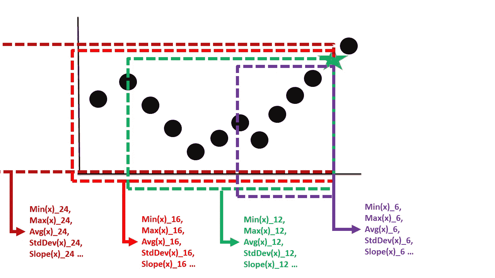
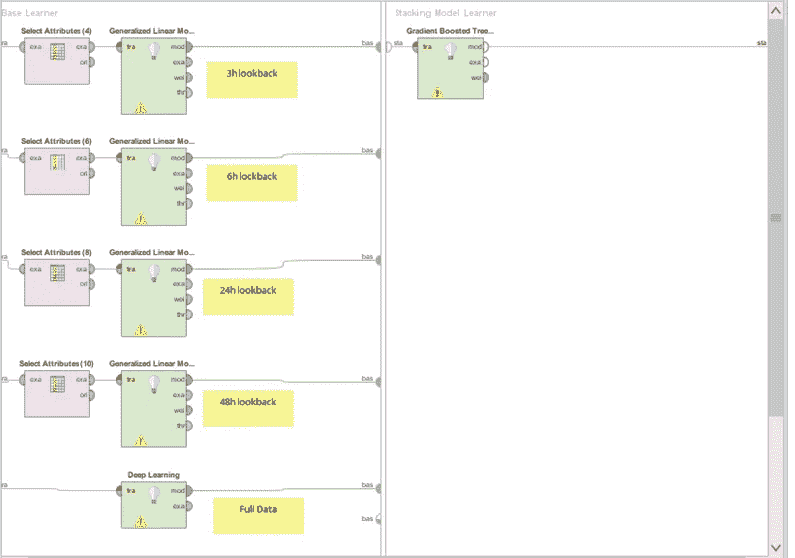

# 当交叉验证失败时

> 原文：<https://towardsdatascience.com/when-cross-validation-fails-9bd5a57f07b5?source=collection_archive---------2----------------------->

验证可能是数据科学中最重要的五种技术之一。我使用交叉验证作为我的默认验证方案，但是这个星期我遇到了一个关于我的验证性能的问题。我花了一些时间来解决这个问题，所以我想和你分享一下。

**机器学习过程**

在 RapidMiner 的工作中，我遇到了一个挑战，那就是预测一个包含 9 个相关序列的时间序列。我通常的方法是窗口回归。我们可以将这种方法分为两部分:特征提取和学习。

Schema of windowed feature extraction. Standard features are extracted on four different window sizes. The resulting features are put into one row for the learning process.

在特征提取中，我对所有时间序列加窗并提取它们的特征。在这个具体的例子中，我的摘录相当简单，即最小，最大，标准偏差，平均值，斜率和线性回归轴。我在 4 个不同的窗口大小上做这个特征提取。

Stacking Implementation in RapidMiner.

第二步是建模。当我从一个广义的线性模型开始时，我很快转向了更复杂的东西。结果是一个堆叠模型。基础学习者是在每个不同窗口大小上学习的 4 个广义线性模型。此外，我还学习了所有窗口大小和原始数据点本身的神经网络。这些模型的预测和原始特征作为堆叠学习器被输入到梯度提升树中。

**验证问题**

在 5 重交叉验证中进行建模。最终测试误差为 2%。这一结果对客户来说非常有希望，他要求提供 6 月份的评分数据集，以便进行自己的性能计算和交叉检查。

我把六月作为交叉检查验证性能的坚持期。令我惊讶的是，我看到坚持的表现是 4%。虽然小的偏差并不少见，但验证和保持性能之间的巨大差异是不可容忍的——所以我开始了寻找根本原因的征服。

**潜在问题 I——季节性和停滞**

我的第一个想法是，我在选择坚持方面做得不好。这些数据包含了每年的季节性，仅仅把六月作为一个持续时间可能是天真的。可能我的模型在预测冬季月份方面很好，但在预测夏季月份方面很差。结果将是更差的拒绝性能，因为这只是在夏季计算的。

为了验证这一点，我查看了每月的交叉验证性能。有季节性，但约为 0.2%。所以这很难成为误差增加 2 倍的原因。

一个类似的想法是，我可能只是运气不好，六月很难预测。因为我的方法使用了一个窗口，所以采用一个随机保持集是很重要的。我决定再坚持一个月——2016 年 1 月。结果几乎一样。维持误差仍然是 2 倍测试误差。

**潜在问题二——过度拟合**

交叉验证通常是衡量精确性能的一个非常好的方法。虽然它不能防止您的模型过度拟合，但它仍然度量了真实的性能估计。如果你的模型过度拟合你，它将导致更差的性能指标。

一个已知的问题是，交叉验证只验证她体内的东西。超参数优化通常在验证之外完成。因此，您无法验证这种优化引入的过度拟合。如果您仔细观察，您还会发现，手动特征生成和模型选择也是模型的超参数，并且具有相同的问题-它们没有通过交叉验证进行检查。为了不被这个欺骗，你需要一个额外的坚持集来比较分析结束时的性能

我应用了一个标准技术来克服过度拟合。我降低了模型的复杂性。对我来说，这相当简单:我已经从我的系综中移除了神经网络。这导致了更差的交叉验证性能。但是抵抗性能仍然差了 2 倍。我仍然面临着同样的问题。

**解决方案相关行**

现在，对我来说，这是回到最基本的。思考假设，找出可能出错的地方。

交叉验证的一个假设是所有的行都是相互独立的。如果你做客户分析，这是相当微不足道的，但如果你做窗口时间序列分析，就不是了。

事实上，我的特征提取方法产生了几乎相同的行。例如，我计算每个窗口的最小值和最大值。很可能下一个窗口以及表中的下一行将具有相同的最小值和最大值。如果您将此输入到交叉验证中，很可能对于大多数训练行来说，在测试部分都有一个几乎相同的行。这让我意识到我是在衡量培训，而不是测试表现。

为了减少这种影响，我每月都计算自己的 batchid。我的 batchId 被定义为(自 1970 年以来的月数)%5，因此我的数据点在相应的月份中只有很小的重叠。

我的坚持性能现在比验证稍微好一点。任务完成。