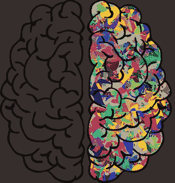
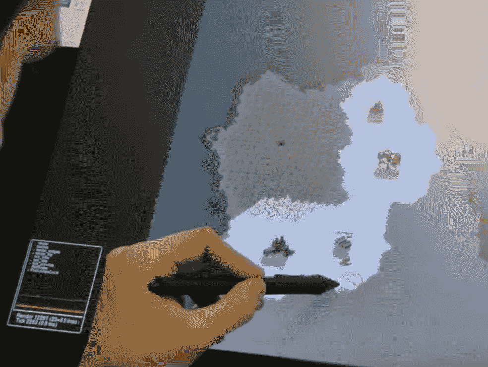
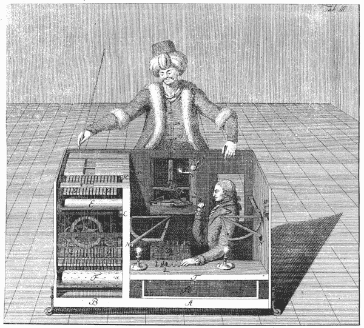

# 当一个人连人工智能都不够好的时候

> 原文：<https://towardsdatascience.com/when-even-a-human-is-not-good-enough-as-artificial-intelligence-c39c9fda4644?source=collection_archive---------5----------------------->

Photo by [Gertrūda Valasevičiūtė](https://unsplash.com/photos/xMObPS6V_gY?utm_source=unsplash&utm_medium=referral&utm_content=creditCopyText) on [Unsplash](https://unsplash.com/?utm_source=unsplash&utm_medium=referral&utm_content=creditCopyText)

2012 年，我为我的机器学习和应用研究收集并汇编了一个数据集。在研究过程中，我自己伪造了一个人工智能。在后期采访中，我听到了许多与会者最奇怪的陈述:**“人工智能犯了很多错误。”**。这篇帖子是关于人们对人工智能性能的偏见，以及我们对人工智能系统的期望有多现实。

# **人类智能 vs 人工智能**

我喜欢用数字来衡量和解释事物。我做的最常见和快速的测量是分数和子分数。如果我需要比较两个东西，我会列出变量并给它们权重。有了那个列表，我给变量打分，乘以权重，求和。这给了我一个单一的数字。对于许多事情，我发现它很容易使用。挑选买哪台电视，接下来做哪项工作，或者测试一种方法是否比其他方法更好。

虽然有些东西很容易衡量，但智力不在其中。智力是一个非常抽象和复杂的东西来衡量。甚至智力的定义也很复杂。什么是智力，如何衡量智力，这些都不是我想要回答的问题。我对这篇文章的好奇心是，我们人类如何看待人工智能，以及我们对它的期望是什么。在我看来，当人们评判 AI 的能力时，我们是苛刻的。我们希望人工智能是完美的。我们没有显示出我们为人工智能提供的与人为错误成比例的灵活性。我们希望人工智能“像人一样”。也许是因为最近“像大脑一样工作”的广告(谷歌“*像大脑一样工作”*)。

不管原因是什么，这是一种常见的模式。我们期待人工智能能与人类智能相媲美。

# 电子奥兹中的人工智能巫师

我进行了一系列数据收集实验，这让我在 2012 年写下了这篇文章。我正在使用机器学习进行一项关于草图识别(即对手写符号和图纸进行分类)的研究。如果你对草图识别器感兴趣或者想有一个更具体的想法，这里有一个很棒的你可以试试:[https://quickdraw.withgoogle.com/](https://quickdraw.withgoogle.com/)。我想实现的事情之一是将一个实时策略视频游戏的交互模型从鼠标/键盘转换成草图。有了草图界面，人们可以通过草图而不是鼠标点击和按键来玩游戏。想象一下，当你想建造一座建筑时，你可以在地图上你想建造的地方画一个简单的房子，而不是从菜单中选择它，然后用鼠标点击把它放到地图上。

A Snapshot from Experiment Records Where of a User Plays the Strategy Game via Sketching

计划是用机器学习开发一个草图识别器。为了实现它，第一步是从多人那里收集许多手绘草图，这样我就可以用它们来训练一个模型。我不想让人们画出他们在屏幕上看到的东西，而是想让他们置身于真实的环境中。他们用像人工智能这样的草图玩游戏的环境已经准备好了。我认为有了这个设置，人们会比在一个放松的、没有时间限制的、没有压力的“临摹”环境中画得更“真实”。为了在那个环境中收集数据，我创建了一个“绿野仙踪”环境。

这个想法很简单。你准备一个有两个房间/空间的场景。在一个空间中，您放置与会者将使用的计算机。在第二个房间里，你放了另一台你要用的电脑。这个想法是把这两台电脑连接起来，这样你就可以看到与会者在做什么，并在你自己的电脑上采取相应的行动。对我来说，这是为了素描识别。因此，如果与会者画了一所房子，我可以从我的电脑上看到它，并发出命令来画房子。我们的目标是替换一个没有到位的人工智能系统，这样看起来就像有一个真实的人工智能，实际上是一个在不同房间的人。

“Mechanical Turk” was a chess playing machine from late 18th century that seems autonomous, but in reality is operated by a human. In that sense, it was a Wizard of Oz setting. [https://en.wikipedia.org/wiki/The_Turk](https://en.wikipedia.org/wiki/The_Turk) .

当我的“奥兹”准备好时，我邀请人们加入我的实验(这不是一件容易的事，要求人们免费放弃他们的时间)。正如所解释的，有一个房间有电脑和一个绘图屏幕，参加者坐在那里，另一个房间，参加者看不到我在哪里模仿人工智能。我告诉与会者，他们将使用草图作为唯一的输入媒介来玩游戏，有一个人工智能将识别他们的草图并相应地执行操作。

实验结束后，我让他们填写了一份问卷，然后进行了非正式的交谈，因为有些人对这种玩游戏的方式感兴趣。这是我感到困惑的地方。许多人告诉我并在问卷上写下了同样的事情:

> “识别我的草图的人工智能犯了错误”

你可以明白我为什么困惑了。我是识别草图的“人工智能”,他们告诉我人工智能表现不佳！这怎么可能？我在识别这些符号时犯了错误吗？可能是这样，但是符号很简单，所以我不认为我犯了很多错误。

这些轶事证据从未进入研究结果，但让我困惑了很长一段时间。如果我，作为一个人类，辜负了人们作为识别者的期望，我们怎么能开发出一个让用户满意的人工智能呢？如果我公开我是人工智能会有不同吗？他们是否预先判断出人工智能总是会出错？我们对人工智能有什么期望？

# 你对机器的期望是什么？

对于大多数识别器来说，90%的准确率是一个里程碑。感觉是个很棒的数字。“你的模型有 90%的准确率”。我希望自己在大多数情况下，我会宣布问题已经解决，并将其提交给利益相关者。我也希望他们对结果感到满意。想象一下你在一次考试中得了 90 分。

然而有一件事。实际上，它在现实生活中可能没有那么好。想象一下，你正在画一个圆，10 次中有 9 次，人工智能正确地识别出它，并采取相应的行动。但是 10 次中有 1 次，它将 1 识别为另一个东西(例如三角形)并且仍然采取行动。在那里，你试图停止人工智能采取的行动，并重做。如果你正在使用语音助手，你可能已经说过:“不！，停！，不要放那首歌！这跟我问的还差得远呢！中止！中止！”。是不是觉得语音识别性能不够好？微软在 2017 年的博客中公布了 5.1%的错误率(准确率 95.9%)([https://www . Microsoft . com/en-us/research/blog/Microsoft-researchers-achieve-new-conversatile-speech-recognition-milestone/](https://www.microsoft.com/en-us/research/blog/microsoft-researchers-achieve-new-conversational-speech-recognition-milestone/))。他们还测量了人类的错误率，同样的指标为 5.1%。所以即使你认为你的语音助手的表现很差，但它实际上已经非常接近人类的表现了。

当你开始一个人工智能项目时，你需要正确地确定利益相关者的期望。如果你管理期望，双方都会更快乐。例如，如果你的利益相关者头脑中有一个完美的图像识别器，那么你一开始就已经失败了。即使你开发了一个很好的识别器，也不会像她想的那样完美。因此，管理预期，并考虑现实生活中的准确性。如果每隔一段时间就对语音助手喊一声“中止”是不可以接受的，也许你在购买或开始开发一个之前应该三思。