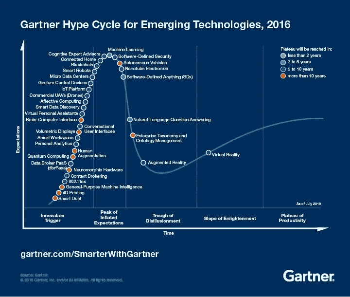
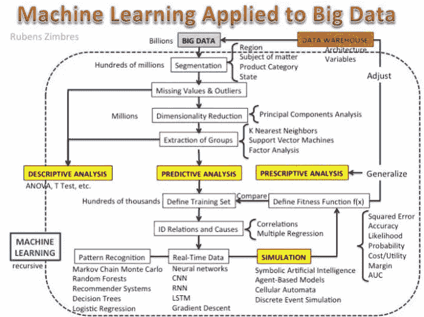

# 当机器学习遇到大数据

> 原文：<https://towardsdatascience.com/when-machine-learning-meets-big-data-4923091ba140?source=collection_archive---------6----------------------->

首先让我们看看为什么现在周围的每个人都对机器学习感兴趣，我相信 Gartner 的 ***炒作新兴技术的周期情节*** 答案也是一样的。

它清楚地表明，机器学习现在正处于膨胀的期望的顶峰，我们都可以闻到这一点。无论我们在哪个领域，我们都看到个人、行业和学术界在谈论自动化，使用人工智能、机器学习和数据挖掘让机器变得更加智能和强大。通过查看机器学习的当前应用，我们可以自信地说它比气体更有实质*(我记得人们说气体闻起来很香的日子)*

***但问题是——机器学习突然变成炒作了吗？***

为了理解这一点，我们需要回顾一下机器学习的基础知识，下面是由 [ExpertSystems 提供的机器学习的定义。](http://www.expertsystem.com/machine-learning-definition/)

> **机器学习**是人工智能(AI)的一种应用，它为系统提供了自动学习和根据经验改进的能力，而无需显式编程。**机器学习**专注于开发能够访问数据并利用数据为自己学习的计算机程序。

想象程序可以自己学习似乎很令人兴奋，但它们需要数据，大量可以用于学习的数据。

艰难的机器学习已经有 50 多年的历史，并且在大约 40 年前就已经开始使用，但是直到最近 20 年，世界才开始钦佩它。谷歌、IBM、微软和百度等大巨头已经开始将主要精力转移到机器学习和深度学习应用上。

那么，在过去的二十年里，是什么导致了这种变化呢？

在过去的二十年里，世界上出现了许多令人敬畏的东西，但推动机器学习和其他相关领域增长(阅读炒作)的只有数据。由于无数的新技术、设备(台式机、笔记本电脑、移动设备等)、社交网站和技术在世界范围内的渗透，人类产生的数据量以千兆字节计，这为数据库、数据挖掘、信息检索、机器学习、深度学习、人工智能等创造了机会。

> 从一开始到 2003 年，我们产生的数据量是 50 亿千兆字节。如果你把数据以磁盘的形式堆积起来，它可能会占满整个足球场。2011 年，每两天就创造了相同的数量，2013 年，每十分钟就创造了相同的数量。这一比率仍在大幅增长。尽管所有这些产生的信息都是有意义的，并且在处理时可能是有用的，但是它们被忽视了。

世界上 90 ***%的数据是最近几年才产生的。数据是新的石油，推动着信息革命。***

从一开始，这种数据增长就为新的数据存储系统提供了机会。直到 2000 年，我们关心的主要是关系数据，主要是结构化的，我们有许多方法来存储它。看看下面的数据库时间表，2000 年以后，数据是非结构化、半结构化的、巨大的，人们明白保留它们在未来会有所帮助，因此大数据出现了，许多技术也在上面。

太酷了，像 Hadoop 这样的大数据技术让工作变得简单，并为人工智能和机器学习模型创造了机会。

简而言之，让我们看看机器学习是如何应用于一般数据的。在下面提到的步骤中，捕获原始数据和清理是最乏味的工作。如果没有像 map-reduce 这样的分布式技术，清理大量数据是不可能的。

现在，我们对机器学习如何需要大数据有了合理的想法，但如何将这两者结合起来的设计和架构仍然变得具有挑战性。

Rubens Zimbres 和著名的数据科学家定义了如何在大数据上应用机器学习的一般架构。下面的情节清晰地展示了如何让这两个人结婚。这里最具挑战性的部分是用适当的设计维护数据仓库，以便机器学习模型可以无缝地消费相同的数据。

在我的下一篇文章中，我们将探索每一个步骤。到目前为止，我们对如何结合大数据&机器学习有了看法。

感谢您的阅读，请在评论中分享您的想法、反馈和想法。你也可以通过 twitter 上的@ [simplykk87](https://twitter.com/simplykk87) 和 linkedin 上的[联系我。](https://www.linkedin.com/in/krishna-kumar-tiwari-723b761b/)

参考文献

 [## 数据科学和机器学习简讯# 55

### 我分享引起我注意的文章，并在每周五发布“数据科学和机器学习时事通讯”。如果你…

www.necatidemir.com.tr](http://www.necatidemir.com.tr/2016/09/data-science-machine-learning-newsletter-55/) 

[https://blogs . NVIDIA . com/blog/2016/07/29/whats-difference-人工智能-机器学习-深度学习-ai/](https://blogs.nvidia.com/blog/2016/07/29/whats-difference-artificial-intelligence-machine-learning-deep-learning-ai/)

[https://www . tutorialspoint . com/Hadoop/Hadoop _ big _ data _ overview . htm](https://www.tutorialspoint.com/hadoop/hadoop_big_data_overview.htm)