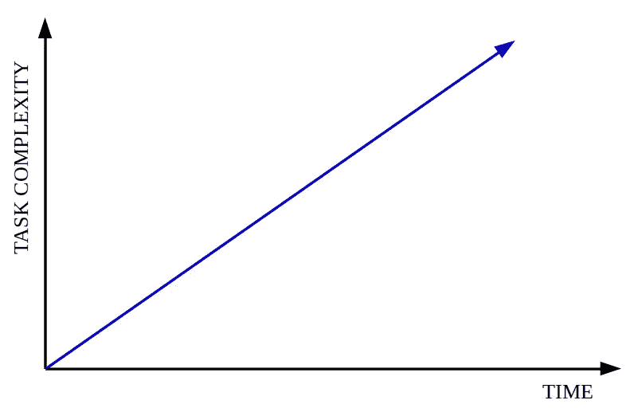
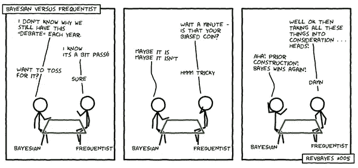

# 当机器学习遇到复杂性:为什么贝叶斯深度学习是不可避免的

> 原文：<https://towardsdatascience.com/when-machine-learning-meets-complexity-why-bayesian-deep-learning-is-unavoidable-55c97aa2a9cc?source=collection_archive---------5----------------------->

Managing people is complex. Photo by [Anna Dziubinska](https://unsplash.com/@annadziubinska?utm_source=unsplash&utm_medium=referral&utm_content=creditCopyText) on [Unsplash](https://unsplash.com/s/photos/crowd-of-people?utm_source=unsplash&utm_medium=referral&utm_content=creditCopyText).

到现在为止，你们所有人可能已经关注深度学习研究很长时间了。1998 年，LeCun 等人提出了非常简单的手写数字 MNIST 数据集，并用他们的 LeNet-5 证明了我们可以在其上达到很高的验证精度。随后提出的数据集变得更加复杂(例如 ImageNet 或 Atari games)，因此在其上表现良好的模型也变得更加复杂。同时，这些模型可以执行的任务也变得更加复杂，例如，Goodfellow 等人的 [GANs](https://arxiv.org/abs/1406.2661) (2014)或 Kingma & Welling 的 [VAEs](https://arxiv.org/abs/1312.6114) (2014)。我个人的一个亮点是 Eslami 等人的[神经场景表示和渲染](https://deepmind.com/blog/neural-scene-representation-and-rendering/) (2018)，它清楚地表明了神经网络迄今为止可以执行相当复杂的任务。我看到神经网络能够执行的任务的复杂性明显上升，我不认为这种趋势会很快停止或放缓。

Tasks which want to be solved by deep learning in the future

在这篇文章中，我将给出清晰的论据，说明为什么贝叶斯方法如此广泛适用，并且当我们想要解决更复杂的任务时必须应用。

值得注意的是，我用社会科学采用的术语来谈论复杂性，因为我个人有兴趣观察社会系统中非常高层次的模式，例如，大学学生或来自低收入国家的移民。当你刚刚打开报纸时，这些问题是我们当代最紧迫的问题，所以我也想鼓励你们所有人尝试用机器学习来解决这些问题，理想的是贝叶斯深度学习。

# 什么是复杂性？

在深度学习的背景下，复杂性最好理解为复杂系统。系统是以某种方式相互作用的代理人的集合体。这些代理一起形成一个整体。复杂系统的一个基本特征是这些代理可能会非线性地相互作用。复杂性研究人员通常认同两种不同层次的复杂性:简单或受限的复杂性，以及复杂或一般的复杂性( [Byrne，2005](https://journals.sagepub.com/doi/10.1177/0263276405057194)[；Morin，2006【分别为 )。根据定义，一般复杂性不能以任何方式进行数学建模，而受限复杂性可以。](http://cogprints.org/5217/1/Morin.pdf)

Byrne ( [2005](https://journals.sagepub.com/doi/10.1177/0263276405057194) )认为，大多数社会系统都属于一般复杂性的范畴，这已经是我们数学方法的一个合理的限制，但是我们现在看到，任何我们认为仅仅拥有有限复杂性的系统。我们这样做，是因为我们未来的深度学习任务可能是调查社会中的模式，鉴于我们迄今为止在基于深度学习的解决方案方面的进展速度，这些解决方案用于越来越复杂的任务。因为社会的代理人，也就是我们所有人，有时确实会不可预测地相互作用，所以我们可以肯定地说，非线性特性是成立的。

# 复杂系统建模

记住，对任何或多或少复杂事物的数学描述仅仅是模型，而**不是**基本真理([科恩&斯图尔特，1995](https://www.goodreads.com/book/show/287896.Nature_s_Numbers) )，我们可以直接推断，在任何复杂的情况下，贝叶斯推理都比频率主义推理更适合使用。在贝叶斯推理中，我们将模型参数 *θ* 视为随机变量，也就是说，我们想要学习它们，而在频率主义推理中，我们将模型参数 *θ* 视为固定的，但未知的事实描述。在 frequentist 推断中，我们进行的实验被视为来自无限大的一组完全相同的实验的样本(例如，掷出一个[公平的骰子](https://www.mathsisfun.com/geometry/fair-dice.html)，即决定每次掷骰结果的真实模型参数 *θ* 是骰子每边的 1/6)。在进行我们的一系列实验之前，我们先定义我们想要多久做一次。在进行了这些数量的实验后，我们有了每个模型参数的*置信区间*，它告诉我们**置信区间包含真实参数**的概率。

因此，在频率主义者的推理中，我们认为模型参数 *θ* 是不可改变的，因此这一学派认为理想模型，即无限频繁地进行我们的实验，代表了任何或多或少复杂事物的真实状态。

> 本质上，这意味着频率主义推理的支持者声称，我们能够用无限多的实验来描述真理，并且这些描述真理的模型参数θ永远不会改变。

这可能适用于任何非常简单的实验，但它从根本上违背了 Stewart(1995 年)关于自然系统的想法，因此比类似于滚动骰子的简单实验更复杂。他们认为，不管过去发生了什么，系统都会随着时间的推移而改变，并且会发展出至今尚未出现的新现象。从社会科学的角度来看，这一论点也非常符合复杂性的定义(参见 [*涌现*](https://en.wikipedia.org/wiki/Emergence) )。

## **这对贝叶斯推断意味着什么？**

在贝叶斯推理中，我们确实以概率分布的形式学习模型参数 *θ* 。这样做，我们可以保持它们的灵活性，并且可以在系统的新观测到来时更新它们的形状。当我们的目标是对复杂系统建模时，这听起来不是更合理吗？

> 但是，这并不是贝叶斯推理比频率主义推理更适合用于复杂任务的唯一原因。

以前，我们已经定义了一个复杂系统，其组件，即其代理之间可能存在非线性交互。迄今为止，还没有为非线性系统开发出确定性的数学形式，也永远不会开发出来，因为根据定义，复杂系统是**非确定性的**。换句话说，如果我们在一个复杂的系统中重复一个实验，第二个实验的结果不会和第一个一样。

> 这在贝叶斯和频率主义推理中仍然是完全可行的，但是当我们不能对任何事情都有确定性的解决方案时，有什么明显的途径可以选择呢？

完全正确，我们近似。

这正是我们在贝叶斯方法中所做的:棘手的后验概率分布 *p(θ|D)* 是近似的，或者通过变分分布 *q(θ|D)* 我们喜欢在神经网络中这样做，或者通过蒙特卡罗方法我们经常在概率图形模型中这样做。相反，在频率主义推理中，我们采取某种无知的方法，只是更频繁地重复实验，希望最终得到一个可接受的置信区间，其中包括我们的真实参数。这个“接受水平”被称为置信水平，表示为 *α* ，你可能以前见过。一般约定， *α* 至少要 95%。

# 这一切对深度学习研究的未来意味着什么？

嗯，还要考虑到任何深度学习模型本身实际上都是一个复杂的系统。我们有神经元，你可以把它看作代理，以及它们之间的非线性激活函数，你可以把它看作代理的非线性关系。例如，在 CNN 中，过滤器从这种设置中发展出来，你可以将它视为一种突发现象。

随着希望通过深度学习解决的任务越来越复杂，同时保持对复杂性的理解，因为它目前在社会科学中存在，所以**可能没有办法绕过贝叶斯深度学习**的应用来解决这些任务。神经网络是能够发现随机变量之间非线性关系的少数方法之一，这是复杂系统建模的一个强烈需求。此外，贝叶斯推理是自然归纳的，通常接近真理，而不是旨在准确地找到它，这是频率主义者的推理。

请记住，这只是利用贝叶斯深度学习的另一个论点，除了[具有测量不确定性的优势](https://medium.com/@laumannfelix/reflections-on-bayesian-inference-in-probabilistic-deep-learning-416376e42dc0)和奥卡姆剃刀的自然体现。

我希望你喜欢阅读这篇不太专业的文章。除了我已经链接的文章，下面是两本我强烈推荐的社会科学书籍。

**延伸阅读:**
伯恩 d .&卡拉汉 G. (2013)。复杂性理论和社会科学:最新发展水平。劳特利奇。约翰逊(2002 年)。*涌现:蚂蚁、大脑、城市和软件的互联生活*。西蒙和舒斯特。

快乐阅读&保持好奇！