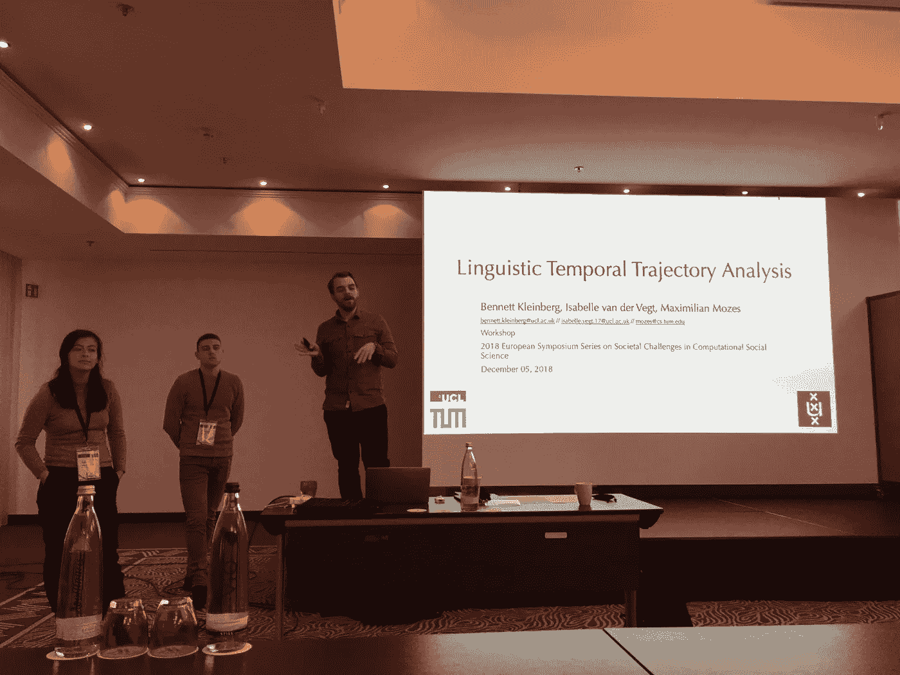
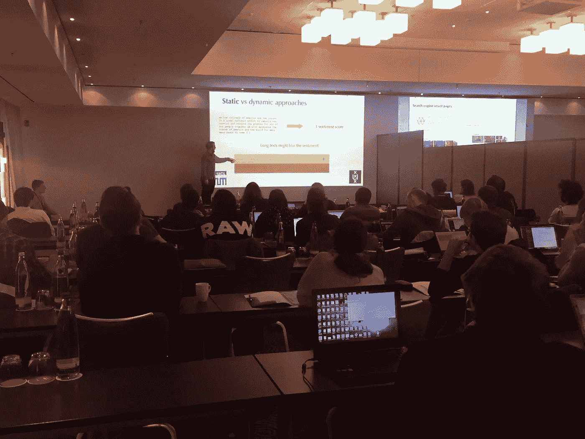
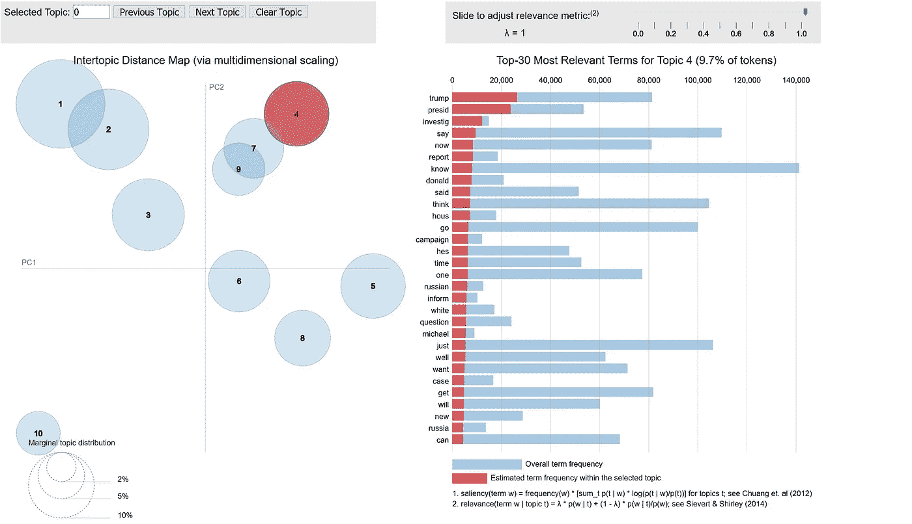
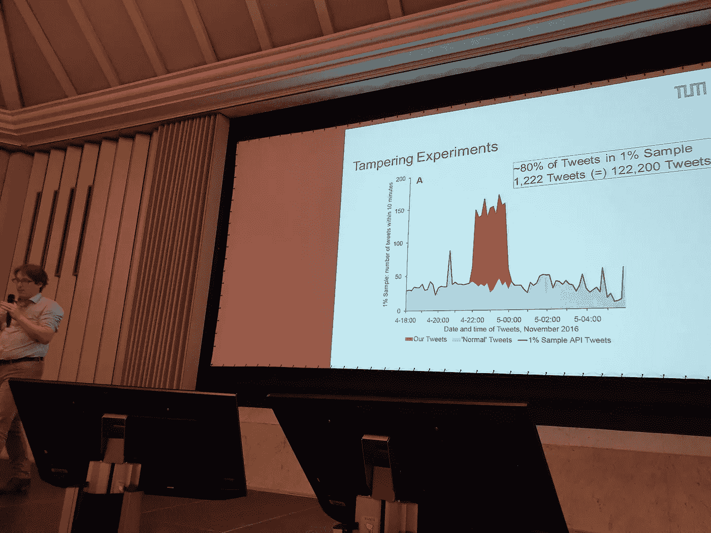
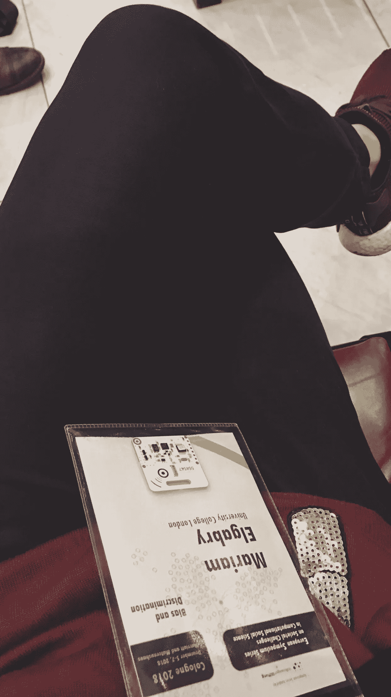

# 当社会科学家转向计算:拯救人类的会议？

> 原文：<https://towardsdatascience.com/when-social-scientists-turn-computational-a-conference-to-save-humanity-2005201109b2?source=collection_archive---------23----------------------->

## 解决数据中“偏见和歧视”挑战的研讨会。

第二届欧洲计算社会科学社会挑战系列研讨会(简称 EuroCSS)于 2018 年 12 月 4—7 日在德国科隆举行。我参加了由副教授 Bennett Kleinberg (UCL)组织的首次“论文黑客马拉松”，这是一次关于语言时态轨迹分析(LTTA)的研讨会，或者用一种非常奇特的方式说文本分析:文本语言如何随时间变化。我对“论文黑客马拉松”很感兴趣，因为它的目标是在一天结束时，有一篇可发表的论文(对于那些没有学术背景的人来说:“论文”是一份科学报告，记录了所进行的研究的发现，发表在期刊上，是量化学者成功的一种方式..请稍后留下您的评论！).至少可以说，我参加过许多计算机科学领域的传统黑客马拉松，我对这种应用于社会科学的混搭黑客马拉松很感兴趣！

The EuroCSS held at Cologne Germany and its twitter hashtag.

## 第 1 天—研讨会前论文黑客马拉松

在科隆的第一天包括在万豪酒店举行的会前研讨会。许多培训课程同时进行，但我参加了 LTTA，因为我想把这些方法应用到我自己的研究中(后来我疯狂的研究！).

研讨会从背景调查开始，让房间里的每一个人都熟悉后面要用到的方法的技术运作。房间里有大约 30 名学生和研究人员，他们来自各种背景，从纯粹的社会科学到铁杆计算机科学家和开发人员。

我们在自己的笔记本电脑上使用 R 和 RStudio 进行实践，将我们刚刚吸收的所有理论付诸实践，同时检查是否下载、安装并正确运行了所有正确的软件包和数据集。我很幸运，在到达研讨会之前已经完成了所有这些工作，因此在每个人都在设置时，我可以很舒服地在方法中摆弄参数。

UCL Data Science Team running the LTTA workshop, from left to right: Isabelle van der Vegt, Maximilian Mozes and Bennett Kleinberg.

Bennett 和他的学生 Isabelle van der Vegt 和 Maximilian Mozes 在 Github 知识库上准备了所有必要的文件、脚本和数据，他们做得非常好——请查看并将其应用到您自己的研究中[这里](https://github.com/ben-aaron188/ltta_workshop)！有两个解析和预处理的选择(一个程序员的梦想！)vlogs 的数据集(如果你不熟悉这个全新的术语，这些是视频版本的博客——翻译成文本脚本以供分析)，一个来自不同的媒体渠道，根据政治影响分为左翼或右翼，另一个来自 YouTube“改变的创造者”用户，其目的是平衡在线发现的有毒材料和积极内容。用外行人的话来说，LTTA 方法基本上是在你从剧本的开头到结尾的过程中，衡量文本情感的积极或消极程度。这些所谓的“轨迹”可以归结为几种类型，根据记忆总共有 7 种，用有趣的名字来描述它们的形状，例如“从赤贫到暴富”的向上轨迹，或者我最喜欢的“情绪波动”，类似于积极和消极情绪之间交替的曲线——你知道女孩们，每月一次的那种类型的事情。

Getting ready for our hackathon on LTTA!

在弄脏我们的手之前，我们在午餐时间边吃边喝脑汁，然后去科隆大教堂和中心逛了逛。一旦我们填饱了碳水化合物，我们回到万豪酒店，提出我们的可怕的研究问题，分成两组，开始黑客攻击！

我在第一组，研究问题是比较不同(左或右)媒体渠道之间话题的情感轨迹。这需要主题建模、情感分析和聚类(如果您对更多技术细节感兴趣，请成为我最喜欢的人，并在下面联系我！).另一个(不太喜欢，因为总体上是一个竞赛)组 2 关注流行度(喜欢 vlog 的数量)对左和右媒体频道 vlog 之间的情感的影响。

我们在万豪酒店找到了一个舒适的空间(显然包括沙发和许多插头)来计划我们 3 小时的项目。经过 20 分钟的头脑风暴，我们分成了“写作”组成员和“分析”组成员。有趣的是，我们最终在分析团队中有三个小组:激烈的 python 程序员与传奇的(这里没有偏见……)R 程序员竞争，他们进行相同的主题建模方法， [LDA](https://en.wikipedia.org/wiki/Latent_Dirichlet_allocation) ，但是使用不同的编程语言，然后是不太幸运的手动(仍然让我畏缩)，是的，你没听错，手动非常容易产生偏见， 的编码人员已经预先选择了两个主题(移民和贸易战)，并且(出于一些非常奇怪的原因)手动编码 regex 关键字，并使用字典来搜索与手动相关的术语的文本——我不能再说手动这个词了(在此插入掌纹)——但你明白这一点。 三个小组，以不同的方式做着完全相同的事情。我们都试图找到媒体渠道中讨论的热门话题，然后应用情感分析，看看它们有什么不同。

Our LDA results from our analysis on the top topics found in Media Channels from 2016–2018 — no surprise “trump” is in there…!

尽管我们做了多余的方法工作，我们的小组还是很有趣。我们有来自意大利、波斯、英国、希腊和德国的人，一起工作。我们可能有一点太多的乐趣，因为当监视第二组时，相比之下，他们似乎在一起。他们已经准备好了幻灯片，时间到了，一切都准备好了。第一组在做什么？还在管理 LDA。以三种不同的方式。在我开始介绍我们的研究和成果的时候，我们的 LDA 仍然在运行，并最终加载了我们的研究和成果。玩笑归玩笑，这是一种非常有创意的方式，让社会科学家参与到计算方法中来，并让研究人员在一天内集中精力完成大量的工作！

我期待着下一次——正式志愿在这里帮助组织它——有更多的时间进行黑客活动，更多现成的小吃，最重要的是*咖啡因*,因为它不可能是一次没有任何形式的能量消耗和某种睡眠剥夺的黑客马拉松！

黑客马拉松一结束，几杯啤酒下肚，“科学满贯”就结束了会议的第一天，笨拙的博士生们对他们的工作进行了 7 分钟的简短陈述。是的。有免费啤酒。

## 第二天—研讨会第一部分在 Maternushaus 举行

在沿着莱茵河跑完 10 公里后，我喝了第一杯咖啡，如果我们很乐意在前一天举行的黑客马拉松上发表一篇论文，那么与一名小组成员就我们需要解决的所有“待办事项”进行交流是一件很棒的事情。很高兴能与一位既有计算机科学背景又对社会科学感兴趣的同事分享这份承诺和兴趣。

所有的咖啡因和运动内啡肽，我已经准备好迎接充满谈话和社交的一天——来吧！第一位主旨发言人是来自东北大学的 Christo Wilson，他就如何调查职业搜索引擎算法中的性别偏见做了精彩的演讲。很高兴发现前 5-10 个结果没有偏见，但一旦招聘人员查看其他排名，就会发现尽管同等资格和优点，男性申请人仍排在第一位。令人害怕的是，当创建一个账户时，算法在没有性别输入的情况下生成了这个数据

然而，今天的话题——毫无疑问——让我大吃一惊——是 Juergen Pfeffer 关于 Twitter API 的采样算法。从本质上来说，这是一个关于如何将 1%的数据片段从 Twitter 提供给数据用户的令人敬畏的黑客技术，它只需要一个良好的(也就是昂贵的)互联网连接，就可以达到一个特定的毫秒窗口(657-666 毫秒或某个特定的范围),然后爆炸！你可以危险地操纵、利用、偏见或任何你喜欢的术语，整个采样数据集！迈克。放下。

因此，正如你所见，没有任何 2 分钟的海报宣传(没有头韵的意图)可以与之相比，尽管大声喊出来的是来自爱丁堡的博士生 Justin Chu-Ting Ho，他的工作有一个关于新脸书 API 如何严重偏见的 rad 海报。没错。理智检查:所有这些“偏见”的谈论实际上意味着以下内容:研究人员使用社交媒体数据来回答关于世界、人类以及人类在这个世界上如何行为的基本问题。脸书、推特和所有其他人拥有大量的数据，这些数据正是这些人自愿放弃的——为了*免费*——然而脸书、推特和类似的人拒绝分享这些非常公开的数据。我会让你思考其中的含义，但如果你需要任何帮助，请告诉我。

带着一点愤世嫉俗的口吻，我们有了非常需要的午休时间。有机会与世界各地的研究人员交谈，甚至讨论潜在的合作。这就是会议的目的，对吧？

研讨会第二天的最后一位主题演讲人 Sara Hajian 非常专业，她分享了她对我们在数据收集中遇到的上述(数量惊人的)偏见的一些解决方案。

我们都去了科隆当地的圣诞市场，几乎每隔几个街区就有一个不同的圣诞市场——足够接下来的 5 年左右了！得到了美味的半米长的肉棒、gluhwein(热葡萄酒)和大量的糖果！

## 第三天—研讨会第二部分在 Maternushaus 举行

研讨会的最后一天，最好的描述是有点懒散，要么是咖啡中的咖啡因被严重稀释，要么是我的大脑被前一天收到的信息严重饱和。不管怎样，这又是一个谈话繁忙的日子，又是一个看海报并投票选出最佳海报的机会。

这一天的亮点最终是听取了社会模式研究人员在研讨会期间进行的一项实验，因为我们都同意在我们的挂绳上佩戴 RFID 芯片。我真的很期待实验的结果，如果你跟踪我的互动，我想我会成为一只社交蜜蜂——有测试谦虚的方法吗？我不太确定我会怎么做…

总的来说，这次会议让你大开眼界，作为一名研究人员，你在收集数据时必须考虑哪些因素，但作为一名数据消费者，所有这些信息可能会加剧我们社会的偏见。我遇到并有机会与之交谈的人提供了一个很好的思想和熟人交流的机会，这种交流可能会在未来保持下去。最后，科隆是一个值得参观和探索的可爱城市，有可爱的市场和美味的椒盐卷饼。Bis zum nä chsten Mal！