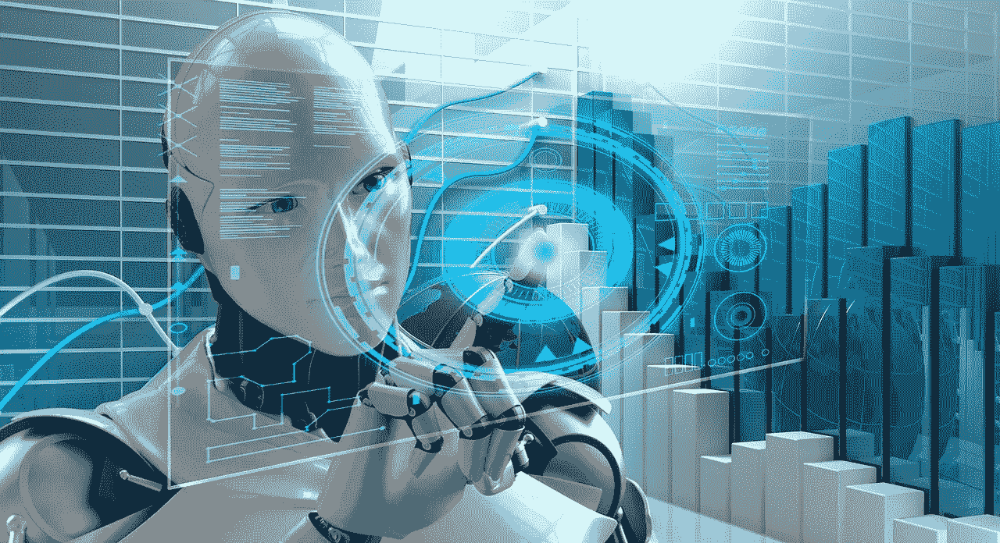
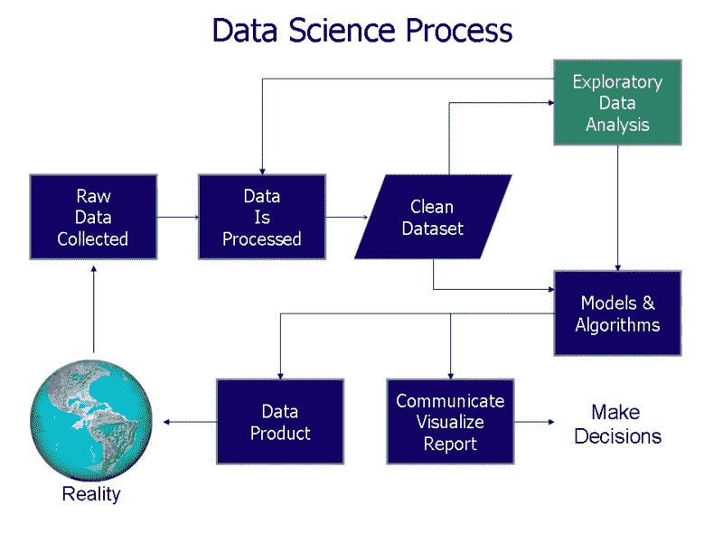
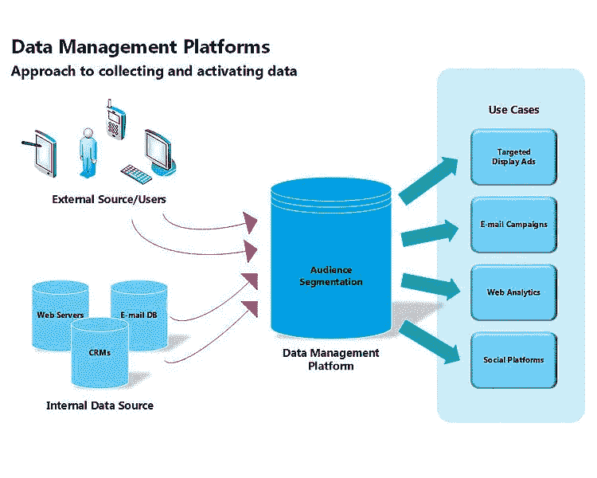

# 人工智能和人工智能在市场营销中的发展方向

> 原文：<https://towardsdatascience.com/where-ai-and-ml-in-marketing-is-headed-6b651f5f7eaa?source=collection_archive---------11----------------------->

人工智能(AI)和机器学习(ML)是当今广告界的前沿，因为这些技术提供了将工具和数据集转化为有价值的营销见解的机会，从而有助于提高公司的投资回报率。现在，人工智能和人工智能比以往任何时候都更有价值，因为最近开发了比以往任何时候都更先进的负担得起和可访问的数据分析工具。

企业能够实现更大、更丰富的数据集，以过去成本的一小部分来宣传自己，从而改善决策。人工智能和人工智能在营销中的应用也越来越被广泛接受，成为积累数据和优化利用数据以增加利润的必要步骤。WorkFusion 通过其智能流程自动化机器人提供了这样的解决方案，可以同时收集和分析来自多个来源的数据。

以下是公司利用这些技术领先于竞争对手的三种方式。

**1)人工智能使用大量数据来识别有价值的模式**

营销人员在数据驱动的广告中面临的一个常见问题是，存在大量带有噪声数据的数据源、分析包和营销软件服务，如果没有适当的技术来分析这些数据，很难对这些数据进行分类。公司正在[寻求以一种比当前解决方案更省时、成本更低的方式将洞察](https://www.forbes.com/sites/andrewstephen/2017/10/30/ai-is-changing-marketing-as-we-know-it-and-thats-a-good-thing/#75ba75b3dc40)整合到所有这些工具中。

解决这一困境的一种方法是使用人工智能分析来收集所有这些工具、平台和数据集的输出，以帮助确定有助于未来决策的新模式。通过分析分析，企业可以使用人工智能来确定这些数据如何与消费者相关的更综合的想法，从而更容易知道最佳营销技术是什么，以及这些技术应该推广到什么平台。其中一个帮助你满足营销需求的工具就是 [WorkFusion 的 RPA Express](https://www.workfusion.com/rpaexpress?utm_source=blog&utm_medium=medium&utm_name=karl-utermohlen&utm_term=the-future-of-ai-and-ml-in-marketing) ，它集成了核心系统并自动执行任务。

**2) ML 有助于创造更高级的客户互动**

与消费者建立直接关系是任何企业取得成功的重要因素，近年来，许多公司都在利用 ML 扩展他们的客户服务和其他消费者对话工具。这里的关键是摆脱传统的内容营销工具，使这些沟通更加以客户为中心。通过这样做，公司将能够在正确的时间向正确的人提供正确的内容。

虽然聊天机器人和语音自动化命令已被证明在加强与消费者的关系方面很有价值，但公司现在正朝着这些技术的下一步发展。微软就是这样一家公司，它使用 ML 开发多感官体验，检查客户的视觉、声音、触觉、手势甚至凝视，以便与他们进行模拟真实事物的全面互动。

**3。人工智能带来更加个性化的消费者体验**

有很多营销个性化工具被用来为客户创造真正个性化的体验。这些工具收集消费者的信息，并定制营销工具来接触这些消费者。人工智能在这方面变得越来越复杂，因为他们正在学习更多关于个人的数据，为他们提供更个性化的购物或营销体验。

人工智能平台依赖于一个预测积分系统，该系统可以监控客户何时开始他们在零售或在线服务网站上的旅程。然后，该工具会跟随客户的整个旅程，在整个旅程中为他们提供独特的内容。

**底线…**

如今，将人工智能应用到他们的业务中对于寻求优化营销的公司来说至关重要。这项技术可以帮助整理大型数据集，对它们进行分类，并根据这些信息提出营销建议。此外，ML 有助于使营销体验对消费者更具针对性和个性化，确保正确的产品和服务被广告给正确的人。

有了所有可用的人工智能营销工具，公司正在改造传统的营销技术和数据库，以换取先进的分析和数据处理技术，这些技术将增加消费者流量，并从长远来看提高他们的投资回报率。