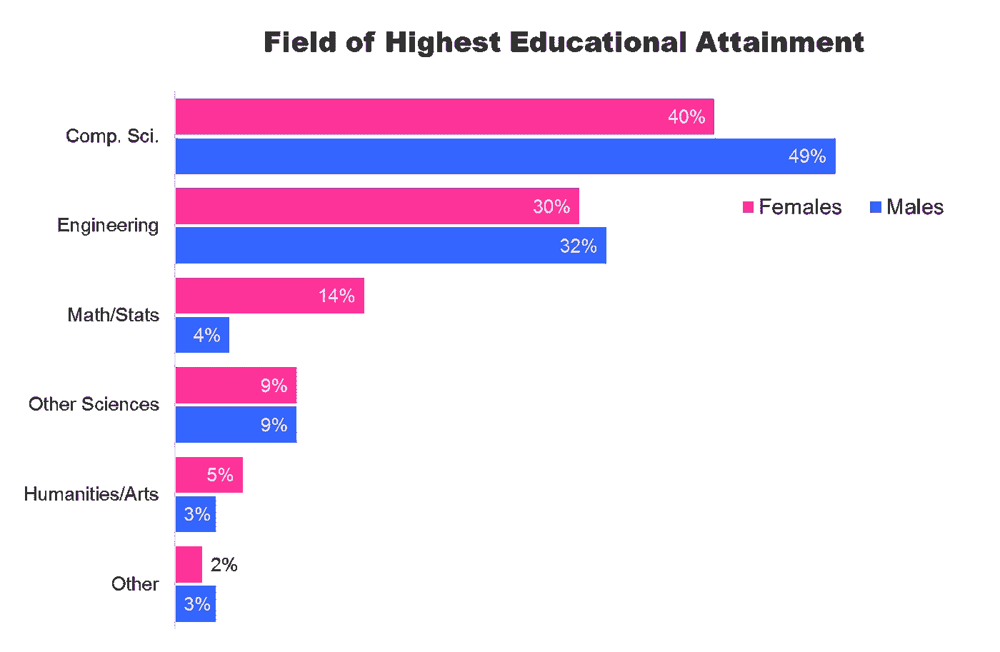
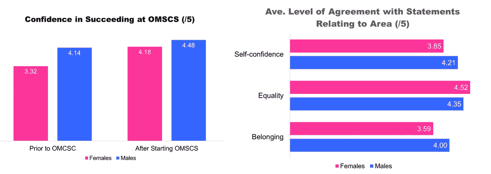
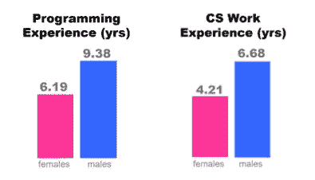

# 乔治亚理工学院 OMSCS 的女性在哪里？

> 原文：<https://towardsdatascience.com/where-are-the-women-in-georgia-techs-omscs-53f16153dfc5?source=collection_archive---------7----------------------->

## 基于在线计算机科学硕士课程的学生调查和成绩数据的分析。

## 介绍

2014 年 1 月，佐治亚理工学院迎来了其在线计算机科学硕士(OMSCS)项目的第一批学生。然而，截至 2018 年春季，女性仅占 OMSCS 学生总数的 14.9%。

这低于佐治亚理工学院计算机科学硕士项目中女性的比例，也低于美国每年计算机科学硕士项目中已经非常低的女性毕业比例。

对于一个以使更多的学生能够接受高水平、先进的计算机科学教育为具体目标的项目来说，这个统计数字低得惊人。

因此，利用从 2015 年夏季至 2016 年秋季开设的三个 omsc 班的 854 名不同学生(123 名女性，715 名男性，16 名未知)中收集的课程调查和成绩数据，以及从 160 名过去和现在的 omsc 学生(57 名女性和 103 名男性)的在线调查中收集的数据，我决定调查为什么会出现这种情况。

## 相同但不同

在我的分析中，我调查了一系列可能对 OMSCS 中的女性人数产生负面影响的不同变量，以了解它们在性别上的差异。特别是，我探索了以下方面的差异:人口统计学；学习成绩；OMSCS 前的计算经验；自信；和归属感。

然而，有趣的是，男性和女性之间的相似性，而不是差异，可能是 OMSCS 学生中存在性别差距的最大原因之一。

Figure 1: Comparison of field of highest educational attainment by gender

如图 1 所示，男性和女性 OMSCS 学生最有可能来自计算机科学或工程教育背景。考虑到 OMSCS 项目的主题，这并不奇怪。

然而，计算机科学和工程是所有教育学科中性别最不平衡的两个。在经合组织国家，女性仅占所有工程专业毕业生的 24%,仅略高于女性占计算机专业毕业生的 21%。

如果 OMSCS 主要从由 75%到 80%的男性组成的群体中吸引学生，那么不可避免的是，该项目录取的大多数学生也将是男性。

## 信心游戏

在被 OMSCS 项目录取的学生中，女性先前获得高等学位(即硕士或博士学位)的可能性高出 44%,并且在学术上与男性同学表现一样好。

然而，尽管如此，有证据表明，与男生相比，omsc 女生对自己的计算能力缺乏信心，特别是在编程方面，并且对 omsc 和计算的归属感较低。

Figure 2: Comparison of confidence in succeeding at OMSCS (left) and average level of agreement with statements relating to self-confidence, equality and belonging (right) by gender

图 2 显示，在开始 OMSCS 之前，女性对自己在项目中取得成功的能力的信心平均比男性低 20%,即使在开始研究之后，女性对自己取得成功的能力的信心仍然比男性低 7%。

它还表明，尽管 omsc 的女生有更强的性别平等意识，但她们对 omsc 的归属感以及对计算机科学的归属感总体上比男生弱。

Figure 3: Comparison of pre-OMSCS programming experience (left) and computer science work experience (right) by gender

对此的一个可能的解释是，如图 3 所示，女性 OMSCS 学生通常在编程经验和计算机科学工作经验较少的情况下进入该计划，并且之前在大学水平上学习计算机科学的可能性比男性低 32%。

即使考虑到年龄等其他变量，男性在 OMSCS 之前的编程和计算机科学工作经验也明显比女性多。

计算机科学/omsc 的归属感较低也可能是女性比例较低的结果，不仅是在 omsc 的学生中，而且在 omsc 的教师中，2018 年秋季开办的 28 个班级中只有两个班级有女教师。

与男生相比，在 OMSCS 女生中观察到的对计算技能的自信心水平较低、对计算机文化的归属感较低以及对计算经验的接触较少，这与以前关于缺乏女性参与计算机科学的原因的调查结果相一致。

## 解决办法？

如果佐治亚理工学院真的想利用 omsc 计划作为一种手段，使计算机科学教育更加普及，那么它就有义务做出认真和持续的承诺，吸引合适的合格女性加入 omsc，并增加女性对该计划的参与。

有可能促进女性参与组织管理中心的三项举措包括:

**1。扩大潜在女性 OMSCS 申请人的范围**

在经合组织国家，女性占所有数学和统计学毕业生的 44%,占物理科学毕业生的 44%,是女性计算机科学和工程毕业生比例的两倍多。

OMSCS 的录取标准中没有任何东西阻止来自这些教育背景的人获得该项目的录取。

积极向计算机科学相关领域的女性推销 omsc，但女性比例较高，如数学/统计或物理科学，不会损害 omsc 目前的招生标准，并可能导致 omsc 招聘活动接触到更多的女性。

**2。为学生提供建立计算机科学和编程能力信心的机会**

在加入 OMSCS 这样的项目时，女性在技能和信心方面都处于劣势。为什么不为女性提供一种方法来弥补这一点，弥补她们技能上的差距呢？

这可以采取为最近被录取或正在考虑申请的人准备课程的形式，甚至可以采取“微型硕士”计划的形式，成功完成该计划可以保证进入 OMSCS。

为很少或没有编程经验的学生提供参与计算机科学的途径已被成功地用于解决美国其他大学本科女生经历的计算机科学信心问题，促使这些大学计算机科学专业女生的比例大幅上升。

**3。通过为 OMSCS 女生创建可见的角色模型，建立女性对计算机科学的归属感**

OMSCS 计划中几乎完全没有可见的女性榜样。对于未来的 omsc 女性申请者和 omsc 女性学生在计算机科学中的位置，这传递了什么信息？

在大学阶段，受到榜样鼓励的女孩比没有受到榜样鼓励的女孩更有可能主修计算机科学，这种可能性是没有榜样鼓励的女孩的四倍多。为什么不将同样的理念应用于 OMSCS 呢？

可以通过教师中更大的性别多样性，通过为女生创造与计算机科学领域的女性互动并接受其指导的机会，为女生创造可见的榜样，无论她们是其他 OMSCS 学生，还是佐治亚理工学院的计算机科学研究人员。

# 结论

自 20 世纪 80 年代中期以来，攻读计算机科学学位的女性比例直线下降。

作为美国最大的计算机科学硕士项目，佐治亚理工学院的 OMSCS 项目有可能帮助扭转这一趋势，但迄今为止，佐治亚理工学院 OMSCS 项目录取的女生比例甚至低于其同等的校内计算机科学硕士项目。

其他大学的经验表明，通过认真和持续的投入，有可能显著提高女性在计算机科学领域的参与度，为此，我提出了佐治亚理工学院可以实施的三项举措。

据估计，OMSCS 项目有可能将美国计算机科学硕士学位持有者的人数增加 8%。想象一下，如果这些人中有一半是女性，对计算机科学性别差距的影响。

要了解关于这个分析的更多信息，请访问这个项目的 GitHub 资源库，这里有。

*Genevieve Hayes 博士是数据科学家、教育家和人工智能及分析专家，拥有*[*Genevieve Hayes Consulting*](https://www.genevievehayes.com/)*。你可以在*[*LinkedIn*](https://www.linkedin.com/in/gkhayes/)*或者*[*Twitter*](https://twitter.com/genevievekhayes)*上关注她。她还是* [*价值驱动数据科学*](https://www.genevievehayes.com/episodes/) *的主持人，这是一个每月两次的播客，面向希望最大化其数据和数据团队价值的企业。*

*想要发掘企业数据的价值，但不知道从哪里开始？**[***下载免费的数据科学项目发现指南。***](https://www.genevievehayes.com/discovery-guide/)*