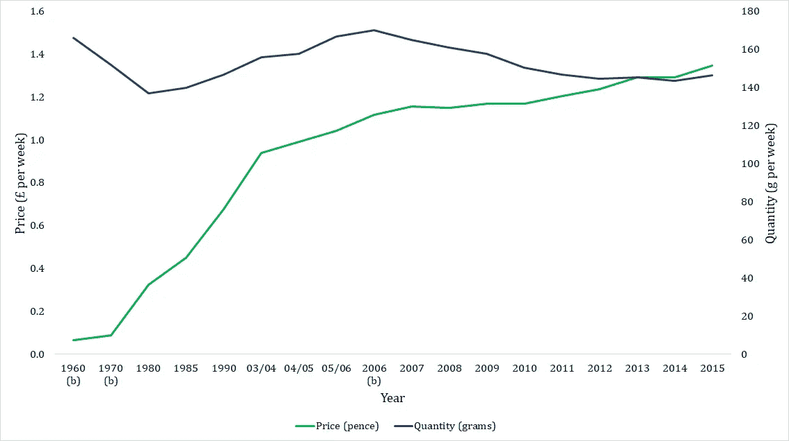
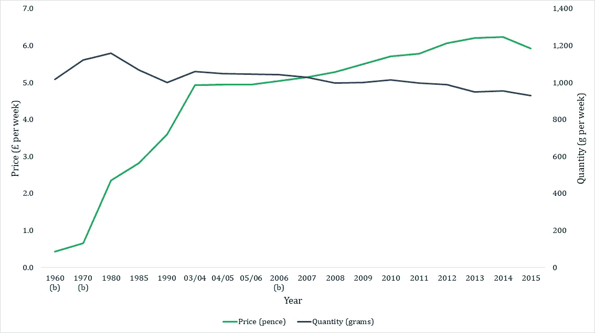
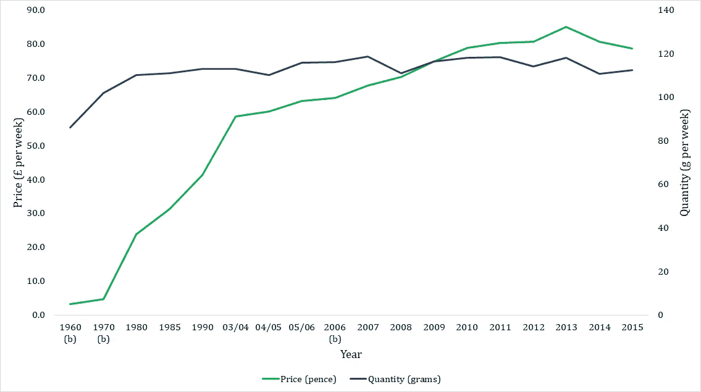
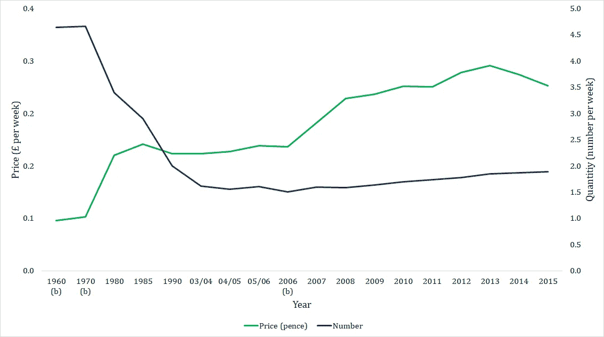
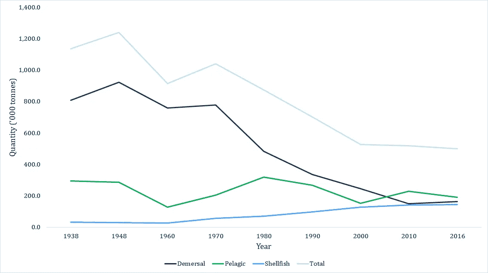
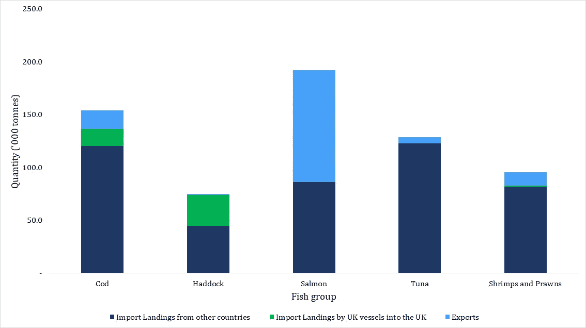
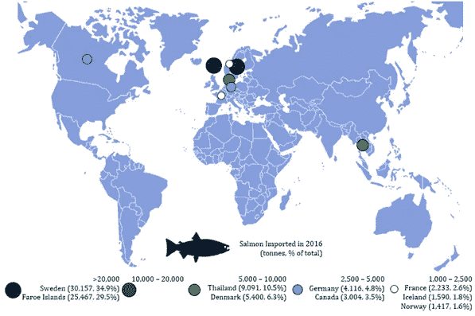
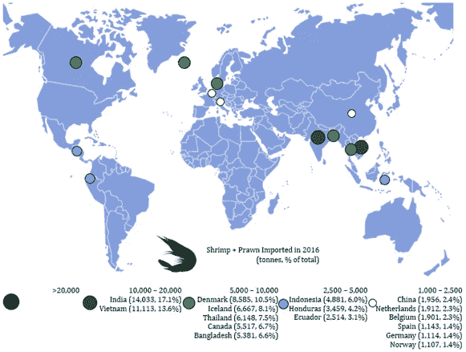

# 我们的鱼从哪里来？

> 原文：<https://towardsdatascience.com/where-does-our-fish-come-from-9457c90d4ff0?source=collection_archive---------9----------------------->

开放数据的世界异常复杂，任何数据科学家都有可能证明这一点。对于我这个刚刚毕业的理学学士来说，这是一个相对陌生的世界。但本周，在安妮·麦克罗森(数据业务专家、[内脏业务](http://visceralbusiness.com/)的创始人、康沃尔郡[开放数据研究所](https://theodi.org/)的负责人)的指导下，我试图探索这个世界，以回答一个我长期思考但从未完全理解的问题——我们在英国消费的鱼到底来自哪里？

***Over 1.1 million tonnes of fish were landed in the UK in 2016 alone. Can open data be used to discern which fish came from where?***

这似乎是一个简单的问题，任何人都可以在超市拿起一罐金枪鱼进行检查，但我特别感兴趣的是渔业的整体范围；更具体地说是英国的“五大”:鳕鱼；黑线鳕；三文鱼；金枪鱼；还有小虾和对虾。作为一个国家，我们与这 5 种鱼类紧密相连。它们主宰着英国的鱼类市场，以至于超市已经开始宣传其他鱼类的存在，并且至少应该被考虑。我本人对这个问题很感兴趣，因为我最近完成了一个保护生物学和生态学学位，我的研究侧重于海洋问题。我学到的是，就像开放数据的世界一样，渔业很难理解；进出口似乎在全球范围内随机流动。鱼类资源的枯竭和水产养殖的兴起导致了这种复杂性，但我决定主要关注这五大鱼类的来源，并可能提供一些关于人们应该瞄准(或避免)哪些鱼类的建议！)如果他们想减少他们的环境足迹。

那么，如何使用开放数据来回答这个问题，并以一种易于向更广泛的受众传达的格式呈现它呢？这是我的任务，要理解它，你必须理解什么是开放数据本身。开放数据研究所将开放数据定义为“每个人都可以访问、使用和共享的数据”。看起来很简单，但是对于这个行业来说，现在还是早期，开放数据的世界才刚刚发展起来。存在各种经过验证的政府数据库(【data.gov.uk】、[欧盟统计局](http://ec.europa.eu/eurostat/data/database)等)，但当前形式的公开数据的问题是很少有人知道去哪里找，更不用说如何解释他们找到的东西了。

我在我的实习培训周期间亲身经历了这一点，这是由埃克塞特大学的就业能力项目设立的，当时我和我的小组在众多数据库中搜寻公司使用塑料的任何证据。从我收集的信息来看，无论如何，在现阶段，企业开放数据库几乎不存在，政府数据库也很难浏览，其中包含大量高度具体的配额、电子表格、调查和各种记录，有时可以追溯到几个世纪前。

培训周让我对数据行业有所了解，但也让我思考我到底应该如何利用它，以及在哪个部门。安妮帮助回答了第二个问题，她说我们将专注于食品数据，但即使在这方面也有太多的工作要做。我花了一段时间进行调查，然后才明白渔业是开放数据供应充足的一个领域。进口数据、出口数据、上岸配额、捕捞配额、生态系统生存能力，凡是你能想到的，都有政府的电子表格。带着一个清晰的问题，我开始了我的数据搜索，寻找我们五大巨头的模式和趋势。

找到一个可行的数据集花了一段时间——有很多，只有一小部分是可下载的，更不用说是可解释的了。然而，在第一天快结束时，我看到了“英国海洋渔业年度统计数据”——这绝对是一个可以追溯到多年前的金矿，尽管附带的档案部分保存了 2012 年之前的数据。

我认为从最基本的层面——消费者本身——开始是值得的。与其他食品相比，普通人每周吃多少鱼，他们在鱼上的花费是多少？这方面的数据大部分是一致的——在某些情况下，年份被分开了，如下图所示，但它确实产生了结果。答案并不令人惊讶——多年来，英国的鱼类消费一直遵循与肉类和奶酪相似的趋势(图 1a、b、c ),保持相对稳定，但价格随着通货膨胀而上涨。最令人惊讶的结果实际上是由我们的鸡蛋消费量带来的(图 1d)——我不知道英国人的平均鸡蛋消费量在 20 世纪末基本上减少了一半。

**Figure 1a: Fish (processed, frozen, fresh + prepared) consumption, per person per week (1960–2015). As with the following graphs, years are denoted by the format in which they are presented in the** [**UK Sea Fisheries Annual Statistics**](https://www.gov.uk/government/statistics/uk-sea-fisheries-annual-statistics-report-2016) **Chapter 4 (hence the “(b)s” and “/s”).**

**Figure 1b: Meat consumption, per person per week (1960–2015) taken from** [**UK Sea Fisheries Annual Statistics**](https://www.gov.uk/government/statistics/uk-sea-fisheries-annual-statistics-report-2016) **Chapter 4.**

**Figure 1c: Cheese consumption, per person per week (1960–2015) taken from** [**UK Sea Fisheries Annual Statistics**](https://www.gov.uk/government/statistics/uk-sea-fisheries-annual-statistics-report-2016) **Chapter 4.**

**Figure 1d: Egg consumption, per person per week (1960–2015) taken from** [**UK Sea Fisheries Annual Statistics**](https://www.gov.uk/government/statistics/uk-sea-fisheries-annual-statistics-report-2016) **Chapter 4.**

接着，我转向了鱼本身。从总体数据开始，我转到了 Big 5(cod；黑线鳕；三文鱼；金枪鱼；以及每组的进出口比率。如你所见，最初的图表完美地描述了整个 20 世纪底栖鱼类的开发情况，远洋(开阔水域)和贝类的情况稍好一些(图 2a)。然而，这一趋势在 21 世纪已经稳定下来(图 2b)，因此我将重点关注最近的数据。

**Figure 2a: Landings data into the UK by all vessels (1938–2016) acquired from** [**UK Sea Fisheries Annual Statistics**](https://www.gov.uk/government/statistics/uk-sea-fisheries-annual-statistics-report-2016) **Chapter 3.**

**Figure 2b: Overall landings data for the UK (2006–2016) taken from** [**UK Sea Fisheries Annual Statistics**](https://www.gov.uk/government/statistics/uk-sea-fisheries-annual-statistics-report-2016) **Chapter 4.**

然而，转到最近的 Big 5 数据(图 3)，一些令人吃惊的结果开始显现出来，也许为图 2a 中看到的平稳提供了解释。值得注意的是，这只是 2016 年的数据，然而，在修订了前几年的数据后，我发现 2016 年并不是特别反常，因此我选择只关注今年。我发现，英国船只在国内卸货的数量少得惊人，而且至少可以说，某些鱼类的进出口比率非常有趣。以鲑鱼为例。在过去的五年里，三文鱼碰巧是英国进口和出口最多的鱼类，但我没有发现英国三文鱼真正登陆英国的记录。为什么会这样，很可能与我专业领域之外的经济因素有关，然而这个发现很有趣。更令人惊喜的是在英国使用的英国捕获的黑线鳕的数量。其余 5 个国家的统计数据，例如完全没有英国捕捞的金枪鱼、小虾和对虾，以及英国捕捞的低水平鳕鱼(我们的鱼类资源是出了名的枯竭——再次参见图 2a ),与我之前读到的一致。

**Figure 3: Big 5 Import, UK-caught and Export data (2016) taken from UK Sea Fisheries Annual Statistics Chapter 4.**

因此，在发现(黑线鳕除外)我们的鱼并非真的来自英国注册的渔船后，我开始回答我的总体问题——它是从哪里来的？下图很好地说明了这一点。

**Figure 4a: Cod imports (2016) taken from** [**UK Sea Fisheries Annual Statistics**](https://www.gov.uk/government/statistics/uk-sea-fisheries-annual-statistics-report-2016) **Chapter 4.**

**Figure 4b: Haddock imports (2016) taken from** [**UK Sea Fisheries Annual Statistics**](https://www.gov.uk/government/statistics/uk-sea-fisheries-annual-statistics-report-2016) **Chapter 4.**

**Figure 4c: Salmon imports (2016) taken from** [**UK Sea Fisheries Annual Statistics**](https://www.gov.uk/government/statistics/uk-sea-fisheries-annual-statistics-report-2016) **Chapter 4.**

**Figure 4d: Tuna imports (2016) taken from** [**UK Sea Fisheries Annual Statistics**](https://www.gov.uk/government/statistics/uk-sea-fisheries-annual-statistics-report-2016) **Chapter 4.**

**Figure 4e: Shrimp and Prawn imports (2016) taken from** [**UK Sea Fisheries Annual Statistics**](https://www.gov.uk/government/statistics/uk-sea-fisheries-annual-statistics-report-2016) **Chapter 4.**

如图所示，鳕鱼和黑线鳕(图 4a，b)显示出类似的趋势，都主要从英国和欧洲进口(黑线鳕显示出英国占主导地位的贸易)。然而，乍一看令人惊讶的是，中国分别是我们第二和第三大最受欢迎的炸鱼薯条来源。这可能是因为他们在全球水产养殖(鱼类养殖)市场的完全主导地位——粮农组织 2011 年的数据显示，中国对全球水产养殖的贡献超过了前 20 名国家的总和。鲑鱼(图 4c)已经被证明是进口和出口最多的鱼类，也主要来自北欧，泰国和加拿大也有所贡献。如前所示(图 3)，我找不到英国为自己的三文鱼供应做出贡献的记录。

然而，五巨头中的另外两个成员显示出完全不同的趋势。金枪鱼(图 4d)，在最好的情况下也是一种有争议的鱼类，来自世界各地，令人惊讶的是，加纳竟然是我们最大的供应国。事实上，绝大多数英国金枪鱼来自欧洲以外，其他非洲国家塞舌尔和毛里求斯、东南亚国家和厄瓜多尔的贡献也超过了欧洲最大的供应国西班牙。最后，虾和对虾(图 4e)显示了其供应量的最大变化。同样，东南亚是一个关键的参与者(水产养殖也可能是原因，因为数据显示，这些国家都是养虾业的重要投资者)，然而，拉丁美洲国家洪都拉斯和厄瓜多尔以及某些欧洲国家也做出了贡献。从这些图表中你可以看到，我个人已经获得了很多关于我们五大成员在到达我们之前会走多远的理解，并且在购买金枪鱼、虾和对虾之前会三思而行。

总的来说，我非常享受我对开放数据世界的探索，以及和 Anne 一起工作的时光。在使用公开数据回答一个问题时，我瞥见了它的潜力，但我也开始意识到这个领域实际上是多么年轻。还有多少其他问题的答案等着从政府数据库代表的迷宫中挖掘出来？如果政府和企业提供更开放的数据源，让现有的数据更容易获取，还能回答多少问题？我刚开始接触开放数据，但我很快就明白了为什么像安妮这样的人致力于发展这个新兴的、令人兴奋的领域。

在我的整个研究过程中，我都有一个日志，包含了我使用过的或考虑使用的所有数据库，以及我在查看它们时的想法。这里可以查看[。](https://docs.google.com/spreadsheets/d/1pbK0tOLXnj4iQAqQlSnmfIQqrtwXSOGL-fgpza4LIAI/edit#gid=0)

我的图标和图像主要来自于[这个名词项目](https://thenounproject.com/)。每条鱼的单独图像链接([鳕鱼](https://thenounproject.com/term/cod/332207/))；[黑线鳕](https://thenounproject.com/term/haddock/7411/)；[三文鱼](https://thenounproject.com/term/salmon/149580/)；[金枪鱼](https://thenounproject.com/term/tuna/92176/)；和[小虾和大虾](https://thenounproject.com/search/?q=shrimp&i=1802086)挂钩。

非常感谢安妮·麦克罗森在整个项目中给予的帮助和指导。