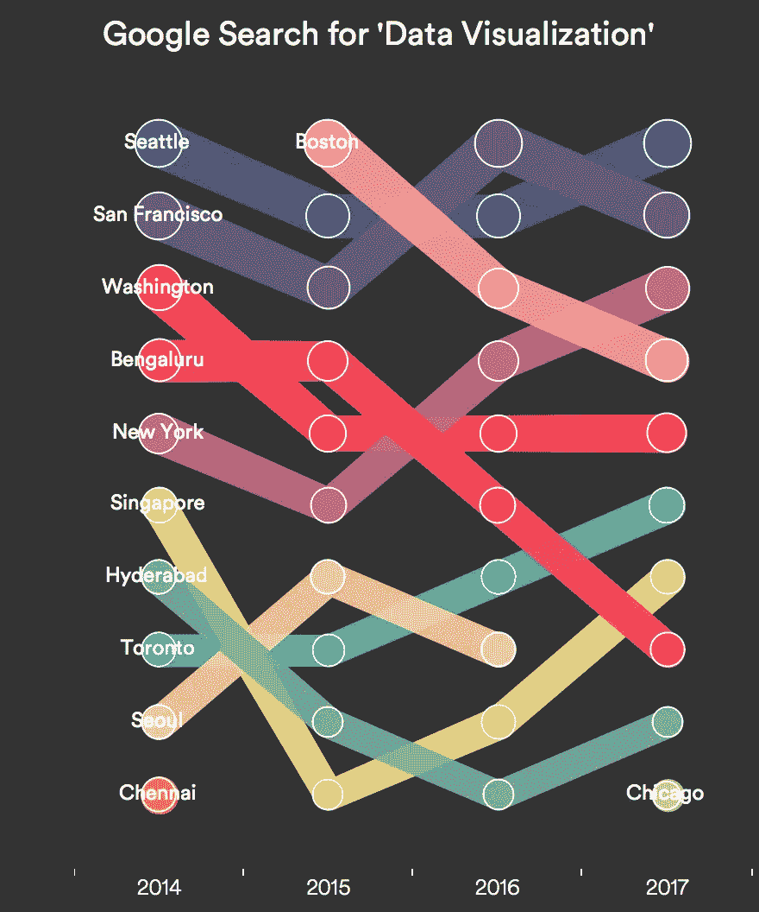
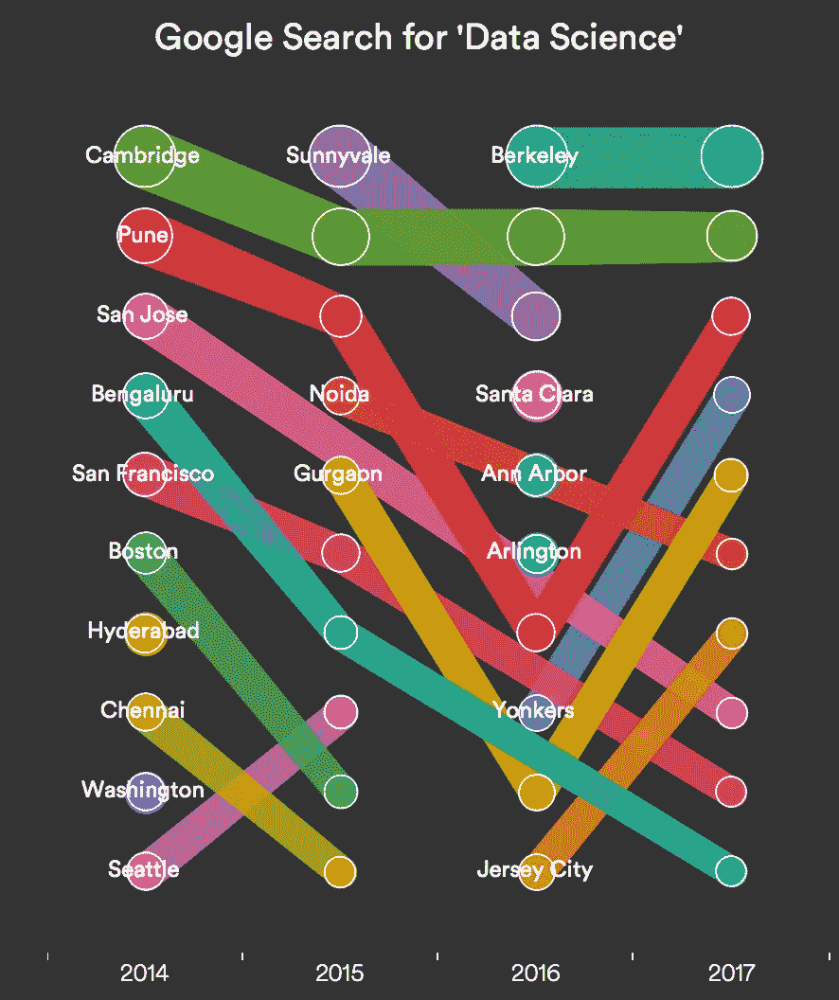
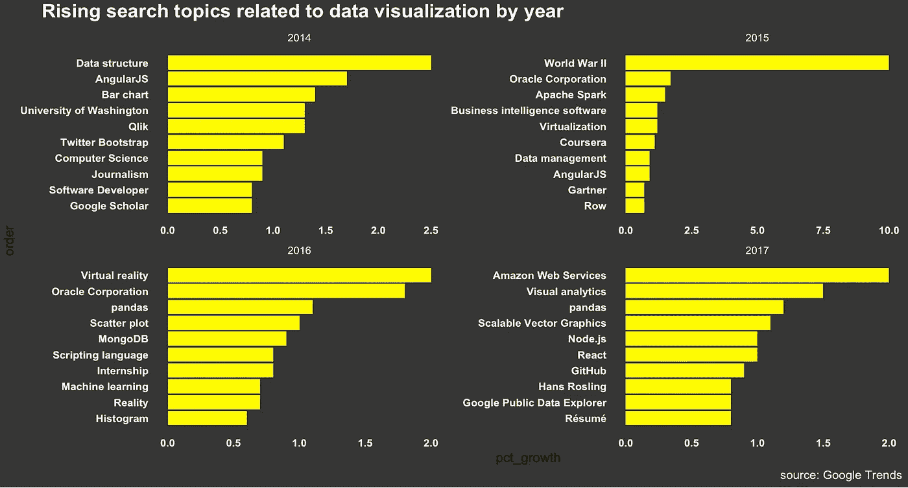
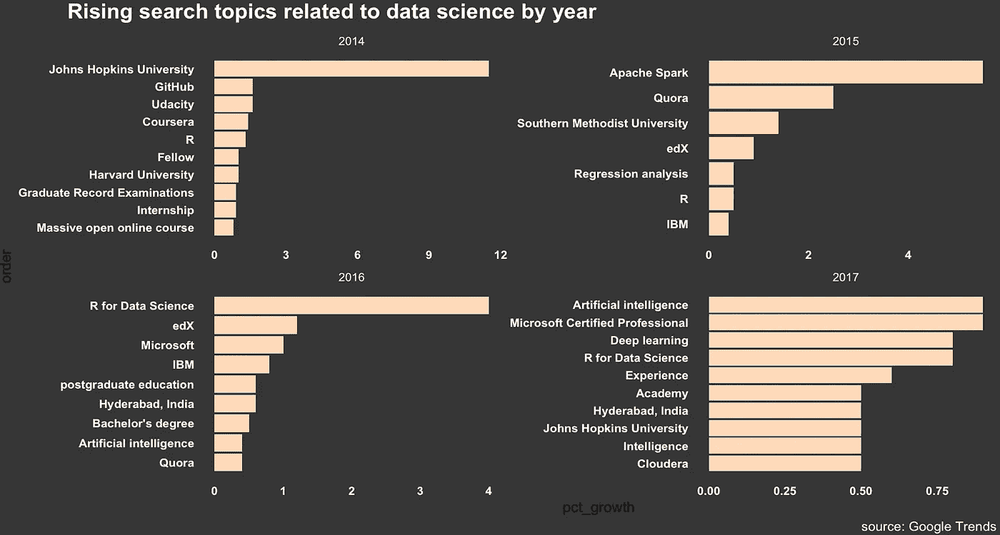

# 人们对数据可视化和数据科学最感兴趣的地方

> 原文：<https://towardsdatascience.com/where-people-are-most-interested-in-data-visualization-and-data-science-16079ad706e0?source=collection_archive---------4----------------------->

今天，我使用 R 提取了 [Google Trends](https://trends.google.com/trends/) 数据，找到了在“数据可视化”和“数据科学”中搜索次数最多的城市，以及与这两个主题相关的趋势话题。

**利益在哪里**

在过去四年中，我们可以看到西雅图、旧金山和华盛顿等美国西海岸城市对数据可视化有着极大的兴趣。东海岸城市波士顿在 2015 年的搜索趋势中排名第一，但随着纽约的兴趣增加，排名有所下滑。芝加哥今年新进入前十名。

包括新加坡、首尔和印度的一些城市、孟加拉、海德拉巴和钦奈在内的亚洲城市也有不错的代表性。

在搜索“数据科学”方面，剑桥和伯克利在过去两年中名列榜首。

大多数城市，甚至那些在四年中只出现过一次的城市，都在美国，这可以归因于对这个角色的高需求。

硅谷的桑尼维尔市是 Linkedin 和 NetApp 等科技公司的总部所在地，似乎对这个话题的兴趣已经消退。

几个印度城市出现在列表中，搜索量要么下降，要么上升。

# 哪些话题是热门话题

2015 年关键词“二战”获得了很多关注，这可能是[这部](http://www.fallen.io/ww2/)数据即电影。2016 年，用于数据可视化的“虚拟现实”正在升温。今年，视觉分析、SVG、React 等主题的搜索量增加，汉斯·罗斯林的去世也是如此。

就数据科学而言，教育主题具有很强的吸引力。在在线课程中，人们的兴趣已经从约翰霍普金斯大学的数据科学专业转向了微软认证专家。2016 年搜索研究生教育几乎翻倍。2017 年，人工智能和深度学习成为增长最快的话题。

**数据和过程**

[gtrendsR](https://github.com/PMassicotte/gtrendsR) 包提供对 Google Trends API 的访问，并返回一个数据框架列表，包括一段时间内的兴趣、地理区域的兴趣和相关主题。考虑到较大的国家将有更多的搜索量，使用范围从 0 到 100 的搜索指数来归一化人口效应。API 还将相关主题分为“热门”、“上升”和“突破”。

这将主要反映英语地区的搜索兴趣，因为不使用谷歌或在搜索中使用其他语言的国家不会出现在数据中。

该软件包的一个问题是，它不采用包含其他拼写的组合术语，如“可视化”(而谷歌趋势可以做到这一点)。主要影响澳大利亚。当软件包更新时，我们可以更新。

**相关读数**

如果你对谷歌趋势感兴趣，你可能会发现这两个很有趣:

[xaquín g . v .及其合作者最常搜索的方法](http://flowingdata.com/2017/09/04/most-frequent-how-tos-we-search-for/)

[r-blogger 上的 gtrendsR](https://www.r-bloggers.com/gtrendsr-1-3-3-2/)

在视觉方面，这些帖子是相关的:

[如何创作 bumpchart](http://sirvizalot.blogspot.sg/2016/03/color-popularity-for-new-cars-2000-2015.html)viz-a-lot 先生

[对多面 ggplot2 内的列进行排序](https://drsimonj.svbtle.com/ordering-categories-within-ggplot2-facets)

这是我关于数据科学和视觉故事的[# 100 日项目](https://medium.com/@yanhann10)的第 56 天。如果喜欢，请分享。我的 github 上的全部代码。建议和反馈总是受欢迎的。感谢阅读。