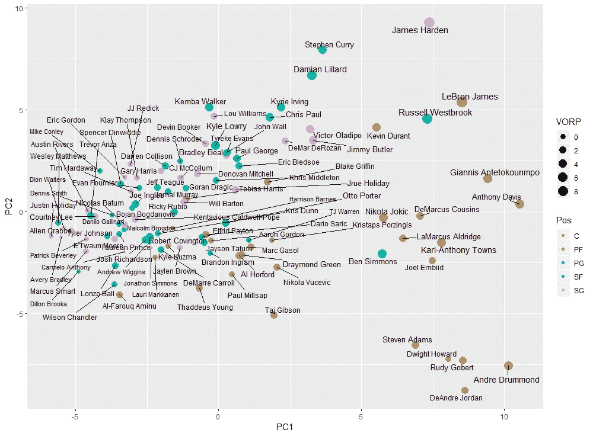
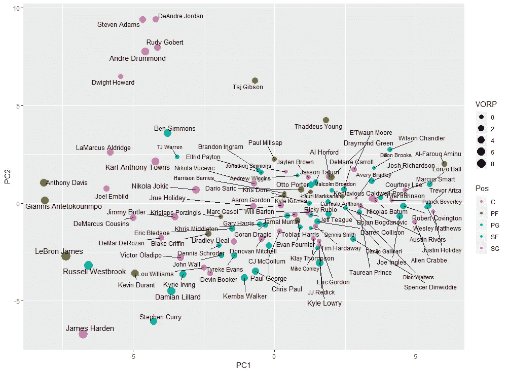
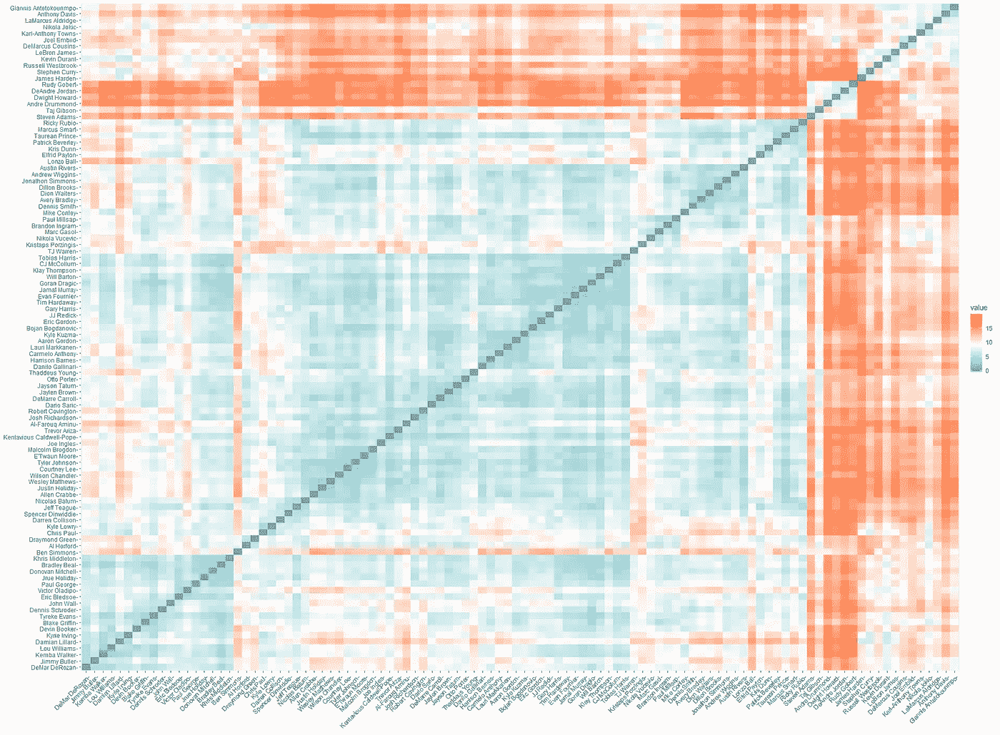
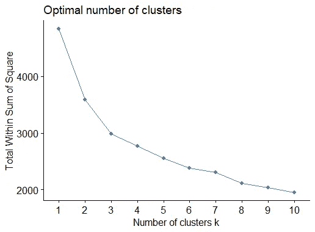
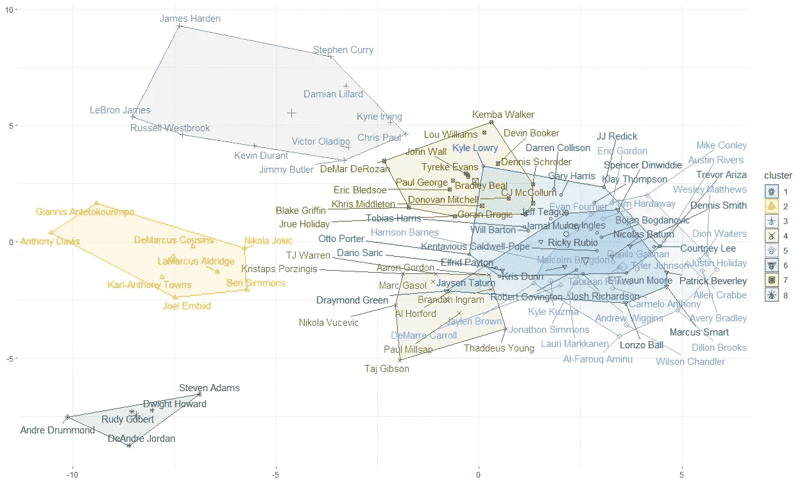
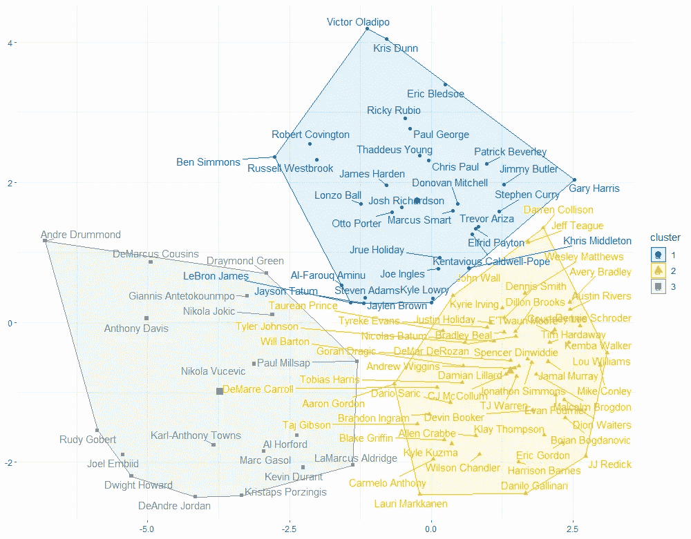
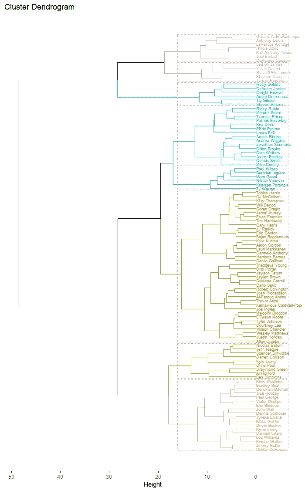

# 用机器学习评估 NBA 球员的相似性

> 原文：<https://towardsdatascience.com/which-nba-players-are-most-similar-machine-learning-provides-the-answers-r-project-b903f9b2fe1f?source=collection_archive---------8----------------------->

## 使用无监督机器学习和主成分分析来确定哪些 NBA 超级明星最相似

Photo by [NeONBRAND](https://unsplash.com/@neonbrand?utm_source=medium&utm_medium=referral) on [Unsplash](https://unsplash.com?utm_source=medium&utm_medium=referral)

# 背景

如果你很了解我，你可能会意识到我的篮球爱好已经成为我生活中的一个重要特征。你可能也知道我是多么喜欢记录我最喜欢的球员的赛季平均数据，经常在观看比赛时，每次投篮后都在脑子里计算数据。但这是我第一次使用应用统计学/机器学习(ML)工具来研究 NBA 数据。不用说，我对我们的进展感到非常兴奋。我们开始吧！

# **定义问题**

正如无监督的 ML 项目的性质一样，没有一个特定的预测问题是我们想要解决的。但是，即使没有具体的目标，仍然有很多东西可以从开放式探索中学习。在这个项目中，我们将着眼于 NBA 上一个完整的常规赛的球员统计数据。我们将探索个别球员和他们之间的差异/相似之处，看看这些数据是否符合球迷和专家们认为的 NBA 球员的基本事实。篮球运动的每一个方面当然都不是统计上可以衡量的，在一项团队运动中观察个人数据只能给我们一个更大图景的片断视图。但即使有这些限制，体育数据科学的进步所提供的见解已经彻底改变了现代篮球。鉴于每支球队都向其球员支付数亿美元，所有 NBA 球队(最终都是数十亿美元的企业)都在这一领域投入更多资金以评估其投资(球员)的质量就不足为奇了。在这个项目中，我们将试图得出我们从表面上看数据无法得出的结论，并希望得出粉丝和分析师都感兴趣的发现。

# 使用的数据集

我们使用了 2017-18 赛季 NBA 常规赛的球员数据，并结合了网站上的三个数据集，[篮球参考](https://www.basketball-reference.com/leagues/NBA_2018.html)和【NBAmining.com 。来自 Basketball-reference 的第一个数据集由传统的 NBA 统计数据(得分、篮板等)组成。我们关注的是 36 分钟比赛时间的球员统计数据，而不是平均每场比赛的数据。按每场比赛的分钟数来标准化给了我们一个更公平的代表每个球员的贡献。相反，如果我们看每场比赛的统计数据，像勒布朗·詹姆斯这样打更多分钟的球员在理论上比像斯蒂芬·库里这样在精英球队打球的球员更好，他们通常不会在大获全胜的比赛结束时上场。现在，你可能会说我们的方法对那些打更多分钟的球员不公平，如果勒布朗像库里一样打更少的分钟，而不是在疲惫的边缘被迫打更长时间，他可能会在 36 分钟内打出更好的数据。也有人认为每 100 场比赛的数据是评估球员影响力的最佳指标，因为他们根据球队的节奏来标准化球员的数据。我认为这个标准也有它的缺点，它减少了那些没有得分选项的球员的影响，因此不会习惯于球队不得不匆忙得分的控球。不幸的是，在评估体育统计数据时，我们永远无法完全摆脱这种偏见。但是我们可以尽力减少这些偏差，并在以后评估我们的结果时注意这些偏差。这也是为什么人的因素在评估 ML 结果中至关重要的部分原因。我们正在使用的第二个篮球参考数据集包括来自同一组球员在整个赛季中的“高级”统计数据(使用百分比、总篮板百分比等)。我们使用的第三个数据集来自一个不太知名的网站，名为 NBAminer.com。这一个提供了各种各样的统计数据(快攻点，内线得分等)，提供了关于球员影响力的有用见解，这在前两个数据集中没有包括。

“传统”数据集有关于 540 名球员(都是现役球员)的数据，有 29 个特征，“高级”数据集有关于相同球员的数据，有 27 个特征，“杂项”数据集包含关于 521 名球员的数据，有 14 个特征。就像我参与的所有其他项目一样，我乐于探索和改进我的模型。因此，如果你知道任何更多的数据集/统计数据来源，可以纳入这个模型，以更好地代表球员的影响，随时让我知道。

# 预处理:数据清理和特征工程

该项目将于 [R](https://www.google.com/search?q=R+project&oq=R+project&aqs=chrome..69i57j69i61l3j69i60l2.5039j0j7&sourceid=chrome&ie=UTF-8) 完成。R 非常适合无监督学习项目，因为数据可视化是 R 的主要优势之一，在这类项目中非常方便。我的 R 代码和情节在 Github 上[公开。](https://github.com/nadir2115/NBA)

**合并数据集并修复不匹配:**我们使用的前两个数据集来自同一个来源，拥有关于相同球员的数据。所以将它们合并在一起只需要一行代码。然而，第三个“杂项”数据集来自不同的来源，因此我们需要解决一些差异。这个新的数据集少了 19 名球员的信息。但是当我们通过匹配球员姓名进行调查时，我们会发现实际上前两个数据集中有 45 名球员在第三个数据集中似乎没有任何数据，反之亦然有 26 名球员。仔细观察，我们发现当名字中包含句点(.)、数值(例如:IV)或后缀(例如:Jr .)。因此，一个数据集中的“JJ Redick”在另一个数据集中被命名为“J.J. Redick”。我们去掉了特殊字符，发现在数据集中仍然有五个球员的名字不同(其中一个因为某种原因决定不包括内内的姓)。所以我们手动修复它们。现在我们只剩下第三组数据中缺失的最初的 19 名球员。如果你像我一样进一步调查这些球员的数据，你会发现他们中的大多数人在很少的比赛中只打了很少的时间。但是我们不必担心这些玩家，因为当我们对数据进行子集划分时，我们已经将他们排除在外了。

**移除特征:**在合并上述数据集之后，我们移除重复的特征(例如:玩过的游戏)。接下来，我们删除多余的特征，如季节编号和季节类型，因为我们只查看一个季节。我们也删除了排名这个特性，因为它是一个没有意义的索引变量。最后，我们还删除了所有 4 个季度的每季度得分，因为这些值没有按照球员在每个季度的平均上场时间进行标准化。

**缺失值**:与大多数 ML 的真实数据集不同，缺失值在这里不是一个大问题。谢天谢地，NBA 雇佣了专业人士来确保这一点。唯一有缺失值的特征是 3P%，2P%，英尺%和 TS%。在子集化我们的数据集之后(同样，很快会有更多)，唯一仍然有缺失值的特征是 3P%。对于在整个赛季中没有尝试过三分球的球员来说，这是缺失的。在这种情况下，我们将这些缺失值替换为 0%，因为公平地说，这些球员的 3 分投篮技能可能与赛季中试图投中一个 3 分球但没有投中的其他人相似。

**特征提取:**在我们目前掌握的特征中，我们可以提取两个更重要的特征。首先是每场比赛的分钟数，这可以很容易地从赛季总分钟数和比赛总场次中计算出来。第二个是助攻失误率。尽管它是两个现有变量的线性函数，但它通常被认为是评估进攻组织者在进攻中对球的小心/粗心程度的重要指标。

**子设定数据:**我们这个项目的目标是在对游戏做出重大贡献的玩家之间进行比较，而不是根据所有玩家的数据做出准确的预测。所以我们将对我们的数据进行分组，以观察更有趣的玩家。这是防止我们的可视化和集群变得过于混乱的好方法。对数据进行分组的一种方法是为每场比赛的最小分钟数设定一个阈值，并包括符合该阈值的球员。我们将这个阈值设定为每场比赛 28.5 分钟，这将我们的数据集限制为 104 名球员。

在结合了 3 个表格、特征工程和子设置我们的数据之后，我们有了关于 104 名具有以下 55 个特征的球员的数据:

1.  **玩家** —玩家姓名
2.  ***位置*** *—位置*
3.  ***年龄*** *—该赛季 2 月 1 日开始时球员的年龄。*
4.  ***Tm*** *—团队名称*
5.  **G** —玩过的游戏
6.  **GS** —游戏开始
7.  MP —整个赛季的上场时间
8.  **MPG** —每场比赛的平均上场时间
9.  **最终目标** —每 36 分钟的目标
10.  FGA——每 36 分钟射门次数
11.  **FG%** —投篮命中率
12.  **3P**——每 36 分钟 3 分
13.  3PA —每 36 分钟尝试 3 分投篮
14.  **3P %**—3 点 fga 上的 FG%。
15.  **2P** —每 36 分钟得 2 分
16.  **2PA** —每 36 分钟 2 分的投篮尝试
17.  **2P %**—2 点 fga 上的 FG%。
18.  **FT** —每 36 分钟罚球
19.  **FTA** —每 36 分钟罚球次数
20.  **FT%** —罚球百分比
21.  **ORB** —每 36 分钟的进攻篮板
22.  **DRB** —每 36 分钟的防守篮板
23.  **TRB**——每 36 分钟总篮板数
24.  **AST** —每 36 分钟助攻数
25.  STL —每 36 分钟抢断一次
26.  **BLK** —每 36 分钟阻塞一次
27.  每 36 分钟的失误
28.  **a2 到** —协助周转定额
29.  PF——每 36 分钟的个人犯规
30.  **点数** —每 36 分钟的点数
31.  **——****球员效率等级-*** *每分钟生产标准化的衡量标准，联盟平均水平为 15。**
32.  ****【TS %】****——****真实投篮命中率——****考虑 2 分投篮命中率、3 分投篮命中率、罚球命中率的投篮效率衡量指标。**
33.  ****3PAr****—****三分球命中率—****三分球范围内投篮命中率**
34.  ****FTr****—****罚球命中率—****每次罚球尝试的罚球次数**
35.  ***—****进攻篮板百分比—****一个球员在场上抢到的可用进攻篮板百分比的估计值。***
36.  ****——****防守篮板百分比——****球员在场上抢到的可用防守篮板百分比的估计值。****
37.  ****—****总篮板百分比—****一个球员在场上抢到的可用篮板百分比的估计值。****
38.  *****【AST %】****——****助攻百分比——****一名球员在场上助攻队友投篮得分的估计百分比。***
39.  ****—****抢断百分比—****对手在场上抢断的估计百分比。****
40.  ****—****盖帽百分比—****对球员在场上时对手两分球投篮次数被盖帽的百分比的估计。****
41.  ****—****失误百分比—****每 100 场比赛失误的估计值。****
42.  *****【USG %】****——****使用百分比——****一名球员在场上使用团队打法的百分比估计值。***
43.  *****【OWS】****——****进攻获胜份额——****一名球员因进攻而贡献的获胜次数的估计值。***
44.  ****——****防守获胜份额——****一名球员因防守而贡献的获胜次数的估计值。****
45.  *****WS****—****赢股—****一个玩家贡献的赢数的预估值。***
46.  *****WS/48****—****每 48 分钟的赢球份额—****每 48 分钟一名球员贡献的赢球数的估计值(联盟平均值约为. 100)***

49.  *********BPM****—****Box 加减-*** *一个 Box 分数一个球员贡献的每 100 份财产的分数高于联盟平均水平球员的估计值，转换为平均水平的球队。*******

51.  ***********快攻点数*** *—每局快攻点数*********
52.  *********点彩*** *—每局点彩得分*******
53.  *********分至****——对方将球翻转后得分*******
54.  *********第二次机会得分****——进攻球员已经尝试一次射门但未命中后，在控球期间得到的任何分数*******
55.  *********每杆得分****——计算方法是将总得分(2P 得分和 3P 得分)除以投篮总次数。*******

******标准化数据:我们也在标准化我们的数据集。这意味着，对于每个值，我们将从该值中减去特征范围的平均值，然后除以特征的标准偏差。这确保了具有高值范围的特征(例如得分)不会比具有低值范围的特征(例如盖帽或抢断)对我们的整体相似性比较产生更大的影响。注意，通过标准化数据，我们用自己的偏见来影响结果。让数据保持原样，或者对其进行处理以使防守统计数据(如抢断)具有更高的范围，这样做是否不正确？不会的。这只是意味着，我们将在最后评估的相似性结果将更倾向于那些特定的统计数据。******

# ********数据分析方法********

******我们将应用以下统计方法来调查我们的数据:
1)主成分分析
2) K 均值聚类
3)层次聚类******

******对于每种方法，我们将根据**总体影响**(来自所有可用的统计数据)来比较参与者。有意思的时候我们还会看看**进攻影响**(来自进攻统计)和**防守影响**(来自防守统计)。******

******对于总体影响计算，我们将最后 48 项功能(上面编号为 8-55 的功能)视为。我们对统计数据不感兴趣，比如整个赛季的上场时间和比赛场次，因为我们不想把因伤错过比赛的球员和其他人分开。我们也没有在计算中使用分类变量，但我们会在检查结果时使用它们。对于进攻影响的计算，我们将从上面看以下特征:8:20，23，26，28，30:33，36，39:41，45，49:53，55。对于防御影响的计算，我们将会看到编号为 21，24，25，27，34，37，38，42，46 的特征。******

******在应用任何统计方法之前，最好快速浏览一下特征之间的相关图，看看是否有什么有趣的东西。除非你准备好了显微镜，这里有一张**下面 48×48 相关矩阵的****放大版。不出所料，二次机会得分与进攻篮板%正相关，三分球命中率与内线得分负相关，等等。没什么奇怪的。************

************

# ********方法 1-主成分分析********

******PCA 是一种有 117 年历史的统计降维方法。根据[维基百科第](https://en.wikipedia.org/wiki/Principal_component_analysis)页，五氯苯甲醚被定义为:******

*******“使用* [*正交变换*](https://en.wikipedia.org/wiki/Orthogonal_transformation) *将一组可能相关的变量(每个变量取不同数值的实体)的观察值转换为一组线性不相关的***变量的值的统计过程，称为***。如果有* ***n*** *个带有* ***p*** *个变量的观测值，那么不同主成分的个数是* ***最小(n-1，p)*** *。这种变换是这样定义的，第一个主分量(****PC1****)具有最大可能的* [*方差*](https://en.wikipedia.org/wiki/Variance) *(即，尽可能多地考虑数据中的可变性)，并且每个随后的分量在与前面的分量* [*正交*](https://en.wikipedia.org/wiki/Orthogonal) *的约束下依次具有最大可能的方差。得到的向量(每个向量都是变量的线性组合并包含 n 个观测值)是一个不相关的正交基集。*********

******对于有兴趣学习 ML 的读者来说，理解这种方法背后的线性代数是至关重要的。对于那些不太关心的老篮球迷来说，请允许我用一种过于简化的方式来解释 PCA。我们试图在我们的数据集中得到两个主要的主成分。这意味着我们将所有正在研究的 48 个特征进行组合，并提取 2 个新特征来代表之前特征的组合。这两个主要成分是两个特征的最佳组合，从数字上表达了玩家之间的差异。为了评估对进攻和防守的影响，我们重复这个过程，但是从我们在上一节中提到的有限的特性集开始。现在是分析数据的有趣部分。让我们看看玩家在我们的第一个 PCA 图中的总体影响。******

************

********OVERALL PLAYER IMPACT********

******上面的图充分说明了我们数据中的玩家。代表每个球员的圆圈的大小取决于球员的 [VORP(超过替补球员的价值)](https://en.wikipedia.org/wiki/Value_over_replacement_player)评级，该评级与 PER 一起被认为是衡量球员整体影响力的最佳全面统计数据之一。如果我们在右上角画一条线将 8 名球员分开，我们将得到本赛季的 8 名最佳得分手。勒布朗，拉塞尔·威斯布鲁克，斯蒂芬·库里，尤其是詹姆斯·哈登，都在这个群体的边缘。不出所料，这是过去 5 个 MVP 中的 4 个，第 5 个，凯文·杜兰特，就在他们旁边。达米恩·利拉德与上述精英群体的接近可能是重新思考他作为一名球员的价值的一个好理由。还要注意的是，球员是按照他们传统的 NBA 位置进行颜色编码的。随着 NBA 比赛风格和位置职责的不断演变，位置之间有很多重叠。但是，在大多数情况下，踢相同位置的球员也是聚集在一起的。在右边(中间到底部)我们有 NBA 最好的篮板王。这些大多是打中锋的球员，但当我们走向中锋时，他们加入了像安东尼·戴维斯和扬尼斯·阿德托昆博这样畸形的运动大前锋，还有本·西蒙斯，NBA 历史上最高的控卫。Antetokounmpo 和 Davis 似乎在剧情中有自己的领地，这一点特别有趣，因为这两人被选为 NBA 经理们在 2018-19 赛季开始时最想开始特许经营的顶级球员。此外，请注意中锋如何被分为主要以防守和篮板著称的球员群(底部的球员群)和同样以得分闻名的球员群(顶部的中锋群)。控球后卫似乎大多聚集在顶端，像库里、利拉德和凯里·欧文这样的高分球员聚集在一起。得分后卫(SG)和小前锋(SF)从中心到左下方有自己的空间，中间有很多重叠。但是总的来说，小前锋比得分后卫更接近大前锋。让我们继续进攻主成分分析图。******

************

********OFFENSIVE IMPACT********

******该图与总体 PCA 图非常相似。这是有意义的，因为我们看到的大多数统计数据都是进攻统计数据，因此这些数据主导了我们的整体分析。但有趣的是，很少有事情会改变。请注意那些通常只从低位得分的球员是如何把他们的独立组合放在高位的。也请注意，尼古拉·约基奇和马克加索尔，可以说是当今 NBA 最好的组织核心，发现他们更接近得分后卫的领地，而不是中锋的位置。本·西蒙斯是所有控卫中距离最远的，紧挨着低位球员。这是可以理解的，因为他缺乏中距离投篮和篮板能力。卫冕 MVP 哈登又一次成为联盟中离其他球员最远的球员。最后，让我们看看 PCA 的防守统计。******

************

******DEFENSIVE IMPACT******

******看来反弹能力是 x 轴上决定主成分 1(PC1)值的一个重要因素。最右边的球员是那些在篮板上领先联盟的球员。左边的，像 JJ Redick，可以说是我们选择的子集中最不为人知的篮板手。但这一部分不仅仅是反弹。如果你仔细看，凯文·杜兰特在拉塞尔·维斯特布鲁克的右边，而杜兰特抢下的篮板(场均 6.8 个)远少于威斯布鲁克(场均 10.1 个)，他在盖帽等其他防守数据方面更接近大个子(联盟第五)。这并不奇怪，他接近右上集群，其中有一些联盟中最可怕的边缘保护者。如果你回到之前的进攻情节，你会注意到中锋似乎以一种非常多样化的方式影响着比赛的进攻。但在防守上，他们并不分散，因为他们的主要工作是保护篮筐和确保防守篮板。离其他人最远的中锋史蒂芬·亚当斯是一个可以理解的局外人。OKC 雷霆队以其让史蒂芬·亚当斯放弃防守篮板的策略而闻名，否则他会得到这些篮板，这样拉塞尔·维斯特布鲁克就可以得到它们并领导快攻。尽管在[抢下](https://www.sportingcharts.com/dictionary/nba/box-out.aspx)篮板方面领先联盟，亚当斯还是经常抢下低位防守篮板。在上个赛季一个更奇怪的数据中，他[场均进攻篮板比防守篮板多](https://www.reddit.com/r/nba/comments/8x519z/steven_adams_averaged_more_offensive_rebounds_per/)。还要注意的是，勒布朗詹姆斯，经常被认为是联盟中最全能的防守者之一，正处于这个情节的中间。******

******PCA 图的缺点是，虽然一些参与者可能看起来彼此非常接近，并且在 2d 图中几乎重叠，但是当我们考虑进一步的主成分时，它们可能在数英里之外。所以这种可视化方法没有利用我们所有的数据差异。为了解决这个问题，我们转向更复杂的无监督最大似然的统计过程。******

# ********方法 2- K-means 聚类********

******如果你想了解这个流行的无监督最大似然算法是如何工作的[从这里开始](https://www.datascience.com/blog/k-means-clustering)。我们不再深入讨论统计方法，而是将重点放在它们的应用上。聚类的**目标是确定一组未标记数据的内部分组。在 **K 均值聚类**中，我们的算法将数据分成 **K** 个聚类，每个聚类由其质心/中心表示，即该聚类中玩家的**均值**。关于编程的细节，请参考我在 Github 上的 R 脚本。********

******距离测量:**为了将玩家分组，我们需要一种方法来计算每对玩家之间的距离或相似度。这种计算的结果被称为相异度或[距离矩阵](https://en.wikipedia.org/wiki/Distance_matrix)。选择距离度量是关键的一步，因为它定义了每个玩家对之间的相似性，并影响了聚类的形状。我们选择经典的“欧几里德距离”作为我们的距离度量来确定玩家相似性。标准化数据和替换丢失的值是所有这一切的先决条件，但我们已经处理了这一点。****

****一旦我们计算出距离矩阵，我们就可以在下图中看到它。这是一张[放大的图片](https://imgur.com/a/t9uMY15)，这样我们可以更好地研究它。红色表示高度相异，蓝绿色表示玩家之间高度相似。不出所料，扮演相似角色的玩家之间的距离最小。****

********

******Distance matrix between players******

******计算 K-means:** 简单来说，算法可以用这五个步骤来概括:****

1.  *****指定要创建的集群数量(K)*****
2.  *****从数据集中随机选择 k 个玩家作为我们的初始聚类质心*****
3.  *****根据欧几里德距离，给每个玩家分配最近的质心*****
4.  ****对于 k 个聚类中的每一个，通过计算聚类中所有玩家特征的新平均值来更新聚类质心。第 k 个集群的质心是长度为 ***p*** *的向量，包含第 k 个集群中玩家的所有特征的平均值，其中* ***p*** *是特征的数量。*****
5.  *****重复步骤 3 和 4，直到聚类分配停止变化或达到最大迭代次数(R 使用 10 作为最大迭代次数的默认值)。*****

******确定最佳聚类数(k):** 没有完美的方法来确定最佳聚类数。但是有几个统计度量允许我们调查 **k** 的值如何影响我们的聚类，因此我们可以得出合理的结论。我们使用以下两种方法:****

1.  ****- **聚类平方和(WSS)** 内的**是每次观测和聚类质心的方差之和。一般来说，**平方和小**的**簇**比那些**平方和大**的簇更紧凑。直观地说，随着 k 值的增加，这个分数只会变小，聚类也会变小。因此，我们在我们的图中寻找一个称为“肘/膝”的点，在该点处，WSS 值显著下降，然后随着 k 值的增加下降不太多。不幸的是，从我们的图中可以看出(如下)，我们的图中没有肘。******
2.  ****我们用来寻找最佳 K 值的第二种方法是观察**间隙统计。**它在数学上比之前的测量更复杂，所以我们不会深入讨论它是如何工作的，但是你可以通过[这个链接](http://web.stanford.edu/~hastie/Papers/gap.pdf)来看一看。间隙统计的值越高，我们的值 **k** 就越好。同样，我们的目标是在最小化 k 的同时获得最佳聚类。我们看到(见下文)间隙统计在 k = 8 时达到峰值****

********

******WSS******

********

****Gap Statistic****

****根据我们的发现，我们将使用 k-means 聚类法将我们的数据分为 8 类，并对结果进行分析。如果您想知道为什么下面的 X 轴和 Y 轴看起来与 PCA 分析中的 PC1 和 PC2 轴非常相似，那是因为它们是相同的。每当处理 2 个以上的特征时，我们使用的 R 函数执行 PCA 并将数据点绘制到前两个主成分上，因为它们解释了大部分数据方差。但是不要把 PCA 和 K-means 聚类混为一谈，因为后者有更多的内容。转到有趣的部分，我们现在将分析每个集群是如何脱颖而出的，并根据我们对[集群表示](https://imgur.com/a/ZpVCeb3)的统计数据，为它们提出适当的标签。****

********

1.  ******黑色集群:【邮差】
    特色球员——德安德鲁·乔丹** 在我们剧情的左下方，我们有在低位“发力”的球员，在内线之外做的不多。如果你要求俗气和非原创的标签，你得到了。但是不要认为这些球员像卡尔·马龙一样是可靠的低位得分手。他们在投篮命中率，篮板率，盖帽率方面领先所有球队，尽管他们在投篮命中率方面领先，但是他们在得分方面远远没有领先。就平均分数而言，它们实际上是所有集群中第二差的。而这些点往往伴随着回撤或空中接力而来。不出所料，他们的罚球命中率，3P 命中率和快攻得分都是最低的。就 PER 和 VOPR 而言，他们排名第三，这表明尽管他们得分低，但他们在球场上非常有价值。****
2.  ******浅灰色集群:“巨星护卫/狂魔”
    特色玩家——詹姆斯·哈登** 这是精英中的精英，在 Win-shares、Points、PER、VORP 上领先其他所有集群。正如精英后卫/杀手所料，他们也在 3P、助攻、罚球命中率和投篮命中率方面领先，仅次于“邮差”。****
3.  ******黄金组合:“超级巨星”
    特色球员:卡尔·安东尼·唐斯** 在中左路，我们有联盟中最好的双向球员，他们主要在内线活动，但在外线也很自在。他们在内线得分上领先所有球队，在篮板和防守篮板上仅次于“邮差”，排名第二。他们还拥有第二好的 PER，VOPR，每 36 分钟得分和赢球份额，仅次于“超级后卫/杀手”****
4.  ******榛子集群:【可靠得分手】
    特色球员:楼威廉姆斯** 这个集群有点多样化。它主要由可以在多方面得分的球员组成，但在所有得分类别上都落后于我们的“超级明星后卫/杀手”。当谈到像 PER，VORP 和 Win-Shares 这样的全面统计数据时，他们处于中间位置。****
5.  ******Indigo cluster:“低得分组织者”
    特色球员:朗佐·鲍尔**
    在中右，我们有更擅长让别人得分而不是自己得分的球员。他们在所有集群中拥有最佳的助攻失误率，并在 TOV%(每 100 次控球失误率)方面领先所有集群。这支球队在得分率和得分方面也落后于其他球队，所以我必须再次强调，他们的得分能力并不是这些球员获得 28.5 分钟以上的原因。****
6.  ******中蓝色集群:【替补射手】
    特色球员:特雷沃·阿里扎**
    这是拥有 19 名球员的较大集群之一，所以这里没有最具体的技能组合。他们的得分确实是 3P 最高的，失误最少，而且在罚球命中率和三分球命中率方面排名第二。但他们也是所有集群中得分第三少的。因此，看起来这个集群的球员不是自己创造投篮机会的得分手，而是擅长高命中率空位投篮的球员。****
7.  ******红色集群:“高位球员”
    特色球员:赛迪斯·杨** 这个集群似乎是由内线和外线对游戏有贡献的球员组成的。这个群体在盖帽，篮板和第二次机会得分上排名第三，仅次于“超级巨星”和“邮差”。但是这个集群比“邮差”拍了更多的照片。这个群体也比“超级巨星 Bigs”拍摄和制造更多的外线镜头。****
8.  ******天蓝色集群:“低产出球员”
    特色球员:卡梅隆安东尼** 记住我们只看出场时间 28.5+的球员。但是在这组著名的 NBA 球员中，这组球员在个人平均工资、VORP、胜率以及进攻和防守的正负计算方面相对来说是最差的。当然，有些球员做出了统计上看不出来的贡献。但是如果这些球员中的一些不是这样，如果这些球员也不年轻，有潜力提高，球队应该重新考虑这些球员获得多少比赛时间。****

## ******K-MEANS** 来自进攻统计的聚类****

****查看差距统计数据，我们再次发现 8 是集群的最佳数量。正如预期的那样，总体细分仍然相似，但有一些有趣的变化。一旦你去掉他的防守数据，拉塞尔·维斯特布鲁克就不再是“超级后卫/杀手”的一部分了。这与威斯布鲁克作为低效得分手的持续批评相一致。他可以说是最近 NBA 历史上效率最低的得分手，事实上他的投篮命中率比“超级后卫/杀手”中的任何人都要低。这让我想知道，如果他没有得到史蒂芬·亚当斯帮助他抢到的防守篮板，他将会落在哪里。本·西蒙斯也离开了“超级巨星”，加入了“邮差”。这是有道理的，因为在进攻上，本·西蒙斯的得分武器缺乏任何形式的跳投。****

********

******8 CLUSTERS- OFFENSE******

## ****k-均值来自国防统计的聚类****

****最佳的 k 被发现是 3，使用它，我们得到下面的图。灰色的**集群**由防守篮板、盖帽和防守得分最高的球员组成(DWS)。**蓝色集群**提供最高的抢断和抢断百分比统计，是第二好的 DWS。第三个**黄色集群**在所有防守统计中数值最低。但是我们会注意到，根据这些聚类，克莱·汤普森，一个顶级的外线防守者，应该比他的队友斯蒂芬·库里更差，因为他的防守明显比汤普森差。因此，这种聚类要么突出了 K-means 算法的局限性，要么突出了 NBA 统计数据在准确传达球员防守影响方面的局限性。****

********

******3 CLUSTERS- DEFENSE******

# ****方法 3:凝聚层次聚类****

****最后，我们将进入最后一个检查方法。与 K-means 聚类不同，层次聚类不需要我们预先指定聚类的数量。我们将执行**自底向上/聚集聚类**而不是**划分/自顶向下层次聚类。**前者更擅长识别小集群，而后者更擅长识别大集群。****

****该算法从最初被认为是单元素簇/叶的所有玩家开始。在每个新步骤中，最相似的两个集群被组合成一个新的更大的集群(节点)。如此反复，直到所有点都汇聚成一个大的簇/根，如下图所示。****

********

****在我看来，这是迄今为止最好的可视化。它允许我们选择任何球员，并找出他们最相似的人。树状图克服了 K-means 聚类中大聚类的问题，其中聚类包含不一定总是相似的玩家。当我第一次看到这个的时候，我有几个“啊哈”的瞬间，我看到球员们最紧密地配对，并建立了我以前从未建立的联系。****

******有趣的观察:**
1。勒布朗和杜兰特，这两个处于谁是 NBA 最佳球员争论中心的球员，彼此最相似。
2。最后 5 个 MVP(哈登、威斯布鲁克、库里、杜兰特、勒布朗)全部落入一个专属迷你集群。也许现代的 MVP 需要遵循比我们意识到的更严格的模式来赢得这个奖项。
3。安特托昆博和安东尼·戴维斯，这两个被 NBA 总经理认为最有潜力的年轻球员，彼此最相似。
4。卢·威廉姆斯是一群相当致命的得分手(欧文、利拉德、德罗赞、巴特勒和沃克)。对一个 30 多岁就达到巅峰的人来说还不错。
5。我们的 K-means 图中的“超级巨星 Bigs”簇仍然是一个紧密的单元。****

****— — — — — — — — — — — — — — — — — — — — — — — — — — — — — — —****

****我们对上个赛季 NBA 球员的冗长分析到此结束。如果你做到了这一步，我希望你能像我喜欢写这篇文章一样喜欢读它。感谢您的阅读。如果你认为你认识的其他人会对我感兴趣，请与他们分享。如果你喜欢这篇文章，并有什么想与我分享的，请随时发表评论，通过电子邮件联系我，地址是 nadir.nibras@gmail.com 或 https://www.linkedin.com/in/nadirnibras/**。
我致力于改进我的方法、分析或数据集，因此如果您有任何建议，请随时评论或告诉我。如果你想关注我在数据科学方面的更多工作，请在 Medium 和 Linkedin 上关注我。另外，如果你是数据科学或 NBA 分析的粉丝，请联系我。和讨厌统计的人聊天总是很有趣:)******