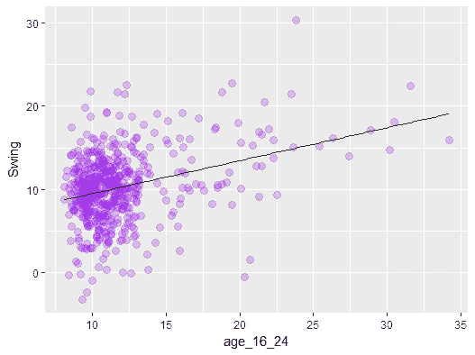
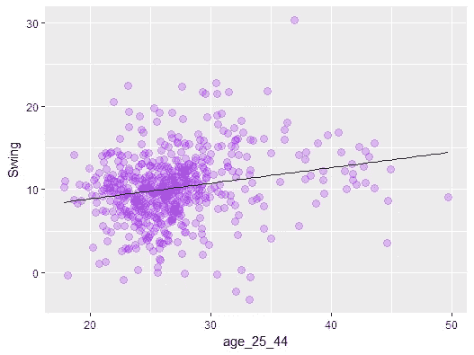
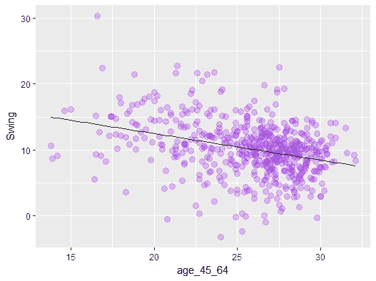
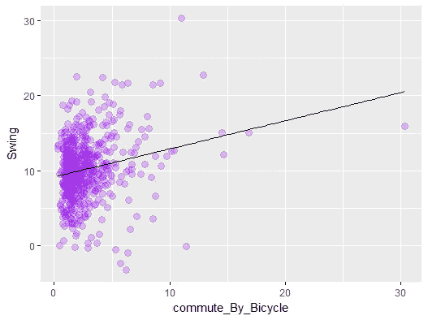
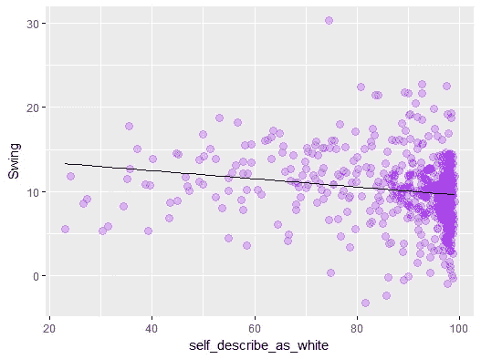
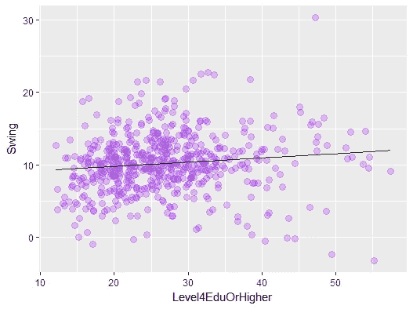
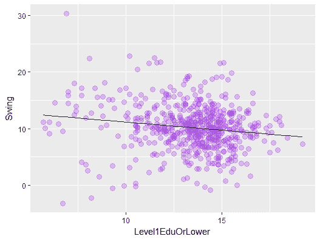
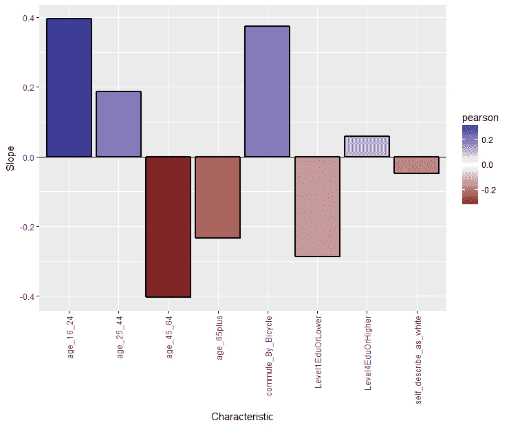

# 杰里米·科尔宾对哪些选民有吸引力？

> 原文：<https://towardsdatascience.com/which-voters-does-jeremy-corbyn-appeal-to-42c809a9fbf0?source=collection_archive---------4----------------------->

## 这是我上一篇选举博客的后续文章，这次关注的是哪些人口统计因素导致了工党出人意料的 9.5%的摇摆

我将工党摇摆(2015 年和 2017 年选举之间投票份额的百分比变化)与英格兰和威尔士选区的一些人口统计特征进行了比较，试图看看是什么因素导致了 2017 年大选中(大部分)出乎意料的工党摇摆。

我从 constituencyexplorer.org.uk 获得了选区的人口统计数据，从 BBC 选举网站获得了选区摇摆数据。我绘制了每个人口统计数据与劳动力变动的关系图。我观察的人口统计特征是:

*   某些年龄组的百分比
*   %拥有 4 级或以上教育(学位或以上)和%拥有 1 级或以下教育(普通中等教育证书或以下)，
*   骑自行车上下班的百分比(16-74 岁的就业人口)
*   自称是白人的百分比

Labour Swing against demographic characteristics. Each point represents a constituency. A linear regression line is shown on each chart

在图中，每个点代表一个选区，并显示最佳拟合的线性线。直线斜率的陡度表明人口特征对劳动力变动的影响有多大。

左侧的地块具有正斜率，*，即*具有较高比例人口特征的选区通常具有增加的劳动力摆动。右手边的情况正好相反。

下面是一个条形图，其中条形的高度对应于上述八个图中每个图的斜率。颜色与皮尔逊相关系数相对应，皮尔逊相关系数是一种衡量每个点平均距离最佳拟合线有多远的指标，0 表示不拟合，-1 和 1 分别表示完全负拟合和正拟合。

Slope of linear regression for demographic characteristics of constituencies. The colour corresponds to how good a fit the regressions is (*i.e.* how close to the regression line each point is on average).

看一下图表，年龄对劳动力变动的影响最大。年轻选民的选区表现出较大的积极波动，而年长选民的选区表现出较大的消极波动(尽管有趣的是，45-64 岁的选民比 65 岁以上的选民表现出更大的消极波动)。骑自行车上下班似乎也对劳动力流动产生了相对较强的积极影响。拥有普通中等教育证书或更低的资格对劳动力流动有相当大的负面影响。拥有大学学位和自我认同为白人分别对劳动力摆动产生积极和消极影响，尽管这些影响相当微弱。

**结论**

杰里米·科尔宾似乎有极化效应；他增加了年轻选民中工党的投票份额，但减少了年长选民中的投票份额。骑自行车上下班的人比例较高对劳动力流动有积极影响，而 GCSE 或更低的教育水平有负面影响。