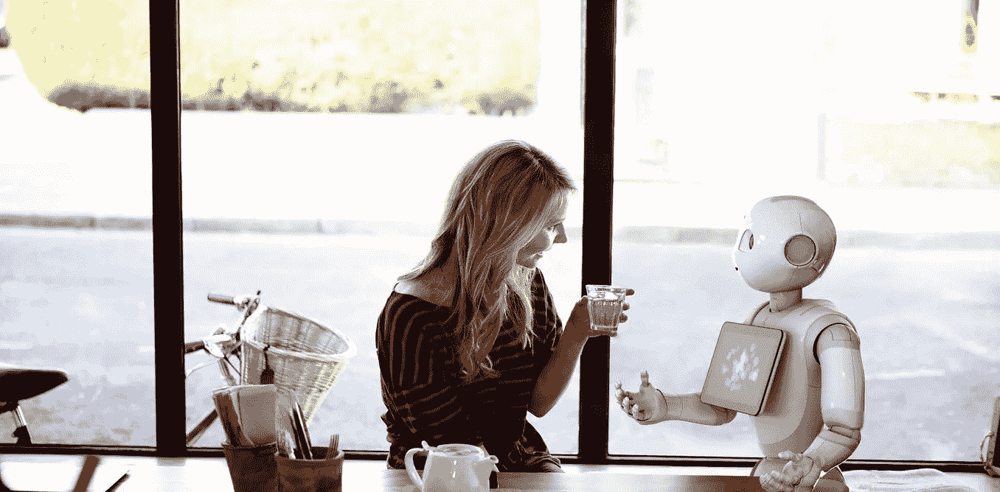
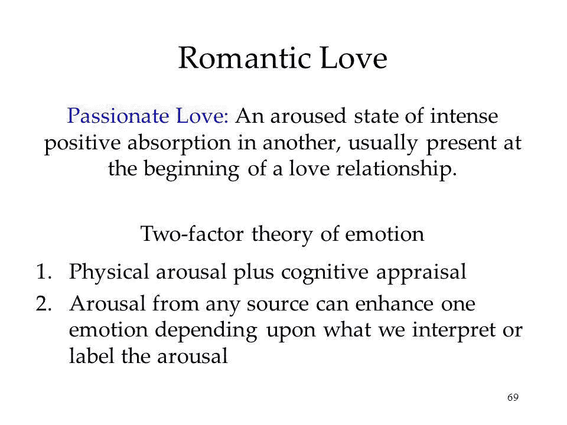
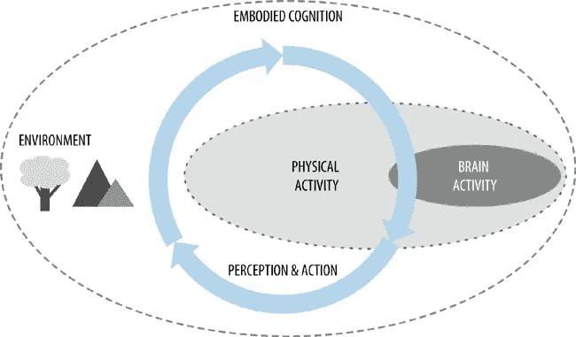

# 为什么机器永远不会爱你

> 原文：<https://towardsdatascience.com/why-a-machine-will-never-love-you-cb2c0f2fd0ef?source=collection_archive---------6----------------------->

## 虽然也许这并不重要

爱情方程式的解决方案有能力为价值数十亿美元的在线婚介行业创造数万亿美元的利润，重新定义人工智能研究的方向，并可能改变人类的长期生存统计数据。

为了理解如此基本的东西是如何成为如此多不同努力和事业的核心，我们只需要问一个看似简单的问题:“爱是什么？”

[网上媒人](http://time.com/aziz-ansari-modern-romance/)认为他们知道。这是外表，再加上化学通过一个心理算法运行。他们认为这是一个神秘的公式，在这个公式中，大脑在寻找配偶的过程中会随着原始节奏摇摆。这种说法很好地配合了他们自己标榜的“配对算法”，该算法旨在帮助减少他们数据库中潜在伴侣的选择，以选出几个比平均水平更有可能联系上的人(这是赌客愿意花大价钱购买的)。

> 当简单的答案包含复杂的问题，而这些问题的性质取决于我们向谁提问时，暗示着这个主题对我们作为人类的运作是如此重要，以至于它渗透到我们的大部分活动中，并影响我们的动机

心理学家和生物学家认为，这只不过是性欲、依恋和社会关系的有力结合，它源于这样一个事实，即我们的神经系统不是独立的，需要与周围的人密切协调。他们指出了哺乳动物表现出配对结合行为的[边缘共振](https://en.wikipedia.org/wiki/Limbic_resonance)的大量证据。

[神经科学家](http://neuro.hms.harvard.edu/harvard-mahoney-neuroscience-institute/brain-newsletter/and-brain-series/love-and-brain)指出血液中的复杂相互作用，如皮质醇、血清素、多巴胺和催产素，它们在血/脑屏障上以影响认知和大脑执行决策过程的方式产生显著影响。

当简单的答案包含复杂的问题，而这些问题的性质取决于我们向谁提问时，暗示着这个主题对于我们作为人类的运作是如此重要，以至于它渗透到我们的大部分活动中，并影响我们的动机。

爱因斯坦能够在第四维时空中想象出时间和空间的扭曲，他是这样描述爱情的:“你究竟如何用化学和物理学来解释像初恋这样重要的生物现象？”

然而，在他去世后的 60 年里，我们对身体、大脑和思想如何工作的理解已经取得了足够的进展，可以说，感觉来自于[情绪](https://www.scientificamerican.com/article/feeling-our-emotions/)，情绪来自于[感官数据](http://nautil.us/issue/56/perspective/why-your-biology-runs-on-feelings)。

# 情感芯片

这种简化的理解爱的方法打开了研究的大门，将爱从形而上学的领域转移到实验室的仪器下。我们的期望是，分析、测量以及最终的复制将为我们人类经历的最基本的驱动力之一提供解决方案。

这与剑桥大学的彼得·罗宾逊等计算机科学家的观点一致，他的团队正忙于建造一台能够理解人类情感并以同样方式回应的情感计算机。

他的“情感计算机”回避了机器智能和意识的问题。如果情绪是“人类和动物中调节复杂行为的进化功能状态，以应对实例化重复出现的环境主题的挑战，”正如一篇研究论文[所说的那样，那么情感计算，创造有感觉的机器是可能的，这意味着我们也可以拥有人类意义上的智能计算机，并进而拥有自我意识。](https://www.ncbi.nlm.nih.gov/pmc/articles/PMC5390692/)

具有代理意识的机器也将拥有权利，正如最近欧盟立法提案所建议的那样。但是形而上学并不是一个容易摆脱的学科，它不需要很长时间就可以用约翰·塞尔的“[中文室](https://en.wikipedia.org/wiki/Chinese_room)”思想实验来搅浑水，该实验基本上说，如果某样东西在每次你需要它的时候都表现得像是智能的和有意识的，那么它与智能的和有意识的是没有区别的。

然而，这种区别很重要。从人类学的角度来看，男人选择[女性机器人](http://www.news.com.au/lifestyle/real-life/true-stories/looking-for-love-unhappy-japanese-men-turn-to-silicone-sex-dolls/news-story/009af6032b995a149ff0d3f5127058d1)而不是人类伴侣的趋势可能是淫秽的，当然也是令人担忧的，这已经超出了这个范围，并引发了关于智力的辩论。

# 具身认知

有[感觉](https://www.npr.org/sections/13.7/2011/01/26/133213460/can-machines-fall-in-love)的机器让我们关注这样一个问题:它们[感觉](https://www.vitamodularis.org/articles/could_a_machine_feel_human-like_emotions.shtml)到底是什么？当它们经常缺少[身体](https://www.theverge.com/2013/12/16/5216522/can-humans-love-computers-sex-robots-her-spike-jonze)时，我们如何确定它们情感的真实性？即使它们有，也不会受到和我们一样的限制、约束和机遇。

感情不仅决定了我们是谁，也决定了我们的决策和身份感，这意味着它们是我们在这个世界上的目的感的背后。

当身体作为包裹大脑的感觉器官，成为我们运作方式不可或缺的一部分。情感、认知和执行功能成为千变万化的复杂舞蹈的一部分。

从计算的角度来看，这使得爱本身成为一个无法解决的 NP 完全问题，这个问题可以被人脑解决，但不能被任何计算机解决。

未来学家雷·库兹韦尔曾说过一句名言:“人类将会在未来的 15 年(T3)内爱上电脑”。他实际上的意思是，在这段时间内，人工智能将足够先进，能够真正感受情感，并做出自己的选择、决定和计算，从而能够回报人类的爱，这样配对就可以发生。

我们早就知道我们是有缺陷的，进化的，不断变化的[生物机器](https://www.brainpickings.org/2016/01/11/what-is-an-emotion-william-james/)。我们是谁，我们想什么，我们成为谁，我们做出什么决定，我们如何做出这些决定，以及这些决定最终将我们引向何方，都受到对管理每个生物系统的熵定律的有意识和潜意识理解的支配。

机器不受此限制。一个真正有意识的机器实际上可能会感觉到足够的同情，但除非它生活在一种早上起床时会疼痛的身体中，中午时会感到饥饿，直到它对上厕所的物理信号做出反应时才能形成连贯的思想，否则它不太可能以与我们完全相同的方式感受到爱。

*我的新书:* [《狙击思维:消除恐惧，应对不确定性，做出更好的决策》](https://www.amazon.com/gp/product/1250113679/ref=s9u_simh_gw_i1?ie=UTF8&fpl=fresh&pd_rd_i=1250113679&pd_rd_r=Z6AN9Q7R88M66K4RXRR0&pd_rd_w=eQtqd&pd_rd_wg=lBays&pf_rd_m=ATVPDKIKX0DER&pf_rd_s=&pf_rd_r=GD8764VXFTC5YQKAYESD&pf_rd_t=36701&pf_rd_p=a6aaf593-1ba4-4f4e-bdcc-0febe090b8ed&pf_rd_i=desktop)是一项神经科学研究，探讨如何运用实际步骤做出更好的决策。