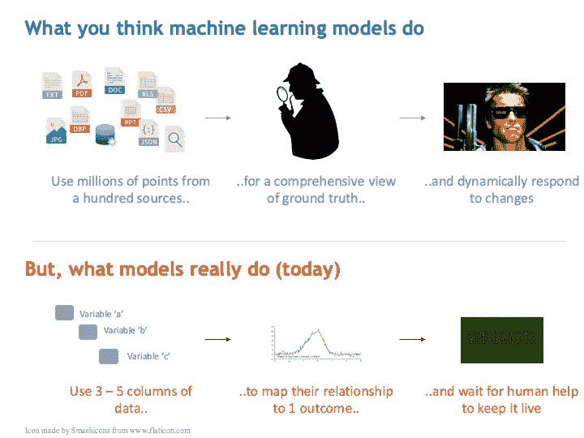

# 为什么人工智能模型非常需要人类来保持令人敬畏？

> 原文：<https://towardsdatascience.com/why-ai-models-absolutely-need-humans-to-stay-awesome-8fce149a8bf?source=collection_archive---------8----------------------->

Photo by [rawpixel](https://unsplash.com/photos/pkt6rsZ2TAM?utm_source=unsplash&utm_medium=referral&utm_content=creditCopyText) on [Unsplash](https://unsplash.com/?utm_source=unsplash&utm_medium=referral&utm_content=creditCopyText)

## 公司通常期望人工智能模型一旦实现，将保持智能并神奇地工作

没有什么比这更偏离事实了。

“*那么自我修复算法或自我维护的人工智能平台呢*”你可能会问。好吧，没有一个接近今天的生产级实现。而且，他们还需要一段时间才能做到不需要任何人工干预。

商业领袖通常会失望地发现，机器学习(ML)模型在消耗了宝贵的时间和投资后，仍然需要人类进行日常维护。让我们来看看为什么这是今天的现实，以及公司可以如何为此进行规划。

## 人工智能世界中勤杂工的相关性

Photo by [Todd Quackenbush](https://unsplash.com/photos/IClZBVw5W5A?utm_source=unsplash&utm_medium=referral&utm_content=creditCopyText) on [Unsplash](https://unsplash.com/@kesari/likes?utm_source=unsplash&utm_medium=referral&utm_content=creditCopyText)

让我们理解为什么算法仍然需要人类，并对 ML 模型的内部进行超级简单的解释。不，你不需要任何数学。是的，这篇文章的其余部分将以英语继续。

然后，我们将根据我们在[格拉米纳](https://gramener.com)的工作经验，讲述模特通常会寻求人类帮助的 4 个关键场景。最后，我们将列出企业为保持其模型健全和成功而必须采取的具体步骤。

## 一瞥典型的 ML 模型是如何工作的

假设你是一家电信公司，想要解决客户流失的大问题。你希望对那些将在未来一个月离开你的客户发出早期*预测性*警告。

您煞费苦心地提取了十几个关于客户人口统计、购买、订阅计划和服务交互的数据源。当你收集这些数据几年后，这 100 多个属性会变成数百万个数据点。

数据科学家日以继夜地分析和理解所有这些数据。然后，他们建立并设计模型来预测，比方说 10 个客户中有 8 个最终会离开。当试验时，这个工作非常漂亮。你现在可以专注于留住这些客户的任务。到目前为止，一切都很好。

现在让我们暂停一下，打开这个神奇的模型来检查它的内部。

Photo by [Pierrick VAN-TROOST](https://unsplash.com/photos/ia-kDal-Tqs?utm_source=unsplash&utm_medium=referral&utm_content=creditCopyText) on [Unsplash](https://unsplash.com/?utm_source=unsplash&utm_medium=referral&utm_content=creditCopyText)

从您提供的 100 多个客户属性因素中，您会找到模型使用的 3 到 5 个关键因素。例如，这些可以是，'*合同期限'*，'*电影是否是流式的'*，'*报告的服务投诉种类'*，或者更非直观的因素，如'*付款方式'，*或'*家属人数'*。

在研究了所有参数之后，数据科学团队可能会决定只使用其中的几个(或者只有 1 个！)对客户流失影响最大。所有其他属性都将被丢弃。

> *这样的模型可以概括为:“只要给我‘a’、‘b’、‘c’参数，我就告诉你‘z’事件发生的几率。”*

这就是一个模型所需要的，并且它完成了所描述的工作。

不，它并不总是处理一百万个数据点。不，它不模拟客户的大脑，也不了解人类的心理。深度学习模型等先进技术也不例外。

不幸的是，人们经常假设机器对地面情况有一个扎实、全面的了解。

机器学习的整个学科是关于识别那几个因素(*预测值*，然后弄清楚它们与结果(*想象一个公式*)之间的关系(*目标*)。

Models — Expectations vs Reality

## 动摇模型基础的四种情况

现在，你可以感觉到一个模型的内部是多么的脆弱，尽管它有着复杂的外表。

公平地说，我们人类也将复杂的决定建立在一组看似很小的因素上。然而，大脑有更强的能力来权衡这些因素以及它们对决策的相对重要性。模特们有大量的工作要做。

以下是四种需要模特重返课堂的场景:

## **1。数据结构的变化**

随着应用程序升级、新工具购买和流程变更，每个组织的技术环境都在不断发展。这些会影响数据格式和供给模型的管道。这种变化需要定期维护。

## **2。新情报的可用性**

企业通常会发现新的信息来源，如客户的在线行为、社交信息来源或其他背景情报。该模型必须重新评估，以检查这些新的投入可能是更强的预测。

## **3。业务动态的变化**

商业策略可能会改变。客户现在可能会被你公司丰富的产品特性所吸引，而不再是价格经济。难道不应该向模型传授这种新的动态以保持相关性吗？

## **4。持续刷新和验证**

假设上述情况都没有改变，模型仍然需要健康检查，比如说每几个月检查一次。该模型必须用新数据重新训练，以避免过时。否则，准确性可能会随着时间的推移而下降。

Business Scenarios that call for a retooling of Machine Learning models in production

## 怎样才能让模特们保持聪明？

既然我们已经确定了干预的必要性，那么公司可以通过以下方式计划保持其 ML 模型的更新和运行:

*   **变更预算:**我们已经看到，模型的衰变和翻新就像生物的生长周期一样自然。通过对模型拥有的总成本进行预算，预先留出维护费用。
*   **规划合适的人才:**虽然发现和模型开发得到了数据科学家的欢呼，但维护往往被视为一种拖累。确保数月后有合适的人才来调整和修补模型。
*   **提防** [**技术债**](https://www.youtube.com/watch?v=V18AsBIHlWs) **:** 如软件开发中所见，模型往往背负着过去包袱的重量。虽然有些是不可避免的，但还是要实施[模型流程](https://ai.google/research/pubs/pub43146)和[责任](https://ai.google/research/pubs/pub45742)来最小化其影响。
*   **创造一种** [**感知 ML 的文化**](https://www2.deloitte.com/insights/us/en/focus/human-capital-trends/2018/ai-robotics-intelligent-machines.html) **:** 模特越来越被视为企业的数字化工作者。公司应该创造一种文化，让人们可以与机器人共存，知道他们可以在哪里相互支持。

Source: [Giphy](https://giphy.com/gifs/mrw-work-hungover-qYTn6z4fjSqXK)

## 对自动化程度更高的未来的总结

今天，相对于模型维护，模型创建和工程阶段受到了过多的关注。可以理解，这是因为数据科学行业仍处于起步阶段。

即将到来的 ML 进展可能有助于解决这些挑战。像 [AutoML](http://www.fast.ai/2018/07/16/auto-ml2/) 和[神经架构搜索](/everything-you-need-to-know-about-automl-and-neural-architecture-search-8db1863682bf)这样的技术，虽然适合今天的模型创建，但也可以很好地适用于保持模型的适应性。

企业领导人必须采取长远的观点，为模型的维护和健康制定计划，以避免数据科学幻灭。对于那些刚接触机器学习的人来说，我希望这篇介绍澄清了一些围绕 AI 和 ML 模型世界的困惑或感知的神奇光环。

*对数据科学充满热情？随意加我在*[*LinkedIn*](https://www.linkedin.com/in/ganes-kesari/)*或者*[*Twitter*](http://twitter.com/kesaritweets)*。*

 [## Ganes Kesari | LinkedIn

### 在其他网站上包含此 LinkedIn 个人资料

www.linkedin.com](https://www.linkedin.com/in/ganes-kesari/)