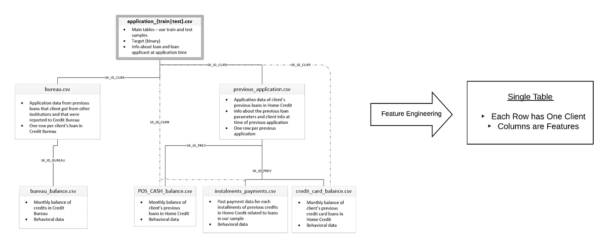
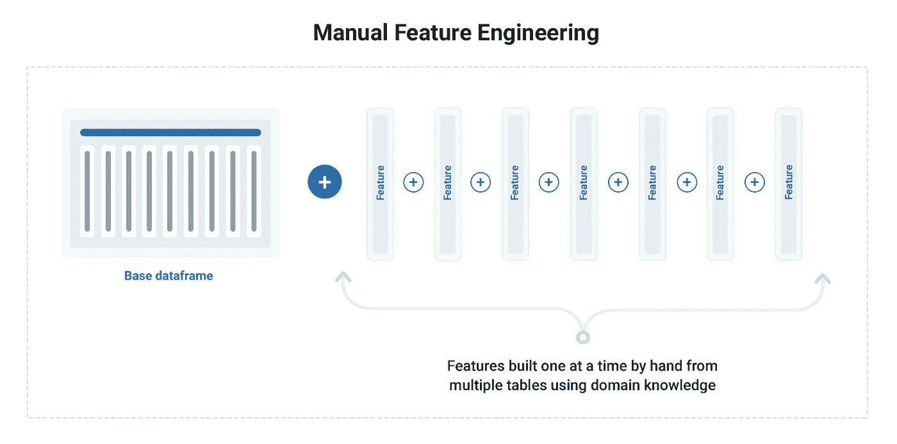
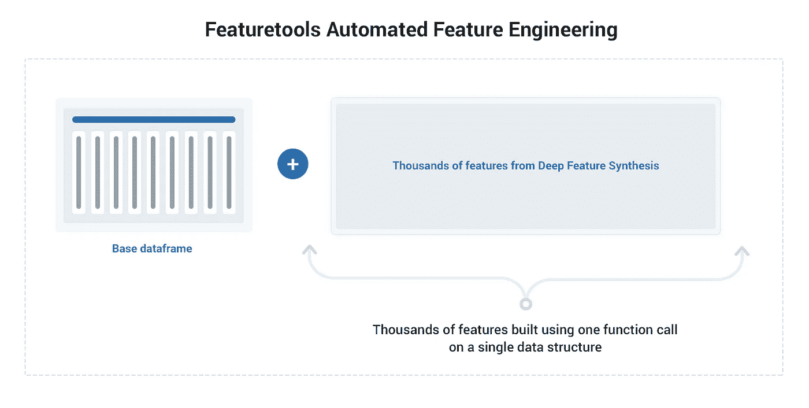
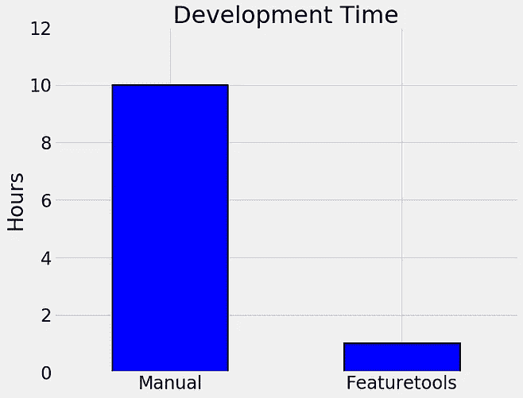
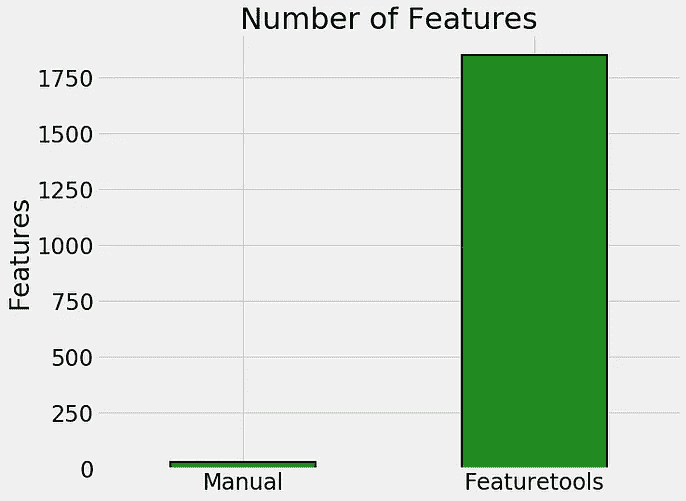
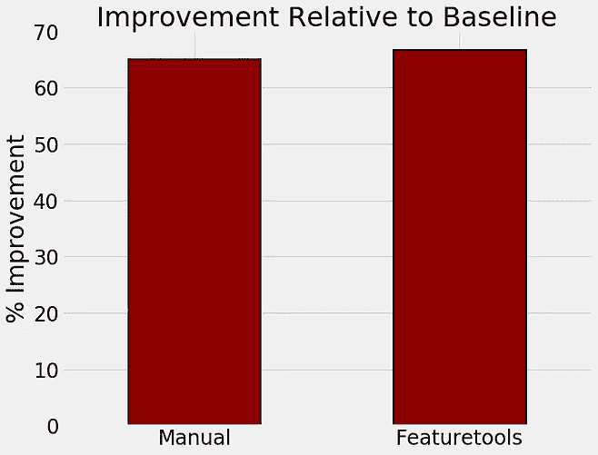
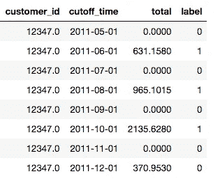
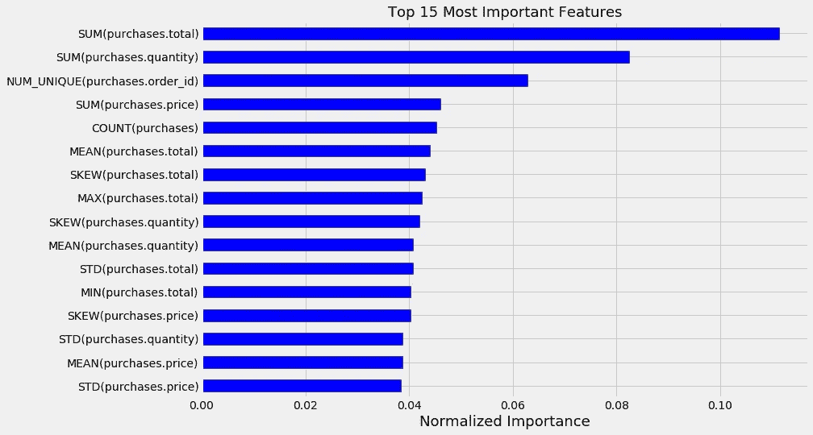
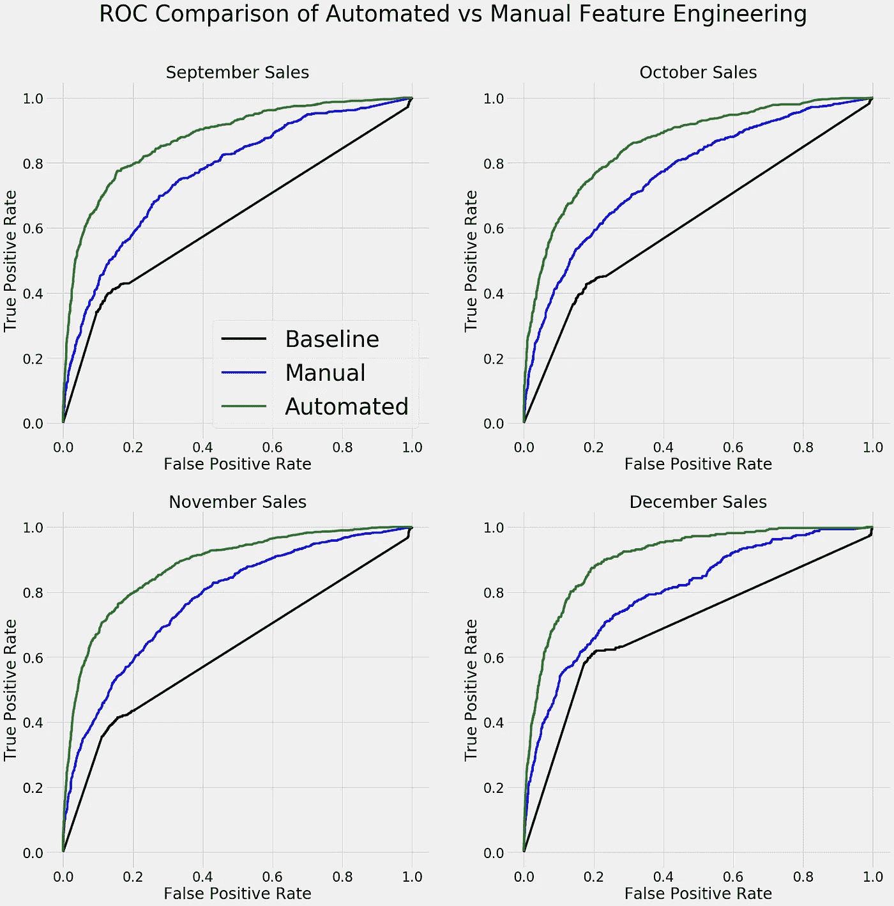

# 为什么自动化特征工程将改变你进行机器学习的方式

> 原文：<https://towardsdatascience.com/why-automated-feature-engineering-will-change-the-way-you-do-machine-learning-5c15bf188b96?source=collection_archive---------1----------------------->


## 自动化特征工程将节省您的时间，构建更好的预测模型，创建有意义的特征，并防止数据泄漏

数据科学中很少有确定性——随着更好方法的开发，库、工具和算法不断变化。然而，一个不会消失的趋势是自动化水平的提高。

近年来，在[自动化模型选择](https://epistasislab.github.io/tpot/api/)和[超参数调整](https://github.com/automl)方面取得了进展，但机器学习管道中最重要的[方面](https://homes.cs.washington.edu/~pedrod/papers/cacm12.pdf)特征工程在很大程度上被忽视了。这个关键领域最有能力的入口是 [Featuretools](https://docs.featuretools.com/#minute-quick-start) ，一个开源的 Python 库。在本文中，我们将使用这个库来了解自动化特征工程将如何更好地改变您进行机器学习的方式。


Featuretools is an open-source Python library for automated feature engineering.

自动化特征工程是一种相对较新的技术，但是，在使用它解决了许多使用真实世界数据集的数据科学问题之后，我确信它应该是任何机器学习工作流的一个标准部分。在这里，我们将通过 GitHub 上的 Jupyter 笔记本来看看这些项目中的两个项目的结果和结论。

每个项目都强调了自动化特征工程的一些好处:

*   **贷款偿还预测:**与手动特征工程相比，自动化特征工程可以将机器学习开发时间减少 10 倍，同时提供更好的建模性能。([笔记本](https://github.com/Featuretools/Automated-Manual-Comparison/tree/master/Loan%20Repayment))
*   **零售支出预测:**自动化特征工程通过内部处理时间序列过滤器来创建有意义的特征并防止数据泄漏，从而实现成功的模型部署。([笔记本](https://github.com/Featuretools/Automated-Manual-Comparison/tree/master/Retail%20Spending))

请随意深入研究代码并试用 Featuretools！(完全披露:我在开发这个库的公司[特性实验室](https://www.featurelabs.com/)工作。这些项目是用 Featuretools 的免费开源版本完成的。

## 特征工程:手动还是自动

[特征工程](https://en.wikipedia.org/wiki/Feature_engineering)是获取数据集并构建解释变量(特征)的过程，可用于为预测问题训练机器学习模型。通常，数据分布在多个表中，必须收集到一个表中，表中的行包含观察值，表中的列包含特征。

传统的特征工程方法是使用领域知识一次构建一个特征，这是一个乏味、耗时且容易出错的过程，称为手动特征工程。手动特征工程的代码是与*问题相关的*和*必须为每个新数据集重写。*

自动化特征工程通过从一组相关数据表中自动提取*有用且有意义的*特征来改进这一标准工作流程，其框架可应用于*任何问题。*它不仅减少了特征工程所花费的时间，还创建了可解释的特征，并通过过滤与时间相关的数据来防止数据泄漏。

> 自动化特征工程比手动特征工程更高效且可重复，允许您更快地构建更好的预测模型。

# 贷款偿还:更快地构建更好的模型

数据科学家在处理家庭信用贷款问题时面临的主要困难是数据的大小和分布(这是目前正在 Kaggle 上进行的一项机器学习竞赛，目的是预测客户是否会偿还贷款)。看一下完整的数据集，你会发现有*5800 万*行数据分布在七个表中。机器学习需要单个表来进行训练，因此特征工程意味着将每个客户端的所有信息整合在一个表中。



Feature engineering requires capturing all information from a set of related tables into one table.

我第一次尝试使用传统的手工特征工程:我总共花了 **10 个小时**手工创建一组特征。首先我阅读[其他数据科学家的作品](https://www.kaggle.com/c/home-credit-default-risk/kernels)，探索数据，研究问题领域，以获取必要的领域知识。然后我把知识翻译成代码，一次构建一个特性。作为单个手动特性的一个例子，我找到了一个客户在以前贷款中的延期付款总数，这个操作需要使用 3 个不同的表。

最终手动设计的功能表现相当出色，比基准功能提高了 65%(相对于排行榜的最高分数)，表明了适当功能设计的[重要性](https://homes.cs.washington.edu/~pedrod/papers/cacm12.pdf)。

然而，低效甚至不能用来描述这个过程。对于手工特征工程，我最终在每个特征上花费了超过 15 分钟，因为我使用了一次制作一个特征的传统方法。



The Manual Feature Engineering process.

除了乏味和耗时之外，手动特征工程还:

*   **特定问题:**我花了很多时间写的所有代码都不能应用于*任何其他问题*
*   **易错:**每一行代码都是犯错误的另一个机会

此外，最终手工设计的功能受到人类创造力和耐心的限制:我们能想到的功能只有这么多，我们能做的时间也只有这么多。

> 自动化特征工程的承诺是通过获取一组相关的表并使用可以应用于所有问题的代码自动构建数百个有用的特征来超越这些限制。

## 从手动到自动特征工程

正如在 Featuretools 中实现的那样，自动化特征工程甚至允许像我这样的领域新手从一组相关的数据表中创建数千个相关的特征。我们需要知道的只是我们的表的基本结构和它们之间的关系，我们在一个叫做[实体集](https://docs.featuretools.com/generated/featuretools.EntitySet.html)的单一数据结构中跟踪它们。一旦我们有了一个实体集，使用一种叫做[深度特征合成](https://www.featurelabs.com/blog/deep-feature-synthesis/) (DFS)的方法，我们能够在*一个函数调用*中构建数千个特征。



The Automated Feature Engineering process using Featuretools.

DFS 使用名为[“原语”](https://docs.featuretools.com/automated_feature_engineering/primitives.html)的函数来聚合和转换我们的数据。这些原语可以简单到取一列的平均值或最大值，也可以复杂到基于专业知识，因为 [Featuretools 允许我们定义自己的自定义原语](https://docs.featuretools.com/guides/advanced_custom_primitives.html)。

特征原语包括许多我们已经手工完成的操作，但是使用 Featuretools，我们可以在任何关系数据库中使用*完全相同的*语法，而不是重新编写代码来对不同的数据集应用这些操作。此外，当我们将原语相互堆叠以创建深层功能时，DFS 的威力就显现出来了。(关于 DFS 的更多信息，请看该技术发明者之一的博客文章[。)](https://www.featurelabs.com/blog/deep-feature-synthesis/)

> 深度特征合成非常灵活，可以应用于任何数据科学问题，而且功能强大，可以通过创建深度特征来揭示数据中的洞察力。

我将省去设置所需的几行代码，但是 DFS 的操作只需要一行代码。在这里，我们使用数据集中的所有 7 个表为每个客户端创建了数千个特征(T0 是导入的特征工具库) :

```
# Deep feature synthesis
feature_matrix, features = ft.dfs(entityset=es, 
                                  target_entity='clients',
                                  agg_primitives = agg_primitives,
                                trans_primitives = trans_primitives)
```

以下是我们从 Featuretools 自动获得的一些 **1820 特性**:

*   客户以前贷款支付的最大总金额。这是跨 3 个表使用一个`MAX`和一个`SUM`原语创建的。
*   客户以前平均信用卡债务的百分比排名。这使用了跨越两个表的`PERCENTILE`和`MEAN`原语。
*   客户在申请过程中是否提交了两份文件。这使用了一个`AND`转换原语和一个表。

这些特性中的每一个都是使用简单的聚合构建的，因此是人类可以理解的。Featuretools 创建了许多与我手动创建的功能相同的功能，但也有数以千计的功能是我从未想到过的——也没有时间去实现。并不是每一个特性都与问题相关，有些特性是高度相关的，尽管如此，拥有*太多的特性比拥有*太少的特性要好！

在进行了一些功能选择和模型优化后，这些功能在预测模型中的表现比手动功能稍好，总开发时间为 **1 小时**，比手动流程缩短了 10 倍。Featuretools 速度更快，因为它需要的领域知识更少，而且需要编写的代码行也更少。

我承认学习 Featuretools 需要一点时间，但这是一项值得的投资。花一个小时左右学习 Featuretools 后，你可以将它*应用到任何机器学习*问题上。

下面的图表总结了我对贷款偿还问题的经验:



Comparison between automated and manual feature engineering on time, number of features, and performance.

*   开发时间:考虑制作最终特征工程代码所需的一切: **10 小时手工对 1 小时自动化**
*   该方法产生的特征数量: **30 个特征手动 vs 1820 个自动**
*   相对于基线的改善是指使用基于以下功能训练的模型，与公共排行榜最高分数相比，基线上的百分比增益: **65%人工对 66%自动**

> 我的观点是，自动化特征工程不会取代数据科学家，而是通过显著提高效率，将使她有更多时间花在机器学习管道的其他方面。

此外，我为第一个项目编写的 Featuretools 代码可以应用于任何数据集，而手动工程代码必须扔掉，并为下一个数据集完全重写！

# 零售支出:构建有意义的功能并防止数据泄露

对于第二个数据集，一个带有在线时间戳的客户交易记录(T10)，预测问题是将客户分为两个部分，那些将在下个月花费超过 500 美元的人和那些不会的人。然而，不是对所有的标签使用一个月，而是每个客户是一个标签*多次*。我们可以用他们 5 月份的支出作为标签，然后是 6 月份，以此类推。



Each customer is used as a training example multiple times

多次使用每个客户作为观察结果给创建训练数据带来了困难:当为给定月份的客户制作特征时，我们不能使用来自未来月份的任何信息，*即使我们可以访问这些数据*。在部署中，我们*永远不会有未来的数据*，因此不能用它来训练模型。公司经常在这个问题上挣扎，经常部署一个在现实世界中比在开发中表现差得多的模型，因为它是使用无效数据训练的。

幸运的是，在 Featuretools 中，确保我们的数据在时序问题中是有效的[。](https://docs.featuretools.com/automated_feature_engineering/handling_time.html)在深度特征合成功能中，我们传入一个如上图所示的数据帧，其中截止时间代表一个点，超过该点我们就不能使用任何标签数据，Featuretools *自动*在构建特征时将时间考虑在内。

给定月份中客户的功能是使用筛选到该月之前的数据构建的。注意，创建我们的特性集的调用与解决贷款偿还问题的调用相同，只是增加了`cutoff_time.`

```
# Deep feature synthesis
feature_matrix, features = ft.dfs(entityset=es, 
                                  target_entity='customers',
                                  agg_primitives = agg_primitives,
                                trans_primitives = trans_primitives,
                                  cutoff_time = cutoff_times)
```

运行深度特性合成的结果是一个特性表，每个月的每个客户*一个特性表。我们可以使用这些特征，用我们的标签训练一个模型，然后对任何一个月进行预测。此外，我们可以放心，我们的模型中的特征不使用未来的信息，这将导致不公平的优势，并产生误导性的训练分数。*

通过自动化功能，我能够建立一个机器学习模型，在预测一个月的客户支出类别时，与 0.69 的知情基线(猜测与上个月的支出水平相同)相比，该模型实现了 0.90 的 ROC AUC。

除了提供令人印象深刻的预测性能之外，Featuretools 实现还给了我同样有价值的东西:可解释的特性。看看随机森林模型的 15 个最重要的特征:



15 most important Featuretools features from a random forest model.

功能的重要性告诉我们，客户下个月将花费多少的最重要的预测因素是他们之前已经花费了多少`SUM(purchases.total)`，以及购买的次数`SUM(purchases.quantity).`，这些是我们可以手工构建的功能，但是我们将不得不担心泄露数据，并创建一个在开发中比在部署中做得更好的模型。

如果创建有意义特性的工具已经存在，而不需要担心特性的有效性，那么为什么还要手工实现呢？此外，自动化特征在问题的上下文中是完全清楚的，并且可以告知我们现实世界的推理。

> 自动化特征工程识别了最重要的信号，实现了数据科学的主要目标:揭示隐藏在海量数据中的洞察力。

即使在手动特性工程上花费了比使用 Featuretools 多得多的时间，我也无法开发出一组性能接近的特性。下图显示了使用在两个数据集上训练的模型对一个月的未来客户销售进行分类的 ROC 曲线。向左上方的曲线表示更好的预测:



ROC curves comparing automated and manual feature engineering results. A curve to the left and top indicates better performance.

我甚至不完全确定手动特性是否是使用有效数据制作的，但是有了 Featuretools 实现，我就不必担心时间相关问题中的数据泄漏。也许无法手动设计一组有用的有效功能说明了我作为数据科学家的失败，但是如果有工具可以安全地为我们做这件事，为什么不使用它呢？

> 我们在日常生活中使用自动安全系统，Featuretools 中的自动化特征工程是在时序问题中构建有意义的机器学习特征的安全方法，同时提供卓越的预测性能。

# 结论

我从这些项目中走出来，确信自动化特征工程应该是机器学习工作流程中不可或缺的一部分。这项技术并不完美，但仍能显著提高效率。

主要结论是自动化特征工程:

*   **将实施时间**缩短了 10 倍
*   达到同级 **或更好**的造型**表现**
*   交付具有现实意义的**可解释特性**
*   **防止可能导致模型无效的不正确数据使用**
*   **适应现有的工作流程**和机器学习模型

> “更聪明地工作，而不是更努力地工作”可能是老生常谈，但有时这种陈词滥调也有道理:如果有一种方法可以用更少的时间投入做同样的工作，那么显然这是一种值得学习的方法。

[Featuretools](https://www.featuretools.com/) 将永远免费使用和开源(欢迎投稿)，有几个例子——[这是我写的一篇文章](/automated-feature-engineering-in-python-99baf11cc219)——让你在 10 分钟内开始。作为一名数据科学家，你的工作是安全的，但是通过自动化特征工程，它可以变得简单得多。

如果构建有意义的高性能预测模型是您关心的事情，那么请联系我们的[功能实验室](https://www.featurelabs.com/contact/)。虽然这个项目是用开源的 Featuretools 完成的，但是[商业产品](https://www.featurelabs.com/product)为创建机器学习解决方案提供了额外的工具和支持。