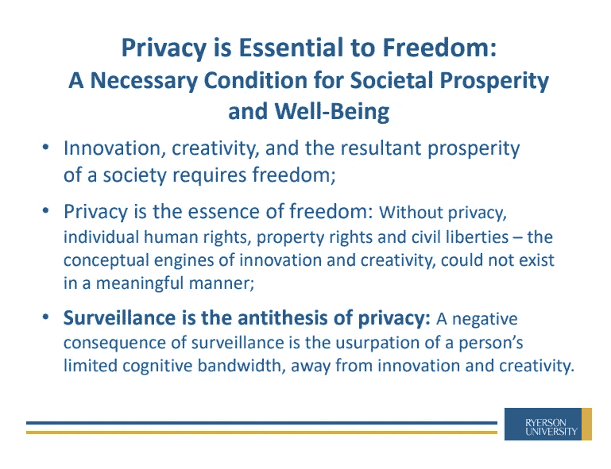
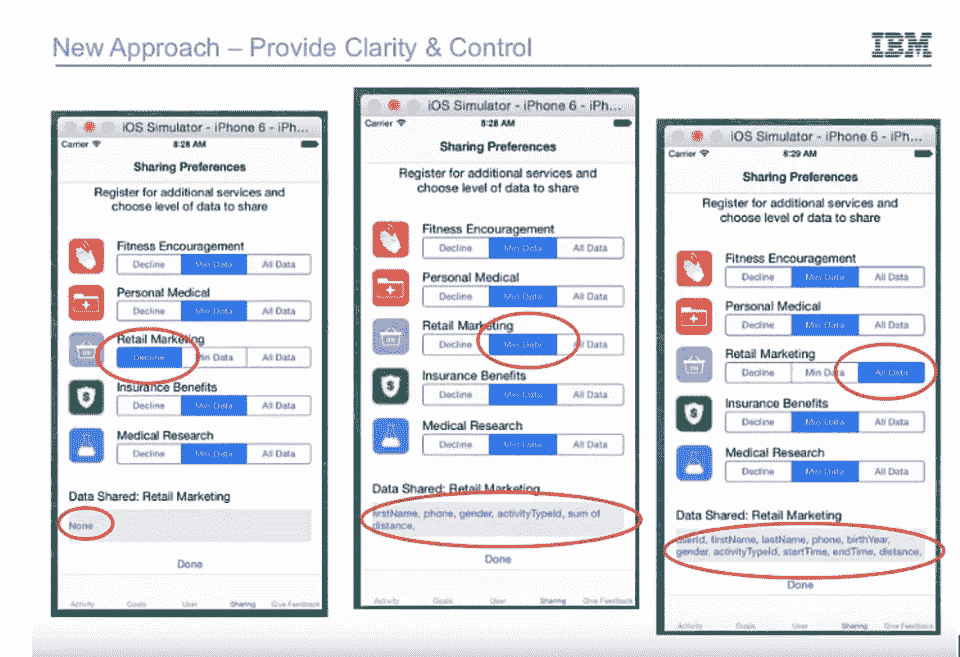

# 为什么大企业应该主动建立隐私:安·卡沃金博士的观点

> 原文：<https://towardsdatascience.com/why-big-business-should-proactively-build-for-privacy-perspectives-from-dr-ann-cavoukian-9b1d1a92c868?source=collection_archive---------11----------------------->

*本文探讨了设计隐私(PbD)的兴起，从基本框架，到它在 GDPR 中的应用，再到它在商业实践和基础设施中的应用，尤其是在人工智能出现之后。*

*我们有幸与前三任安大略省隐私专员、现任加拿大多伦多瑞尔森大学卓越隐私设计中心杰出常驻专家 Ann Cavoukian 博士坐在一起，讨论这一将颠覆当前商业实践的巨大转变。我们还寻求人工智能初创企业和企业高管的回应，以解决设计隐私目前的障碍和未来的商业影响。本文包括 Scott Bennet 的贡献，他是一位研究隐私和 GDPR 对新兴技术和当前商业实践的影响的同事。*

Dr. Ann Cavoukian, Ph.D

我称自己为反营销者，尤其是这些天。我的背景主要来自数据库营销和数据的语境化，以做出更明智的决定，有效地向人们出售更多的东西。我看到的数据，无论是在银行、忠诚度计划、广告和社交平台——用户交易、数字行为、互动、对话和个人资料——都被缝合在一起，以创建关于个人和群体、他们的倾向、意图及其对业务的潜在风险的叙述。

虽然以我们这样的方式分析这些信息是一种既定的做法，但好处主要在企业，而对我们的客户不利。我们对人们的描述是基于他们创造的数据，基于我们自己的假设，这些假设反过来影响了分析，并最终创造了管理数据和决策的规则。这些规则中的一些在不知不觉中受到了来自经验和因素的非故意偏见的影响，这些经验和因素使特定集群或人群的主张永久化。

虽然多年来我没有质疑过我们用来理解和定义受众的方法，但很明显，商业仍然在很大程度上不受约束，自由使用这些信息，几乎没有责任和法律后果。

随着数据变得越来越重要，随着人工智能以更快的速度分析和表达意义，这些偏见永久化的危险变得更加严重，如果措施不到位并无情地执行，将造成更大的社会分裂。

最近，我遇到了我的创造者。就当是对我作为营销人员操纵数据多年的赎罪吧。我们有幸与一位我仰慕多年的人谈论隐私。在我看来，Ann Cavoukian 博士将推动整个行业的讨论，让企业站起来倾听。

# 还记得加拿大隐私专员对脸书采取的措施吗？

Ann Cavoukian 在传播隐私意识方面发挥了重要作用，这使她在 2008 年站在了世界舞台的中心，与脸书展开了直接的对抗。当时，联邦隐私专员声称 22 种做法违反了加拿大个人信息保护和电子文件法案(PIPEDA)。这最终导致 FTC 与脸书达成协议，要求增加对用户的透明度，要求在“实施覆盖其隐私设置的更改”之前获得用户的明确同意

Ann Cavoukian 在技术和商业领域是一个家喻户晓的名字。作为加拿大安大略省的三任隐私专员，她已经放弃了几十年的隐私讨论。如今，随着 2018 年 5 月 25 日生效的欧盟通用数据保护和法规(GDPR)包括 Cavoukian 长期倡导的创作“设计隐私”(PbD)，这一讨论已经达到了白热化。这将大大提高门槛，任何与欧盟做生意的公司或平台都需要遵守这些标准。在收集、存储和处理个人消费者信息时，GDPR 的核心是这些[指导原则](https://www.itgovernance.eu/blog/en/the-gdpr-understanding-the-6-data-protection-principles):

*   合法、公平和透明
*   目的限制
*   数据最小化
*   准确(性)
*   存储限制
*   完整性和保密性(安全性)
*   有责任

Privacy by Design 的前提是以公平和道德的方式在新产品或服务的每个阶段主动嵌入隐私。Cavoukian 认为，通过实施 PbD，公司实际上已经走上了遵守 GDPR 的道路。

# 是什么让这个时机成熟的隐私设计？

在 90 年代，网络呈指数级增长。商业、在线应用和平台正在引入一个新时代，这将极大地改变商业和社会。当时，Ann Cavoukian 是安大略省隐私专员的第一个任期。她目睹了这种现象，并担心它会急剧增长，在一个无处不在的计算、日益增加的在线连接和大规模社交媒体的时代，她推测隐私需要作为一种预防模式来发展，而不是简单地“以后请求原谅”

> *想象一下，你去看医生，他告诉你，你有一些癌症发展的迹象，并说，“我们会看看它是否恶化，如果恶化，我们会送你去做一些化疗”。多么不可思议的提议！我希望同样不可思议的是，你会让隐私损害发展，只是等待违反，而不是防止他们发生。这就是 PbD 的起源。*

2010 年，在欧洲数据保护机构和隐私专员国际会议上，Cavoukian 提出了一项决议，即 PbD 应该补充监管合规性，以减轻潜在的危害。一致通过。原因？

> *每个人都看到这只是识别隐私危害的冰山一角，我们无法解决所有逃避我们检测的数据泄露和隐私危害，因为犯罪者的复杂性意味着大多数泄露仍然基本上不为人知、不受挑战和不受监管。因此，PbD 成为当前隐私法规的补充，作为确保未来隐私的唯一方法，它不再是可持续的。*

如今，数据安全问题已经变得与 airplay 同等重要，如果不是更多的话。Cavoukian 认为:

> *当恐怖事件增多，比如巴黎的* [*【圣贝纳迪诺】*](https://www.cnn.com/2015/12/02/us/san-bernardino-shooting/index.html)*[*【查理周刊】*](https://www.telegraph.co.uk/news/worldnews/europe/france/11331902/Charlie-Hebdo-attack-Frances-worst-terrorist-attack-in-a-generation-leaves-12-dead.html) *袭击，以及曼彻斯特的***袭击，钟摆又转回到:忘掉隐私——我们需要安全。当然，我们需要安全——但不排除隐私！***
> 
> **我总是说隐私就是控制——与使用你自己的数据有关的个人控制。这与保密无关。当人们说‘好吧，如果你没什么好隐瞒的，那有什么问题？’时，我快疯了。问题是这不是自由的意义所在。自由意味着，作为一名守法公民，你可以决定你想披露哪些数据，向谁披露——向政府、向公司、向雇主。**

**皮尤研究中心在斯诺登事件后开展了一项互联网研究，以了解消费者对个人隐私的看法。引用的主要发现:**

> ***人们普遍担心政府和企业的监控:
> 91%的成年人认为消费者已经失去了对其个人信息的控制；80%的社交网络用户担心第三方访问他们的数据；80%的成年人认为美国人应该关注政府监控。***

# **背景是关键:**

**虽然有些人知道他们是在用自己的信息换取对价值的期望，但他们应该充分了解这种价值是如何从他们的数据中提取出来的。Cavoukian 警告说:**

> **隐私不是宗教。如果你想泄露你的信息，请便，只要你决定这么做。背景是关键。对我来说敏感的东西对你来说可能毫无意义，反之亦然……在社交聚会上，连我的医生都不会承认自己是我的医生！他们就是这么保护我的隐私的。这真是太棒了！他们竭尽全力保护你的个人健康信息。**

**销售隐私需求的重要性包括持续的教育。除非人们个人受到影响，否则许多人不会把这两者联系起来。普通人知道物联网设备接收他们对配偶或子女说的“甜言蜜语”的含义吗？当他们意识到这一点时，他们通常会强烈反对。**

**背景凸显了选择的重要性。这不再是一个要么全有要么全无的游戏，包含在公司的条款和条件中，只需点击一下，“接受”就会自动给予完全的许可。那些日子已经过去了。**

**虽然有些人可能会反对出于保险目的进行分析和语境化，但他们可能会允许以匿名方式将他们的个人健康史纳入研究，以了解他们特定地区的癌症流行情况。**

> ***语境是选择的问题；选择的自由对维护我们的自由至关重要。***

# **隐私不等于秘密**

**卡沃金强调，隐私并不是要隐藏什么。每个人都有对自己非常敏感的个人信息领域，他们可能希望也可能不希望公开这些信息。**

> ***你必须有选择。你必须是做决定的人。* ***这就是个人控制问题如此重要的原因。*****

**我从 Ann Cavoukian 最近的演讲中摘录了这张幻灯片:**

****

**Privacy by Design by Dr. Ann Cavoukian**

**中国社会信用体系[的建立是为了增加透明度，提高公民的可信度。这是我们不想要的反面乌托邦。中国是一个明显的监视社会，与自由社会的价值观相矛盾。Cavoukian 阐明了隐私是我们自由的基础这一概念。如果你重视自由，你就重视隐私。](https://www.wired.co.uk/article/china-social-credit)**

> **看看德国。德国是世界上领先的隐私和数据保护国家，这不是偶然的。他们不得不忍受第三帝国的虐待，忍受他们的隐私和自由的完全丧失，这绝非偶然。当这一切结束时，他们说，“我们再也不会允许国家剥夺我们的隐私——我们的自由！”他们确实遵守了这一点。**

**在斯诺登事件后，我写了这样一段话:[美国国家安全局，隐私和公然意识到:你在网上做的任何事情都不是隐私](http://arcompany.co/the-nsa-privacy-and-the-blatant-realization-nothing-you-do-online-is-private/)并引用了 Writynga 在 2012 年回应扎克伯格关于隐私不再是社会规范的观点时写的一段话:**

> ***我们喜欢说我们是伴随着互联网长大的，因此我们认为互联网是完全成熟的。但事实并非如此。没有隐私的亲密是什么？什么是没有隐私的民主？……科技让人变傻。它会让你看不到你的潜在价值是什么，需要什么。我们真的愿意放弃我们努力争取的宪法和公民自由吗？人们为此而流血，而不是生活在一个监视的社会里。我们看着史塔西说，‘那不是我们。***

**人民的意愿要求更大的透明度。**

**但是我们不想要一个让人感觉我们生活在警察国家的监视状态。在确保国家安全和遏制我们的公民自由之间必须有一个平衡。**

# **人们将随时拥有完全的透明度…完全的控制权**

**自 2010 年通过隐私设计(PbD)作为补充隐私法规的国际标准以来，PbD 已被翻译成 40 种语言。该方法已被修改，以包括这样一个前提，即可以努力确保个人隐私，同时在正和范式内发展消费者信任并增加企业的收入机会。Cavoukian 相信这是商业发展的可行之路:**

> **我们可以拥有隐私，满足商业利益、安全和公共安全……这不是一个非此即彼的命题。我认为这是最好的方式，以正和、双赢的方式进行，从而使各方都受益。**

**隐私设计的[基本原则](https://www.ryerson.ca/pbdce/certification/seven-foundational-principles-of-privacy-by-design/)包括:**

1.  **主动而非被动:预防性而非补救性**
2.  **隐私作为默认设置**
3.  **设计中嵌入隐私**
4.  **完整的功能:正和，而不是零和**
5.  **端到端安全性:全生命周期保护**
6.  **可见性和透明度:保持开放**
7.  **尊重用户隐私:以用户为中心**

**Cavoukian 认为，原则 2(默认隐私)至关重要，也是所有基本原则中最难的一条，因为它需要最大的投资和努力:明确要求改变数据的收集、使用和披露方式，并将导致数据政策和流程的改变，包括新的以用户为中心的隐私控制。**

**[第 21 条](https://gdpr-info.eu/art-21-gdpr/)还规定个人在任何时候都有“反对”处理其个人信息的“权利”*。这包括在直接营销和档案中使用:***

> ****控制方将不再处理个人数据，除非控制方证明其处理数据有令人信服的合法理由，可以超越数据主体的利益、权利和自由****

***业务必须更明确，走得更远，超越传统的披露和服务条款。目的说明和使用限制要求组织明确说明它需要的信息、目的是什么，并且必须获得专门针对该目的且仅针对该目的的同意。稍后，如果发生二次使用，组织将再次要求用户同意。如果公开是透明度的关键，那么企业将需要找到一种方法来做到这一点，同时减轻同意疲劳。***

***第 17 条提出了一个更强的用户权利，它掩盖了当前的商业惯例:删除的权利(“被遗忘的权利”)***

> ****数据主体应有权在无不当延迟的情况下从控制者处获得删除与其相关的个人数据的权利，控制者有义务在无不当延迟的情况下删除个人数据。****

***虽然该法规将有例外，如将数据主体确定为实体的数据:通过健康记录和银行信息，行为、交易、未来分析和背景模型是“被遗忘权”的公平游戏。GDPR 的出现让企业看到了潜在的影响，对于那些没有明确选择加入的客户，公司的客户记录量平均下降了 20%。***

***这是真正以用户为中心的系统。毫无疑问，隐私设计将挑战当前的实践，颠覆当前的基础设施。***

***这个隐私 UI 模拟([IBM:Journey to Compliance](https://www.youtube.com/watch?v=RV0T8ISaCmg))展示了潜在的用户控制将如何实时工作，以及用户可以根据不同的上下文授予同意的程度。这种级别的用户访问将需要一个数据存储库来清除用户信息，但如果用户决定恢复访问，必须灵活地将数据重新部署到系统中。***

******

***IBM: Journey Towards Compliance***

# ***隐私设计能为商业创造一个正和的存在吗？***

***如果你在一年前问我，我会说商业采用设计隐私是不现实的，更不用说接受了。它将颠覆流程、结构和政策。然而，在 GDPR 的职权范围内，这是不可避免的。***

***今天，我们请 Ann Cavoukian 考虑一下商业惯例。继 GDPR 事件之后，谷歌和脸书都收到了高达 93 亿美元的巨额罚款。由于最近的[剑桥分析数据泄露](https://timesofindia.indiatimes.com/india/facebook-data-breach-cbi-initiates-preliminary-enquiry-against-cambridge-analytica-gsr/articleshow/65324390.cms)，脸书正在投资数百万在工具和资源上，以尽量减少未来的事件发生。最近 [Q2 股票暴跌](https://techcrunch.com/2018/07/25/facebook-q2-2018-earnings/)让市场大吃一惊，但对于扎克伯格来说，他明确表示他们将在几个季度内遭受性能打击，以便为用户改善平台……而不是为股东。虽然它们是公司应该如何行事的灯塔，但这种明确的“以后再请求原谅”模式否定了这种策略完全是利他主义的任何表象。***

***脸书隐私政策经理 Emily Sharpe 认为，在准备 GDPR 时，他们特别关注第 29 条工作组的透明度指南:***

> ****在过去的 18 个月里，我们已经做好了准备，以确保满足 GDPR 的要求。我们已经使我们的政策更加清晰，我们的隐私设置更容易找到，并为人们提供了更好的工具来访问、下载和删除他们的信息。在 GDPR 之前，我们要求人们回顾用通俗易懂的语言写下的关键隐私信息，并对三个重要话题做出选择。我们的方法符合法律，遵循隐私和设计专家的建议，旨在帮助人们理解技术的工作方式和他们的选择。****

***Cavoukian 指出，IBM 与 Ponemon Institute 进行的一项研究让人们意识到了数据泄露的成本:该研究报告称，数据泄露的全球平均成本比上一年上升了 6.4%，达到每起事件 386 万美元。就每张唱片而言，每张唱片丢失的平均成本上升了 4.8%，达到 148 美元。正如 Cavoukian 指出的，如果你保持个人身份信息(PII)静止，这些成本将继续上升。***

***PbD 解决方案需要完整的端到端解决方案，包括隐私和安全性:***

1.  ***信息技术系统；***
2.  ***负责任的商业行为；和***
3.  ***网络化基础设施。***

# ***你如何应对如今成功利用数据赚钱的广告客户？***

***对于在这个[、5600 亿美元的行业](https://www.statista.com/statistics/236943/global-advertising-spending/)中打拼的广告主和发布平台，你有什么话要说？我们不能阻止进步。数据越多，有意愿的买家从中提取意义的需求就越多。另一方面，由于脸书事件的影响，一些广告商因为可疑的做法或内容而被列入该平台广告的灰色或黑色名单。平台的变化也极大地限制了当前广告客户的广告触达机会。现在，这种多米诺骨牌效应与 GDPR 要求获得明确同意并提高数据使用透明度的命令相结合。安·卡沃金说过:***

> ***数据的价值是巨大的。很抱歉，广告公司不能再认为他们可以对人们的数据为所欲为了。我同情他们。我真的爱你。他们的商业模式将发生巨大变化。这很难接受，所以我真的为他们感到难过。但我的建议是:这种商业模式正在消亡，所以你必须找到一种方法来转变这种模式，让你的客户参与进来，让他们参与到一种协商一致的模式中，让客户也能受益。背景是关键。让个人选择控制他们的信息，并获得他们的同意来交换他们对你有价值的东西。***

***玛丽·米克尔的“[隐私悖论](https://medium.com/bigtoken/paying-the-price-for-our-privacy-paradox-the-week-in-data-privacy-and-transparency-ea14ad6d5b99)”指出了消费者对更快、更简单、更方便和更实惠的产品和服务的需求日益增长。这需要能够利用个人信息的系统来为消费者实现这一点。增加定制是一种期望，但随之而来的是商业风险的增加。根据 Cavoukian 的说法，只要当前的业务做法持续下去，他们的业务就很容易受到不断的数据泄露和网络攻击的影响，正如我们所目睹的那样。Equifax 和 Target 就是两个例子。***

***与数据主体的沟通需要双赢(正和)。企业能否提供必要的价值，同时尊重个人的选择？当人工智能变得更加普遍时，这将变得更加具有挑战性，因为流数据将需要更多实时接口和应用程序，以允许跨各种上下文和垂直用途访问和单独配置数据类型。***

***我邀请了一些来自各种数据初创企业和成熟企业的高管，他们在从广告到社交技术再到网络平台的商业和消费者体验方面有着丰富的经验，他们对隐私辩论发表了看法:***

***Josh Sutton， [Agorai，](http://www.agorai.ai/?p=home)的首席执行官，也是 Publicis.Sapient 的前数据和人工智能全球主管。在一个推动数亿收入的广告行业，寻求建立消费者相关性是有代价的。随着越来越多的公司寻求人工智能来提高精确度，这种情况越来越多:***

> ****数据显然是当今世界最有价值的资产之一——尤其是依赖于海量数据的人工智能(AI)的重要性日益增长。数据隐私需要纳入这些技术的工作架构中，以便社会从人工智能中获得最大利益。对我来说，数据隐私意味着有能力控制你所拥有的数据何时以及为何被使用——而不是保密，这是一项容易得多的任务。要做到这一点，需要有一个公开透明的市场，让个人和公司可以出售他们创造的数据，以及一套关于公司如何使用数据的一致法规。****

***Nitin Mayande 博士， [Tellagence](http://www.tellagence.com/) 的首席科学家，前耐克数据科学家同意 Josh Sutton 的观点。Nitin 多年来一直在研究社交网络行为，了解转变当前方法的必要性:***

> ***我设想迟早会有一个数据市场——供应方和需求方。如今，公司以用户为代价利用数据并将其货币化。最终用户没有体验到任何真正的经济利益。想象有一天，数据变得如此有价值，个人可以完全控制并成为自己信息的提供者。***

***对 Dana Toering 来说，他是 Yroo 的首席收入官，也是 Adobe Advertising Cloud 的前董事总经理，他的职业生涯见证了广告平台的出现，这些平台在很大程度上依赖于数据宝库来提高广告定位的粒度:***

> ***作为一个完整的生态系统，我觉得我们刚刚开始接受价值交换的演变，这种价值交换始于 1994 年 10 月，当时 Hotwired.com 运营了互联网的第一个横幅广告。通过广告和广泛收集相同受众的数据来换取“免费”内容或软件的受众货币化，使得互联网和围绕互联网建立的业务迅速增长，但也导致了大量的欺诈和邪恶活动。幸运的是，我们正处于一个转折点，企业/品牌和[用户都在收回数据所有权](http://adage.com/article/digital/brands-agencies/314555/)，并要求透明，以及同意和问责。随着[新技术](https://www.adweek.com/digital/heres-what-you-need-to-know-about-voice-ai-the-next-frontier-of-brand-marketing/)和相关工具的兴起，定义和管理这种价值交换的核心原则在未来将变得更加重要(和复杂)。因此，现在是正确的时候了，这样企业和用户都可以长期受益。***

***我曾与苏坎特·库拉纳博士进行过有趣的讨论，他是印度 CSIR-CDRI 大学人工智能、数据科学和神经生理学实验室的负责人。作为一名也在从事各种颠覆性项目的企业家，他回应了上述观点:***

> ***隐私和安全之间的争论是一个误导，因为与私营公司和政府共享的数据的种类和数量不需要也不应该相同。人工智能在数据隐私问题上受到了诋毁，但同样的技术(特别是即将到来的元学习方法)可以用来确保安全，同时防止不必要的营销和监控。如果监控工具(通过设计)无法向当局报告数据，除非存在明显的安全威胁，否则这种情况就像拥有近乎完美的隐私。这在技术上是可能的。此外，我们需要将隐私与利润结合起来，这样，总的来说，公司不会与监管机构发生冲突。这意味着需要更智能的媒体和社交平台，为数据共享提供更多选择，这些选择在最终客户和平台之间都是可以接受的。***

***Alfredo C. Tan，行业教授，[麦克马斯特大学德格鲁特商学院](https://www.degroote.mcmaster.ca/)在 B2C 广告平台方面有着丰富的经验，并且了解公平交易的必要性，在信任中磨练:***

> ***如果对如何使用个人数据有更好的控制和理解，我相信人们会愿意更加开放。这种平衡确保了公平价值交换的发生。作为对我的数据的交换，我的经历变得更好，如果不是现在而是未来。只要这是一种信任的关系，并且人们理解价值交换，那么人们就会乐于分享越来越多的信息。我很高兴脸书、亚马逊和其他平台意识到我是一名 35-45 岁的男性，对旅行和宠物有特殊兴趣，但对曲棍球或滑板没有兴趣。或者，根据我看的某些电影，网飞会推荐我感兴趣的其他类型的内容，让我更加开心。也许这些数据被用在了其他地方，在我的许可下，可以在其他平台上提供更好的体验。在竞争日益激烈的消费者环境中，数据之战是利用他们收集的关于客户的个性化见解来增加参与度，最终创造更好的体验。我敢肯定，许多人不想回到匿名网络，在那里我们所有人都受到基本相同的对待，在体验上没有区别。***

***所有人都认为回归匿名既不合理也不可行。***

# ***隐私、安全、信任和可持续性***

***这是未来，企业和政府要形成一种立场，接受不同的思维方式，这一点至关重要。随着人工智能变得越来越普遍，算法的黑匣子将要求企业开发系统和政策，以警惕潜在的危害。Cavoukian 明白这是一场艰苦的战斗:***

> ***当我与首席执行官们进行这些对话时，起初他们认为我反对商业，我想做的就是让他们关门大吉。这是我最想不到的事。你必须让企业以一种能吸引顾客并保持其商业模式运转的方式运营。那是我认为你应该采取的观点。这必须是一个双赢的局面。***
> 
> ***有资料图吗？我总是从那里开始。您需要绘制数据在整个组织中的流动方式，并确定您需要额外同意的位置。遵循组织内部的流程。这将确定可能需要修复的任何差距。***
> 
> ***信任:需要多年来建立…和几天来失去…***

***也许这是公司应该持有的观点。Ann Cavoukian 坚持认为，那些实施了 PbD 的人说它建立了巨大的信任。当你与你的客户建立了可信赖的业务关系时，他们会很乐意在今后给予你额外的许可。他们只是不想让信息流向未知的第三方。***

> ***我告诉公司，如果你做 PbD，在屋顶上大声喊出来。以它为先导。告诉你的客户你会尽全力保护他们的隐私，以及你对他们的尊重。他们会以各种方式感谢你。你将获得他们持续的忠诚，你将吸引新的机会。***
> 
> ***我对那些将隐私视为负面因素的公司说，隐私会扼杀创造力和创新，事实恰恰相反:隐私孕育创新和繁荣，它会给你带来竞争优势。它让你从信任的基础开始，这稳步提高了你的客户的增长和他们的忠诚度。让它成为一个双赢的提议！***

***Ann Cavoukian 最近推出了全球隐私和安全设计:GPSbyDesign.org，一个全球隐私和安全的国际委员会。想了解更多关于 Ann Cavoukian 的信息，请访问瑞尔森大学[卓越设计中心](https://www.ryerson.ca/pbdce/)。***

***这篇文章最早出现在福布斯上:[第一部分](https://www.forbes.com/sites/cognitiveworld/2018/08/13/will-privacy-first-be-the-new-normal-an-interview-with-privacy-guru-ann-cavoukian/#26a584da25dc)和[第二部分](https://www.forbes.com/sites/cognitiveworld/2018/08/17/ann-cavoukian-why-big-business-should-proactively-build-for-privacy/#44f034362e3d)。***