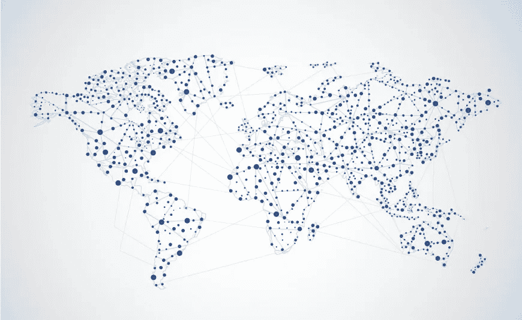
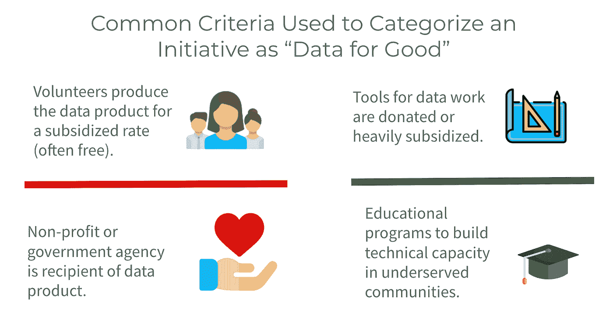
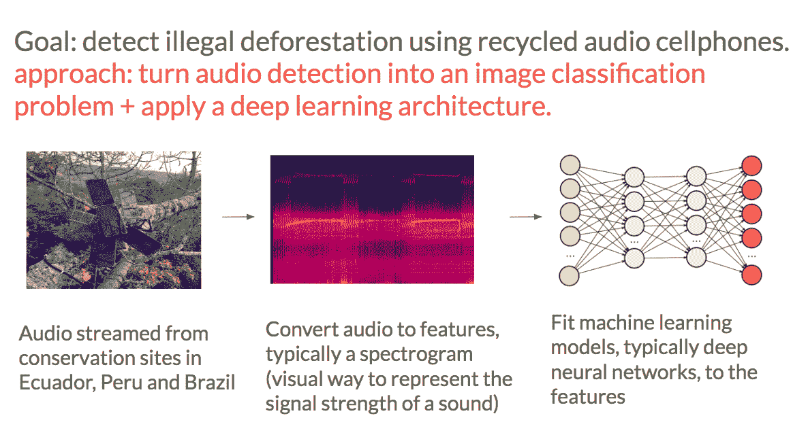
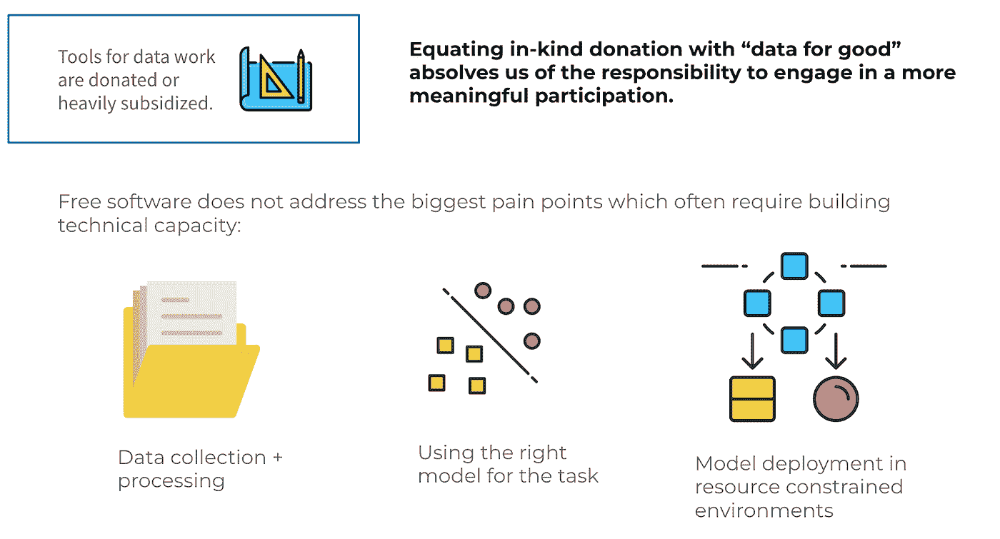
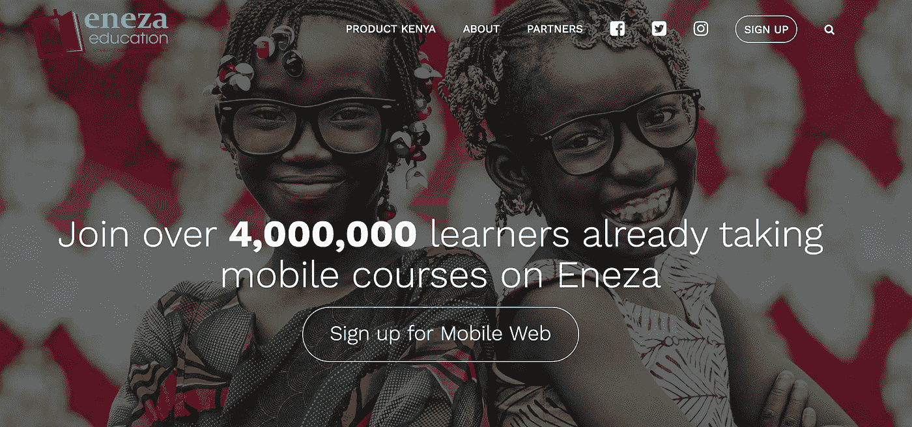
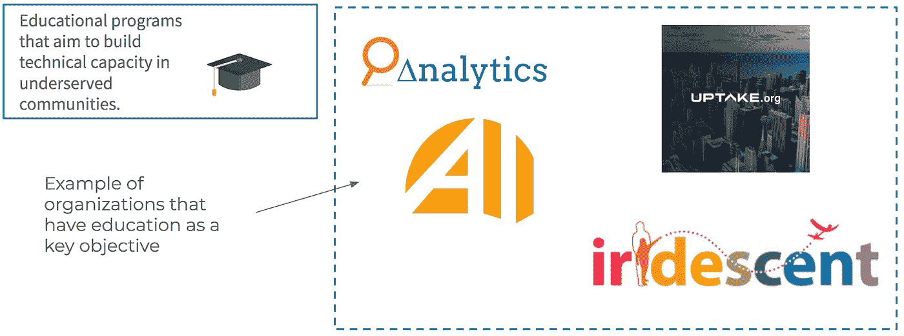
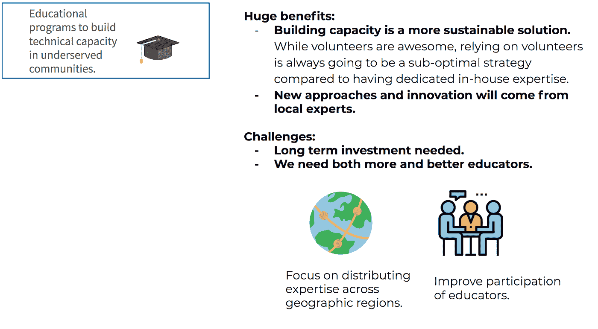
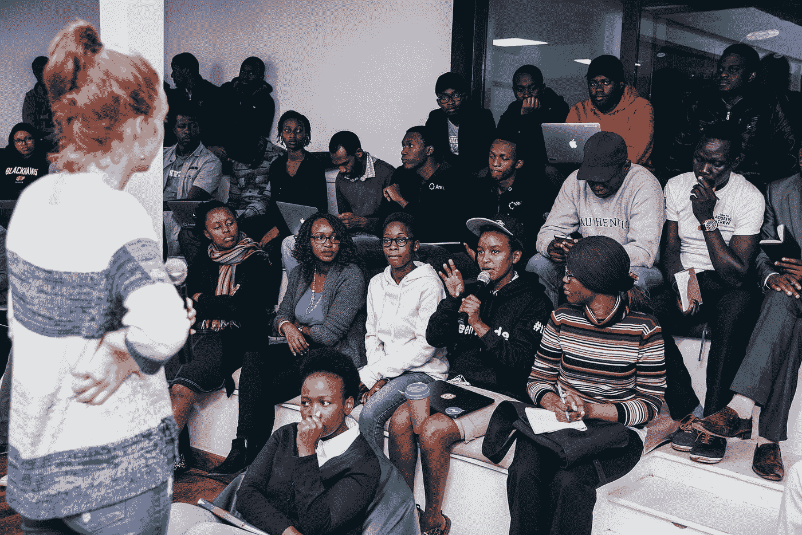
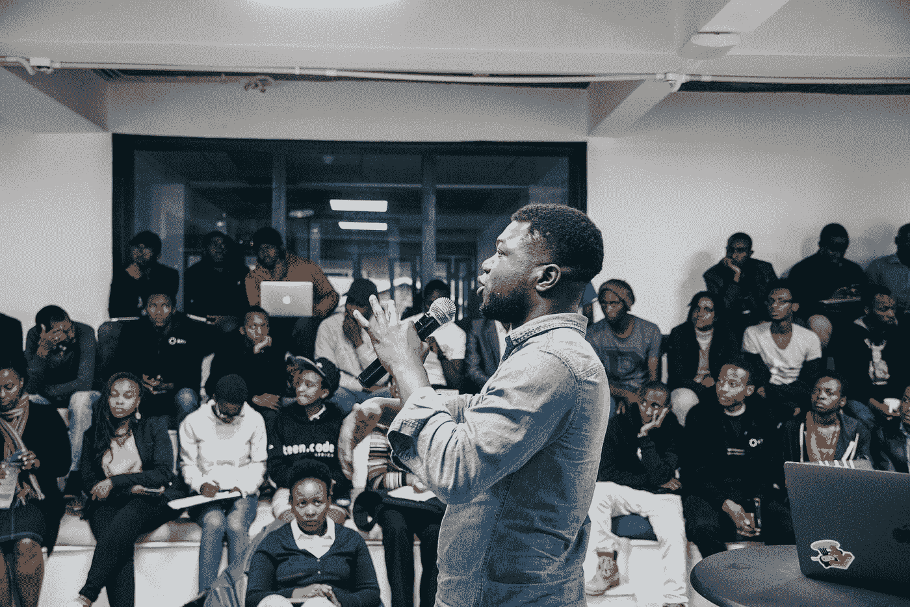

# 为什么“永远的数据”缺乏精确性。

> 原文：<https://towardsdatascience.com/why-data-for-good-lacks-precision-87fb48e341f1?source=collection_archive---------5----------------------->

我刚刚在斯德哥尔摩参加了 2018 年 ICML 国际机器学习大会，度过了美妙的一周。ICML 最活跃的非正式社区之一是“数据为善”社区。我们组织了几次自发的午餐，在那里我遇到了一些令人难以置信的研究人员和应用实践者。然而，作为一个小组，我们的讨论让我重新审视了一段时间以来我的直觉反应，即“数据为善”已经成为一个武断的术语，不利于运动的目标。

“数据为善”很少提到所使用的工具、努力的目标或我们服务的对象。类似于经常用“AI”来形容一切与机器学习模糊相关的事物。这两个术语的使用和普遍吸引力都令人兴奋，但是从技术从业者的角度来看,**缺乏精确性。**

我承认“数据为善”是与广大受众交谈的一个有用的捷径(我也在与普通受众交谈时使用它，就像在我的推特[简历](https://twitter.com/sarahookr)中一样)。我担心的是，当我们在自己之间谈论数据时，缺乏精确性。这篇文章的目标是那些选择加入“数据为善”保护伞的技术熟练的个人和组织。

我们需要更严谨的语言来描述我们正在做的工作，最重要的是**,这样我们也可以找出我们可以做得更好的地方。**在这篇文章中，我将描述经常用来将一个计划定义为“好的数据”的关键标准我将使用这个粗略的分类法来讨论一些公开的挑战。最后，我想说的是，最重要的一部分，机器学习教育项目，很少被讨论，并且很少被我们的社区所重视。

# 什么是好的数据？

“永久数据”是一个非常新的术语。我是谷歌大脑的研究员。四年前，我创办了一个 501(c)3 非营利组织，名为 [Delta Analytics](http://www.deltanalytics.org/) 。当时，我只知道少数其他组织将自己归类在“数据为善”的保护伞下(例如: [DataKind](http://www.datakind.org/) 、 [Bayes Impact](https://www.bayesimpact.org/) 和[Data Science for Social Good](https://dssg.uchicago.edu/))。

与此同时，人们对这一领域也非常感兴趣。我经常被邀请在等候名单很长的小组中发言，申请德尔塔奖学金的人数每年都在增长，许多新的组织也随之成立，如 [AI4ALL](http://ai-4-all.org/) 、 [hack4impact](https://hack4impact.org/) 和【uptake.org】T4。为了有效地利用这种令人难以置信的兴趣，我们需要一个更好的框架来讨论我们的工作和最值得关注的领域。

**首先，我们来问一下“数据”是什么意思？**我将把“数据”定义为从现有数据集中提取信息或收集新的/额外数据的项目，以此来限制我们的讨论范围。这通常需要数据收集、清理和/或应用统计工具和/或机器学习模型。这项工作还可能涉及构建数据收集或模型部署的技术工具。

**“数据为善”是指数据项目的子集。**“数据为善”是一个奇怪的描述符，因为它意味着一些数据没有被很好地使用，或者至少在应用的本质上是矛盾的。“好”这个词作为限定词的主观性意味着可能同时使用多个有效的定义。

我经常看到有四个标准被用来将一个项目归入“良好数据”的范畴:

1.数据产品的最终接收方是一家非营利机构或政府机构。

2.**技术熟练的志愿者**开发并交付数据产品。

3.**数据工具**免费或以高额补贴的方式提供给组织/个人。

4.**教育培训**提高服务不足社区的数据技能

虽然这是一个粗略的分类，但它也是更严格地处理每个存储桶的一个有用的起点。在语言中，每当一个术语的含义不明确时，澄清所使用的定义是很重要的。除非我们清楚地说明这些定义，否则很难就我们是否以有价值的方式对计划进行优先级排序进行严格的讨论。作为一个社区，我们需要远离沾沾自喜的论坛，而是就这些权衡进行坦诚的对话，我将在下面的几个部分中对此进行讨论。

# **1。熟练的志愿者开发并交付数据产品(免费或按补贴费率)。**

Delta Analytics 是一个自称为“数据为善”的组织的例子，部分原因是我们将免费志愿者的技术专家与世界各地的数据项目联系起来。

技术志愿者是一种强大的方式，可以弥合科技公司和大学的专业知识与世界其他地方之间存在的严重技术差距。理想情况下，志愿者致力于解决服务不足的问题。这可能是因为问题的性质，也可能是因为主机组织和/或地理区域内的技术专业知识不足。

虽然有技能的志愿服务是弥合技能差距的有力方式，但我们也必须注意到利用志愿者来促进数据发展的缺点。

**依赖志愿者可能会导致零星的、通常不可预测的进展。**志愿者可能会忙于应付多项任务，必须优先考虑带薪工作/家庭/休息时间。志愿者可能只在有限的时间内可用，这可能需要在不同时间表的志愿者之间权衡项目。

**“尖端”问题备受青睐。**最容易让志愿者兴奋的项目都包含有趣的技术挑战。例如，去年我和其他三名德尔塔研究员志愿参与了一个名为[雨林连接](https://rfcx.org/)的项目，利用回收手机的音频流来检测链锯。这个问题很有趣，因为数据稀缺，我们部署的雨林的训练和测试分布之间的差异，以及所涉及的工程挑战。

使用深度学习很容易吸引高技能的志愿者来检测非法砍伐森林。然而，99%的数据问题并不那么耀眼，但仍然值得我们关注。大多数问题只涉及极少的数据，而是需要深入了解数据清理的最佳实践，并在样本量较小的情况下估计不确定性。事实上，通常最需要的是首先帮助确定要收集哪些数据。

为什么不解决这些问题呢？为这些问题中的任何一个提供解决方案都会产生深远的影响。然而，对于一周只能贡献几个小时的志愿者来说，解决这种性质的问题(例如收集正确的数据)所需的时间框架通常是不合适的。

**并非所有的志愿服务都是平等的。**周末或一日黑客马拉松旨在将时间有限的志愿者与需要他们帮助的非营利组织联系起来。达美航空从未举办过为期一天的黑客马拉松；我们更倾向于关注 6 个月的非盈利项目。我们不做一天的黑客马拉松，因为这需要付出难以置信的努力，才能让数据产品的最终接收者觉得这是一项值得的努力。

通常，为黑客马拉松做准备会给非营利组织带来巨大的开销，周末出现的数据原型无法证明这一点。非营利组织和黑客马拉松主办方必须投入大量时间来准备数据文档和数据集清理，这是参与者快速适应新数据库所必需的。

非营利组织资源有限，很少有专门的“数据”人员。除非对黑客马拉松进行仔细的研究和精心的计划，否则产生的数据产品很少能证明投入的时间是值得的。也就是说，黑客马拉松的目标通常是为有技能的志愿者提供体验活动，这些志愿者可能会决定更经常地参与其中。在这种情况下，成功取决于对持续参与有一系列清晰的预期结果。这些应该在黑客马拉松之前定义，这样活动本身就可以作为更长期参与的有用垫脚石。

# 2.用于数据工作的工具是捐赠的或得到大量补贴的。

这一类别通常是“永久数据”最有问题的特征几乎所有大型科技公司都有非营利项目，以高额补贴或免费的方式提供硬件、许可证和计算资源。虽然这些努力都是善意的，但大多数努力的当前表述都让人感到痛苦的麻木。原因如下:

**企业最渴望捐赠的工具并不适合绝大多数数据和技术专长有限的非营利组织。**我们忘记了绝大多数组织仍在使用 Excel，并认为将他们的数据转移到 Salesforce 是一个重大的技术进步。免费提供云信用、硬件或昂贵的可视化许可对极少数组织是有用的。然而，当公司将这种非常专业化的捐赠等同于拥有“数据为善”计划时，这是有问题的。至少，这些计划应该为非营利组织提供专门的支持和培训，这些组织通常缺乏技术专长和/或以不寻常和意想不到的方式使用软件。

**将实物捐赠等同于“数据为善”,可以免除科技公司更有意义参与的责任。**大多数非营利组织会告诉你，他们最常见的痛点不是软件，而是技术培训。像 Delta Analytics 这样的组织最大的贡献不是技术创新，而是让非营利组织更有信心使用他们的数据。科技公司可以通过将获得实物资源与诚然成本更高但更有意义的举措相结合来提供教育推广和熟练的志愿者，从而发挥最大的影响。

# 3.非营利或政府机构是数据产品的接收者。

如果最终受益人是非营利机构或政府机构，计划通常被归类为“永久数据”。

虽然这可能感觉像是一种将项目归类为“永久数据”的直观方式，但重要的是要记住，这并不总是保证我们处理最有意义的问题。我们应该灵活处理，优先确定有影响的问题。例如，达美航空每年都会收到来自世界各地非营利组织的赠款接受者计划申请。我们从不接受涉及帮助非营利组织准备资助提案数据的申请。这类数据工作有用吗？几乎可以肯定。**还有更有影响力的问题需要解决吗？**绝对可以。鉴于资源和专业知识有限，我们必须权衡如何分配资源。

基于分类的方法不会忽视营利组织的社会影响。作为德尔塔志愿者，我参与的最有意义的项目之一是与肯尼亚内罗毕的 [Eneza Education](http://enezaeducation.com/) 合作。Eneza 是一家营利性组织，它使用智能手机技术为准备年终考试的中小学生提供基于测验的资源。

Eneza 拥有一个令人难以置信的无与伦比的数据集，记录了东非学生的学习方式。此外，Eneza 团队同意我们可以与更广泛的受众公开分享这些见解。出现的是学生如何学习、如何优化测验顺序以留住学生以及非洲家庭如何以创新方式使用智能手机之前的技术的丰富画面。

最后，越来越多令人激动的研究项目甚至不是针对单个组织的。相反，研究人员的目标是为服务不足的领域提供可概括的见解。例如，位于坎帕拉的联合国脉冲实验室利用卫星图像来评估地区贫困状况，比如使用建造屋顶的材料。[可持续发展和人工智能实验室](http://sustain.stanford.edu/predicting-poverty/)参与了多个项目，包括使用卫星图像预测贫困和使用遥感数据预测作物产量。我们应该鼓励更多的机构支持，就像 SalesForce 的[爱因斯坦基金](https://einstein.ai/grants)一样，使这种类型的研究成为可能。

# 4.旨在欠发达社区建立技术能力的教育项目。

当教育项目集中于没有替代培训项目的服务水平低下的社区时，它们属于“数据为善”的范畴。例如，[Uptake.org](https://www.uptake.org/data-fellows.html)在芝加哥开展了一个项目，为非营利专业人士提供机器学习和安全实践方面的培训。[达美助教](http://www.deltanalytics.org/machine-learning-for-good.html)在肯亚奈洛比教授机器学习入门课程，并将于今年晚些时候在摩洛哥阿加迪尔授课。

在这篇文章的开始，我建议教育项目既是最重要的“数据为善”计划，也是最缺乏服务的。

**为什么？因为有技能的志愿者工作本质上是一项短期的努力。虽然我们绝对需要有技能的志愿者，但同时我们也需要更多的教育者。这就是在项目结束时“移交”的数据产品和最终接收方已经买入并将长期使用的数据产品之间的区别。**

同样重要的是，当地专家能解决问题。熟练的志愿者经常提出不合适的解决方案，因为我们很难忘记自己喜欢的日常工具包。作为谷歌大脑的一名研究人员，我通常不担心数据的质量或数量，因为我依赖一些大型、公开和干净的数据集。然而，绝大多数现实世界的问题并不涉及那么多数据，也不需要神经网络。我愿意认为我没有被最近的研究束缚住，当我自愿为不同的问题贡献我的技能时，我仍然能够提供价值。然而，如果有人每天都在那些非常不同的约束下思考问题，那会怎么样呢？**他或她更适合提出创新的解决方案吗？至少，我们的解决方案可能会非常不同。**

**教育之所以是服务不足的领域，并不是因为我们不关心。我们有。**这是因为技能培训从根本上来说是一个比弥合技能差距更困难的问题。为了建设能力，我们必须建设有同样能力的生态系统。这很有挑战性，但并非不可能。今年夏天早些时候，我去了肯尼亚，在非洲数据科学学院教了一节课。在回旧金山的路上，我在安德拉停了下来。在过去的三年里，我每年都去安德拉。Andela 是非洲的一家工程动力公司，在拉各斯、内罗毕和坎帕拉都有校区。

人们普遍认为，这是工程师在非洲以外的公司工作的最佳方式之一。事实上，一些已经完成计算机科学本科课程的学生仍然加入安德拉，尽管该项目专门培训没有假定背景知识的工程师。这些学生加入是因为安德拉雇佣工程师与世界各地的公司合作。安德拉非常成功，因为它招募人才是基于这样一种假设，即才华比以往的经验更重要。它依靠极低的录取率来选择非洲最有前途的开发者。

另一个巨大资本投资努力的例子是最近宣布的由脸书和谷歌共同赞助的[非洲人工智能硕士项目(AIMS)](https://medium.com/@moustaphacisse/introducing-the-african-masters-of-machine-intelligence-at-aims-9441b4346a55) 。Andela 和 AIMS 需要大量资本投资和机构合作伙伴的支持。然而，在较小的层面上，我们都可以推动将教育纳入我们的努力。 [Fast.ai](http://www.fast.ai/2017/08/15/diversity/) 为他们在数据学院教授的每门深度学习课程提供远程多样性奖学金。[尼日利亚数据科学](https://twitter.com/DataScienceNIG)将于 11 月举办一次会议，届时美国和欧洲的机器学习专家将通过谷歌视频聊天工具教授教程。

当我们将熟练的志愿者与非营利组织合作时，我们应该做一个心理检查— **“一旦我们不再参与，我们正在使用的工具是否可以被非营利组织重复使用？”最重要的是，我们不应该害怕教学。我经常遇到非常技术化的个人对自己是否有资格当老师的犹豫。你应该反过来问，什么会使你失去当老师的资格。世界很大，而知识目前集中在少数城市和个人手中。作为教育者和导师，我们都必须发挥自己的作用。**

# 离别的思念。

我在这篇文章的开头提出，我们如何谈论“好的数据”是不精确的。我调查了一些用于将项目定义为“好的数据”的通用标准使用更精确的语言的一个可能的动机是有一个共同的话语来有效地引导“数据为善”这一术语带来的巨大兴奋、能量和资源。**另一个或许更重要的原因是，通过反思我们当前的努力是否能最好地服务于世界各地的社区，让我们自己负起责任。**

# **致谢**

感谢 Melissa Fabros、Brian Spiering、Simon Kornblith、Anna Bethke、Jonathan Wang 和 Kumar Agrawal 对本文的丰富反馈。特别是，我要感谢 Amanda Su 的许多有用的软编辑和阅读这篇文章的多次迭代。