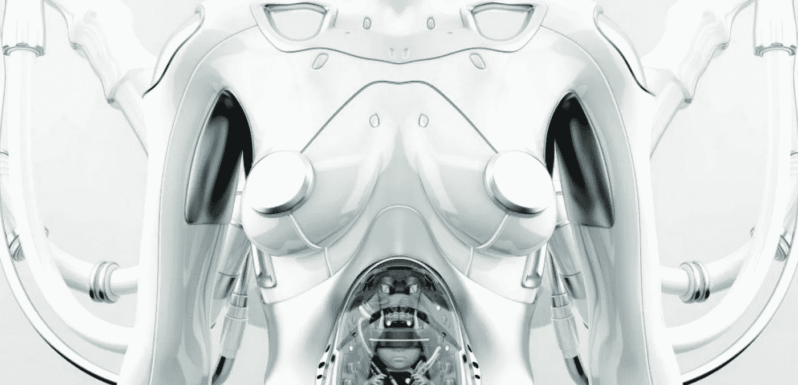
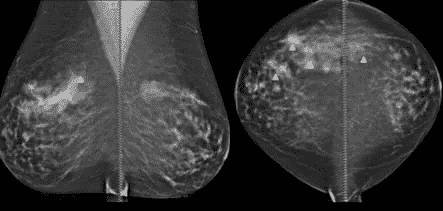

# 为什么深度学习可能最适合乳房

> 原文：<https://towardsdatascience.com/why-deep-learning-may-be-best-for-breast-7725d1440fde?source=collection_archive---------6----------------------->

1986 年是伟大的一年。在史上最差着装十年的鼎盛时期，俄罗斯人发射了 *Mir* 空间站，皮克斯成立，微软上市，第一台 3D 打印机售出，马特·格罗宁创作了《辛普森一家》。与此同时，两个同样重要但完全不同的科学飞跃发生在地球相反两侧完全不同的学术领域。现在，32 年后，深度学习的诞生和乳房筛查的首次实施终于融合在一起，创造了可能是女性最常见癌症的最终早期诊断测试。

# 深度学习简史

**1986:** 在美国，机器学习早期领域的一小群感知鼓动者在《自然》杂志上发表了一篇题为“[通过反向传播错误](https://www.nature.com/articles/323533a0)学习表征”的论文。作者 Rumelhart、Hinton 和 Williams 违背了传统智慧，证明了通过在系统中反向运行神经网络的输出错误，他们可以显著提高图像感知任务的性能。反向传播(或简称为 back-prop)[不是他们的发现](https://link.springer.com/article/10.1007/BF01931367)(因为我们都站在巨人的肩膀上)，但随着这篇论文的发表，他们终于成功说服了持怀疑态度的机器学习社区，使用手工工程功能来“教”计算机寻找什么不是前进的方向。该技术的巨大效率增益，以及不再需要主题专家的艰苦特征工程来发现数据中的潜在模式的事实，意味着反向传播允许人工神经网络应用于以前可能的大量问题。对于许多人来说，1986 年标志着我们所知的深度学习诞生的一年。

尽管理论上很先进，但深度学习在计算上仍然过于复杂，计算机芯片当时无法有效处理。用了十多年的时间来证明商业上可用的处理能力最终已经足够先进，可以显著提高神经网络的性能。这一点在 2012 年的 Alexnet 中得到了完美的展示，这是一个运行在图形处理单元(GPU)上的八层卷积网络，令人信服地击败了之前所有的图像分类测试，以超过 10%的准确率增长击败了所有竞争对手。从那以后，GPU 一直是所有深度学习研究的中流砥柱。直到最近，研究才开始生产应用于放射学的功能性和经临床验证的深度学习软件。现代深度学习系统不再需要手工制作的特征工程来学习在图像中寻找什么；他们现在可以自己学习了。简而言之，深度学习终于被推上了主流。

# 乳腺癌筛查简史

**1986 年:**在英国，教授 Patrick Forrest 爵士制作了“Forrest 报告”，受前瞻性思维卫生大臣肯尼斯·克拉克的委托。Forrest 从几个国际试点试验(美国、荷兰、瑞典、苏格兰和英国)中获得了乳腺癌筛查有效性的证据，他得出结论，NHS 应该建立一个全国性的乳腺癌筛查项目。这很快被应用到实践中，到 1988 年，NHS 有了世界上第一个基于邀请的乳腺癌筛查项目。英国各地建立了“福里斯特单位”,用于筛查年龄在 50 岁至 64 岁之间的女性，她们每三年被邀请做一次乳房 x 光检查。然后在 2012 年，当对筛查计划的持续分析证明将邀请筛查的年龄范围扩大到 47-73 岁的好处时，早期发现女性最常见癌症的可能性得到了进一步支持。到 2014 年，英国系统成功地发现了超过 50%的女性人口的乳腺癌(在目标年龄范围内),然后才出现症状。筛查现在是国际公认的最佳实践标志，NHS 项目被全世界视为黄金标准。简而言之，英国拥有世界上最好的乳腺癌筛查项目，诞生于 1986 年。

在 2000 年数字乳房 x 线照相术出现后，医学成像数据以一种服从于计算分析的格式变得可用。到 2004 年，[研究人员开发了](https://www.ncbi.nlm.nih.gov/pubmed/14990808)被称为计算机辅助诊断系统(CAD)，使用老式的特征工程程序和监督学习来突出乳房 x 光片上的异常。这些系统使用手工制作的特征，如乳房密度、实质纹理、肿块或微钙化的存在，来确定是否可能存在癌症。它们旨在通过根据人类识别的特征高亮显示乳房 x 光片上的区域，试图模仿专家的决策过程，从而提醒放射科医生特定特征的存在。

# CAD 的问题

虽然传统 CAD 在与放射科医生结合使用时显示出对乳腺癌的卓越检测(“二次阅读 CAD”)，但它们也显著增加了所谓的“召回率”，因此增加了运行筛查程序的成本。在 CAD 增强乳腺筛查中，乳房 x 线照片由一名放射科医师(或两名独立的阅读者，如在英国的情况下)查看。读者寻找乳腺癌的迹象，然后检查 CAD 覆盖图，该覆盖图显示系统突出显示的感兴趣区域，如果有任何怀疑，则决定是否召回患者进行进一步测试，如超声波和/或活检。召回率被用作乳腺筛查单位质量的一个指标，召回率越高，表明该项目产生的假阳性越多。高召回率的后遗症包括执行更多后续测试导致的成本增加。例如， [Elmore 等人](http://www.nejm.org/doi/full/10.1056/NEJM199804163381601)证明，在 CAD 筛查上每花费 100 美元，就要额外花费 33 美元来评估不必要的假阳性结果。更重要的是，越来越多的女性承受着过度的压力和情绪上的担忧，因为她们害怕发生最坏的情况。

召回率明显上升的原因与 CAD 输出性能的统计基础有关。这些系统显示出很高的灵敏度，但特异性很差(例如，一个行业领先的 CAD 报告仅算法的灵敏度为 86%，但特异性仅为 53%)。这意味着这种系统非常善于在真阳性和假阴性结果之间做出决定，但在区分真阳性和假阳性结果方面相当差。将这一点与人类的表现相比较——灵敏度和特异性分别为 86.9%和 88.9%([Lehman 等人](https://www.ncbi.nlm.nih.gov/pubmed/27918707))，你就可以开始明白为什么 CAD 没有完全实现它的承诺了。在一项开创性的英国试验( [CADET II](http://www.nejm.org/doi/full/10.1056/NEJMoa0803545) )中，尽管 CAD 被证明有助于单读者检测癌症，但在人/CAD 组合和两个人的标准双阅读之间，召回率相对增加了 15%。

Traditional CAD — areas of calcification are marked with an * and potential masses marked with a ▲. Criticisms of CAD include that there are too many markers, and they distract from the underlying image, subsequently raising recall rates.

除了提高召回率，CAD 系统已经[显示不一致](https://www.ncbi.nlm.nih.gov/pubmed/15358850)，并且在[假阳性率](https://www.ncbi.nlm.nih.gov/pubmed/15358846)上有显著差异。此外，多达 30%的癌症在“正常”乳房 x 光检查后仍然存在，被称为间歇期癌症。本质上，传统 CAD 使用过时的特征工程编程来部分成功地尝试改进筛查检测。不幸的是，由于特异性差，放射科医生不信任它，而且由于增加了不必要的召回，给患者带来了严重的不必要的焦虑。

与任何乳腺放射科医生交谈，当你提到乳腺 CAD 时，他们经常会傻笑——有些人忽略它，有些人甚至不使用它。与任何患者交谈，他们都会告诉你，收到更多检查的召回邀请是他们经历过的最令人心痛的经历之一。还没有人解决如何提供有效和准确的 CAD 乳房筛查而不增加不必要的召回率的难题。

# 驱动压力

在最近对乳房筛查的深度学习和自动化驱动的兴趣背后，除了准确性之外，还有其他因素。筛查项目的成功推动了需求和成本，据估计，仅在美国，每年就要进行 3900 万次乳房 x 光检查。因此，没有足够的人类放射科医生来跟上工作量。在英国，这种情况甚至更有压力，因为强制复读意味着每次测试的放射科医生数量是美国的两倍。昂贵的专业乳腺放射科医生的短缺变得如此严重，以至于在英国将双读基准降低到单读的杂音被说出——尽管[有令人信服的证据](https://www.sciencedirect.com/science/article/pii/S095980491401168X)证明双读确实更好。

然而，对于寻求削减开支的政策制定者来说，双重阅读的[成本低效率](https://www.ncbi.nlm.nih.gov/pmc/articles/PMC4961365/)是一个诱人的目标，尽管单一阅读或单一阅读器 CAD 支持的程序都没有被证明是准确的。在采煤工作面，尤其是在资金不足的国民医疗保健系统中，感觉就像在事情发生之前需要做出一些让步。

# 机会的汇聚

由于命运的巧合，乳腺筛查项目的本质提供了大量数字化成像数据，这些数据非常好地记录了患者的结果。这种丰富的数据来源恰好非常适合深度学习的需求。通过利用带标签的数字图像及其相关的最终病理结果，我们可以为数据科学家提供近乎完美的“地面真相”数据集。如果图像上有疑似癌症，这可以通过活组织检查或手术从组织病理学上得到证实或否认。如果没有疑似癌症，那么三年后的随访成像将证实这一点。通过允许神经网络在“图像加病理结果”或“图像加后续图像”的基础真实数据上进行训练，系统可以自学从“正常”的海洋中识别癌症所需的特征，而不是像前几代 CAD 那样依赖人类来为它们进行教学。希望是，通过使用深度学习，我们可以从乳腺筛查中前所未有的准确性水平中受益。

# 在实践中取得成功

以前的 CAD 系统旨在通过突出专家演示的已知感兴趣的区域来模仿放射科医生的思维过程，而神经网络实际上做的正好相反。他们拍摄整套乳房 x 光照片(通常是 4 张)，并利用他们自己学到的特征来决定是否有癌症。因此，解释神经网络的输出更加困难，因为它可能解释人类甚至没有意识到的特征。这并不像听起来那样是个大问题——毕竟，过去放射科医生几乎一致拒绝 CAD 覆盖图，认为它太分散注意力。事实上，越来越多的人意识到，向放射科医生展示可能的异常在哪里，或者试图对其进行分类，可能并不像听起来那么有用。该领域的研究人员建议，深度学习 CAD 系统的未来迭代[根本不会向放射科医生](https://www.ncbi.nlm.nih.gov/pubmed/29097047)提供任何本地化信息，而是简单地允许他们查看任何被系统认为可疑并标记为召回的图像。这将防止减少受控人类思维的风险，并允许他们更有效地做出最佳明智的决定，而不是因试图解释深度学习算法的输出而分心。

然而，深度学习模型可以被训练成以其他方式有效地呈现它们的推理。显著性图突出了图像的哪些区域最能触发神经网络的最终决策。这与以前的 CADs 没有什么不同，但是可以通过对高光进行阈值处理，使其仅在给定特定条件和异常确定性的情况下出现，从而变得更加有用。通过改变系统的 ROC 曲线上的操作点，召回决策阈值可以与给定放射科医师的表现相匹配。这将允许高召回放射科医生与低召回版本的算法配对，提供一种更细致入微的 CAD 支持方法。此外，来自乳房 x 光照片数据库的比较图像搜索可以为放射科医师提供相似的图像和已知的病理结果以供查看。最后，CAD 可以被设置成仅当它不同意人类读者的召回建议时才使其被知晓，从而仅在需要时充当安全网。

# **我们有多近？**

在医疗保健系统中看到这一领域的一系列活动并不奇怪。英国可能拥有最高质量的数据，因为 NHS 拥有世界上最强大的国家乳腺筛查数据库，其中每个乳房 x 光检查结果、活检和手术结果都与每个筛查事件相关联。

我在一家总部位于伦敦的初创公司 [Kheiron Medical](http://www.kheironmed.com/) 担任临床主管，该公司专注于乳房 x 线摄影的深度学习。到目前为止，对成千上万张乳房 x 光片训练的算法进行的内部基准测试显示了有希望的结果，我们期待着正在进行的独立多点临床试验的结果。

据报道，现有的 CAD 提供商也在研究深度学习解决方案。其他初创公司包括韩国的 Lunit 和以色列的 Zebra Medical，而[谷歌 DeepMind](https://deepmind.com/blog/applying-machine-learning-mammography/) 刚刚与帝国理工学院合作加入了竞争。在全球学术圈里，瑞士的和荷兰的，当然还有美国，都在进行卓有成效的研究。所有这些研究人员和公司都旨在通过支持单个读者检测，同时使用深度学习算法降低召回率，来改善 CAD 之前的迭代。

接下来的步骤很清楚——这些算法需要通过严格的医疗设备监管审查，以确保它们符合自己的主张。这将涉及稳健的临床试验，既回顾基准性能，又展望未来，以确保算法性能在现实世界的临床设置中得到保持。

圣杯将是实现由精确的深度学习支持的单阅读器程序，潜在地减少已经超负荷的双阅读放射科医生的工作量。在这种情况下，深度学习绝对不会取代单一阅读的放射科医生，只是通过增加一个由机器完成的额外的模式识别层来增强他们，让人类进行抽象和决策。这项技术可以将现有的单读本程序的一致性和准确性提高到双读本程序的水平，并为尚未实施筛查程序的国家提供大量新资源。

深度学习在全国筛查中的支持潜力，以及不发达的医疗保健系统跃进深度学习时代的潜力，可能只需要一两年的时间。

到目前为止只花了三十二年…

如果你和我一样对放射学人工智能的未来感到兴奋，并想讨论这些想法，请保持联系。我在推特上 [@drhughharvey](http://twitter.com/drhughharvey)

如果你喜欢这篇文章，点击推荐并分享它会很有帮助。

*关于作者:*

*哈维博士是一名委员会认证的放射科医生和临床学者，在英国国民医疗服务体系和欧洲领先的癌症研究机构 ICR 接受过培训，在那里他两次获得年度科学作家奖。他曾在 Babylon Health 工作，领导监管事务团队，在人工智能支持的分诊服务中获得了世界第一的 CE 标记，现在是顾问放射科医生，皇家放射学家学会信息学委员会成员，以及人工智能初创公司的顾问，包括 Algomedica 和 Kheiron Medical。*