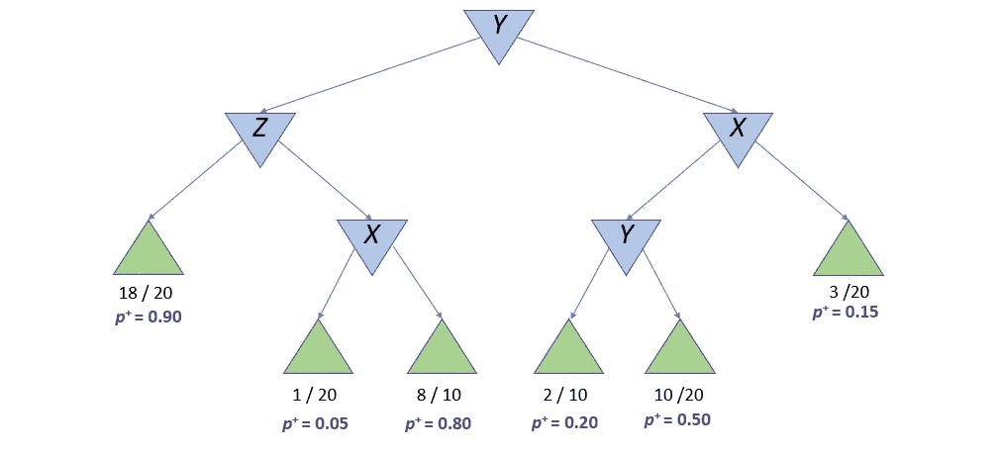
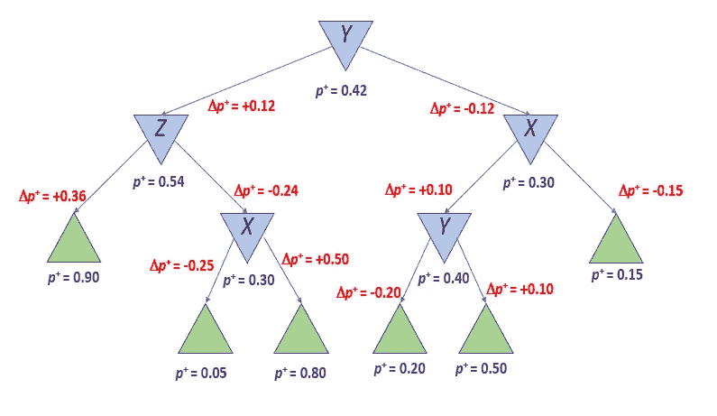
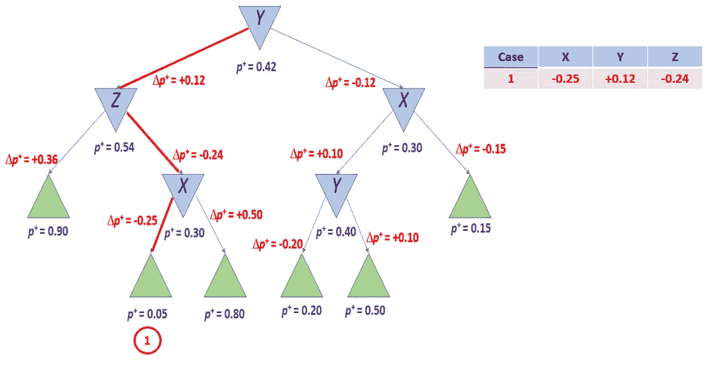

# 为什么你的模型预测到了？(第 1 部分，共 2 部分)

> 原文：<https://towardsdatascience.com/why-did-your-model-predict-that-4f7ed3526397?source=collection_archive---------9----------------------->

Picture from pixabay.com

在这篇文章中，我们提出了一个简单且可扩展的方法来为基于树的二元分类器的个体预测产生易于解释的解释。这篇文章分为三个部分:

*   在第 1 节中，我们激发了对机器学习分类器所做预测的逐案解释的需求，并评论了最先进的方法通常是最不透明的。
*   在**第 2 节**中，我们回顾了之前在这方面的工作，特别是石灰包
*   在**第 3 节**中，我们详细介绍了我们的解释生成算法，并对其通用性和可扩展性进行了评论

在第二部分的[中，我们将提供这里提出的算法的链接实际代码实现，与 LIME 进行并排比较，并查看一个示例应用。去那里，如果你想看我们的算法在行动。](https://medium.com/@mateini_12893/why-did-your-model-predict-that-part-2-of-2-48e3d50e1daf)

## 1.高级机器学习模型及其解释力(或缺乏解释力)

Not understanding the predictions of a machine-learning model.

机器学习模型经常因缺乏透明度而受到批评。除了最简单的模型架构(即线性/逻辑回归)之外，所有模型架构都实现了相当复杂的非线性预测函数，这些函数以难以可视化和解释的方式组合了所有可用的特征以及它们之间的相互作用。因此，例如，问题*为什么您的模型拒绝向客户 X 提供信贷？如果预测是由随机森林、增强森林或神经网络产生的，则不能令人满意地回答。*

正如其他人之前指出的那样，能够理解模型产生的预测背后的原因对于在使用模型结果的人和最终将受这些结果影响的人之间建立*信任*是很重要的。

高级 ML 模型的黑箱性质导致了至少两个不良后果:

*   在某些情况下，单个预测解释至关重要(下文将详细介绍)，数据科学家已经恢复到最简单的模型架构，代价是显著影响预测准确性。
*   公众和监管机构对先进的机器学习模型做出了反应，例如《通用数据保护条例》( GDPR)的*算法公平性*条款[即将在欧洲成为法律](https://analyticsindiamag.com/deep-learning-going-illegal-europe/)。

一个天真的数据科学家会说，只要分类器达到非常高的准确度或其他一些性能指标，为什么预测是什么并不重要。在许多情况下，这是不正确的。有些情况下，我们必须根据具体情况决定最佳的行动方案。例如，想想客户流失或贷款回收。通常情况下，*给定案例的最佳行动方案取决于哪些变量对该特定案例的预测*影响最大。因此，能够计算出这些变量是什么，并量化它们中的每一个影响所述预测的程度变得至关重要。

## 2.以前的工作

对于某些架构，尤其是随机森林，有一些众所周知的方法可以得出输入变量重要性的**全局**度量。术语*全局*意在强调它们为每个变量产生一个单一的重要性度量，并通过聚合所有训练案例来实现。这是不令人满意的，因为在大多数情况下，重要的决策变量取决于被检查的特定情况。因此，我们真正需要的是局部的，或者更好的是，不同重要性的逐案衡量。

从这里开始，我们将使用术语*解释* 的精确意义:给定一组求值实例 **x** [ *i* ] *，i = 0，1，…* ，以及一个*二元*分类器 *C* ， 给每个实例分配一个属于正类的概率*p*[*I*]*= C*(**x**[*I*)*，对于那个预测的一个**解释**是维数为 *f、*的实数数组 ***e*** ，其中*f* 在符号中，*

**

*Eq. 1 : Explanation as a function of a model and a case.*

*在这个数组中，*第 j-* 个分量被解释为*第 j 个特征对概率**p**I****的重要性或贡献的度量。*** 由此可见，一个解释是两个事物的函数；用于生成预测的分类器和应用该分类器的实例。*

*这种形式很容易扩展到 k 级分类的情况。在这种情况下，解释是维数为 *k* -by- *p* 的矩阵，其中第*l*-第行 ui 被解释为实例属于类 *l.* 的概率的每个特征的贡献*

*在这方面已经有了重要的贡献。也许最引人注目和最著名的是[石灰包](https://github.com/marcotcr/lime) ( [视频](https://www.youtube.com/watch?v=hUnRCxnydCc)，[论文](https://arxiv.org/abs/1602.04938))，它可以用来为*任何分类器的预测产生解释。* LIME 代表***L**local**I**interpretable**M**model-agnostic**E**解释。它通过为要解释的每个实例 **x** [ *i* 生成局部线性 ML 模型，并将该模型的特征重要性转换为对上述形式的解释，来实现模型不可知论。生成该局部线性模型的方式是，首先生成围绕 **x** [ *i* ]的邻域的 *M* (数百个数量级)个样本，评估每个样本上的分类器，然后在由此生成的 *M* 预测上拟合模型。**

**这种方法的明显优点是它适用于任何模型。但是这种通用性是以巨大的计算成本为代价的。也就是说，为所有评估实例产生解释所需的操作数量比分类器预测的简单计算所需的操作数量大 *M* 倍。**

**在接下来的部分中，我们将解决这个缺点，并提出一个简单有效的算法来为基于树的分类器产生解释。**

**LIME 的作者声称为每个例子生成的本地模型在某种意义上是忠实的。然而，*your truly*不清楚这在基于树的模型的情况下意味着什么，基于树的模型产生分段常数分类函数。在这类模型中，任何足够局部的模型必然会错过决策函数对任何独立变量的依赖性。另一方面，任何考虑到一个点的邻居落在一些树的不同分支内的模型都有不够局部而不可靠的危险。**

## **3.为单树预测产生解释的简单算法**

**首先，让我们考虑一个简单的二叉分类树 *T* 的情况，它已经在一组例子上被训练过了。设 *t* 表示该树中的节点总数，索引从 0 到 *t* -1，0 对应树的根。一个关键的事实是，在这个树的每个节点上都有一个*单一特征*，向左或向右的决定是基于这个特征。因此我们有相应的特征{ *f* [0]， *f* [1]，…， *f* [ *t -* 1]}，每一个都是集合{0，1，…, *f-1* }中的一个简单索引**

**给定一个要评估和解释的实例 **x** [ *i* ，进行预测的方法是沿着以叶子结束的节点路径遍历树。**

****

**An example three for a problem with three features X, Y, Z. Each leave has a corresponding empirical probability, computed at training time, that an example that “falls” in it belongs to the positive class.**

**当然，确切的路径取决于给定实例的特征值。让这条路径由它所经过的节点的索引序列来描述:**

****

**现在，对于任何节点 *n，*让我们定义*p*[*n*]*a*s 训练集中的一个实例属于正类*的经验概率，假设该实例的路径经过节点 n* 。**

****

**The same three now with (conditional) probabilities defined at every node.**

**注意，使用上面的符号，树对 **x** [ *i* ]在正类中的概率的估计由下式给出**

****

**另一方面，*p*[0】—回忆 0 表示树的根——对应于 **x** [ *i* 属于正类*的无条件概率。***

**沿着 **x** [ *i* ]在树中的路径，我们可以将其概率估计分解为 p[0]和一系列概率增量的和**

****

**Eq. 3 Decomposing the probability of x[i] belonging to the positive class as a sum of p[0] and an increment for each edge in the path**

****

**For each edge connecting two nodes of the three, we define a delta of probability as the difference between the probability of the deeper node and that of the shallower node.**

**请注意， *s* -th 概率增量对应于从节点*n*[*s*-*1*到节点 *n* [ *s* ]的路径段，因此，c *可归因于在 n*[*s-1**处使用的特征来决定***

**基于这一观察，我们可以如下定义解释数组:
解释数组的第 *j* 个分量，对于{0，1，... *p-1* }中的 j，作为归因于来自先前总和的特征 *j* 的概率增量的总和而获得。在符号中，**

****

**Eq. 4 The contribution to the probability for feature j comes from all deltas for which the first node’s feature is feature j.**

**注意，因为这个定义和等式。3 以上，我们有以下漂亮的身份**

****

**Eq. 5\. This shows that the sum of explanation bits from each of the feature’s, together with p[0] adds up to s” the predicted probability, and fully explains it.**

****

**Tallying up explanation components for each of the variables, for a simple case in which each variable appears only once**

## **3.1 对树集成分类器的扩展**

**敏锐的读者在这一点上肯定已经意识到，上面给出的解释数组的定义自然地扩展到任何分类器，该分类器产生作为各个树预测的线性组合的预测。假设给我们这样一个分类器 *C* ，由 *A* 树、 *T* [0】、 *T* [1】、…、 *T* [ *A* -1】，对应的权重 *w* [0】、 *w* [1]、…、 *w* [ *A* -1**

****

**然后，解释数组可以被计算为针对每个单独的树计算的解释数组的加权和:**

****

## **3.2 关于复杂性和可伸缩性的说明**

**假设条件概率 *p* [ *n* ]是可用的，计算解释数组 *e* [ *j* ]、for *j in 0、…、f、*、for 任意给定实例、***x**[*I*]的所有组件的成本通过等式。4 仅仅是 O(n_c)(回想一下 n_c 是树中路径的长度)，因为它足以对 **x** [ *i* ]进行一次遍历，并在此过程中更新 **e** 的适当组件。因此，计算实例的解释数组与计算该实例的预测具有本质上相同的复杂性。***

**顺便提一下，scikit-learn 树估计过程以及 Spark 2.2 ml 决策树库实现都在估计的树中生成并保存这些 *p* 的值。】*。***

**如果它们不可用，计算它们的成本基本上与计算所有训练样本的预测的成本相同，同时在每棵树的每个节点更新两个计数器变量，一个用于实例总数，另一个用于属于路径经过该节点的正类的实例数。**

**在[第二部分](https://medium.com/@mateini_12893/why-did-your-model-predict-that-part-2-of-2-48e3d50e1daf)中，我们将提供此处给出的算法的实际代码实现的链接，与 LIME 进行并排比较，并查看一个示例应用。[去那里](https://medium.com/@mateini_12893/why-did-your-model-predict-that-part-2-of-2-48e3d50e1daf)，如果你想看我们的算法在行动。**