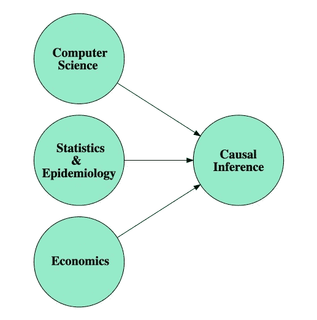

# 为什么我们需要数据科学中的因果关系？

> 原文：<https://towardsdatascience.com/why-do-we-need-causality-in-data-science-aec710da021e?source=collection_archive---------10----------------------->

## [偶然的因果推断](https://towardsdatascience.com/tagged/casual-causal-inference)

这是一系列解释为什么我们在数据科学和机器学习中需要因果推理的帖子(下一个是[‘使用图表！’](/use-causal-graphs-4e3af630cf64))。因果推理带来了一套全新的工具和视角，让我们处理老问题。

# 当实验不可行时

首先，设计和运行实验(通常是 A/B 测试)总是比使用因果推理技术要好:你不需要建模数据是如何产生的。如果你能做到，那就去做吧！

然而，在许多情况下这是不可能的:

*   如果你的实验是不道德的(你不能让一个孩子吸烟来测试它是否会导致癌症)
*   原因不取决于你(竞争力推出新产品，你想衡量它对你的销售的影响)
*   你有历史数据，想充分利用它。
*   从金钱或影响的角度来看，进行实验的成本太高，或者太麻烦而无法付诸实践

# 一点历史

因果推断的影响来源主要有三个:计算机科学、统计学和流行病学、计量经济学。对因果关系的积极研究始于 80 年代

计算机科学分支由 Judea Pearl 领导。其最初的影响可以追溯到 20 世纪 20 年代的 Sewell Wright，当时他写了关于线性函数的图形模型。这些技术不断发展，现在被称为有向无环图(DAG)方法。

统计学和流行病学中最流行的框架被称为潜在结果框架，由杰吉·内曼于 1923 年提出。这是从统计学角度发展因果推断的起点。唐纳德·鲁宾是这种方法中最著名的。

两个框架是等价的，意味着一个框架中的定理是另一个框架中的定理，一个框架中的每个假设都可以转化为另一个框架中的等价假设。差异是用法的问题。有些问题在一个框架中更容易表述，有些在另一个框架中更容易表述。杰米·罗宾(Jamie Robin)和托马斯·s·理查森(Thomas S. Richardson)研究了一个称为单一世界干预图(SWIG)的框架，该框架在这两个框架之间起着中介作用。

计量经济学中有一些关于因果关系的事实已经知道一段时间了。计量经济学家中比较流行的技术是:

1.  受控回归
2.  回归不连续设计
3.  差异中的差异
4.  固定效应回归
5.  工具变量

当然，它们可以用前面的框架来表述。

# 哲学问题(总是在争论中)

因果关系的本质真的很难。矛盾的是，我们每天都在不断地使用它，这在很多情况下是常识，但找到一个定义来评估在现实世界中哪种情况下 A 导致 B 是非常困难的！我们都同意下雨会导致地板潮湿(我希望……我们也能找到否认下雨的人)。但是我们如何给出一个明确的定义来区分是雨还是空气导致了潮湿呢？我们怎么知道雨是主要原因，而不是另一个未观察到的变量导致雨和地板同时变湿？尽管你想思考，但在 18 世纪，大卫·休谟已经开始思考因果关系的本质，许多哲学家也写了相关的文章。

统计学界的普遍共识是，至少在不进行实验的情况下，你无法证明因果关系。当你处理观察数据(被动获得的数据，没有经过你的实验)时，你最多能期待的是谈论相关性(概率相关性)。这就造成了一种在观察数据中明确谈论因果关系是禁忌的情况。

即使在这种情况下证明因果关系是不可能的，明确地谈论因果关系还是有好处的。第一个很容易理解:作为人类，我们关于世界如何运转的大部分知识都是观察所得。你不会对所有你知道的事情做实验。在某些情况下，这甚至是不可能的:是太阳导致了日光吗？你如何做一个实验，打开和关闭太阳？在这种情况下，你可以尝试某种替代实验，并认为这验证了最初的假设，但这也不是直截了当的。与此同时，我们都同意太阳产生了日光。第二个论点是避免误导。当你分析数据时，是因为你想得出一些结论来采取进一步的行动。如果你那样想，那是因为你认为那些行为影响了一定数量的利益(因此是利益的原因)。因此，即使你谈论技术正确性的相关性，你也要以一种因果的方式使用那些洞察力。所以，如果你的目标是因果关系，你最好明确地说出来。

# 从哪里开始阅读

## 教程

*   亚当·凯勒赫的[介绍系列](https://medium.com/causal-data-science/causal-data-science-721ed63a4027)
*   从因果角度解读线性模型:[线性结构方程建模的图形工具](https://ftp.cs.ucla.edu/pub/stat_ser/r432.pdf)，Bryant Chen 和 Judea Pearl

## 书

*   "[统计学中的因果推理:初级读本](https://www.wiley.com/en-us/Causal+Inference+in+Statistics%3A+A+Primer-p-9781119186847) " , (DAGs 框架)Pearl J .，Glymour M .和朱厄尔 N.P
*   "[因果推理](https://www.hsph.harvard.edu/miguel-hernan/causal-inference-book/)"，(潜在结果框架)Hernán M.A .和 Robins J.M
*   [《大多无害的计量经济学:一个经验主义者的伴侣》](http://www.mostlyharmlesseconometrics.com/)，(计量经济学的观点)安格里斯特 J.D .和皮什克 j

我是谁？我是 Aleix Ruiz de Villa([http://aleixruizdevilla.net](http://aleixruizdevilla.net))，数学分析博士，曾任一些公司的数据科学主管。我住在加泰罗尼亚的巴塞罗那，我是 badass.cat 和 bacaina.cat 的联合创始人