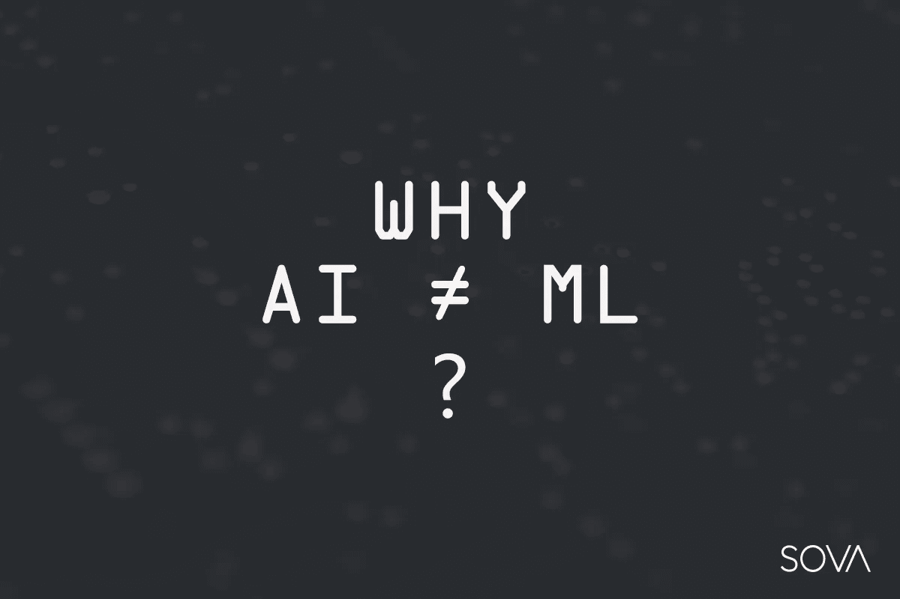
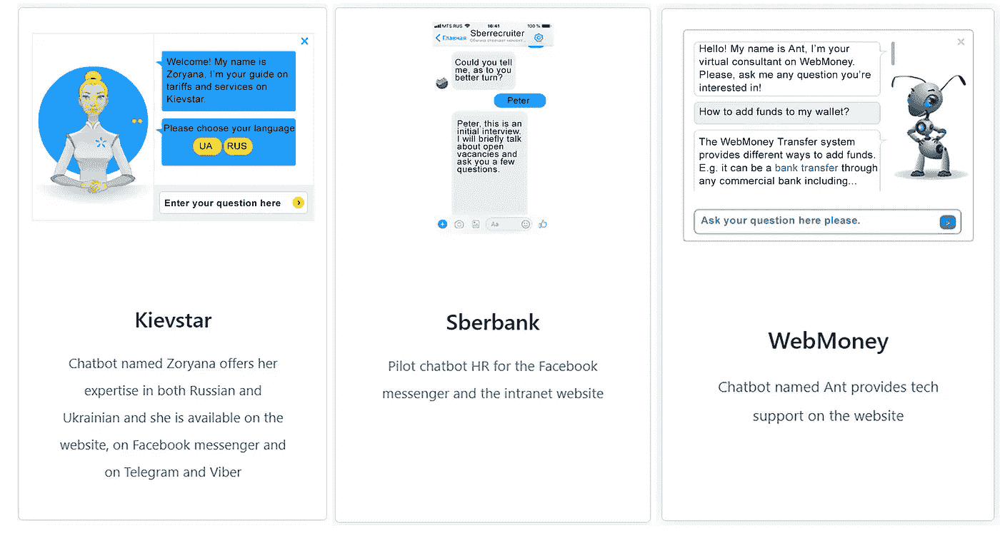

# 为什么 AI ≠ ML？考虑聊天机器人创建的例子。

> 原文：<https://towardsdatascience.com/why-does-ai-ml-considering-the-examples-of-chatbots-creation-20b1906274f8?source=collection_archive---------4----------------------->

近年来，人工智能、机器学习和聊天机器人的会议已经将人工智能等同于机器学习，并将机器学习等同于神经网络。

过去几年围绕“机器学习”的炒作已经说服了大多数 IT 行业，即当我们找到巨大的大数据并将其交给人工智能时，人工智能就会给出自己的见解，并为不同的问题找到完美的解决方案。

为什么我们要讨论为什么 AI 不是 100%的机器学习，是因为我们想讨论我们擅长什么。我们公司，纳米科学实验室(作为 SOVA 的一部分。人工智能项目)，与虚拟助手和聊天机器人的创造合作已经超过 15 年。稍后我将展示机器学习在哪里以及如何让聊天机器人受益，以及围绕它的一些神话和高期望。

## 我们在谈论什么聊天机器人

我们的客户是大银行、电信运营商和零售连锁店。我们为他们制作的聊天机器人是客户支持的虚拟顾问。他们的主要工作是减少联络中心的负荷。基本上，他们被放在网站上，手机应用程序中，并连接到信使，在那里他们可以与客户交谈，他们可能会对不同的产品和服务有一些问题。

聊天机器人还有其他应用(快速订购产品的按钮机器人、内部员工支持机器人、促销机器人等)。)中的每一个都执行不同的任务并具有不同的要求。这些也很有趣，但是我们改天再谈。

对于我们最大的客户，联络中心的运营成本每年高达数百万美元。一个设计良好、训练有素的聊天机器人可以为那些不停工作的操作员节省大量成本。在我们的一些案例中，聊天机器人设法承担了 50 %- 80%的所有输入请求，从而为我们的客户节省了大量资金并减少了线路负载。

作为联络中心，聊天机器人应该做几件事:

知道尽可能多的**信息**请求的答案(“你的费用是多少？”，“你最近的办公室在哪里？”等。),

能够识别并满足**事务性**请求(例如，“我的余额是多少？”)，通过完成 CRM 数据库和/或计费系统中的查询，

当问题过于复杂时，能够**理解**，并快速、谨慎地将客户从支持或销售部门转移到现场接线员，同时保持对话的上下文。

如何准确地识别查询类型以及如何填充和更新机器人的知识库是实现的特点。

如果这项技术可以处理认知任务，例如，任务被自动化以解决客户的问题，那么它可以被称为人工智能，尽管不是好莱坞意义上的人工智能。

## 术语

在聊天机器人的现代“时尚”机器学习中，识别问题类型被称为**意图识别**，根据脚本或对话树进行对话被称为**对话管理**，并根据用户提示(例如，姓名、资费名称、手机号码等)分配参数。)叫做**槽填充**。

我们使用基于规则的方法或“正确的”方法在我们的项目中实现所有这些阶段:机器人通过可能的用户问题来学习，这些问题使用在对话框的描述语言中具有量词的模板，类似于使用正则表达式。

This is how Joseph Weizenbaum taught his ELIZA which was the first in the history of the virtual companion, and how the well-known AIML (Artificial Intelligence Mark-up Language) language was originally conceived. This was all invented in the last century, but now it’s currently the only approach to man-machine dialog in a natural language that works well and predictably. Image: Wikipedia.

有一些开放的工具可以用来构建基于规则的聊天机器人——例如 project ChatScript。但是我们创造了自己的语言——对话语言。它比 AIML 更强大、更简单、更舒适，但目前还不能用于第三方开发人员。

## “正确”的方法

基于规则的聊天机器人是这样制作的:

1.**问题陈述。我们与客户一起定义聊天机器人将具有的一般功能，聊天机器人应该回答哪些类型的问题(常见问题解答、网站和内部知识库通常会帮助我们)。此外，聊天机器人的身份是经过设计的(个性、风格、知识领域)。**

2.**创建通用模板和对话框树。数据工程师(知识库中的专家)用一种特殊的语言编写模板，这是识别可能的问题所必需的。模板可以覆盖成千上万种可能的正确语言结构。然后把它们组合成交互树，有上下文记忆，提取变量。**

3.**提取查询参数。**在对话过程中，总是需要从用户请求中提取数据(以填充槽)。这是通过识别命名实体来决定的(命名实体识别)。

4.**获取外部服务。**在信息请求和事务请求中，需要调用外部服务(数据库、CRM 等)。).聊天机器人访问外部数据库，传输参数，接收信息，然后形成对用户的平滑响应。

然后是内部和外部测试，向客户介绍聊天机器人，并将其部署在我们的云中或客户的服务器上。

总的来说，似乎没有什么猫腻。但是细节决定成败。

## 对“正确”方法的批评

我们对基于规则的方法的主张通常是对编写模板的需求的不满。程序员、IT 主管讨厌它，就像经验法则一样。除了本能，“这是胡说八道——一切都是手工写的！”，有一句简短的话“你是认真的吗？不可能事先想到所有可能的变化——这是一项巨大的工作，产生的完整答案非常少。”

看起来是的，但是，唉，不是的。描述性对话语言的力量帮助一个模板覆盖成千上万的问题措辞变化。虽然看起来很奇怪，但编写一个丰富的模板显示出比机器学习显著更高的效率。

15 years we have been saving a massive database of templates and word databases for various industries and subject areas (banks, air transportation, retail, insurance, etc.) In general, it’s our key intellectual property that is more important than our chatbot engine and Dialogue Language.

因为我们有这样的基础，所以对于我们来说，制作一个新的聊天机器人(例如，为一家银行)或掌握一个新的主题(如零售)非常简单，总共只需要两名数据工程师额外工作 1-2 个月。

## 机器学习中的聊天机器人

与所描述的基于规则的方法相反，机器学习聊天机器人使用以下方案:

1.**数据摄入。**从客户端，我们从联络中心获得成千上万个对话的日志。

2.**清理数据。**(清理是什么意思？我们稍后会解释这一点)

3.**马克舍耶夫。在清理后的数据中，我们标记意图:每个副本被分配到一个特定的类型**

4.**教导。**我们将“副本+意图”数据库馈送给机器学习算法。我们向哪种算法输入数据并不重要，通常是 SVM(支持向量方法)或 DSSM(深度结构化语义模型)，并对单词进行初步矢量化。

结果是我们可以按类型对输入引用进行分类。进一步假设，通过知道问题的类型，我们可以引导一个人通过相应的对话树。机器学习的爱好者当然不希望手动构建这些树。这里再次使用了意图分类器，它不再用于输入副本，而是用于辅助副本。诸如此类。

在事务性请求的正确时刻，聊天机器人使用上述实体识别来检索变量参数的值，就像基于规则的方法一样。

## 对 ML 方法的批评

我们公司的机器学习由 8 名员工负责。至于谈话记录，我们一直和客户保持联系。出于这个原因，我们非常清楚机器学习聊天机器人的所述实现的问题:

1.**数据太少。客户通常没有对话的数据库，或者他们有，但是他们是呼叫中心的录音。这些可以用自动语音识别器打出来，但是质量非常低，需要以后做更多的工作来清理。**

2.数据是敏感的。如果有数据库，客户可能无法在不违反个人数据法的情况下将其提供给我们。然后，客户端需要编辑数据库，删除任何显示客户端身份的数据。

3.**数据库里的都是垃圾。**如果客户确实有一个数据库，并且他们确实清理了它，那么稍后就会出现从数据库中清除特定人的特定答案的问题。例如，问题“我的电话余额是多少？”在该数据库将是一个具体的总和为每个特定的客户。来自训练样本的“25 美元”当然需要被丢弃，以便当 Peter 要求他的 2018 年 9 月余额时，他没有给 Kate 2016 年 12 月的余额。

4.**该数据库没有对外部数据库的引用。**为了处理事务性请求，必须有一个事务——对外部服务的访问。在对话日志中没有这些参考，只有关于凯特在 2016 年有什么平衡的答案。这种逻辑不能通过机器学习来实现，它仍然需要开发人员分析对话的日志，并将呼叫嵌入到计费、CRM 等中。聊天机器人对话框。

5.**布局仍然是手动的。**如果我们编辑数据库，剩下的就是意图的布局，这是一个很大的手工工作。是的，这样做的人有时比数据工程师的工资低 2-3 倍，但一般来说很难做布局，他们对做布局不是很仔细。除此之外，数据工程师通常执行少量的任务:查看对话、常见问题等的例子。，了解客户可以问什么以及如何问，然后写一个好的模板。

6.**数据的根本不完全性。需要理解的是，无论多么大的对话日志集，它们从根本上来说都是不完整的。以英语为母语的人可以问一个过去没有人问过的问题——语法正确且有条理。如果请求中有 5 个单词，并且每个单词都有几个同义词，那么对于一个问题来说，可能的变化数量已经成千上万了。通常新问题的比例是每月 10%。机器人从过去的对话日志中学习，不能覆盖所有的新问题，然后犯错误。正是在这个地方，编写具有良好覆盖率和可变性的模板比“按区域”进行机器学习具有巨大的优势。**

7.**对话焦点不佳。**识别每个阶段的“意图”与记忆答案和上下文的对话树不一样。对于高度负责的应用程序，这样的意图“猜测”是行不通的。

Image: Comicscube.Com.

我们想单独指出，机器学习系统通常是**不可预测的**。测试它们，尤其是完整性，是另一项复杂的工作。

也就是说，我们不能向我们的客户保证聊天机器人会以可预测的方式行动。这是一个绝对的法律要求，甚至经常由客户在合同条款中写明。

## 基于规则+ ML =友谊

如果有人告诉你，他们完全基于神经网络或机器学习制造了一个功能良好的聊天机器人，你要知道他们在骗你。或者说 chatbot 根本不行，或者说机器学习只占整个系统的 5%。

但是机器学习可以在以下几个方面让我们受益:

输入短语中的错别字纠正

选择单词的同义词，帮助数据工程师进行开发

对联络中心日志进行聚类，以识别频繁的请求，从而帮助数据工程师

FAQ 机器人的自动回答(有趣的技术——我们将在另一篇文章中讨论)

对信息请求的问答对的不清楚搜索

这些都是有用的应用程序，可以节省开发时间，提高聊天机器人的整体质量。

## 结论

这篇文章的目的是说为什么你不应该期望在聊天机器人领域从机器学习中获得快速而简单的成功

聊天机器人不能完全在机器学习中实现:机器学习是系统的一个小补充，增加了开发的效率。

聊天机器人可以而且需要基于规则的方法:这是可行的，这是一项艰巨的任务，而且它保证了质量。

人工智能不仅仅是机器学习——基于规则的聊天机器人——而且除了机器学习之外，还有专家系统、逻辑和其他领域。

围绕机器学习的宣传已经进入了我们的行业，也许很快，它也会进入你的行业。