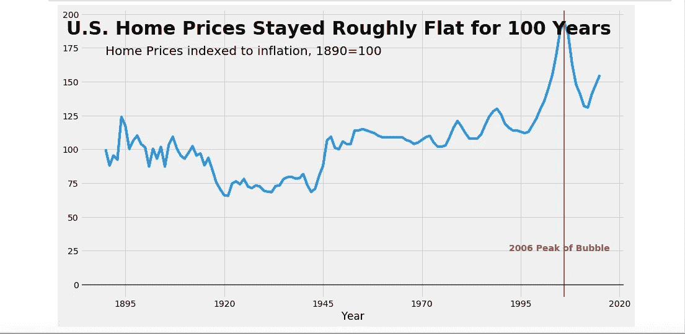

# 为什么领域专长被高估—第一部分

> 原文：<https://towardsdatascience.com/why-domain-expertise-is-overrated-part-i-d17898d2d679?source=collection_archive---------15----------------------->


数据科学正在帮助消除的一个最基本的误解是，一个全能、无所不知的专家喜欢告诉普通人做什么、怎么吃、买什么、如何抚养我们的孩子等等。

但是，非专家篡夺旧世界秩序的例子数不胜数，证明专家是错的。

历史上的例子包括莱特兄弟，他们冒着生命危险进行修补，而不是推导物理理论。或者通过纯粹的意外发现而不是自上而下的定向研究取得的无数医学进步。

早在 21 世纪初，长期以来流行的观点是，棒球比赛中的胜利次数与球队的薪资水平高度相关。

但是比利·比恩，全棒球中薪水最低的球队的总经理，连续四次带领奥克兰运动家队进入季后赛——这是一个令人震惊的低概率事件。

他是怎么做到的？他之所以做到这一点，是因为他专注于一个棒球专家都不太重视的统计数据——基于垒位百分比(OBP):

“An Island of Misfit Toys”

## 一个重要的例子

> 不动产不能丢失或被盗，也不能被带走。用常识购买，全额支付，合理谨慎地管理，**这大概是世界上最安全的投资**。—富兰克林·罗斯福，美国总统

一个在美国社会仍然流传的神话是，单户住宅是好的、安全的投资，从长远来看，价格会上涨。

正如我们从上一次衰退(大约 2009 年)中看到的那样，这不是一件小事。我记得当我的同事谈论在拉斯维加斯购买 50 万美元的房子，或者同时拥有三套房子时(作为一名 24 岁的酒保)，他声音中的焦虑。

我们都知道大衰退是如何结束的，但我脑海中总是浮现的是，本该给我们发出警告的专家在哪里？

> 我们从未经历过全国性的房价下跌——本·伯南克(2005 年美国消费者新闻与商业频道前美联储主席)

可以说，世界上最有权力的人之一，本·伯南克，告诉美国人要保持冷静，继续前进。

**本·伯南克是对的吗？**

让我们启动一个 Jupyter 笔记本。

```
import numpy as np
import pandas as pd
import matplotlib.pyplot as plt
%matplotlib inlinepd.set_option('display.max_rows', 1000)
pd.set_option('display.max_columns', 500)
pd.set_option('display.width', 1000)xlsx = pd.ExcelFile('HomePriceIndex.xls')
df = pd.read_excel(xlsx, skiprows=6)df.rename({'Date': 'Year',
           'Index': 'RealHomePriceIndex',
           'Index.1': 'RealBuildingCost',
          'Millions': 'Population',
          'Long Rate': 'LongRate'}, inplace=True, axis=1)
df = df[['Year', 'RealHomePriceIndex', 'RealBuildingCost', 'Population', 'LongRate']]df.head()
```


[数据集](http://www.econ.yale.edu/~shiller/data.htm)来自耶鲁大学经济学家罗伯特·希勒，他是在他的书[非理性繁荣](https://www.amazon.com/Irrational-Exuberance-Revised-Expanded-Third/dp/0691173125/ref=sr_1_1?ie=UTF8&qid=1543358036&sr=8-1&keywords=irrational+exuberance+by+robert+shiller)中预测房价崩溃的少数经济学家之一。对于那些想跳过预处理的人，你可以在这里获得清理后的数据集[。](https://github.com/Captmoonshot/irrational_exuberance)

顺便说一句，这个数据集与标准普尔现在用作美国全国房价标准的数据集相同。在希勒之前，没有可靠的房价指数可以追溯到 19 世纪末。我们站在他的肩上。

让我们继续检查`dtypes`并将它们转换成数值。


```
df['LongRate'] = pd.to_numeric(df['LongRate'], errors='coerce').dropna()
```

如果您检查整个数据集，主要问题是它是一个时间序列，其中频率在集合的中间发生变化。从 1953 年开始，频率从每年一次切换到每月一次，一直到 2018 年。

因为这个问题只涉及“Year”和“RealHomePriceIndex”变量，我们将把它们分离出来，使用平均值进行重新采样和聚合，并将这两个数据框架放在一起，形成一个我们可以处理的数据框架。

```
df_2 = df[['Year', 'RealHomePriceIndex']]
df_2.drop([851,852,853], inplace=True)# Resample 'Year' and make it into an indexdf_2['Year'].loc[0:62] = pd.date_range('1890', periods=63, freq='A')
df_2['Year'].loc[63:] = pd.date_range('1953', periods=788, freq='M')df_2.index = df_2.Year
df_2.drop('Year', inplace=True, axis=1)df_2_bottom = df_2['1953-01-31':].resample('A').mean()
df_2_bottom = df_2_bottom.astype('int')df_2 = df_2.loc['1890-12-31': '1952-12-31']
df_2 = df_2.append(df_2_bottom)df_2.index
```

现在，我们清理旧的 df 数据帧，我们将“RealHomePriceIndex”从其中分离出来。

```
# Drop these because we already have df_2
df.drop(['Year', 'RealHomePriceIndex'], inplace=True, axis=1)df.dropna(inplace=True)  # Drop NaN values# Truncate by 3 rows to make it even with the rest of the DataFrame
df_2 = df_2.loc['1890-12-31':'2015-12-31']df.index = df_2.index# Finally add df_2 to df
df['RealHomePriceIndex'] = df_2['RealHomePriceIndex']df.head()
```


现在让我们绘制数据图表，看看伯南克是否正确。

```
plt.style.use('fivethirtyeight')ax = df.RealHomePriceIndex.plot.line(x=df.index, y=df.RealHomePriceIndex, legend=False, figsize=(14,8));ax.axvline(x='2006', color='red', linewidth=2, alpha=0.8)
ax.axhline(y=0, color='black', linewidth=1.3, alpha=0.8)ax.text(x='1880', y=185, s="U.S. Home Prices Stayed Roughly Flat for 100 Years",
       fontsize=30, fontweight='bold');ax.text(x='1890', y=170, s="Home Prices indexed to inflation, 1890=100",
       fontsize=20);ax.text(x='1992', y=25, s="2006 Peak of Bubble",
       fontweight='bold', color='#CB4335');
```



该图最重要的特点是它与通货膨胀挂钩，所以它是美国 100 多年来房价的比较。

如果你伸出食指，追踪从 1890 年开始的图表，当指数从 100 开始到 1995 年，价格水平几乎没有任何增长，这意味着与股票在整个 20 世纪回报的 9%的股票溢价基准相比，对大多数人来说，住房并不是一种很好的投资。

在 20 世纪初，房价确实下降了大约 20 年。

这种类型的分析不涉及微积分或线性代数或任何经济学家喜欢为他们的模型使用的定量方法。

如果伯南克和其他人只是注意到房价总体上停滞了 100 年的事实，从 1995 年开始的泡沫式上涨可能会促使他们尽早采取行动。