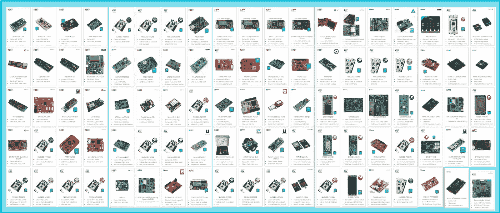
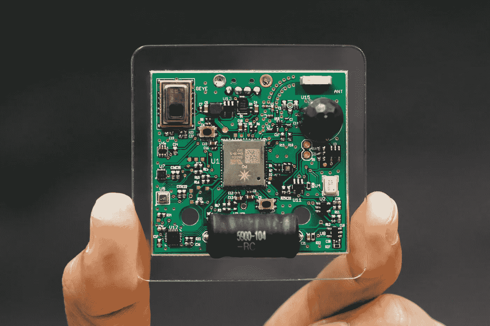

# 为什么机器学习在边缘？

> 原文：<https://towardsdatascience.com/why-machine-learning-on-the-edge-92fac32105e6?source=collection_archive---------5----------------------->

“A view from the orbit on an artificial satellite over white clouds on the ocean” by [NASA](https://unsplash.com/@nasa?utm_source=medium&utm_medium=referral) on [Unsplash](https://unsplash.com?utm_source=medium&utm_medium=referral)

软件工程可能很有趣，尤其是当与志同道合的人朝着共同的目标努力时。自从我们开始了微控制器(MCU)人工智能框架 [uTensor](https://github.com/utensor) 项目，许多人问我们: ***为什么要在 MCU 上进行边缘计算？云与应用处理器还不足以构建物联网系统吗？*** 深思熟虑的问题，确实如此。我将尝试在这里展示我们对这个项目的动机，希望你也会感兴趣。

> **TL；MCU 上的 AI 使更便宜、更低功率和更小的边缘设备成为可能。它减少了延迟、节省了带宽、提高了隐私性并支持更智能的应用。**

An image of a Mbed development board ([source](https://os.mbed.com/platforms/))

## **什么是 MCU？**

MCU 是非常低成本的微型计算设备。它们通常位于物联网边缘设备的中心。每年出货 150 亿个 MCU，这些芯片无处不在。它们的低能耗意味着它们可以依靠纽扣电池运行数月，并且不需要散热器。它们的简单性有助于降低系统的总成本。

## **未利用功率**

在过去的几十年中，MCU 的计算能力一直在增加。然而，在大多数物联网应用中，它们只不过是将数据从传感器转移到云中。MCU 的时钟频率通常为数百 MHz，封装有数百 KB 的 RAM。鉴于时钟速度和 RAM 容量，转发数据是一件轻而易举的事。事实上，MCU 大部分时间都是空闲的。下面我们来举例说明:

A representation of MCU’s busy vs idle time for typical IoT applications

上图区域显示了 MCU 的计算预算。绿色区域表示 MCU 处于忙碌状态，包括:

*   建立工作关系网
*   传感器读数
*   更新显示
*   定时器和其他中断

蓝色区域代表闲置的、未开发的潜力。想象一下，现实世界中部署了数百万台这样的设备，集合起来就是大量未被利用的计算能力。

# **向边缘设备添加人工智能**

如果我们能利用这种力量呢？我们能在边缘做得更多吗？事实证明，人工智能非常适合这里。让我们看看我们可以在边缘应用人工智能的一些方法:

## **推理**

Projection into a 3D space (via PCA) of the MNIST benchmark dataset. ([source](https://www.researchgate.net/figure/Projection-into-a-3D-space-via-PCA-of-the-MNIST-benchmark-dataset-This-data-set_fig3_261567034))

可以在边缘设备上完成简单的图像分类、手势识别、声音检测和运动分析。因为只传输最终结果，所以我们可以在物联网系统中最小化延迟，提高隐私性并节省带宽。左图显示了投影空间中的经典手写数字数据集 MNIST。

## **传感器融合**

An image of the super sensor, including accelerometer, microphone, magnetometer and more ([source](https://www.technologyreview.com/s/607837/this-mega-sensor-makes-the-whole-room-smart/))

使用机器学习和其他信号处理算法，不同的现成传感器可以组合成一个合成传感器。这些类型的传感器能够检测复杂的事件。与基于摄像机的系统相比，这些传感器成本更低，能效更高。超级传感器的一个很好的例子可以在[这里](https://techcrunch.com/2017/05/11/google-funded-super-sensor-project-brings-iot-powers-to-dumb-appliances/)找到。

## **自强产品**

An illustration of federated learning ([source](https://research.googleblog.com/2017/04/federated-learning-collaborative.html))

设备在现场部署后可以不断改进。谷歌的 Gboard 使用了一种叫做[联合学习](https://research.googleblog.com/2017/04/federated-learning-collaborative.html)的技术，这种技术涉及每一个设备收集数据并做出个人改进。这些单独的改进被集中在一个中央服务上，然后每台设备都用组合的结果进行更新。

## **带宽**

神经网络可以进行划分，以便在设备上评估一些层，而在云中评估其余层。这实现了工作负载和延迟的平衡。网络的初始层可以被视为特征抽象功能。随着信息在网络中传播，它们会抽象成高级功能。这些高级功能占用的空间比原始数据少得多，因此更容易通过网络传输。物联网通信技术，如 Lora 和 NB-IoT 的有效载荷大小非常有限。特征提取有助于在有限的有效载荷中打包最相关的信息。

An illustration of the Lora network setup for IoT ([source](https://blog.microtronics.com/lora-and-2g-in-one-module/))

## **迁移学习**

在上面的带宽示例中，神经网络分布在设备和云之间。在某些情况下，只需改变云中的层，就可以将网络重新用于完全不同的应用。

A graphical representation of transfer learning ([source](https://www.slideshare.net/ckmarkohchang/applied-deep-learning-1103-convolutional-neural-networks))

云中的应用程序逻辑很容易更改。网络层的这种热插拔使得相同的设备能够用于不同的应用。修改网络的一部分以执行不同任务的实践是迁移学习的一个例子。

## **生成模型**

作为上述带宽和迁移学习示例的补充，通过仔细的工程设计，可以根据从数据中提取的特征来重构原始数据的近似值。这可以允许边缘设备以来自云的最少输入生成复杂的输出，以及在数据解压缩中具有应用。

# **包装**

人工智能可以帮助边缘设备变得更加智能，提高隐私和带宽利用率。但是，在撰写本文时，还没有已知的在 MCU 上部署 Tensorflow 模型的框架。我们创建了 uTensor，希望推动边缘计算的发展。

低功耗和低成本的 AI 硬件像 MCU 一样普及可能还需要一段时间。此外，随着深度学习算法快速变化，拥有一个灵活的软件框架来跟上人工智能/机器学习研究是有意义的。

uTensor 将继续利用最新的软件和硬件进步，例如 CMSIS-NN，Arm 的 Cortex-M 机器学习 API。这些将被集成到 uTensor 中，以确保 Arm 硬件的最佳性能。开发人员和研究人员将能够使用 uTensor 轻松测试他们的最新想法，如新算法、分布式计算或 RTLs。

我们希望这个项目能把对这个领域感兴趣的人聚集在一起。毕竟，协作是在尖端领域取得成功的关键。

在 Medium 和 [Twitter](https://twitter.com/neil_the_1) 上关注我，了解即将发布的事件文章。

# 了解更多信息

uTensor 文章(即将发布)
[**uTensor . ai**](http://utensor.ai/)
[奥莱利人工智能大会](https://conferences.oreilly.com/artificial-intelligence/ai-ca/public/schedule/detail/68659)
[FOSDEM 2018](https://fosdem.org/2018/schedule/speaker/neil_tan/)
[演示视频](https://www.youtube.com/watch?v=FhbCAd0sO1c)
[量化博客](https://petewarden.com/2016/05/03/how-to-quantize-neural-networks-with-tensorflow/)